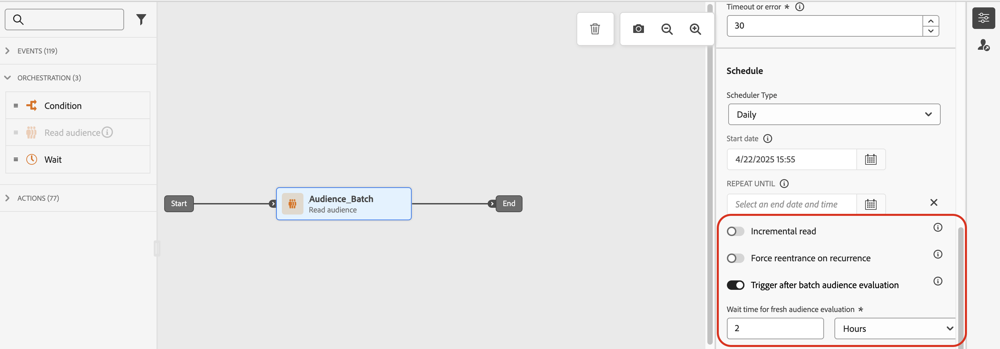

# Gerenciamento de entrada de perfis {#entry-management}

O gerenciamento de entrada de perfis depende do tipo de jornada. No Adobe Journey Optimizer, os seguintes tipos de jornadas estão disponíveis:

* **Evento unitário** jornadas: essas jornadas começam com um evento Unitário. Quando o evento é recebido, o perfil associado entra na jornada. [Leia mais](#entry-unitary)

* **Evento comercial** jornadas: essas jornadas começam com um evento Comercial seguido imediatamente por um **Ler público** atividade. Quando o evento for recebido, os perfis pertencentes ao público-alvo direcionado entram na jornada. Uma instância dessa jornada é criada para cada perfil. [Leia mais](#entry-business)

* **Ler público** jornadas: essas jornadas começam com um **Ler público** atividade. Quando a jornada for executada, os perfis que pertencem ao público-alvo de destino entram na jornada. Uma instância dessa jornada é criada para cada perfil. Essas jornadas podem ser recorrentes ou &quot;únicas&quot;. [Leia mais](#entry-read-audience)

* **Qualificação de público** jornadas: essas jornadas começam com um evento de qualificação de Público-alvo. Essas jornadas escutam as entradas e saídas dos perfis nos públicos-alvo. Quando isso acontece, o perfil associado entra na jornada. [Leia mais](#entry-unitary)

Em todos os tipos de jornada, um perfil não pode estar presente várias vezes na mesma jornada, ao mesmo tempo. Para verificar se uma pessoa está em uma jornada, a identidade do perfil é usada como uma chave. O sistema não permite que a mesma chave, por exemplo, a chave CRMID=3224, esteja em locais diferentes na mesma jornada.

## Jornadas unitárias de qualificação de evento e público-alvo{#entry-unitary}

Entrada **Evento unitário** e **Qualificação de público** jornadas, você pode ativar ou desativar a reentrada:

* Se a reentrada estiver ativada, um perfil poderá inserir uma jornada várias vezes, mas não poderá fazer isso até que ele tenha saído totalmente da instância anterior da jornada.

* Se a reentrada estiver desativada, um perfil não poderá inserir várias vezes a mesma jornada dentro do tempo limite da jornada global. Consulte esta [seção](../building-journeys/journey-properties.md#global_timeout).

Por padrão, o jornada permite a reentrada. Quando a variável **Permitir reentrada** estiver ativada, a variável **Período de espera de reentrada** é exibido. Isso permite definir o tempo de espera antes de permitir que um perfil entre na jornada novamente. Isso impede que uma mesma jornada seja incorretamente acionada várias vezes no mesmo evento. Por padrão, o campo é definido como 5 minutos. A duração máxima é de 91 dias ([tempo limite global](journey-properties.md#global_timeout)).

<!--
When a journey ends, its status is **[!UICONTROL Closed]**. New individuals can no longer enter the journey. Persons already in the journey automatically exit the journey. 
-->

Após o período de reentrada, os perfis podem inserir a jornada novamente. Para evitar isso e desativar totalmente a reentrada desses perfis, você pode adicionar uma condição para testar se o perfil entrou já ou não, usando dados de perfil ou público-alvo.

<!--
Due to the 30-day journey timeout, when journey re-entrance is not allowed, we cannot make sure the re-entrance blocking will work more than 91 days. Indeed, as we remove all information about persons who entered the journey 91 days after they enter, we cannot know the person entered previously, more than 91 days ago. -->

## Jornadas comerciais {#entry-business}

<!--
Business events follow re-entrance rules in the same way as for unitary events. If a journey allows re-entrance, the next business event will be processed.
-->

Entrada **Jornadas comerciais**, para permitir várias execuções de eventos comerciais, ative a opção correspondente no **[!UICONTROL Execução]** seção das propriedades da jornada.

No caso de eventos comerciais, para determinada jornada, os dados do público-alvo recuperados na primeira execução são reutilizados durante uma janela de tempo de 1 hora.

Um perfil pode estar presente várias vezes na mesma jornada, ao mesmo tempo, mas no contexto de diferentes eventos comerciais.

Para obter mais informações, consulte esta [seção](../event/about-creating-business.md)

## Ler jornadas de público {#entry-read-audience}

**Ler público** As jornadas podem ser recorrentes ou &quot;únicas&quot;:

* Para jornadas não recorrentes/únicas: o perfil insere uma vez e apenas uma vez na jornada.

* Para jornadas recorrentes: por padrão, todos os perfis pertencentes ao público-alvo inserem a jornada em cada recorrência. Eles devem concluir a jornada antes de entrar novamente em outra ocorrência.

Duas opções estão disponíveis para jornadas recorrentes de Leitura de público:

* **Leitura incremental** opção: quando uma jornada com um evento recorrente **Ler público** O executa pela primeira vez, todos os perfis no público-alvo entram na jornada. Essa opção permite direcionar, após a primeira ocorrência, somente os indivíduos que entraram no público-alvo desde a última execução da jornada.

  >[!NOTE]
  >
  >Se você estiver direcionando um [público-alvo personalizado do upload](../audience/about-audiences.md#segments-in-journey-optimizer) na jornada, os perfis só serão recuperados na primeira recorrência se essa opção estiver habilitada em uma jornada recorrente, pois esses públicos-alvo são corrigidos.

* **Forçar reentrada na recorrência**: essa opção permite fazer com que todos os perfis ainda presentes no jornada saiam automaticamente na próxima execução. Se a duração dos perfis nesta jornada for maior que a frequência de recorrência (por exemplo, se você usar atividades de espera), não ative essa opção para garantir que os perfis possam concluir a jornada.

Para obter mais informações, consulte esta [seção](../building-journeys/read-audience.md#configuring-segment-trigger-activity)

<!--
After 91 days, a Read audience journey switches to the **Finished** status. This behavior is set for 91 days only (i.e. journey timeout default value) as all information about profiles who entered the journey is removed 91 days after they entered. Persons still in the journey automatically are impacted. They exit the journey after the 30 day timeout. 
-->
