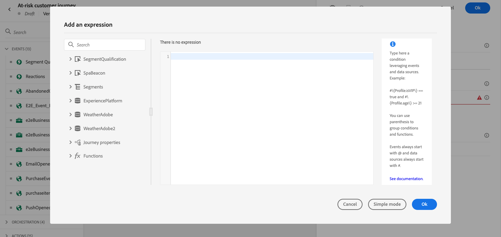

# Trabalhar com o editor de expressão avançado {#about-the-advanced-expression-editor}

>[!CONTEXTUALHELP]
>id="ajo_journey_expression_advanced"
>title="Sobre o editor de expressão avançado"
>abstract="O editor de expressão avançado cria expressões avançadas em várias telas da interface. Por exemplo, você pode criar expressões ao configurar e usar jornadas e ao definir uma condição de fonte de dados."

Use o editor de expressão avançado do Jornada para criar expressões avançadas em várias telas da interface. Por exemplo, você pode criar expressões ao configurar e usar jornadas e ao definir uma condição de fonte de dados.

Ele também está disponível sempre que for necessário definir parâmetros de ação que exijam manipulações de dados específicos. Você pode usar os dados provenientes dos eventos ou informações adicionais recuperadas da fonte de dados. Em uma jornada, a lista exibida de campos de evento é contextual e varia de acordo com os eventos adicionados na jornada.

O editor de expressão avançado oferece um conjunto de funções e operadores integrados, permitindo manipular valores e definir uma expressão que se ajuste especificamente às suas necessidades. O editor de expressão avançado também permite definir os valores do parâmetro de fonte de dados externa, manipular campos de mapa e coleções.

>[!NOTE]
>
>As funções e os recursos disponíveis no editor de expressão avançado do Jornada diferem daqueles disponíveis no [editor de personalização](../../personalization/functions/functions.md).

## Acessar o editor de expressão avançado {#accessing-the-advanced-expression-editor}

O editor avançado de expressões pode ser usado para:

* criar [condições avançadas](../conditions.md#data_source_condition) em fontes de dados e informações do evento
* definir [atividades de espera](../wait-activity.md#custom) personalizadas
* definir mapeamento de parâmetros de ação

Quando possível, você pode alternar entre os dois modos usando o botão **[!UICONTROL Modo avançado]** / **[!UICONTROL Modo simples]**. O modo simples é descrito [aqui](../conditions.md#about_condition).

>[!NOTE]
>
>* As condições podem ser definidas no editor de expressão simples ou avançado. Eles sempre retornam um tipo booleano.
>
>* Parâmetros de ações podem ser definidos selecionando campos ou por meio do editor de expressão avançado. Eles retornam um tipo de dados específico de acordo com a expressão.

Você pode acessar o editor de expressão avançado de diferentes maneiras:

* Ao criar uma condição de fonte de dados, você pode acessar o editor avançado clicando em **[!UICONTROL Modo avançado]**.

  

* Ao criar um temporizador personalizado, o editor avançado será exibido diretamente.
* Ao mapear o parâmetro de ação, clique em **[!UICONTROL Modo avançado]**.

>[!NOTE]
>
>Para gerar expressões de Jornada usando prompts de linguagem natural, use **[Gerar expressões com IA](generate-expression.md)** (**beta público**) por meio do controle de IA dentro do editor avançado.

## Conheça a interface {#discovering-the-interface}

Nesta tela você pode escrever manualmente a expressão.

Na parte esquerda da tela são exibidos os campos e as funções disponíveis:

* **[!UICONTROL Eventos]**: escolha um dos campos recebidos do evento de entrada. A lista exibida de campos de evento é contextual e varia de acordo com os eventos adicionados na jornada. [Leia mais](../../event/about-events.md)

  >[!CAUTION]
  >
  >Não há suporte para criar expressões usando eventos de experiência. Abordagens alternativas e práticas recomendadas para criar expressões/lógica com eventos de experiência são referenciadas [aqui](../../building-journeys/exp-event-lookup.md)

* **[!UICONTROL Públicos-alvo]**: se você tiver descartado um evento de **[!UICONTROL Qualificação de público-alvo]**, escolha o público-alvo que deseja usar na expressão. [Leia mais](../conditions.md#using-a-segment)
* **[!UICONTROL Fontes de dados]**: escolha na lista de campos disponíveis nos grupos de campos de suas fontes de dados. [Leia mais](../../datasource/about-data-sources.md)
* **[!UICONTROL Propriedades da Jornada]**: esta seção reagrupa os campos técnicos relacionados à jornada de um determinado perfil. [Leia mais](journey-properties.md)
* **[!UICONTROL Funções]**: escolha entre uma lista de funções integradas que permitem fazer uma filtragem complexa. As funções são organizadas por categorias. [Leia mais](functions.md)

Um mecanismo de autopreenchimento exibe sugestões contextuais.

Um mecanismo de validação de sintaxe verifica a integridade do código. Erros são exibidos na parte superior do editor.

>[!TIP]
>
>Ao criar condições no editor de expressão avançado, certifique-se de que suas expressões não contenham caracteres ocultos ou não imprimíveis. Além disso, use expressões de linha única para evitar erros de análise.

**Necessidade de parâmetros ao criar condições com o editor de expressão avançado**

Se você selecionar um campo de uma fonte externa de dados que requer um parâmetro para ser chamado (consulte [esta página](../../datasource/external-data-sources.md)), uma nova guia aparecerá à direita para permitir a especificação desse parâmetro. O valor do parâmetro pode vir dos eventos posicionados na jornada ou na fonte de dados do Experience Platform (e não de outras fontes de dados externas). Por exemplo, em uma fonte de dados relacionada ao clima, um parâmetro frequentemente usado será &quot;cidade&quot;. Como resultado, você deve selecionar onde deseja obter o parâmetro cidade. As funções também podem ser aplicadas aos parâmetros para executar alterações de formato ou concatenações.

Para casos de uso mais complexos, caso queira incluir os parâmetros da fonte de dados na expressão principal, é possível definir os valores usando a palavra-chave &quot;params&quot;. Consulte [esta página](../expression/field-references.md).

+++ Referência de conhecimento de IA

Esta seção contém conhecimento estruturado destinado a oferecer suporte à interpretação, recuperação e resposta a perguntas relacionadas a este tópico.

Para uma compreensão completa, essas informações devem ser combinadas com a documentação desta página. Nenhuma das origens deve ser independente; a página descreve o recurso, enquanto esta seção fornece um contexto adicional que ajuda a desfazer a ambiguidade da terminologia, intenção, aplicabilidade e restrições.

* **TL;DR:** esta página apresenta o editor de expressão avançado do Jornada — seus pontos de acesso, painéis de interface e recursos para criar condições complexas, temporizadores de espera personalizados e mapeamentos de parâmetros de ação usando eventos, fontes de dados, funções e operadores.

**Intenções:**

* Acesse o editor de expressão avançado de uma condição de fonte de dados, atividade de espera personalizada ou mapeamento de parâmetro de ação
* Criar condições booleanas avançadas usando campos de evento, campos de fonte de dados, associação de público-alvo e propriedades do jornada
* Alternar entre o modo simples e o modo avançado ao configurar condições
* Referencie parâmetros de fonte de dados externa diretamente na expressão principal usando a palavra-chave `params`
* Use a geração de expressões alimentadas por IA para criar expressões a partir de prompts de linguagem natural

**Glossário:**

* **Editor de expressão avançado**: o editor de código Journey Optimizer para gravar expressões complexas; distinto do editor de condição para apontar e clicar mais simples *(específico do produto)*
* **Modo simples**: um editor de condições do tipo apontar-e-clicar; menos flexível que o editor avançado, mas mais fácil para não desenvolvedores *(específico do produto)*
* **Propriedades da Jornada**: campos técnicos sobre a instância de jornada (ID, versão, erros, nó atual) acessível no editor de expressão *(específico do produto)*
* **Gerar expressões com IA**: um recurso alimentado por IA (beta público) dentro do editor avançado que gera expressões de prompts de linguagem simples *(específico do produto)*

**Medidas de Proteção:**

* A criação de expressões usando diretamente eventos de experiência não é suportada — use abordagens alternativas, como atributos calculados
* As condições sempre retornam um tipo booleano independentemente do modo do editor
* As expressões não devem conter caracteres ocultos ou não imprimíveis e devem usar formato de linha única para evitar erros de análise
* Os valores de parâmetro da fonte de dados externa só podem vir de eventos de jornada ou da fonte de dados do Experience Platform, não de outras fontes de dados externas
* As funções avançadas do editor de expressões são diferentes daquelas no editor de personalização

**Terminologia:**

* Nome canônico: Editor de expressão avançado — Acrônimo: none — variantes: editor avançado, editor de expressão
* Sinônimos: &quot;Modo avançado&quot; = &quot;editor de expressão avançado&quot;
* Não confunda: editor de expressão avançado (condições/ações de jornada) ≠ editor de personalização (personalização do conteúdo da mensagem)

**Perguntas frequentes:**

* **P: Quando devo usar o editor de expressão avançado em vez do modo simples?** — use o editor avançado quando precisar consultar coleções, usar funções, fazer referência a propriedades de jornada ou criar uma lógica de várias condições que o editor simples não consegue expressar.
* **P: Como transfiro um parâmetro para uma fonte de dados externa na expressão?** — Use a palavra-chave `params` na sintaxe da expressão, por exemplo `#{DataSource.fieldGroup.field, params: {paramName: value}}`.
* **P: O que o mecanismo de preenchimento automático faz?** — Ele exibe sugestões de campo e função contextuais à medida que você digita, ajudando a criar expressões válidas mais rapidamente.
* **P: Onde é acessada a opção Gerar expressões com IA?** — Por meio do controle de IA no editor de expressão avançado; no momento, está em beta público.
* **P: As condições no editor avançado retornam um tipo diferente do modo simples?** — Não; as condições sempre retornam um booleano em ambos os modos.

+++
