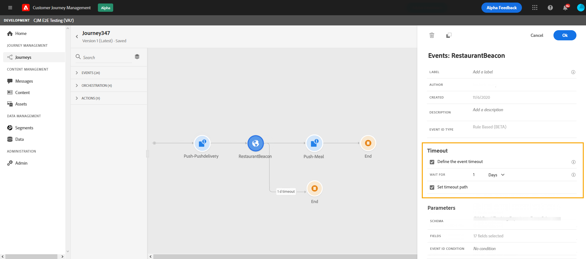

# Eventos gerais {#section_ofg_jss_dgb}

Para esse tipo de evento, você só pode adicionar um rótulo e uma descrição. O restante da configuração não pode ser editado. Ele foi executado pelo usuário técnico . Consulte [esta página](../event/about-events.md).

Quando você solta um evento comercial, ele adiciona automaticamente um **Ler segmento** atividade . Para obter mais informações sobre eventos comerciais, consulte [esta seção](../event/about-events.md)

## Acompanhamento de eventos em um horário específico {#events-specific-time}

Uma atividade de evento posicionada na jornada escuta eventos indefinidamente. Para ouvir um evento somente durante um determinado tempo, é necessário configurar um tempo limite para o evento.

A jornada ouvirá o evento durante o tempo especificado no tempo limite. Se um evento for recebido durante esse período, a pessoa fluirá no caminho do evento. Caso contrário, o cliente fluirá para um caminho de tempo limite ou terminará sua jornada.

Para configurar um tempo limite para um evento, siga estas etapas:

1. Ative o **[!UICONTROL Define the event timeout]** nas propriedades do evento.

1. Especifique a quantidade de tempo que a jornada aguardará pelo evento.

1. Se desejar enviar os indivíduos para um caminho de tempo limite quando nenhum evento for recebido dentro do tempo limite especificado, habilite o **[!UICONTROL Set a timeout path]** opção. Se essa opção não estiver ativada, a jornada terminará para o indivíduo depois que o tempo limite for atingido.

   

Neste exemplo, a jornada envia um primeiro push de boas-vindas a um cliente. Em seguida, ele envia um push de desconto para refeições somente se o cliente entrar no restaurante no dia seguinte. Portanto, configuramos o evento de restaurante com um tempo limite de 1 dia:

* Se o evento do restaurante for recebido menos de 1 dia após o push de boas-vindas, a atividade de push de desconto para refeições será enviada.
* Se nenhum evento de restaurante for recebido no dia seguinte, a pessoa percorre o caminho de tempo limite.

Observe que se você quiser configurar um tempo limite em vários eventos posicionados após uma **[!UICONTROL Wait]** , é necessário configurar o tempo limite em um desses eventos somente.

O tempo limite será aplicado a todos os eventos posicionados após a **[!UICONTROL Wait]** atividade . Se nenhum evento for recebido antes do tempo limite especificado, os indivíduos fluirão para um único caminho de tempo limite ou encerrarão sua jornada.

