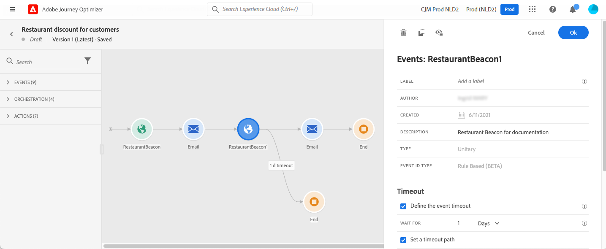

# Eventos gerais {#general-events}

>[!CONTEXTUALHELP]
>id="ajo_journey_event_custom"
>title="Eventos unitários"
>abstract="Os eventos permitem acionar as jornadas de forma unitária para enviar mensagens em tempo real à pessoa que flui para a jornada. Para esse tipo de evento, você só pode adicionar um rótulo e uma descrição. A configuração do evento é executada por um engenheiro de dados e não pode ser editada."

Os Eventos permitem acionar as jornadas de forma unitária para enviar mensagens, em tempo real, ao indivíduo que flui para a jornada.

Para esse tipo de evento, você só pode adicionar um rótulo e uma descrição. O restante da configuração não pode ser editado. Ele foi executado pelo usuário técnico. Consulte [esta página](../event/about-events.md).

Quando você solta um evento comercial, ele adiciona automaticamente um **Ler público-alvo** atividade. Para obter mais informações sobre eventos comerciais, consulte [nesta seção](../event/about-events.md)

## Acompanhamento de eventos durante um período específico {#events-specific-time}

Uma atividade de evento posicionada na jornada escuta eventos indefinidamente. Para acompanhar um evento somente durante um determinado tempo, você deve configurar um tempo limite para o evento.

A jornada ouvirá o evento durante o tempo especificado no tempo limite. Se um evento for recebido durante esse período, a pessoa fluirá no caminho do evento. Caso contrário, o cliente fluirá para um caminho de tempo limite ou encerrará a jornada.

Para configurar um tempo limite para um evento, siga estas etapas:

1. Ativar o **[!UICONTROL Definir o tempo limite do evento]** nas propriedades do evento.

1. Especifique por quanto tempo a jornada aguardará pelo evento. A duração máxima é de 29 dias.

1. Se desejar enviar as pessoas físicas para um caminho de tempo limite quando nenhum evento for recebido dentro do tempo limite especificado, habilite o **[!UICONTROL Definir um caminho de tempo limite]** opção. Se essa opção não estiver habilitada, a jornada será encerrada para o indivíduo assim que o tempo limite for atingido.

   

Neste exemplo, a jornada envia um primeiro push de boas-vindas para um cliente. Em seguida, ele envia um push de desconto para refeição somente se o cliente entrar no restaurante no dia seguinte. Portanto, configuramos o evento do restaurante com um tempo limite de 1 dia:

* Se o evento do restaurante for recebido menos de 1 dia após o push de boas-vindas, a atividade de push de desconto para refeições será enviada.
* Se nenhum evento de restaurante for recebido no dia seguinte, a pessoa fluirá pelo caminho de tempo limite.

Observe que se quiser configurar um tempo limite em vários eventos posicionados após um **[!UICONTROL Aguardar]** atividade, é necessário configurar o tempo limite em apenas um desses eventos.

O tempo limite será aplicado a todos os eventos posicionados após o **[!UICONTROL Aguardar]** atividade. Se nenhum evento for recebido antes do tempo limite especificado, os indivíduos fluirão para um único caminho de tempo limite ou encerrarão sua jornada.

