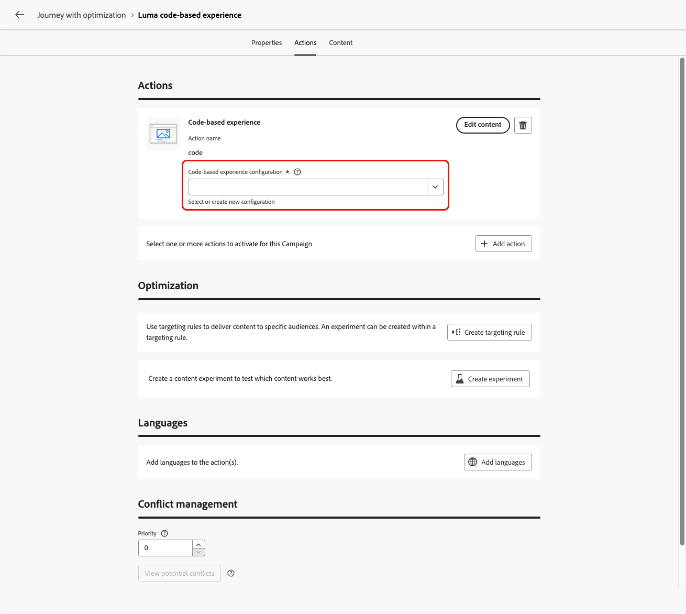
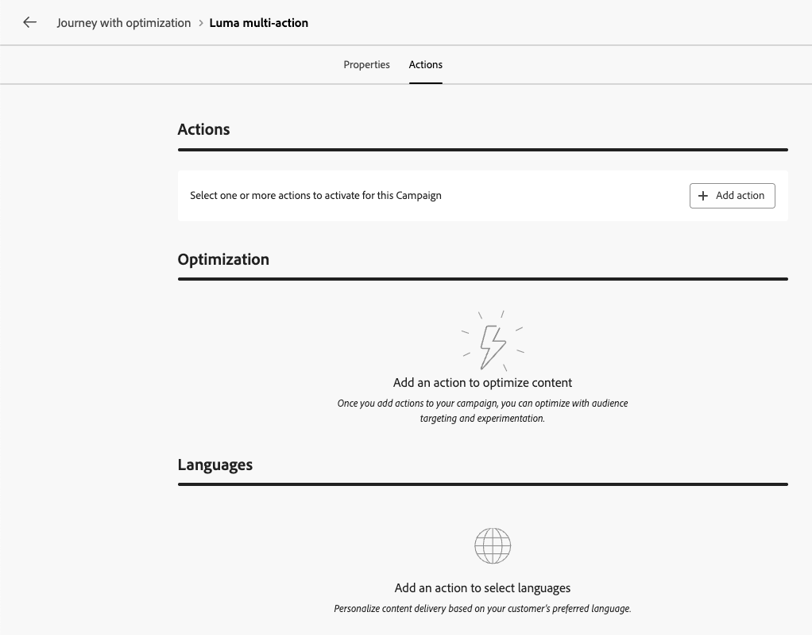

# Usar a Atividade de ação {#add-a-message-in-a-journey}

>[!CONTEXTUALHELP]
>id="ajo_action_activity"
>title="Atividade de ação"
>abstract="A atividade **Ação** permite configurar uma única ação de canal nativo e várias atividades de entrada com a capacidade de adicionar otimização a qualquer ação de canal interna."

O [!DNL Journey Optimizer] vem com uma nova atividade genérica **Action** que permite configurar uma única ação de canal interna e também várias atividades de entrada.

A atividade Action oferece:

* Uma configuração de ação nativa simplificada na tela da jornada.
* A capacidade de criar grupos de ação de entrada multiação.
* A capacidade de adicionar otimização a qualquer ação de canal integrada.

Para adicionar uma ação de canal interna à sua jornada, use a atividade **Ação**. Essa atividade unificada consolida todas as ações de canal (Email, Push, SMS, No aplicativo, Web, Experiência baseada em código e Cartão de conteúdo) em um único tipo de atividade, substituindo as atividades individuais de canal anteriores.

>[!IMPORTANT]
>
>Sendo todos os canais nativos agora acessíveis por meio da atividade Ação, as atividades de canal nativas herdadas serão descontinuadas na versão de março. As jornadas existentes que incluem ações herdadas continuarão a funcionar como estão — não é necessária nenhuma migração.

Você também pode configurar ações personalizadas para enviar suas mensagens no [!DNL Journey Optimizer]. [Saiba mais](#recommendation)

## Adicionar uma ação de canal interna a uma jornada  {#add-action}

Para adicionar uma ação de canal interna à sua jornada usando a atividade **[!UICONTROL Ação]**, siga as etapas abaixo.

Para obter mais informações sobre os canais disponíveis no jornada, consulte a tabela nesta seção: [Canais em jornadas e campanhas](../channels/gs-channels.md#channels).

1. Inicie sua jornada com uma atividade [Evento](general-events.md) ou [Ler público](read-audience.md).

1. Na seção **[!UICONTROL Ações]** da paleta, arraste e solte uma atividade **[!UICONTROL Ação]** na tela.

1. Selecione a atividade de canal integrada que deseja aproveitar no jornada.

   

1. Adicione um rótulo à sua ação e selecione **[!UICONTROL Configurar ação]**.

   {width="80%"}

1. Você é direcionado para a guia **[!UICONTROL Ações]** da tela de configuração da ação de jornada.

   Selecione a configuração a ser usada para o canal selecionado.

   

1. Se você selecionou um canal de entrada, é possível adicionar várias ações. [Saiba mais](#multi-action)

1. Configure sua atividade de acordo com o canal selecionado. Diretrizes de configuração detalhadas estão disponíveis nos links abaixo.

   * Saiba mais sobre as etapas detalhadas para criar sua ação de saída da seguinte maneira:

     <table style="table-layout:fixed">
      <tr style="border: 0;">
      <td>
      
      
<a href="../email/create-email.md"><strong>Criar emails</strong>
      

      

      </td>
      <td>
      
      

      <a href="../push/create-push.md"><strong>Criar notificações por push<strong></a>
      

      

      </td>
      <td>
      
      

      <a href="../sms/create-sms.md"><strong>Criar mensagens de texto (SMS/MMS)</strong></a>
      

      

      </td>
      </tr>
      </table>

   * Saiba mais sobre as etapas detalhadas para criar sua ação de entrada da seguinte maneira:

     <table style="table-layout:fixed">
      <tr style="border: 0;">
      <td>
      
      
<a href="../in-app/create-in-app.md"><strong>Criar mensagens no aplicativo</strong>
      

      

      </td>
      <td>
      
      
<a href="../web/create-web.md"><strong>Criar experiências da Web</strong>
      

      

      </td>
      <td>
      
      
<a href="../content-card/create-content-card.md"><strong>Criar cartões de conteúdo</strong>
      

      

      </td>
      <td>
      
      

      <a href="../code-based/create-code-based.md"><strong>Criar experiências baseadas em código<strong></a>
      

      

      </td>
      </tr>
      </table>

   >[!NOTE]
   >
   >* Cada ação de experiência de entrada vem com uma atividade de 3 dias **Aguardar**. [Saiba mais](wait-activity.md#auto-wait-node)
   >
   >* Para emails e notificações por push, é possível ativar a Otimização de tempo de envio. [Saiba mais](send-time-optimization.md)

1. Dependendo da atividade, é possível exibir parâmetros avançados específicos do canal selecionado e substituir alguns valores padrão, como o endereço de execução. [Saiba mais](about-journey-activities.md#advanced-parameters)

   >[!NOTE]
   >
   >Se os parâmetros avançados estiverem ocultos, clique no botão **[!UICONTROL Mostrar campos somente leitura]** na parte superior do painel direito.

1. Use a seção **[!UICONTROL Otimização]** para executar experimentos de conteúdo, aproveitar regras de direcionamento ou usar combinações avançadas de experimentação e direcionamento.

   Estas diferentes opções e as etapas a serem seguidas estão detalhadas em [esta seção](../content-management/gs-message-optimization.md).

1. Use a seção **[!UICONTROL Idiomas]** para criar conteúdo em vários idiomas dentro da sua ação de jornada. Para fazer isso, clique no botão **[!UICONTROL Adicionar idiomas]** e selecione as **[!UICONTROL configurações de idioma]** desejadas.

   Informações detalhadas sobre como configurar e usar recursos multilíngues estão disponíveis em [esta seção](../content-management/multilingual-gs.md).

Configurações adicionais estão disponíveis, dependendo do canal de comunicação selecionado. Expanda as seções abaixo para obter mais informações.

+++**Aplicar regras de limitação** (Email, Push, SMS)

Na lista suspensa **[!UICONTROL Regras de negócio]**, selecione um conjunto de regras para aplicar regras de limitação à sua ação de jornada.

O uso de conjuntos de regras de canal permite definir o limite de frequência por tipo de comunicação para evitar sobrecarga de clientes com mensagens semelhantes.

[Saiba como trabalhar com conjuntos de regras](../conflict-prioritization/rule-sets.md)

+++

+++**Rastrear envolvimento** (Email, SMS).

Use a seção **[!UICONTROL Rastreamento de ação]** para acompanhar como seus destinatários reagem às suas entregas de email ou SMS.

Os resultados do rastreamento podem ser acessados no relatório de jornada depois que a jornada for executada.

[Saiba mais sobre relatórios do jornada](../reports/journey-global-report-cja.md)

+++

+++**Habilitar o modo de entrega rápida** (Push).

O modo de entrega rápida é um complemento do [!DNL Journey Optimizer] que permite o envio muito rápido de mensagens por push em grandes volumes por meio de campanhas.

A entrega rápida é usada quando o atraso na entrega da mensagem é essencial para os negócios, quando você deseja enviar um alerta de push urgente em telefones celulares, por exemplo, notícias de última hora para usuários que instalaram seu aplicativo de canal de notícias.

Saiba como habilitar o modo de entrega rápida para notificações por push [nesta página](../push/create-push.md#rapid-delivery).

Para obter mais informações sobre desempenho ao usar o modo de entrega rápida, consulte [[!DNL Adobe Journey Optimizer] descrição do produto](https://helpx.adobe.com/br/legal/product-descriptions/adobe-journey-optimizer.html){target="_blank"}.

+++

+++**Atribuir pontuações de prioridade** (Web, No aplicativo, Baseado em código)

Na seção **[!UICONTROL Gerenciamento de conflitos]**, você pode atribuir uma pontuação de prioridade à ação de jornada, permitindo que você priorize uma ação de entrada quando houver várias ações de jornada ou campanhas usando a mesma configuração de canal.

Por padrão, a pontuação de prioridade da ação é herdada da pontuação de prioridade geral da jornada.

[Saiba como atribuir pontuações de prioridade a ações de canal](../conflict-prioritization/priority-scores.md#priority-action)

+++

+++**Definir regras de entrega adicionais** (Cartões de conteúdo)

Para jornadas de cartão de conteúdo, é possível habilitar regras de entrega adicionais para escolher os eventos e critérios que acionam sua mensagem.

[Saiba como criar cartões de conteúdo](../content-card/create-content-card.md)

+++

+++**Definir acionadores** (no aplicativo)

Para mensagens no aplicativo, você pode usar o botão **[!UICONTROL Editar acionadores]** para escolher os eventos e critérios que acionam sua mensagem.

[Saiba como criar uma mensagem no aplicativo](../in-app/create-in-app.md)

+++

## Adicionar várias ações de entrada {#multi-action}

>[!CONTEXTUALHELP]
>id="ajo_multi_action_journey"
>title="Adicionar várias ações de entrada"
>abstract="É possível selecionar várias ações de entrada em uma única jornada. Este recurso permite entregar várias experiências baseadas em código, mensagens no aplicativo, cartões de conteúdo ou ações da web para locais diferentes ao mesmo tempo, cada ação com um conteúdo específico."

Para simplificar a orquestração de jornadas, é possível definir várias ações de entrada em uma única ação de jornada.

>[!NOTE]
>
>Essa capacidade só está disponível para canais de entrada. No momento, não há suporte para canais de saída como email.

Essa capacidade permite que você forneça várias experiências baseadas em código, mensagens no aplicativo, Cartões de conteúdo ou ações da Web para diferentes locais ao mesmo tempo, sem a necessidade de criar várias ações de jornada. Ele facilita a implantação da jornada e permite relatórios mais suaves, com todos os dados consolidados em uma única jornada.

Por exemplo, você pode enviar uma experiência baseada em código para vários endpoints com conteúdo ligeiramente diferente. Para fazer isso, crie várias ações baseadas em código na mesma ação do jornada, cada uma com uma configuração de endpoint diferente.

Para definir várias ações de entrada em um único nó de ação de jornada, siga as etapas abaixo.

1. Inicie sua jornada com uma atividade [Evento](general-events.md) ou [Ler público](read-audience.md).

1. Na seção **[!UICONTROL Ações]** da paleta, arraste e solte uma atividade **[!UICONTROL Ação]** na tela.

1. Selecione **[!UICONTROL Várias ações]** como o tipo de ação.

   

1. Adicione um rótulo se necessário e selecione **[!UICONTROL Configurar ação]**.

   {width="60%"}

1. Você é direcionado para a guia **[!UICONTROL Ações]** da tela de configuração da ação de jornada.

   {width="70%"}

1. Selecione uma ação de entrada (**Experiência baseada em código**, **Mensagem no aplicativo**, **Cartão de Conteúdo** ou **Web**) na seção **[!UICONTROL Ações]**.

1. Selecione a configuração de canal e defina um conteúdo específico para essa ação.

1. Use o botão **[!UICONTROL Adicionar ação]** para selecionar outra ação de entrada na lista suspensa.

   {width="80%"}

1. Continue da mesma forma para adicionar mais ações. Você pode adicionar até 10 ações de entrada em um grupo de ações de jornada.

Quando a jornada estiver [ativa](publish-journey.md), todas as ações serão ativadas simultaneamente.

## Atualizar um conteúdo ao vivo {#update-live-content}

Você pode atualizar o conteúdo de uma ação de canal integrada em uma jornada em tempo real.

Quaisquer alterações feitas no conteúdo não serão refletidas na jornada até que você salve as propriedades da ação. [Saiba mais](about-journey-activities.md#advanced-parameters)

Para fazer isso, abra a jornada em tempo real, selecione a atividade de canal e clique em **Editar conteúdo**.

No entanto, não é possível alterar os atributos usados na personalização, sejam eles atributos de perfil ou dados contextuais (de propriedades de evento ou jornada).

* Se você modificou dados contextuais, a seguinte mensagem de erro será exibida: `ERR_AUTHORING_JOURNEYVERSION_201`

* Se você modificou atributos de perfil, a seguinte mensagem de erro será exibida: `ERR_AUTHORING_JOURNEYVERSION_202`

Observe que, para a atividade no aplicativo, qualquer alteração pode ser feita no conteúdo enquanto a jornada está ativa, mas os acionadores no aplicativo não podem ser modificados.

## Enviar com ações personalizadas {#recommendation}

Em vez de usar os recursos de mensagem incorporados, você pode usar ações personalizadas para configurar a conexão de um sistema de terceiros para enviar mensagens ou chamadas de API.

* Se você estiver usando um sistema de terceiros para enviar mensagens, poderá criar uma ação personalizada. [Saiba mais](../action/action.md)

* Se estiver trabalhando com o Adobe Campaign, consulte estas seções:

   * [[!DNL Journey Optimizer] e o Campaign v7/v8](../action/acc-action.md)
   * [[!DNL Journey Optimizer] e Campaign Standard](../action/acs-action.md)
