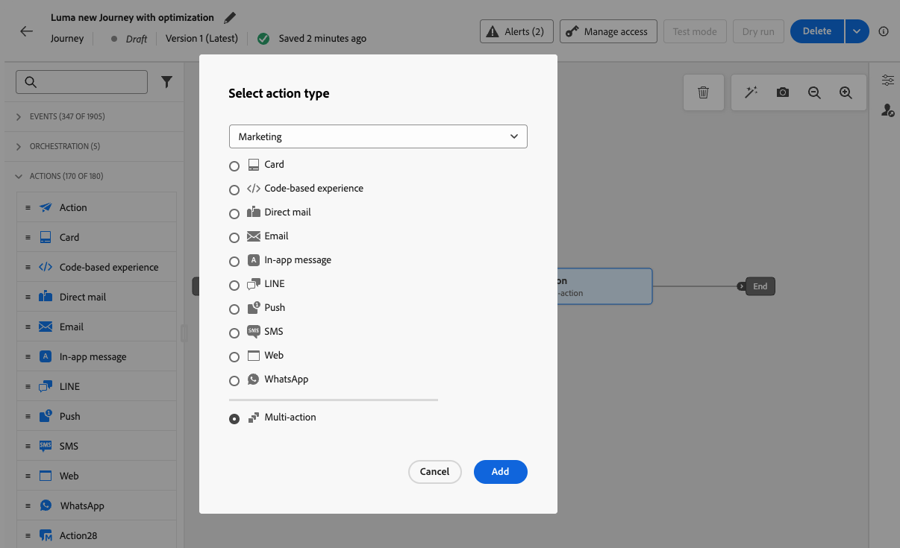

# Usar a atividade Ação {#add-a-message-in-a-journey}

>[!CONTEXTUALHELP]
>id="ajo_action_activity"
>title="Atividade de ação"
>abstract="A atividade genérica **Action** permite configurar uma única ação de canal nativo e várias atividades de entrada com a capacidade de adicionar otimização a qualquer ação de canal incorporada."

>[!AVAILABILITY]
>
>Este recurso é oferecido com disponibilidade limitada. Entre em contato com o seu representante da Adobe para obter acesso.

O [!DNL Journey Optimizer] vem com uma nova atividade genérica **Action** que permite configurar uma única ação de canal interna e também várias atividades de entrada.

Ele permite:

* Uma configuração de ação nativa simplificada na tela da jornada.
* A capacidade de criar grupos de ação de entrada de várias ações.
* A capacidade de adicionar otimização a qualquer ação de canal integrada.

>[!NOTE]
>
>Você também pode configurar ações personalizadas para enviar suas mensagens no [!DNL Journey Optimizer]. [Saiba mais](#recommendation)

## Adicionar uma ação a uma jornada  {#add-action}

Para adicionar uma ação de canal integrada a uma jornada, siga as etapas abaixo.

1. Inicie sua jornada com uma atividade [Evento](general-events.md) ou [Ler público](read-audience.md).

1. Na seção **[!UICONTROL Ações]** da paleta, arraste e solte uma atividade **[!UICONTROL Ação]** na tela.

1. Selecione a atividade de canal integrada que deseja aproveitar no jornada.

   

1. Adicione um rótulo à sua ação e selecione **[!UICONTROL Configurar ação]**.

   {width="80%"}

1. Você é direcionado para a guia **[!UICONTROL Ações]** da tela de configuração da ação de jornada.

   Selecione a configuração a ser usada para o canal selecionado.

   

1. Se você selecionou um canal de entrada, é possível adicionar várias ações. [Saiba mais](#multi-action)

1. Configure sua atividade de acordo com o canal selecionado. Saiba como configurar ações de canal integradas em [esta seção](journeys-message.md).

1. Use a seção **[!UICONTROL Otimização]** para executar experimentos de conteúdo, aproveitar regras de direcionamento ou usar combinações avançadas de experimentação e direcionamento. Estas diferentes opções e as etapas a serem seguidas estão detalhadas em [esta seção](../campaigns/campaigns-message-optimization.md).

1. Use a seção **[!UICONTROL Idiomas]** para criar conteúdo em vários idiomas dentro da sua ação de jornada. Para isso, clique no botão **[!UICONTROL Adicionar idiomas]** e selecione as **[!UICONTROL Configurações de idioma]** desejadas. Informações detalhadas sobre como configurar e usar recursos multilíngues estão disponíveis em [esta seção](../content-management/multilingual-gs.md).

Configurações adicionais estão disponíveis, dependendo do canal de comunicação selecionado. Expanda as seções abaixo para obter mais informações.

+++**Aplicar regras de limitação** (Email, Correspondência direta, Push, SMS)

Na lista suspensa **[!UICONTROL Regras de negócio]**, selecione um conjunto de regras para aplicar regras de limitação à sua ação de jornada. O uso de conjuntos de regras de canal permite definir o limite de frequência por tipo de comunicação para evitar sobrecarga de clientes com mensagens semelhantes. [Saiba como trabalhar com conjuntos de regras](../conflict-prioritization/rule-sets.md)

+++

+++**Rastrear envolvimento** (Email, SMS).

Use a seção de **[!UICONTROL Rastreamento de ações]** para acompanhar como os seus destinatários reagem às suas entregas de email ou SMS. Os resultados do rastreamento podem ser acessados no relatório de jornada depois que a jornada for executada. [Saiba mais sobre os relatórios do jornada](../reports/journey-global-report-cja.md)

+++

+++**Habilitar o modo de entrega rápida** (Push).

O modo de entrega rápida é um complemento do [!DNL Journey Optimizer] que permite um envio muito rápido de mensagens por push em grandes volumes por meio das campanhas. A entrega rápida é usada quando um atraso na entrega das mensagens seria crítico para os negócios, quando você deseja enviar um alerta por push urgente a telefones celulares, como, por exemplo, notícias de última hora para usuários que instalaram o seu aplicativo de canal de notícias. Para mais informações sobre desempenho ao usar o modo de entrega rápida, consulte a [descrição do produto Adobe Journey Optimizer](https://helpx.adobe.com/br/legal/product-descriptions/adobe-journey-optimizer.html).

+++

+++**Atribuir pontuações de prioridade** (Web, No aplicativo, Baseado em código)

Na seção **[!UICONTROL Gerenciamento de conflitos]**, atribua uma pontuação de prioridade à ação de jornada, permitindo que você priorize uma ação de entrada quando houver várias ações de jornada ou campanhas usando a mesma configuração de canal. Insira um valor numérico (de 0 a 100). Observe que, quanto maior o número, maior a prioridade. Por padrão, a pontuação de prioridade da ação é herdada da pontuação de prioridade geral da jornada. [Saiba como atribuir pontuações de prioridade a jornadas e campanhas](../conflict-prioritization/priority-scores.md)

+++

+++**Definir regras de entrega adicionais** (Cartões de conteúdo)

Para jornadas de cartão de conteúdo, é possível habilitar regras de entrega adicionais para escolher os eventos e critérios que acionam sua mensagem. [Saiba como criar cartões de conteúdo](../content-card/create-content-card.md)

+++

+++**Definir acionadores** (no aplicativo)

Para mensagens no aplicativo, você pode usar o botão **[!UICONTROL Editar acionadores]** para escolher os eventos e critérios que acionam sua mensagem. [Saiba como criar uma mensagem no aplicativo](../in-app/create-in-app.md)

+++

## Adicionar várias ações de entrada {#multi-action}

>[!CONTEXTUALHELP]
>id="ajo_multi_action_journey"
>title="Adicionar várias ações de entrada"
>abstract="É possível selecionar várias ações de entrada em uma única jornada. Este recurso permite que você forneça várias experiências baseadas em código, mensagens no aplicativo, cartões de conteúdo ou ações da web para locais diferentes ao mesmo tempo, cada ação com um conteúdo específico."

Para simplificar a orquestração de jornadas, é possível definir várias ações de entrada em uma única ação de jornada.

>[!NOTE]
>
>Essa capacidade só está disponível para canais de entrada. No momento, não há suporte para canais de saída como email.

Essa capacidade permite que você forneça várias experiências baseadas em código, mensagens no aplicativo, Cartões de conteúdo ou ações da Web para diferentes locais ao mesmo tempo, sem a necessidade de criar várias ações de jornada. Ele facilita a implantação da jornada e permite relatórios mais suaves, com todos os dados consolidados em uma única jornada.

Por exemplo, você pode enviar uma experiência baseada em código para vários endpoints com conteúdo ligeiramente diferente. Para fazer isso, crie várias ações baseadas em código na mesma ação do jornada, cada uma com uma configuração de endpoint diferente.

Para definir várias ações de entrada em um único nó de ação de jornada, siga as etapas abaixo.

1. Inicie sua jornada com uma atividade [Evento](general-events.md) ou [Ler público](read-audience.md).

1. Na seção **[!UICONTROL Ações]** da paleta, arraste e solte uma atividade **[!UICONTROL Ação]** na tela.

1. Selecione **[!UICONTROL Várias ações]** como o tipo de ação.

   

1. Adicione um rótulo se necessário e selecione **[!UICONTROL Configurar ação]**.

   {width="60%"}

1. Você é direcionado para a guia **[!UICONTROL Ações]** da tela de configuração da ação de jornada.

   

1. Selecione uma ação de entrada (**Experiência baseada em código**, **Mensagem no aplicativo**, **Cartão de Conteúdo** ou **Web**) na seção **[!UICONTROL Ações]**.

1. Selecione a configuração de canal e defina um conteúdo específico para essa ação.

1. Use o botão **[!UICONTROL Adicionar ação]** para selecionar outra ação de entrada na lista suspensa.

   {width="80%"}

1. Continue da mesma forma para adicionar mais ações. Você pode adicionar até 10 ações de entrada em um grupo de ações de jornada.

Quando a jornada estiver [ativa](publishing-the-journey.md), todas as ações serão ativadas simultaneamente.
<!--
## Next steps {#next}

Once your action is configured, you can design its content. [Learn more]-->
