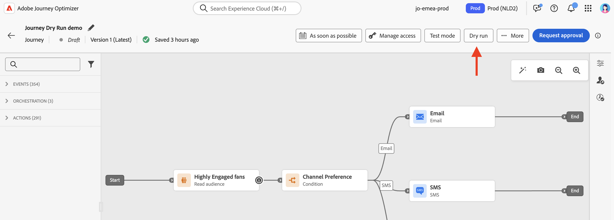
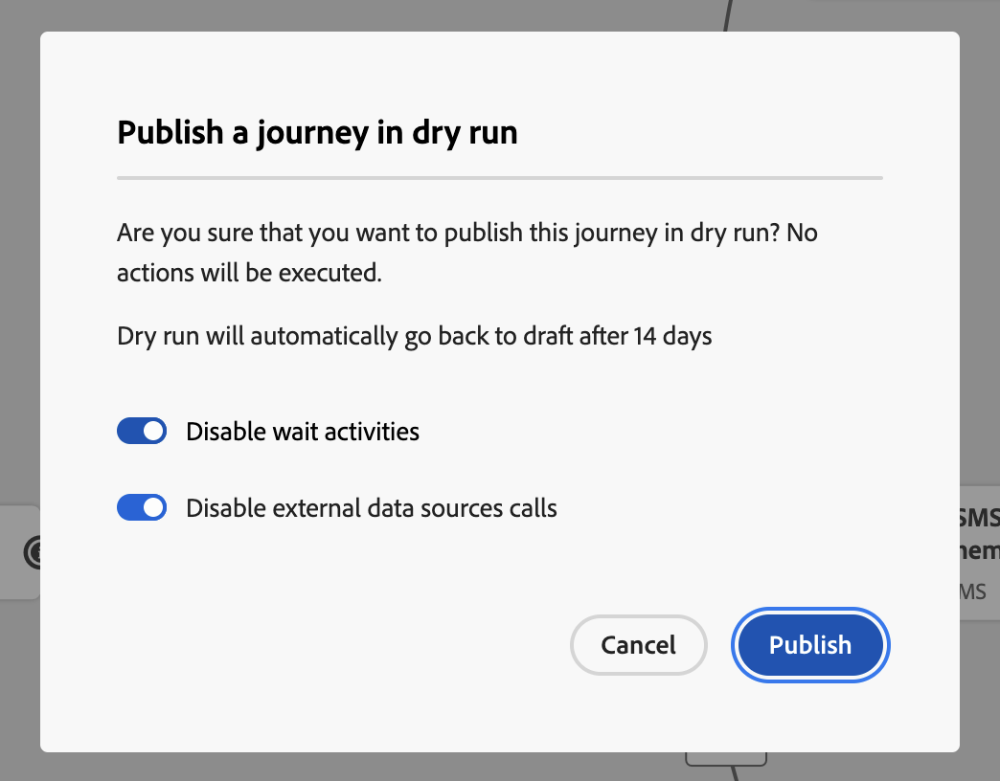
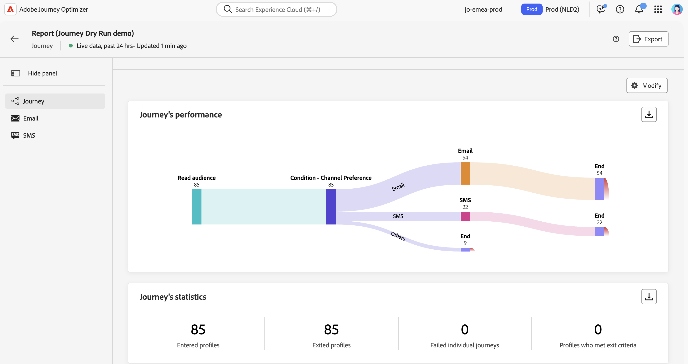
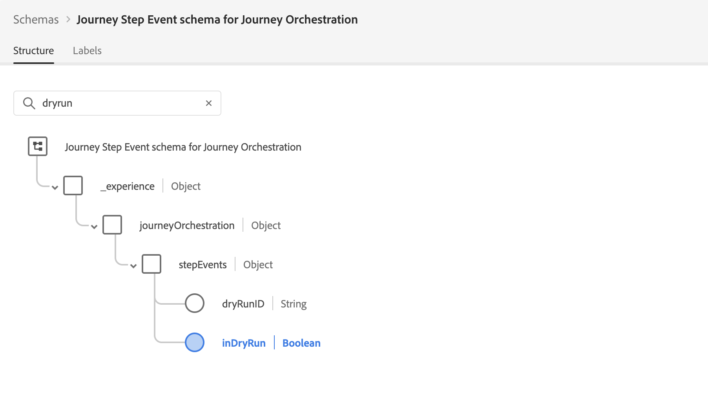

# Teste de simulação de jornada {#journey-dry-run}

>[!BEGINSHADEBOX]

**Nesta página:** saiba como publicar uma jornada no modo de execução a seco para testá-la com dados de produção reais sem entrar em contato com clientes reais ou atualizar perfis, para que você possa validar seu design antes de entrar em funcionamento.

>[!ENDSHADEBOX]

>[!CONTEXTUALHELP]
>id="ajo_journey_dry_run"
>title="Modo de teste de simulação"
>abstract="Esta jornada está em teste de simulação. O teste de simulação da jornada é um modo de publicação especial no [!DNL Adobe Journey Optimizer] que permite que profissionais testem uma jornada usando dados de produção reais, sem entrar em contato com clientes reais ou atualizar informações de perfil.  Esse recurso ajuda os profissionais de jornada a ganharem confiança no design da jornada e no direcionamento de público-alvo antes de publicá-la."

>[!CONTEXTUALHELP]
>id="ajo_journey_dry_run_start"
>title="Publicar uma jornada no modo de teste de simulação"
>abstract="O teste de simulação da jornada é um modo de publicação especial no [!DNL Adobe Journey Optimizer] que permite que profissionais testem uma jornada usando dados de produção reais. Depois que uma jornada é projetada, uma execução de teste confirma que ela está funcional e garante que as etapas estejam corretas. Esse modo de publicação permite realizar um teste preliminar da jornada sem enviar comunicações para qualquer perfil."

O teste de simulação da jornada é um modo de publicação especial no [!DNL Adobe Journey Optimizer] que permite que profissionais testem uma jornada usando dados de produção reais, sem entrar em contato com clientes reais ou atualizar informações de perfil.  Esse recurso ajuda os profissionais de jornada a ganharem confiança no design da jornada e no direcionamento de público-alvo antes de publicá-la.

➡️ [Saiba mais sobre o teste simples do jornada neste vídeo](#dry-run-video)

## Principais benefícios {#journey-dry-run-benefits}

O Jornada Dry run aumenta a confiança do profissional e o sucesso da jornada, permitindo testes seguros e orientados por dados das jornadas do cliente usando dados de produção reais — sem o risco de entrar em contato com os clientes ou alterar as informações do perfil. Esse recurso permite que os profissionais de jornada validem o alcance do público-alvo e a lógica da ramificação antes de entrar em funcionamento, garantindo que as jornadas se alinhem às metas de negócios desejadas.

Com o Jornada Dry run, você obtém a capacidade de identificar problemas antecipadamente, otimizar estratégias de direcionamento e melhorar o design da jornada com base em dados reais, não em suposições. Integrado diretamente à tela do jornada, o Dry run oferece relatórios intuitivos e visibilidade dos principais indicadores de desempenho, permitindo que as equipes interajam com confiança e simplifiquem os fluxos de trabalho de aprovação. Isso aumenta a eficiência operacional, reduz o risco de lançamento e impulsiona melhores resultados de engajamento do cliente.

Em última análise, esse recurso melhora o tempo de implantação e reduz as falhas de jornada.

A jornada Dry run traz:

1. **Ambiente de teste seguro**: perfis no modo de simulação não são contatados, garantindo que não haja risco de envio de comunicações ou de impacto nos dados dinâmicos.
1. **Insights do público-alvo**: os profissionais de Jornada podem prever a acessibilidade do público-alvo em vários nós de jornada, incluindo recusas e exclusões com base nas condições de Jornada.
1. **Feedback em tempo real**: as métricas são exibidas diretamente na tela de jornada, de modo semelhante aos relatórios em tempo real, permitindo que os profissionais de jornada refinem seu design de jornada.

## Lógica de execução de simulação {#journey-dry-run-exec}

Durante o Dry Run, a jornada é executada no modo de simulação, aplicando os seguintes comportamentos específicos a cada atividade de jornada sem acionar ações reais:

* Os nós **Ação de canal**, incluindo emails, SMS ou notificações por push, não são executados.
* **As ações personalizadas** estão desabilitadas durante a execução Seca e suas respostas estão definidas como nulas.

  Para aprimorar a legibilidade, as ações personalizadas e as atividades de canal aparecem esmaecidas durante a execução de uma simulação.

  {width="80%"}

* As **fontes de dados**, incluindo as fontes de dados externas, e as atividades **Wait** são desabilitadas por padrão durante a Execução seca. No entanto, você pode alterar esse comportamento [ao ativar o modo de simulação](#journey-dry-run-start).

* Os nós **Reaction** não são executados: todos os perfis que entram nele serão encerrados com êxito. No entanto, as seguintes regras de prioridade se aplicam:

   * Se um nó **Reaction** for usado com um ou vários nós **unitary event** em paralelo, os perfis sempre passarão pelo evento de reação.
   * Se um nó **Reaction** for usado com um ou vários nós **response event** em paralelo, os perfis sempre irão passar pelo primeiro na tela (o que está na parte superior).

* As atividades de **Ler Público** com um tempo de execução agendado (diário, semanal ou mensal) não seguem o tempo configurado na jornada — o agendamento é ancorado no momento em que a Execução Seca é ativada. Por exemplo, se sua jornada estiver definida para ser executada diariamente às 10:00, mas você ativar o Dry run às 8:00 AM, todas as leituras programadas subsequentes durante o Dry run serão executadas às 8:00 AM.

>[!CAUTION]
>
>* As permissões para iniciar uma simulação são restritas a usuários com a permissão de alto nível **[!DNL Publish journeys]**. As permissões para parar uma simulação são restritas a usuários com a permissão de alto nível **[!DNL Manage journeys]**. Saiba mais sobre como gerenciar os direitos de acesso de [!DNL Journey Optimizer] usuários em [esta seção](../administration/permissions-overview.md).
>
>* Antes de começar a usar o recurso Dry run, [leia as Medidas de Proteção e as Limitações](#journey-dry-run-limitations).

## Iniciar uma simulação {#journey-dry-run-start}

Você pode usar o recurso Dry run em qualquer jornada de rascunho sem erros.

Para ativar o Dry run, siga estas etapas:

1. Abra a jornada que deseja testar.
1. Selecione o botão **[!UICONTROL Execução seca]**.

   

1. Selecione se você deseja habilitar ou desabilitar as atividades de **Espera** e as chamadas de **Fontes de dados externas**, e confirme a publicação de execução em andamento.

   {width="50%"}

   Uma mensagem de status, **[!UICONTROL Ativando Dry run]**, é exibida enquanto a transição está ocorrendo.

1. Uma vez ativada, a jornada entra no modo **[!UICONTROL Execução seca]**.

## Monitorar uma simulação {#journey-dry-monitor}

Depois que a publicação no modo Seco for iniciada, você poderá visualizar a execução da jornada e como os perfis avançam por ramificações e nós de jornada.

As métricas são exibidas diretamente na tela de jornada. Saiba mais sobre métricas e relatórios ao vivo do jornada em [Relatório ao vivo na tela de jornada](report-journey.md).

Você também pode acessar os **Últimos relatórios de 24 horas** e os **Relatórios de tempo integral** para o Dry run. Para acessar esses relatórios, clique no botão **Exibir relatório** no canto superior direito da tela de jornada.

>[!CAUTION]
>
> Os dados de relatório estão disponíveis somente quando a simulação está **ativa**.  Depois de interrompido, os dados de relatório não estarão mais acessíveis. Use o botão **Exportar** acima dos relatórios para baixá-los, se necessário.

## Parar uma simulação {#journey-dry-run-stop}

Após 14 dias, as jornadas de Execução Seca fazem a transição automática para o status **[!UICONTROL Rascunho]**.

As jornadas de simulação também podem ser interrompidas manualmente. Para desativar o modo Dry run, siga estas etapas:

1. Abra a jornada Dry run que deseja parar.
1. Selecione o botão **[!UICONTROL Fechar]** para finalizar o teste.
Os links para as últimas 24 horas e relatórios de todos os tempos estão disponíveis na tela de confirmação.

   {width="50%"}

1. Clique em **[!UICONTROL Voltar ao rascunho]** para confirmar.

## Medidas de proteção e limitações {#journey-dry-run-limitations}

* Os perfis no modo de execução em disco são contados em [Perfis que podem ser ativados](../audience/license-usage.md)
* Jornadas no modo simulação são contadas para a cota de jornada ativa
* As jornadas de simulação não afetam as regras de negócios
  <!--* When creating a new journey version, if a previous journey version is **Live**, then the Dry run activation is not allowed on the new version.-->
* As ações de **Salto** não estão habilitadas no Modo de Execução Seco.
Quando uma jornada de origem aciona um evento **Jump** para um evento de destino, esse evento de salto não se aplica a uma versão de jornada Dry run. Por exemplo, se a versão mais recente de uma jornada estiver em Execução a seco e a anterior for **Ativa**, o evento de salto ignorará a versão de Execução a seco e será aplicável somente para a versão **Ativa**.

## Jornada eventos de etapa e simulação {#journey-step-events}

O Jornada Dry run gera **stepEvents**. Estes stepEvents têm um sinalizador específico e ID de Dry run: `inDryRun` e `dryRunID`.

* `_experience.journeyOrchestration.stepEvents.inDryRun` retorna `true` quando a jornada está no modo Dry run e `null` para jornadas de teste ou ao vivo (execução não seca).
* `_experience.journeyOrchestration.stepEvents.dryRunID` retorna a ID da instância de simulação quando no modo de simulação; para jornadas de teste ou ativas, é `null`.

Se exportar dados de stepEvent para **sistemas externos**, você poderá filtrar execuções de execução Seca usando o sinalizador `inDryRun`.

Ao analisar **métricas de relatórios do jornada** usando o serviço de consulta [!DNL Adobe Experience Platform], os eventos de etapa gerados por Dry Run devem ser excluídos. Para fazer isso, exclua os eventos de etapa em que `inDryRun` é `true` (ou seja, inclua apenas eventos em que `inDryRun` seja `null` ou `false`).

## Perguntas frequentes {#faq}

**Uma simulação envia mensagens a clientes reais?**

Não. O Dry run usa dados de produção reais, mas não entra em contato com perfis ou atualiza informações de perfil. As ações de canal (Email, SMS, Push) não são executadas e as ações personalizadas são desabilitadas com respostas definidas como `null`.

**Que permissões preciso ter para iniciar ou parar uma execução Seca?**

Iniciar uma execução Seca requer a permissão de alto nível **[!DNL Publish journeys]**. A interrupção de uma simulação requer a permissão de alto nível **[!DNL Manage journeys]**. Saiba mais na [seção de permissões](../administration/permissions-overview.md).

**Em quais jornadas posso executar um Dry run?**

Você pode usar o comando Executar Seco em qualquer jornada de **[!UICONTROL Rascunho]** que não contenha erros.

**Por quanto tempo dura uma simulação?**

Após 14 dias, as jornadas de Execução Seca fazem a transição automática de volta para o status **[!UICONTROL Rascunho]**. Você também pode interromper uma execução seca manualmente a qualquer momento.

**As atividades de espera e as fontes de dados externas são executadas durante uma Execução Seca?**

Por padrão, as atividades de **Espera** e as **Fontes de dados** (incluindo fontes de dados externas) são desabilitadas durante uma Execução seca. Você pode alterar esse comportamento ao [ativar o modo de simulação](#journey-dry-run-start).

**Os perfis e as jornadas de simulação contam nas minhas cotas?**

Sim. Perfis no modo de execução a seco são contados em relação a [Perfis ativáveis](../audience/license-usage.md) e jornadas no modo de execução a seco são contadas em relação à cota de jornada ativa. No entanto, as jornadas de simulação não afetam as regras de negócios.

**Ainda posso acessar os relatórios de Dry run após parar o teste?**

Não. Os dados de relatório estão disponíveis somente enquanto o Dry run está **ativo**. Depois de interrompidos, os dados não estarão mais acessíveis. Use o botão **Exportar** acima dos relatórios para baixá-los antecipadamente, se necessário.

**Como posso excluir os dados de simulação do meu relatório?**

O simulação gera **stepEvents** sinalizados com `inDryRun` e um `dryRunID`. Ao analisar métricas de relatórios de jornada com o Serviço de consulta [!DNL Adobe Experience Platform], exclua os eventos de etapa em que `inDryRun` é `true` (inclua apenas eventos em que `inDryRun` seja `null` ou `false`).

**O tempo de execução agendado de uma atividade Read Audience muda no Dry run?**

Sim. Para jornadas que usam uma atividade **Read Audience** com um horário agendado (diário, semanal ou mensal), o Dry run ancora o agendamento no momento em que o Dry run é ativado, não o tempo configurado na jornada. Por exemplo, se a jornada estiver definida para ser executada às 10h, mas você ativar o Dry run às 8h, todas as leituras diárias durante o Dry run serão executadas às 8h.

## Vídeo tutorial {#dry-run-video}

Saiba como testar suas jornadas neste vídeo.

>[!VIDEO](https://video.tv.adobe.com/v/3464687/?captions=por_br&learn=on&enablevpops)

+++ Referência de conhecimento de IA

Esta seção contém conhecimento estruturado destinado a oferecer suporte à interpretação, recuperação e resposta a perguntas relacionadas a este tópico.

Para uma compreensão completa, essas informações devem ser combinadas com a documentação desta página. Nenhuma das origens deve ser independente; a página descreve o recurso, enquanto esta seção fornece um contexto adicional que ajuda a desfazer a ambiguidade da terminologia, intenção, aplicabilidade e restrições.

* **TL;DR:** esta página explica o Jornada Dry run, um modo de publicação especial que permite aos profissionais testar uma jornada usando dados de produção reais sem entrar em contato com os clientes ou modificar perfis, e aborda como iniciar, monitorar, parar e filtrar eventos de etapa de Dry run.

**Intenções:**
* Ativar o modo de execução a seco em uma jornada de rascunho para validar o alcance do público-alvo e a lógica da ramificação com dados de produção reais
* Monitorar métricas de execução de jornada na tela durante uma simulação
* Interromper uma execução seca manualmente e retornar a jornada ao status Rascunho
* Filtrar eventos de etapa de execução seca de consultas de relatórios usando o sinalizador `inDryRun`
* Entenda quais atividades são desabilitadas ou simuladas durante uma simulação

**Glossário:**
* **Dry run**: um modo de publicação de jornada especial que executa a jornada em dados de produção reais sem enviar comunicações ou atualizar informações de perfil *(específico do produto)*
* **stepEvent**: um registro de conjunto de dados gerado automaticamente que captura todas as etapas executadas por um perfil em uma jornada; eventos de etapa de execução em andamento apresentam `inDryRun=true` e um `dryRunID` *(específico do produto)*
* **Sinalizador inDryRun**: um campo booleano em stepEvents que é `true` para execuções de Execução em modo de teste e `null` para jornadas de teste ou online *(específico do produto)*

**Medidas de Proteção:**
* Somente jornadas de rascunho sem erros podem ser ativadas no modo Execução sem erros
* Para iniciar uma Execução Seca, é necessária a permissão **Publicar jornadas**; para interrompê-la, é necessário **Gerenciar jornadas**
* As jornadas de simulação saem automaticamente do modo de simulação e retornam ao status Rascunho após 14 dias. Nenhum conteúdo de jornada é perdido; somente a sessão de Dry run termina.
* Os perfis processados durante uma simulação são contados em Perfis ativáveis e na cota de jornada ativa
* Os nós de ação de canal (Email, SMS, Push) e as ações personalizadas não são executados durante Dry run
* As ações de salto não estão habilitadas no Dry run
* Os nós de reação não são executados durante a execução seca; os perfis são fechados com êxito, com regras de prioridade para ramificações unitárias paralelas e de reação
* Os dados de relatório só estão disponíveis enquanto o Dry run estiver ativo; uma vez interrompido, os dados não estarão mais acessíveis
* As jornadas de simulação não afetam as regras de negócios
* Para jornadas que usam uma atividade **Read Audience** com um horário agendado (diário, semanal ou mensal), o Dry run não segue o agendamento de jornada configurado — o agendamento é ancorado no momento em que o Dry run é ativado (por exemplo, jornada definida para 10 AM, Dry run ativado às 8 AM → todas as leituras durante o Dry run executado às 8 AM)

**Terminologia:**
* Nome canônico: Jornada Dry run — Acrônimo: none — variantes: modo de simulação, modo de publicação de simulação
* Sinônimos: &quot;Pista seca&quot; = &quot;teste de fumaça&quot; (informalmente)
* Não confunda: &quot;Dry run&quot; ≠ &quot;Modo de teste&quot; ≠ &quot;Simulation&quot; — O Dry run usa dados de produção reais e contagens em direção a Perfis ativáveis e cota de jornada em tempo real; O modo de teste usa perfis de teste de AEP persistentes em uma jornada de rascunho; A simulação usa usuários simulados temporários que não persistem no AEP

**Perguntas frequentes:**
* **P: O Dry run realmente envia emails ou notificações por push aos clientes?** — Não; todos os nós de ação de canal e ações personalizadas são desativados e não são executados durante uma execução sem erros.
* **P: Por quanto tempo um Dry run dura antes de parar automaticamente?** — 14 dias, após os quais a jornada muda automaticamente para o status Rascunho.
* **P: Como posso excluir dados do Dry run das minhas consultas de análise do jornada?** — Filtre os eventos de etapa em que `inDryRun` é `true`; inclua apenas eventos em que `inDryRun` seja `null` ou `false`.
* **P: Os perfis são contados em relação a quaisquer limites durante uma simulação?** — Sim; os perfis são contados para Perfis acionáveis e a jornada de simulação é contada para a cota de jornada ativa.
* **P: Posso habilitar atividades de espera e chamadas de fonte de dados externas durante uma execução Seca?** — Ambos são desativados por padrão, mas você pode optar por ativá-los ou desativá-los ao ativar o Dry run.
* **P: O Dry run respeita o tempo de execução agendado configurado em uma jornada Read Audience?** — Não. O Dry run ancora o agendamento para o horário de ativação, não o tempo de jornada configurado. Se a jornada estiver definida para ser executada às 10 horas, mas o Dry run estiver ativado às 8 horas, todas as leituras programadas durante o Dry run serão executadas às 8 horas.

+++
