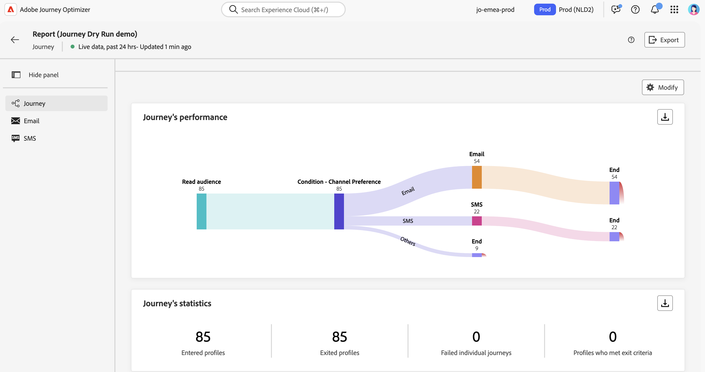

# Execução de prática de jornada {#journey-dry-run}

>[!CONTEXTUALHELP]
>id="ajo_journey_dry_run"
>title="Modo de execução de prática"
>abstract="Esta jornada está em execução de prática. A Execução de prática da jornada é um modo de publicação especial no Adobe Journey Optimizer que permite aos profissionais de jornada o teste de uma jornada usando dados de produção reais, sem entrar em contato com clientes reais ou atualizar informações de perfil.  Esse recurso ajuda os profissionais de jornada a ganharem confiança no design da jornada e no direcionamento de público-alvo antes de publicá-la."

>[!CONTEXTUALHELP]
>id="ajo_journey_dry_run_start"
>title="Publicar uma jornada no modo de execução de prática"
>abstract="A Execução de prática da jornada é um modo de publicação especial no Adobe Journey Optimizer que permite aos profissionais de jornada o teste de uma jornada usando dados de produção reais. Depois de projetar a jornada, execute um teste para confirmar sua funcionalidade e garantir que as etapas estejam corretas. Esse modo de publicação permite realizar um teste preliminar da jornada sem enviar comunicações para qualquer perfil."

A Execução de prática da jornada é um modo de publicação especial no Adobe Journey Optimizer que permite aos profissionais de jornada o teste de uma jornada usando dados de produção reais, sem entrar em contato com clientes reais ou atualizar informações de perfil.  Esse recurso ajuda os profissionais de jornada a ganharem confiança no design da jornada e no direcionamento de público-alvo antes de publicá-la.

## Principais benefícios {#journey-dry-run-benefits}

O Jornada Dry run aumenta a confiança do profissional e o sucesso da jornada, permitindo testes seguros e orientados por dados das jornadas do cliente usando dados de produção reais — sem o risco de entrar em contato com os clientes ou alterar as informações do perfil. Esse recurso permite que os profissionais de jornada validem o alcance do público-alvo e a lógica da ramificação antes de entrar em funcionamento, garantindo que as jornadas se alinhem às metas de negócios desejadas.

Com o Jornada Dry run, você obtém a capacidade de identificar problemas antecipadamente, otimizar estratégias de direcionamento e melhorar o design da jornada com base em dados reais, não em suposições. Integrado diretamente à tela do jornada, o Dry run oferece relatórios intuitivos e visibilidade dos principais indicadores de desempenho, permitindo que as equipes interajam com confiança e simplifiquem os fluxos de trabalho de aprovação. Isso aumenta a eficiência operacional, reduz o risco de lançamento e impulsiona melhores resultados de engajamento do cliente.

Em última análise, esse recurso melhora o tempo de implantação e reduz as falhas de jornada.

A jornada Dry run traz:

1. **Ambiente de teste seguro**: perfis no modo de simulação não são contatados, garantindo que não haja risco de envio de comunicações ou de impacto nos dados dinâmicos.
1. **Insights do público-alvo**: os profissionais de Jornada podem prever a acessibilidade do público-alvo em vários nós de jornada, incluindo recusas e exclusões com base nas condições de Jornada.
1. **Feedback em tempo real**: as métricas são exibidas diretamente na tela de jornada, de modo semelhante aos relatórios em tempo real, permitindo que os profissionais de jornada refinem seu design de jornada.

## Lógica de execução de simulação {#journey-dry-run-exec}

Durante o Dry Run, a jornada é executada no modo de simulação, aplicando os seguintes comportamentos específicos a cada atividade de jornada sem acionar ações reais:

* Os nós **Ação de canal**, incluindo emails, SMS ou notificações por push, não são executados.
* **As ações personalizadas** estão desabilitadas durante a execução Seca e suas respostas estão definidas como nulas.

  Para aprimorar a legibilidade, as ações personalizadas e as atividades de canal aparecem esmaecidas durante a execução de uma simulação.

  {width="80%" align="left"}

* As **fontes de dados**, incluindo as fontes de dados externas, e as atividades **Wait** são desabilitadas por padrão durante a Execução seca. No entanto, você pode alterar esse comportamento [ao ativar o modo de simulação](#journey-dry-run-start).

* Os nós **Reaction** não são executados: todos os perfis que entram nele serão encerrados com êxito. No entanto, são aplicáveis as seguintes regras de prioridade:
   * Se um nó **Reaction** for usado com um ou vários nós **unitary event** em paralelo, os perfis sempre passarão pelo evento de reação.
   * Se um nó **Reaction** for usado com um ou vários nós **response event** em paralelo, os perfis sempre irão passar pelo primeiro na tela (o que está na parte superior).

>[!CAUTION]
>
>* As permissões para iniciar uma simulação são restritas a usuários com a permissão de alto nível **[!DNL Publish journeys]**. As permissões para parar uma simulação são restritas a usuários com a permissão de alto nível **[!DNL Manage journeys]**. Saiba mais sobre como gerenciar os direitos de acesso de [!DNL Journey Optimizer] usuários em [esta seção](../administration/permissions-overview.md).
>
>* Antes de começar a usar o recurso Dry run, [leia as Medidas de Proteção e as Limitações](#journey-dry-run-limitations).

## Iniciar uma simulação {#journey-dry-run-start}

Você pode usar o recurso Dry run em qualquer jornada de rascunho sem erros.

Para ativar o Dry run, siga estas etapas:

1. Abra a jornada que deseja testar.
1. Selecione o botão **Execução seca**.

   

1. Selecione se você deseja habilitar ou desabilitar as atividades de **Espera** e as chamadas de **Fontes de dados externas**, e confirme a publicação de execução em andamento.

   {width="50%" align="left"}

   Uma mensagem de status, **Ativando Dry run**, é exibida enquanto a transição está ocorrendo.

1. Uma vez ativada, a jornada entra no modo **Execução seca**.

## Monitorar uma simulação {#journey-dry-monitor}

Depois que a publicação no modo Seco for iniciada, você poderá visualizar a execução da jornada e como os perfis avançam por ramificações e nós de jornada.

As métricas são exibidas diretamente na tela de jornada. Saiba mais sobre métricas e relatórios ao vivo do jornada em [Relatório ao vivo na tela de jornada](report-journey.md).

Você também pode acessar os **Últimos relatórios de 24 horas** e os **Relatórios de tempo integral** para o Dry run. Para acessar esses relatórios, clique no botão **Exibir relatório** no canto superior direito da tela de jornada.

>[!CAUTION]
>
> Os dados de relatório estão disponíveis somente quando a simulação está **ativa**.  Depois de interrompido, os dados de relatório não estarão mais acessíveis. Use o botão **Exportar** acima dos relatórios para baixá-los, se necessário.

## Parar uma simulação {#journey-dry-run-stop}

Após 14 dias, as jornadas de Execução Seca fazem a transição automática para o status **Rascunho**.

As jornadas de simulação também podem ser interrompidas manualmente. Para desativar o modo Dry run, siga estas etapas:

1. Abra a jornada Dry run que deseja parar.
1. Selecione o botão **Fechar** para finalizar o teste.
Os links para as últimas 24 horas e relatórios de todos os tempos estão disponíveis na tela de confirmação.

   {width="50%" align="left"}

1. Clique em **Voltar ao rascunho** para confirmar.

## Medidas de proteção e limitações {#journey-dry-run-limitations}

* Os perfis no modo simulação são contados em perfis acionáveis
* Jornadas no modo simulação são contadas para a cota de jornada ativa
* As jornadas de simulação não afetam as regras de negócios
  <!--* When creating a new journey version, if a previous journey version is **Live**, then the Dry run activation is not allowed on the new version.-->
* As ações de **Salto** não estão habilitadas no Modo de Execução Seco.
Quando uma jornada de origem aciona um evento **Jump** para um evento de destino, esse evento de salto não se aplica a uma versão de jornada Dry run. Por exemplo, se a versão mais recente de uma jornada estiver em Execução a seco e a anterior for **Ativa**, o evento de salto ignorará a versão de Execução a seco e será aplicável somente para a versão **Ativa**.

## Jornada eventos de etapa e simulação {#journey-step-events}

O Jornada Dry run gera **stepEvents**. Estes stepEvents têm um sinalizador específico e ID de Dry run: `inDryRun` e `dryRunID`.

* `_experience.journeyOrchestration.stepEvents.inDryRun` retorna `true` se a Execução Seca estiver ativada, caso contrário `false`
* `_experience.journeyOrchestration.stepEvents.dryRunID` retorna a ID de uma instância de simulação

Se exportar dados de stepEvent para **sistemas externos**, você poderá filtrar execuções de execução Seca usando o sinalizador `inDryRun`.

Ao analisar **métricas de relatórios do jornada** usando o serviço Adobe Experience Platform Query, os eventos de etapa gerados por Dry Run devem ser excluídos. Para fazer isso, defina o sinalizador `inDryRun` como `false`.

