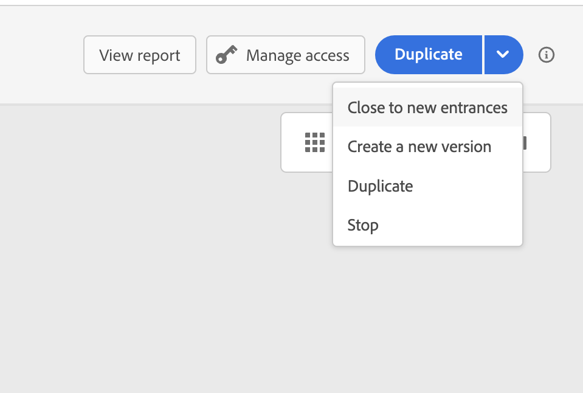

# Ciclo de vida da jornada{#journey-lifecyle}

## Perfis no jornada{#profile-journey}

Em uma jornada unitária:

* Se a reentrada estiver ativada, um perfil poderá inserir uma jornada várias vezes, mas não poderá fazê-lo até que ele tenha saído totalmente da instância anterior da jornada.

* Se a reentrada estiver desativada, um perfil não poderá inserir várias vezes a mesma jornada

Para obter mais informações sobre a reentrada do perfil, consulte esta seção [seção](../building-journeys/journey-gs.md#change-properties).

Em uma jornada de segmento de leitura:

* Para jornadas não recorrentes: o perfil é inserido uma vez e somente uma vez na jornada.
* para jornadas recorrentes: o perfil insere a jornada em cada recorrência, se ele estiver no segmento/status esperado. Se ele ainda estava na jornada de uma recorrência anterior, ele a reiniciará do início.

Em jornadas de eventos comerciais que começam com um segmento de leitura :

Sabendo que essa jornada se baseia na recepção de um evento de negócios, se o perfil estiver qualificado no segmento esperado, ele inserirá a jornada para cada evento de negócios recebido, o que significa que esse perfil pode ser várias vezes na mesma jornada, ao mesmo tempo, mas no contexto de eventos de negócios diferentes.

## Jornada final{#journey-ending}

Uma jornada pode terminar para um indivíduo em dois contextos específicos:

* A pessoa chega à última atividade de um caminho.
* A pessoa chega em um **Condição** atividade (ou uma **Aguardar** com uma condição) e não corresponde a nenhuma das condições.

A pessoa pode então entrar novamente na jornada se a reentrada for permitida. Consulte [esta página](../building-journeys/journey-gs.md#change-properties)

Para encerrar uma jornada ao vivo, recomendamos que você a feche. A chegada de novos clientes à jornada será bloqueada. Os clientes que já entraram na jornada podem experimentá-la até o fim. Consulte [esta seção](../building-journeys/journey-end.md#close-journey)

Você só pode interromper uma jornada se ocorrer uma emergência e todo o processamento precisar ser encerrado imediatamente em uma jornada. As pessoas que já entraram em uma jornada são todas interrompidas em seus progressos. Consulte [esta seção](../building-journeys/journey-end.md#stop-journey)

>[!NOTE]
>
>Observe que não é possível retomar uma jornada fechada ou interrompida.

<!--

### Journey end tag{#end-tag}

While authoring a journey, an "end node" is displayed at the end of each path. This node cannot be added by a user, cannot be removed and only its label can be changed. It marks the end of each path of the journey. If the journey has several paths, we recommend that you add a label to each end to make reports easier to read. See [this page](../reports/live-report.md).

-->

### Finalizar atividade{#journey-end-activity}

O **[!UICONTROL End]** permite marcar o final de cada caminho da jornada. Não é obrigatório, mas recomendado para clareza visual. Consulte [esta página](../building-journeys/end-activity.md)

### Fechar uma jornada{#close-journey}

Uma jornada pode ser fechada pelos seguintes motivos:

* A jornada é fechada manualmente por meio do **[!UICONTROL Close to new entrances]** botão.
* Uma jornada baseada em segmento que terminou de ser executada.
* Após a última ocorrência de uma jornada recorrente baseada em segmentos.

Fechar uma jornada manualmente garante que os clientes que já entraram na jornada possam concluir seu caminho, mas os novos usuários não poderão entrar na jornada. Quando uma jornada for fechada (por qualquer um dos motivos acima), ela terá o status **[!UICONTROL Closed]**. A jornada para de deixar novos indivíduos entrarem na jornada. As pessoas que já estão na jornada podem terminar a jornada normalmente. Após o tempo limite global padrão de 30 dias, a jornada será alternada para a variável **Concluído** status. Veja isso [seção](../building-journeys/journey-gs.md#global_timeout).

Uma versão de jornada fechada não pode ser reiniciada ou excluída. Você pode criar uma nova versão ou duplicá-la. Somente jornadas concluídas podem ser excluídas.

Para fechar uma jornada da lista de jornadas, clique no botão **[!UICONTROL Ellipsis]** botão localizado à direita do nome da jornada e selecione **[!UICONTROL Close to new entrances]**.

Você também pode:

1. No **[!UICONTROL Journeys]** , clique na jornada que deseja fechar.
1. No canto superior direito, clique na seta para baixo.

   

1. Clique em **[!UICONTROL Close to new entrances]** e confirmar na caixa de diálogo.

### Parar uma jornada{#stop-journey}

Caso precise parar o progresso de todos os indivíduos na jornada, você pode pará-la. Parar a jornada atingirá o tempo limite para todos os indivíduos na jornada. No entanto, parar uma jornada envolve que as pessoas que já entraram em uma jornada são todas interrompidas em seus progressos. A jornada está basicamente desligada. Se você quiser terminar com uma jornada, recomendamos que a feche.

Não é possível reiniciar uma versão de jornada interrompida.

Quando parado, o status da jornada é definido como **[!UICONTROL Stopped]**.

Você pode interromper uma jornada, por exemplo, se um profissional de marketing perceber que a jornada direciona o público-alvo errado ou se uma ação personalizada que deveria entregar mensagens não está funcionando corretamente. Para interromper uma jornada da lista de jornadas, clique no botão **[!UICONTROL Ellipsis]** botão localizado à direita do nome da jornada e selecione **[!UICONTROL Stop]**.

Você também pode:

1. No **[!UICONTROL Journeys]** , clique na jornada que deseja parar.
1. No canto superior direito, clique na seta para baixo.

1. Clique em **[!UICONTROL Stop]** e confirmar na caixa de diálogo.
