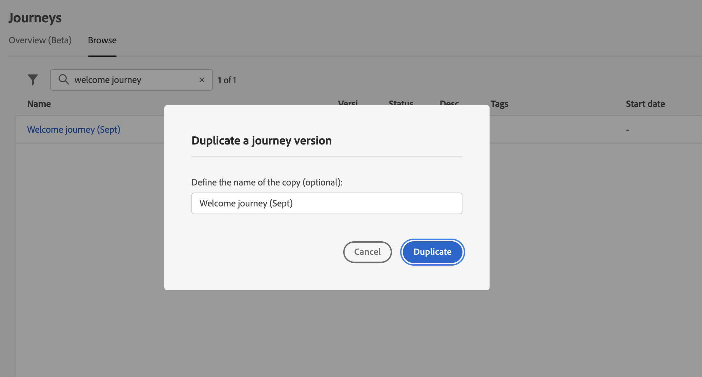

# Criar a primeira jornada{#jo-quick-start}

>[!CONTEXTUALHELP]
>id="ajo_homepage_card2"
>title="Criar jornadas"
>abstract="Use o **Adobe Journey Optimizer** para criar casos de uso de orquestração em tempo real, aproveitando dados contextuais armazenados em eventos ou fontes de dados."

## Pré-requisitos{#start-prerequisites}

Para enviar mensagens com jornadas, as seguintes configurações são necessárias:

1. **Configurar um evento**: se quiser acionar as jornadas de forma unitária quando um evento for recebido, será necessário configurar um evento. Você define as informações esperadas e como processá-las. Esta etapa é executada por um **usuário técnico**. [Leia mais](../event/about-events.md).

   

1. **Criar um público**: sua jornada também pode ouvir os públicos da Adobe Experience Platform para enviar mensagens em lote para um conjunto especificado de perfis. Para isso, você precisa criar públicos. [Leia mais](../audience/about-audiences.md).

   

1. **Configurar a fonte de dados**: é possível definir uma conexão com um sistema para recuperar informações adicionais que serão usadas em suas jornadas, por exemplo, em suas condições. Uma fonte de dados integrada da Adobe Experience Platform também é configurada no momento do provisionamento. Esta etapa não é necessária se você usar somente os dados dos eventos em sua jornada. Esta etapa é executada por um **usuário técnico**. [Leia mais](../datasource/about-data-sources.md)

   

1. **Configurar uma ação**: se você estiver usando um sistema de terceiros para enviar mensagens, é possível criar uma ação personalizada. Saiba mais nesta página [seção](../action/action.md). Esta etapa é executada por um **usuário técnico**. Se você estiver usando os recursos de mensagem incorporados do Journey Optimizer, basta adicionar uma ação de canal à jornada e projetar o conteúdo.

   

## Acessar jornadas {#journey-access}

>[!CONTEXTUALHELP]
>id="ajo_journey_create"
>title="Jornadas"
>abstract="Crie jornadas do cliente para fornecer experiências personalizadas e contextuais. O Journey Optimizer permite criar casos de uso de orquestração em tempo real usando dados contextuais armazenados em eventos ou fontes de dados. A guia **Visão geral** exibe um painel com as métricas principais relacionadas às suas jornadas. A guia **Procurar** exibe a lista de jornadas existentes."

### Métricas principais e lista de jornadas {#access-metrics}

Na seção de menu GERENCIAMENTO de JORNADAS, clique em **[!UICONTROL Jornadas]**. Duas guias estarão disponíveis:

**Visão geral**: esta guia exibe um painel com as métricas principais relacionadas às suas jornadas:

* **Perfis processados**: número total de perfis processados nas últimas 24 horas
* **Jornada ao vivo**: número total de jornadas ativas com tráfego nas últimas 24 horas. As jornadas em tempo real incluem **Jornadas unitárias** (com base em eventos) e **Jornadas em lote** (leia público).
* **Taxa de erros**: taxa de todos os perfis com erro em comparação ao número total de perfis que entraram nas últimas 24 horas.
* **Taxa de descarte**: taxa de todos os perfis descartados em comparação ao número total de perfis que entraram nas últimas 24 horas. Um perfil descartado representa alguém que não está qualificado para entrar na jornada, por exemplo, devido a um namespace incorreto ou a regras de reentrada.

>[!NOTE]
>
>Esse painel considera as jornadas com tráfego nas últimas 24 horas. Somente as jornadas às quais você tem acesso são exibidas. As métricas são atualizadas a cada 30 minutos e somente quando novos dados estão disponíveis.

**Procurar**: esta guia exibe a lista de jornadas existentes. Você pode pesquisar jornadas, usar filtros e executar ações básicas em cada elemento. Por exemplo, você pode duplicar ou excluir um item. Para obter mais informações, consulte [esta seção](../start/user-interface.md#filter-lists).

### Filtrar jornadas {#filter}

Na lista de jornadas, você pode aproveitar vários filtros para refinar a lista de jornadas para melhorar a legibilidade.

Estas são as várias operações de filtragem que você pode executar:

Filtre as jornadas de acordo com seu status, tipo, versão e tags atribuídas do **[!UICONTROL Filtros de status e versão]**.

O tipo pode ser: **[!UICONTROL Evento unitário]**, **[!UICONTROL Qualificação de público]**, **[!UICONTROL Ler público]** ou **[!UICONTROL Evento comercial]**.

O status pode ser:

* **Fechado**: a jornada foi fechada usando o **Fechar para novas entradas** botão. A jornada pára de permitir que novos indivíduos entrem na jornada. As pessoas que já estão na jornada podem terminar a jornada normalmente.
* **Rascunho**: a jornada está em seu primeiro estágio. Ele ainda não foi publicado.
* **Rascunho (Teste)**: o modo de teste foi ativado usando o **Modo de teste** botão.
* **Concluído**: a jornada alterna automaticamente para esse status após os 91 dias [tempo limite global](journey-properties.md#global_timeout). Os perfis que já estão na jornada concluem a jornada normalmente. Novos perfis não podem mais entrar na jornada.
* **Ao vivo**: a jornada foi publicada usando o **Publish** botão.
* **Parado**: a jornada foi desligada usando o **Parar** botão. Todos os indivíduos saem instantaneamente da jornada.

>[!NOTE]
>
>O ciclo de vida de criação do Jornada também inclui um conjunto de status intermediários que não estão disponíveis para filtragem: &quot;Publicação&quot; (entre &quot;Rascunho&quot; e &quot;Ao vivo&quot;), &quot;Ativando modo de teste&quot; ou &quot;Desativando modo de teste&quot; (entre &quot;Rascunho&quot; e &quot;Rascunho (teste)&quot;) e &quot;Parando&quot; (entre &quot;Ao vivo&quot; e &quot;Parado&quot;). Quando uma jornada está em um estado intermediário, ela fica como de somente leitura.

Use o **[!UICONTROL Filtros de criação]** para filtrar jornadas de acordo com a data de criação ou o usuário que as criou.

Exibir jornadas que usam um evento, grupo de campos ou ação específica do **[!UICONTROL Filtros de atividade]** e **[!UICONTROL Filtros de dados]**.

Use o **[!UICONTROL Filtros de publicação]** para selecionar uma data de publicação ou um usuário. Você pode optar, por exemplo, por exibir as versões mais recentes de jornadas ao vivo que foram publicadas ontem.

Para filtrar jornadas com base em um intervalo de datas específico, selecione **[!UICONTROL Personalizado]** do **[!UICONTROL Publicado]** lista suspensa.

Além disso, nos painéis de configuração Evento, Fonte de dados e Ação, a variável **[!UICONTROL Usado em]** campo exibe o número de jornadas que usam esse evento, grupo de campos ou ação específica. Você pode clicar no botão **[!UICONTROL Exibir jornadas]** para exibir a lista de jornadas correspondentes.

## Criar sua jornada {#jo-build}

Crie jornadas para fornecer experiências personalizadas e contextuais. O [!DNL Journey Optimizer] permite criar casos de uso de orquestração em tempo real usando dados contextuais armazenados em eventos ou fontes de dados. Crie designs de cenários avançados com várias etapas e com os seguintes recursos:

* Envie uma **entrega unitária** em tempo real acionada quando um evento é recebido, ou **em lote** usando os públicos-alvo da Adobe Experience Platform.

* Aproveite **dados contextuais** de eventos, informações da Adobe Experience Platform ou dados de serviços de API de terceiros.

* Use o **ações do canal integradas** (Email, SMS, Push, InApp) para enviar mensagens projetadas no [!DNL Journey Optimizer] ou criar **ações personalizadas** se você estiver usando um sistema de terceiros para enviar mensagens.

* Com o **Designer de jornadas**, crie seus casos de uso de várias etapas: arraste e solte facilmente um evento de entrada ou uma atividade de público-alvo de leitura, adicione condições e envie mensagens personalizadas.

➡️ [Descubra este recurso no vídeo](journey.md#video)

As etapas para enviar mensagens por meio de jornadas estão listadas abaixo.

1. No **Procurar** clique em **[!UICONTROL Criar Jornada]** para criar uma nova jornada.

1. Edite as propriedades da jornada no painel de configuração exibido no lado direito. Saiba como definir as propriedades da sua jornada nesta [esta página](journey-properties.md).

   

1. Comece arrastando e soltando um evento ou uma **Ler público-alvo** atividade da paleta para a tela. Para saber mais sobre o design do jornada, consulte [nesta seção](using-the-journey-designer.md).

   

1. Arraste e solte as próximas etapas que o indivíduo seguirá. Por exemplo, é possível adicionar uma condição seguida por uma ação de canal. Para saber mais sobre atividades, consulte [nesta seção](using-the-journey-designer.md).

1. Teste a jornada usando perfis de teste. Saiba mais nesta página [seção](testing-the-journey.md)

1. Publique sua jornada para ativá-la. Saiba mais nesta [seção](publishing-the-journey.md).

   

1. Monitore sua jornada usando as ferramentas de relatório dedicadas para medir a eficiência da sua jornada. Saiba mais nesta [seção](../reports/live-report.md).

   

## Duplicar uma jornada {#duplicate-a-journey}

É possível duplicar uma jornada existente do **Procurar** guia. Todos os objetos e configurações são duplicados na cópia de jornada.

Para fazer isso, siga as etapas abaixo:

1. Navegue até a jornada que deseja copiar, clique na guia **Mais ações** ícone (os três pontos ao lado do nome da jornada).
1. Selecione **Duplicar**.

   

1. Insira o nome da jornada e confirme. Você também pode alterar o nome na tela de propriedades da jornada. Por padrão, o nome é definido da seguinte maneira: `[JOURNEY-NAME]_copy`

   

1. A nova jornada é criada e está disponível na lista de jornadas.
