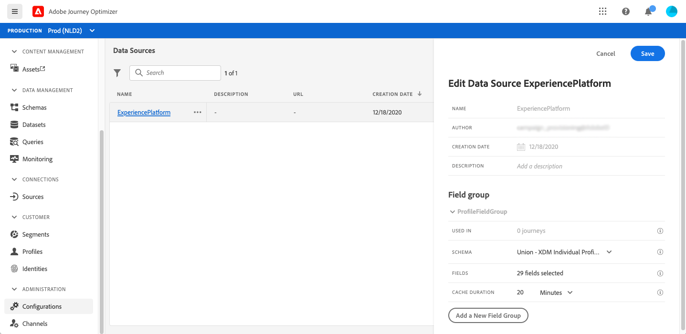
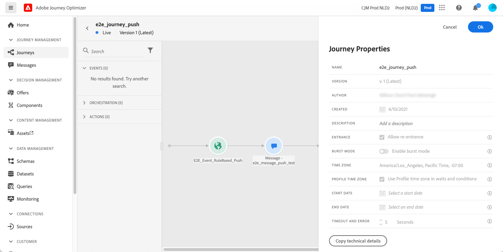
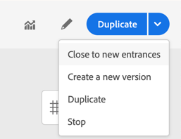

# Introdução a jornadas{#jo-quick-start}

## Pré-requisitos

Para enviar mensagens com o jornada, a seguinte configuração é necessária:

1. **Configurar um evento**: se quiser acionar as jornadas manualmente quando um evento for recebido, será necessário configurar um evento. Você define as informações esperadas e como processá-las. Esta etapa é executada por um **usuário técnico**. [Leia mais](../event/about-events.md).

   

1. **Criar um segmento**: sua jornada também pode acompanhar segmentos do Adobe Experience Platform para enviar mensagens em lote a um conjunto especificado de perfis. Para isso, é necessário criar segmentos. [Leia mais](../segment/about-segments.md).

   

1. **Configurar a fonte** de dados: você pode definir uma conexão com um sistema para recuperar informações adicionais que serão usadas em suas jornadas, por exemplo, em suas condições. Uma fonte de dados integrada da Adobe Experience Platform também é configurada no momento do provisionamento. Esta etapa não é necessária se você usar somente os dados dos eventos em sua jornada. Esta etapa é executada por um **usuário técnico**. [Leia mais](../datasource/about-data-sources.md)

   

1. **Configurar uma ação**: Os recursos de mensagens do Journey Optimizer são integrados, basta criar o conteúdo e publicar a mensagem. Consulte [esta seção](../get-started-content.md). Se você estiver usando um sistema de terceiros para enviar mensagens, é possível criar uma ação personalizada. Saiba mais nesta [seção](../action/action.md). Esta etapa é executada por um **usuário técnico**.

   

## Criar a jornada{#jo-build}

Esta etapa é executada pelo **usuário empresarial**. É aqui que você cria suas jornadas. Combine diferentes atividades de evento, orquestração e ação para criar cenários de canais em várias etapas.

Estas são as principais etapas para enviar mensagens por meio do jornada:

1. Na seção GERENCIAMENTO DE JORNADAS , clique em **[!UICONTROL Journeys]**. A lista de jornadas é exibida.

   

1. Clique em **[!UICONTROL Create]** para criar uma nova jornada.

1. Edite as propriedades da jornada no painel de configuração exibido no lado direito. Saiba mais nesta [seção](journey-gs.md#change-properties).

   

1. Comece arrastando e soltando um evento ou uma atividade **Ler segmento** da paleta na tela. Para saber mais sobre o design do jornada, consulte [esta seção](using-the-journey-designer.md).

   

1. Arraste e solte as próximas etapas que o indivíduo seguirá. Por exemplo, você pode adicionar uma condição seguida de uma mensagem. Para saber mais sobre atividades, consulte [esta seção](using-the-journey-designer.md).

1. Teste sua jornada usando perfis de teste. Saiba mais nesta [seção](testing-the-journey.md)

1. Publique sua jornada para ativá-la. Saiba mais nesta [seção](publishing-the-journey.md).

   

1. Monitore sua jornada usando as ferramentas de relatório dedicadas para medir a eficácia da jornada. Saiba mais nesta [seção](../reports/live-report.md).

   

## Alterar propriedades {#change-properties}

Clique no ícone de lápis, na parte superior direita para acessar as propriedades da jornada.

Você pode alterar o nome da jornada, adicionar uma descrição, permitir nova entrada, escolher datas de início e término e definir uma duração **[!UICONTROL Timeout and error]** se você for administrador.

O **Copy technical details** permite copiar informações técnicas sobre a jornada que a equipe de suporte pode usar para solucionar problemas. As seguintes informações são copiadas: JourneyVersion UID, OrgID, orgName, sandboxName.

### Entrada{#entrance}

Por padrão, novas jornadas permitem a reentrada. Você pode desmarcar a opção por jornadas de &quot;uma ocorrência&quot;, por exemplo, se quiser oferecer um presente único quando uma pessoa entrar em uma loja. Nesse caso, você não deseja que o cliente possa entrar novamente na jornada e receber a oferta novamente.

Quando uma jornada &quot;termina&quot;, ela terá o status **[!UICONTROL Closed (no entrance)]**. A jornada deixará de permitir que novos indivíduos entrem na jornada. Pessoas que já estão na jornada vão terminar a jornada normalmente.

Após o tempo limite global padrão de 30 dias, a jornada mudará para o status **Finished**. Consulte esta [seção](../building-journeys/journey-gs.md#global_timeout).

### Tempo limite e erro nas atividades do jornada {#timeout_and_error}

Ao editar uma ação ou atividade de condição, você pode definir um caminho alternativo em caso de erro ou tempo limite. Se o processamento da atividade de interrogação de um sistema de terceiros exceder a duração do tempo limite definida nas propriedades da jornada (campo **[!UICONTROL Timeout and  error]** ), o segundo caminho será escolhido para executar uma potencial ação de fallback.

Os valores autorizados estão entre 1 e 30 segundos.

Recomendamos que você defina um valor **[!UICONTROL Timeout and error]** muito curto se sua jornada for sensível ao tempo (por exemplo: reação ao local em tempo real de uma pessoa) porque não é possível atrasar a ação por mais de alguns segundos. Se sua jornada for menos sensível ao tempo, você poderá usar um valor mais longo para dar mais tempo ao sistema chamado para enviar uma resposta válida.

O Jornada também usa um tempo limite global. Consulte a [próxima seção](#global_timeout).

### Tempo limite da jornada global {#global_timeout}

Além do [timeout](#timeout_and_error) usado em atividades de jornada, também há um tempo limite de jornada global que não é exibido na interface e não pode ser alterado. Esse tempo limite interromperá o progresso dos indivíduos na jornada 30 dias após sua entrada. Isso significa que a jornada de um indivíduo não pode durar mais de 30 dias. Após o período de tempo limite de 30 dias, os dados do indivíduo são excluídos. Os indivíduos que ainda fluem na jornada no final do período limite serão interrompidos e serão considerados como erros no relatório.

>[!NOTE]
>
>As jornadas não reagem diretamente às solicitações de recusa, acesso ou exclusão de privacidade. No entanto, o tempo limite global garante que os indivíduos nunca permaneçam mais de 30 dias em qualquer jornada.

Devido ao tempo limite da jornada de 30 dias, quando a reentrada da jornada não é permitida, não podemos garantir que o bloqueio de reentrada funcione por mais de 30 dias. Na verdade, à medida que removemos todas as informações sobre pessoas que entraram na jornada 30 dias depois de terem entrado, não podemos conhecer a pessoa que entrou anteriormente, há mais de 30 dias.

### Fuso horário e fuso horário do perfil {#timezone}

Os fusos horários são definidos no nível da jornada.

Você pode inserir um fuso horário fixo ou usar perfis do Adobe Experience Platform para definir o fuso horário da jornada.

Para obter mais informações sobre o gerenciamento de fuso horário, consulte [esta página](../building-journeys/timezone-management.md).

## Encerramento de uma jornada

Uma jornada pode terminar para um indivíduo por dois motivos:

* A pessoa chega à última atividade de um caminho. Essa última atividade pode ser uma atividade final ou outra atividade. Não há obrigação de encerrar um caminho com uma atividade final. Consulte [esta página](../building-journeys/end-activity.md).
* A pessoa chega a uma atividade de condição (ou uma atividade de espera com uma condição) e não corresponde a nenhuma das condições.

A pessoa pode então entrar novamente na jornada se a reentrada for permitida. Consulte [esta página](../building-journeys/journey-gs.md#change-properties)

Uma jornada pode ser fechada pelos seguintes motivos:

* A jornada é fechada manualmente por meio do botão **[!UICONTROL Close to new entrances]**.
* Uma jornada baseada em segmento que terminou de ser executada.
* Após a última ocorrência de uma jornada recorrente baseada em segmentos.

Quando uma jornada é fechada (por qualquer um dos motivos acima), ela terá o status **[!UICONTROL Closed (no entrance)]**. A jornada deixará de permitir que novos indivíduos entrem na jornada. Pessoas que já estão na jornada vão terminar a jornada normalmente. Após o tempo limite global padrão de 30 dias, a jornada mudará para o status **Finished**. Consulte esta [seção](../building-journeys/journey-gs.md#global_timeout).

Caso precise parar o progresso de todos os indivíduos na jornada, você pode pará-la. Parar a jornada atingirá o tempo limite para todos os indivíduos na jornada.

Veja como fechar ou parar uma jornada manualmente:

As opções **[!UICONTROL Stop]** e **[!UICONTROL Close to new entrances]** permitem encerrar as jornadas **live**. O fechamento de uma jornada envolve **que a chegada de novos clientes à jornada é bloqueada** e que os clientes que já entraram na jornada podem experimentá-la até o fim. Essa é a maneira mais recomendada de encerrar uma jornada, pois oferece a melhor experiência para os clientes. Parar uma jornada envolve que as pessoas que já entraram em uma jornada são todas interrompidas em seu progresso. A jornada está basicamente desligada.

>[!NOTE]
>
>Observe que não é possível retomar uma jornada fechada ou interrompida.

### Fechamento de uma jornada

Você pode fechar uma jornada manualmente para garantir que os clientes que já entraram na jornada possam concluir seu caminho, mas os novos usuários não poderão entrar na jornada.

Quando fechada, uma jornada terá o status **[!UICONTROL Closed (no entrance)]**. Após o tempo limite global padrão de 30 dias, a jornada mudará para o status **Finished**. Consulte esta [seção](../building-journeys/journey-gs.md#global_timeout).

Uma versão de jornada fechada não pode ser reiniciada ou excluída. Você pode criar uma nova versão ou duplicá-la. Somente jornadas concluídas podem ser excluídas.

Você pode fechar uma jornada clicando em **[!UICONTROL Close to new entrances]** ao passar o mouse sobre uma jornada na lista de jornadas.

Você também pode:

1. Na lista **[!UICONTROL Journeys]**, clique na jornada que deseja fechar.
1. No canto superior direito, clique na seta para baixo.

   

1. Clique em **[!UICONTROL Close to new entrances]**. Uma caixa de diálogo é exibida.
1. Clique em **[!UICONTROL Close to new entrances]** para confirmar.

### Interromper uma jornada

Você pode interromper uma jornada quando ocorrer uma emergência e todo o processamento precisar ser encerrado imediatamente em uma jornada.

Não é possível reiniciar uma versão de jornada interrompida.

Quando parada, uma jornada terá o status **[!UICONTROL Stopped]**.

Você pode interromper uma jornada (por exemplo, se um profissional de marketing perceber que a jornada direciona o público-alvo errado ou uma ação personalizada que deveria entregar mensagens não está funcionando corretamente...) clicando em **[!UICONTROL Stop]** ao passar o mouse sobre uma jornada na lista de jornadas.

Você também pode:

1. Na lista **[!UICONTROL Journeys]**, clique na jornada que deseja parar.
1. No canto superior direito, clique na seta para baixo.

1. Clique em **[!UICONTROL Stop]**. Uma caixa de diálogo é exibida.
1. Clique em **[!UICONTROL Stop]** para confirmar.
