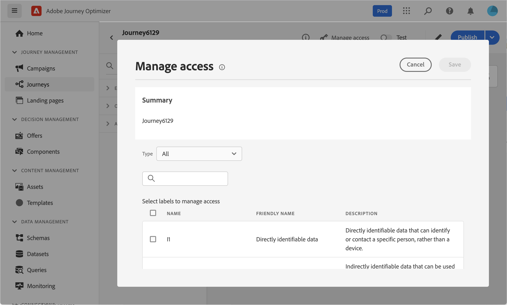
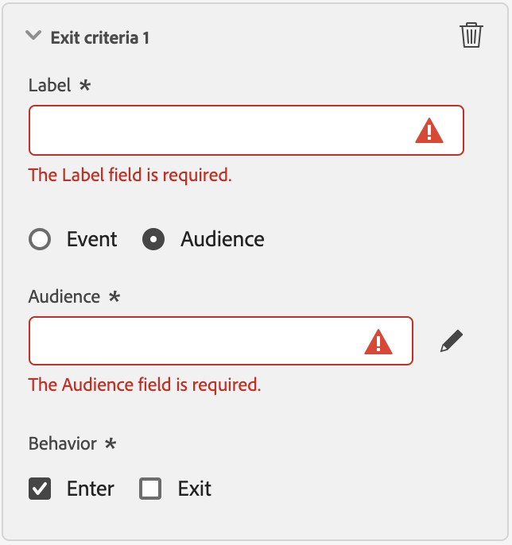

# Definir as propriedades da jornada {#jo-properties}

>[!CONTEXTUALHELP]
>id="ajo_journey_properties"
>title="Propriedades da jornada"
>abstract="Essa seção mostra as propriedades da jornada. Por padrão, os parâmetros somente leitura ficam ocultos. As configurações disponíveis dependem do status da jornada, das permissões e da configuração do produto."

## Acessar as propriedades de uma jornada {#access-properties}

As propriedades de uma jornada são centralizadas no painel direito. Esta seção é exibida por padrão ao criar uma nova jornada. Para jornadas existentes, clique no ícone de lápis ao lado do nome da jornada para abri-lo.

Nesta seção, você pode definir o nome da jornada, adicionar uma descrição e:

* gerenciar [entrada e reentrada](#entrance),
* escolher o início e o fim de [datas](#dates),
* gerenciar [acesso aos dados](#manage-access),
* defina uma [duração do tempo limite](#timeout) em atividades do jornada (somente para usuários administradores),
* selecione a jornada e o perfil [fusos horários](#timezone)
* atribua Tags unificadas do Adobe Experience Platform à sua jornada para classificá-las facilmente e melhorar a pesquisa na lista de campanhas. [Saiba como trabalhar com tags](../start/search-filter-categorize.md#tags)

>[!NOTE]
>
>Para jornadas ao vivo, essa tela exibe somente a data da publicação e o nome do usuário que publicou a jornada.

Os **detalhes técnicos da Cópia** permitem copiar informações técnicas sobre a jornada que a equipe de suporte pode usar para a solução de problemas. As seguintes informações foram copiadas: `JourneyVersion UID`, `OrgID`, `orgName`, `sandboxName`, `lastDeployedBy`, `lastDeployedAt`.

Saiba mais sobre os campos técnicos relacionados a uma jornada para um determinado perfil e como usá-los [nesta página](expression/journey-properties.md).

## Entrada e reentrada {#entrance}

O modo de entrada de perfil é definido no nível da jornada, no painel de configuração direito. As configurações estão descritas abaixo.

O gerenciamento de entrada de perfis depende do tipo de jornadas. Saiba mais sobre a entrada de perfis e o gerenciamento de reentrada em [esta página](entry-management.md).

### Permitir reentrada  {#allow-reentrance}

>[!CONTEXTUALHELP]
>id="ajo_journey_properties_entrance"
>title="Permitir reentrada"
>abstract="Por padrão, novas jornadas permitem a reentrada. Você pode desmarcar a opção **Permitir reentrada**, por exemplo, se quiser oferecer um presente único quando uma pessoa entrar em uma loja."
>additional-url="https://experienceleague.adobe.com/pt-br/docs/journey-optimizer/using/orchestrate-journeys/manage-journey/entry-management" text="Gerenciamento de entrada de perfis"

Por padrão, novas jornadas permitem a reentrada. Você pode desmarcar a opção **Permitir reentrada** para jornadas &quot;únicas&quot;, por exemplo, se quiser oferecer um presente único quando uma pessoa entrar em uma loja.

### Período de espera de reentrada  {#reentrance-wait}

>[!CONTEXTUALHELP]
>id="ajo_journey_properties_re-entrance_wait"
>title="Período de espera de reentrada"
>abstract="Defina o tempo de espera antes de permitir que um perfil entre na jornada novamente em jornadas unitárias. Isso impede que os usuários insiram novamente na jornada por um período determinado. Duração máxima: 90 dias."
>additional-url="https://experienceleague.adobe.com/pt-br/docs/journey-optimizer/using/orchestrate-journeys/manage-journey/entry-management" text="Gerenciamento de entrada de perfis"

Quando a opção **Permitir reentrada** está ativada, o campo **Período de espera de reentrada** é exibido. Este campo possibilita definir o tempo de espera antes de permitir que um perfil entre novamente em jornadas unitárias (que começam com um evento ou uma qualificação de público-alvo). Isso impede que uma mesma jornada seja incorretamente acionada várias vezes no mesmo evento. Por padrão, o campo é definido como 5 minutos. A duração máxima é de 90 dias.

## Gerenciar acesso {#manage-access}

Para atribuir rótulos de uso de dados personalizados ou principais à jornada, clique no botão **[!UICONTROL Gerenciar acesso]**. [Saiba mais sobre OLAC (Controle de Acesso em Nível de Objeto)](../administration/object-based-access.md)

## Fusos horários de Jornada e perfil {#timezone}

O fuso horário é definido no nível da jornada. Você pode inserir um fuso horário fixo ou usar perfis do Adobe Experience Platform para definir o fuso horário de jornada. Se um fuso horário for definido no perfil do Adobe Experience Platform, ele poderá ser recuperado na jornada.

Para obter mais informações sobre o gerenciamento de fuso horário, consulte [esta página](../building-journeys/timezone-management.md).

## Datas iniciais e finais {#dates}

>[!CONTEXTUALHELP]
>id="ajo_journey_properties_start_date"
>title="Data de início"
>abstract="Escolha a data em que a entrada na jornada pode começar. Se nenhuma data inicial for especificada, ela será definida automaticamente no momento da publicação."

>[!CONTEXTUALHELP]
>id="ajo_journey_properties_end_date"
>title="Data de término"
>abstract="Escolha a data final da jornada. Quando essa data é atingida, os perfis nessa jornada saem automaticamente e novos perfis não podem mais entrar."

Você pode definir uma **Data de início**. Se não tiver especificado um, ele será definido automaticamente no momento da publicação.

Você também pode adicionar uma **Data final**. Isso permite que os perfis saiam automaticamente quando a data for atingida. Se nenhuma data de término for especificada, os perfis poderão permanecer até o [tempo limite da jornada global](#global_timeout) (que geralmente é de 91 dias). A única exceção são as jornadas de público-alvo de leitura recorrente com **Forçar a reentrada na recorrência** ativada, que terminam na data de início da próxima ocorrência.

## Tempo limite {#timeout}

### Tempo limite ou erro em atividades da jornada {#timeout_and_error}

>[!CONTEXTUALHELP]
>id="ajo_journey_properties_timeout"
>title="Tempo limite"
>abstract="Defina por quanto tempo a jornada tentará executar uma ação ou verificar uma condição antes de considerá-la como tempo limite."

Ao editar uma atividade de ação ou condição, é possível definir um caminho alternativo em caso de erro ou tempo limite. Se o processamento da atividade que interroga um sistema de terceiros exceder a duração do tempo limite definida no campo **[!UICONTROL Tempo limite ou erro]** das propriedades da jornada, o segundo caminho será escolhido para executar uma possível ação de fallback.

Os valores autorizados estão entre 1 e 30 segundos.

Recomendamos que você defina um valor muito curto de **[!UICONTROL Tempo limite ou erro]** se a jornada diferenciar tempo (exemplo: reagir ao local em tempo real de uma pessoa) porque você não pode atrasar sua ação por mais do que alguns segundos. Se a jornada for menos sensível ao tempo, você poderá usar um valor mais longo para dar mais tempo ao sistema chamado para enviar uma resposta válida.

O Jornada também usa um tempo limite global, conforme detalhado abaixo.

### Tempo limite de jornada global {#global_timeout}

Além do [tempo limite](#timeout_and_error) usado em atividades de jornada, um tempo limite de jornada global é aplicado. Ele não é exibido na interface e não pode ser alterado.

Este tempo limite global interrompe o progresso das pessoas físicas na jornada **91 dias** após a sua entrada. Isso significa que a jornada de um indivíduo não pode durar mais de 91 dias. Após esse período de tempo limite, os dados do indivíduo são excluídos. Os indivíduos que ainda fluem na jornada no final do período de tempo limite serão interrompidos e não serão considerados nos relatórios. Portanto, você poderia ver mais pessoas entrando na jornada do que saindo.

Devido ao tempo limite de jornada de 91 dias, quando a reentrada da jornada não é permitida, não podemos garantir que o bloqueio de reentrada funcionará por mais de 91 dias. De fato, à medida que removemos todas as informações sobre as pessoas que entraram na jornada 91 dias depois de entrarem, não podemos saber a pessoa que entrou anteriormente, há mais de 91 dias.

Um indivíduo só poderá inserir uma atividade de espera se tiver tempo suficiente na jornada para concluir a duração da espera antes do tempo limite de jornada de 91 dias. Consulte [esta página](../building-journeys/wait-activity.md).

#### Perguntas frequentes sobre TTL (Time-to-Live) e retenção de dados {#timeout-faq}

A partir da versão de junho de 2024 do Adobe Journey Optimizer, o tempo limite global do jornada mudou de 30 para 91 dias. Os impactos estão listados nas Perguntas frequentes abaixo:

**Para Jornadas Unitárias**
<table style="table-layout:auto">
  <tr style="border: 1;">
    <td>
      
O que acontece com o jornada publicado depois que a extensão TTL é implantada?

    </td>
    <td>
      
Os perfis que entram na nova jornada terão um TTL de 91 dias automaticamente.

    </td>
  </tr>
  <tr style="border: 1;">
    <td>
      
O que acontece com um perfil que entra em uma jornada publicada antes do lançamento da extensão TTL?

    </td>
    <td>
      
O perfil terá um TTL de 30 dias (7 dias para a HIPAA), consistente com o horário em que a jornada foi originalmente publicada.

    </td>
  </tr>
  <tr style="border: 1;">
    <td>
      
O que acontece com um perfil que já entrou em uma jornada quando a extensão TTL é iniciada?

    </td>
    <td>
      
O perfil manterá um TTL de 30 dias (7 dias para a HIPAA), de acordo com o tempo de publicação original da jornada.

    </td>
  </tr>
  <tr style="border: 1;">
    <td>
      
O que acontece com um perfil em uma versão anterior do jornada republicada após a inicialização da extensão TTL?

    </td>
    <td>
      
O perfil manterá um TTL de 30 dias (7 dias para a HIPAA), alinhado ao tempo de publicação da versão original do jornada.

    </td>
  </tr>
  <tr style="border: 1;">
    <td>
      
O que acontece com um novo perfil que entra em uma versão republicada do jornada após a inicialização da extensão TTL?

    </td>
    <td>
      
O perfil terá um TTL de 91 dias, que corresponde ao TTL da versão do jornada recém-republicada.

    </td>
  </tr>
</table>

**Para Jornadas de Gatilho de Segmento**

<table style="table-layout:auto">
  <tr style="border: 1;">
    <td>
      
O que acontece com as novas jornadas únicas publicadas após a extensão TTL?

    </td>
    <td>
      
Os perfis que entram na nova jornada terão um TTL de 91 dias automaticamente.

    </td>
  </tr>
  <tr style="border: 1;">
    <td>
      
O que acontece com as novas jornadas recorrentes sem reentrada forçada publicadas após a extensão TTL?

    </td>
    <td>
      
Os perfis que entram na nova jornada terão um TTL de 91 dias automaticamente.

    </td>
  </tr>
  <tr style="border: 1;">
    <td>
      
O que acontece com as novas jornadas recorrentes com reentrada forçada publicadas após a extensão TTL?

    </td>
    <td>
      
Os perfis que entram na nova jornada terão um TTL igual ao período de recorrência. Por exemplo, se a jornada for executada diariamente, o TTL será 1 dia.

    </td>
  </tr>
  <tr style="border: 1;">
    <td>
      
O que acontece com um perfil que entra em uma jornada publicada antes do lançamento da extensão TTL?

    </td>
    <td>
      
O perfil terá um TTL de 30 dias (7 dias para a HIPAA), consistente com o tempo de publicação original. Para jornadas recorrentes com reentrada forçada, o TTL corresponderá ao período de recorrência.

    </td>
  </tr>
  <tr style="border: 1;">
    <td>
      
O que acontece com um perfil executado em uma jornada quando a extensão TTL é iniciada?

    </td>
    <td>
      
O perfil manterá um TTL de 30 dias (7 dias para a HIPAA), de acordo com o tempo de publicação original da jornada. Para jornadas recorrentes com reentrada forçada, o TTL corresponderá ao período de recorrência.

    </td>
  </tr>
  <tr style="border: 1;">
    <td>
      
O que acontece com um perfil em execução em uma versão anterior do jornada republicada após a inicialização da extensão TTL?

    </td>
    <td>
      
O perfil manterá um TTL de 30 dias (7 dias para o HIPPA), alinhado ao tempo de publicação da versão original do jornada. Para jornadas recorrentes com reentrada forçada, o TTL corresponderá ao período de recorrência.

    </td>
  </tr>
  <tr style="border: 1;">
    <td>
      
O que acontece com um novo perfil que entra em uma versão republicada do jornada após a inicialização da extensão TTL?

    </td>
    <td>
      
O perfil terá um TTL de 91 dias, que corresponde ao TTL da versão do jornada recém-republicada. Para jornadas recorrentes com reentrada forçada, o TTL corresponderá ao período de recorrência.

    </td>
  </tr>
</table>

## Mesclar políticas {#merge-policies}

O Jornada usa políticas de mesclagem ao recuperar dados de perfil do Adobe Experience Platform. Dependendo do tipo de jornada, são usadas diferentes políticas de mesclagem:

* Em Ler jornadas de qualificação de público ou público-alvo: a política de mesclagem do público-alvo é usada
* Em jornadas de eventos unitários: a política de mesclagem padrão é usada
* Nas jornadas de eventos comerciais: a política de mesclagem do público-alvo na seguinte atividade Ler público é usada

O Jornada seguirá a política de mesclagem usada em toda a jornada. Portanto, se vários públicos-alvo forem usados em uma jornada (por exemplo: em funções &quot;inAudience&quot;), criando inconsistências com a política de mesclagem usada pela jornada, um erro será gerado e a publicação será bloqueada. No entanto, se um público-alvo inconsistente for usado na personalização da mensagem, um alerta não será gerado, apesar da inconsistência. Por isso, é altamente recomendável verificar a política de mesclagem associada ao seu público-alvo quando ele for usado na personalização da mensagem.

Para saber mais sobre políticas de mesclagem, consulte a [documentação do Adobe Experience Platform](https://experienceleague.adobe.com/en/docs/experience-platform/profile/merge-policies/overview){target="_blank"}.

## Critérios de saída {#exit-criteria}

>[!CONTEXTUALHELP]
>id="ajo_journey_exit_criterias"
>title="Critérios de saída da jornada"
>abstract="Esta seção mostra as opções de critérios de saída. É possível criar uma ou várias regras de critérios de saída para a sua jornada."

### Descrição

Geralmente, os profissionais de marketing desejam remover perfis de uma jornada quando não atendem mais ao objetivo da jornada. Isso será feito através de **critérios de saída globais**, que estão intimamente associados ao gerenciamento de metas.

**Caso de uso de exemplo:**

Um profissional de marketing tem uma jornada promocional com uma série de comunicações. Cada uma dessas comunicações tem como objetivo orientar o cliente a fazer uma compra. Assim que a compra for feita, o cliente não deverá receber o restante das mensagens na série. Ao definir um critério de saída, os perfis que fizeram uma compra serão removidos da jornada.

### Configuração e utilização

Os critérios de saída são definidos no nível da jornada. Uma jornada pode ter vários critérios de saída. Quando você tem vários critérios de saída definidos, a avaliação acontece de cima para baixo com uma lógica OR. Portanto, se você tiver o Critério de Saída n°1 e o Critério de Saída n°2, ele será avaliado como n°1 **ou** n°2. Os critérios são avaliados em cada etapa da jornada.

Para **criar** um critério de saída:

* Clique no seguinte ícone {width="40%" align="left"} no painel direito.
* Clique no botão **Adicionar critério de saída**.

{width="40%" align="left"}

* Você pode adicionar vários critérios de saída.
* Insira um **Rótulo** e selecione se os seus critérios de saída se baseiam em um evento ou público-alvo.

### Critérios de saída com base em um evento

Escolher somente evento unitário.

{width="40%" align="left"}

### Critérios de saída com base em um público-alvo

Escolha um público.

{width="40%" align="left"}

Observação: os critérios de saída que usam um público-alvo podem levar até 10 minutos para ficarem operacionais.

### Restrições e limitações

* Os critérios de saída são definidos como rascunho
* Jornada a coerência de namespace entre eventos e critérios de saída baseados em eventos

