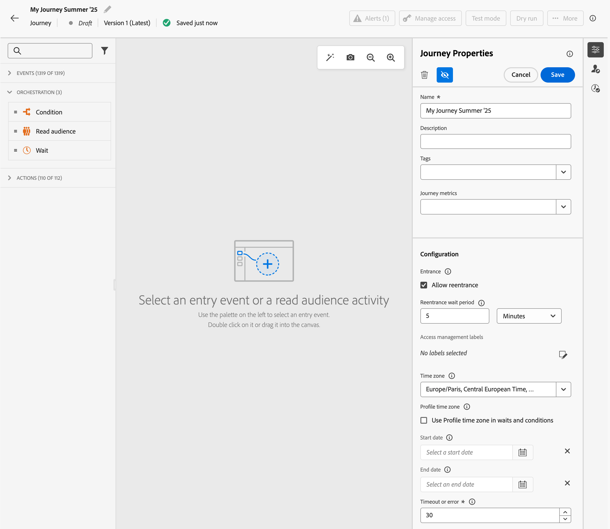
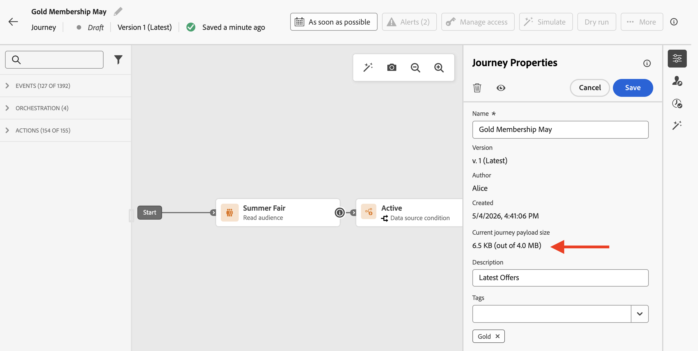
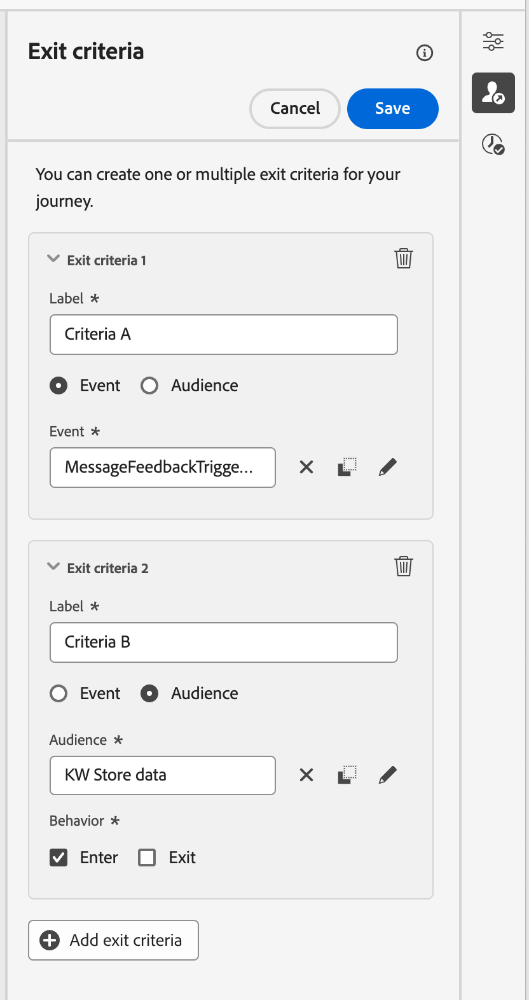

# Definir as propriedades da jornada {#jo-properties}

>[!BEGINSHADEBOX]

**Nesta página:** saiba como definir as propriedades globais de uma jornada — incluindo nome, regras de entrada, fuso horário, datas de início e término, tempo limite, critérios de saída e gerenciamento de conflitos — no painel direito durante a criação.

>[!ENDSHADEBOX]

Use as propriedades do jornada para definir as configurações globais para sua jornada, incluindo nome, regras de entrada, fuso horário, datas de início e término, duração do tempo limite, critérios de saída e gerenciamento de conflitos. As propriedades podem ser acessadas no painel direito em qualquer estágio da criação do jornada.

>[!CONTEXTUALHELP]
>id="ajo_journey_properties"
>title="Propriedades da jornada"
>abstract="As propriedades da jornada detêm as configurações globais dessa jornada, incluindo nome, tags, regras de entrada, fuso horário, datas, tempo-limite e gerenciamento de conflitos. Os parâmetros somente leitura estão ocultos por padrão. As opções disponíveis variam com base no status da jornada, nas permissões e na configuração do produto."

## Acessar as propriedades de uma jornada {#access-properties}

As propriedades de uma jornada são centralizadas no painel direito. Esta seção é exibida por padrão ao criar uma nova jornada. Para jornadas existentes, clique no ícone de lápis ao lado do nome da jornada para abri-la.

Nesta seção, defina o nome da jornada, adicione uma descrição e defina as propriedades globais da jornada.

É possível:

* Atribua [!DNL Adobe Experience Platform] Tags unificadas à sua jornada, para classificá-las facilmente e melhorar a pesquisa na lista de campanhas. [Saiba como trabalhar com tags](../start/search-filter-categorize.md#tags)
* Selecione suas métricas do jornada. [Saiba como configurar e acompanhar suas métricas do jornada](success-metrics.md)
* Gerenciar [entrada e reentrada](#entrance). O gerenciamento de entrada de perfis depende do tipo de jornada. Há detalhes disponíveis em [esta página](entry-management.md)
* Gerenciar [acesso aos dados](#manage-access)
* Selecione a jornada e o perfil [fusos horários](#timezone)
* Escolher [datas de início e término](#dates) personalizadas
* Defina uma [duração de tempo limite](#timeout) nas atividades de jornada (somente para usuários administradores)
* Monitore o [tamanho da carga de jornada atual](#journey-payload-size) para evitar erros de publicação
* Monitore conflitos e priorize suas jornadas usando as [ferramentas de gerenciamento de conflitos](#conflict)

{width="80%"}{zoomable="yes"}

>[!NOTE]
>
>Para jornadas ao vivo, essa tela exibe somente a data da publicação e o nome do usuário que publicou a jornada.

A opção **Copiar detalhes técnicos** permite copiar informações técnicas sobre a jornada que a equipe de suporte pode usar para a solução de problemas. As seguintes informações são copiadas:

**Geral**

* `JourneyVersion UID` - Identificador exclusivo desta versão da jornada
* `OrgID` - Identificador de sua organização (IMS)
* `orgName` - Nome da sua organização
* `sandboxName` - Nome da sandbox onde a jornada é executada
* `lastDeployedBy` - Usuário que publicou a jornada pela última vez
* `lastDeployedAt` - Data e hora da última publicação

**Pausar e retomar** (incluído quando a jornada foi pausada pelo menos uma vez)

* `lastPausedAt` - Data e hora da última vez que a jornada foi pausada
* `lastPausedBy` - Nome de exibição do usuário que executou a última pausa
* `lastPausedById` - Identificador interno do usuário que executou a última pausa
* `lastResumedAt` - Data e hora da última vez que a jornada foi retomada
* `lastResumedBy` - Nome de exibição do usuário que executou a última retomada
* `lastResumedById` - Identificador interno do usuário que executou a última retomada

**Configurações de jornada pausadas** (em `pausedJourneySettings`, quando a jornada está ou foi pausada)

* `pauseBehavior` - O que acontece com os perfis na jornada quando ela é pausada (por exemplo, descartá-los ou mantê-los no lugar)
* `maxPauseDurationInMinutes` - Duração máxima de pausa em minutos, após a qual a jornada é retomada automaticamente (por exemplo, 20160 = 14 dias)
* `transitionStateForAutoResume` - Estado aplicado quando a jornada é retomada automaticamente no final do período de pausa (por exemplo, parar ou continuar)
* `pauseId` - Identificador exclusivo da instância de pausa atual

Saiba mais sobre os campos técnicos relacionados a uma jornada para um determinado perfil e como usá-los [nesta página](expression/journey-properties.md).

## Entrada e reentrada {#entrance}

O modo de entrada de perfil é definido no nível da jornada, no painel de configuração direito. As configurações estão descritas abaixo.

O gerenciamento de entrada de perfis depende do tipo de jornada. Saiba mais sobre a entrada de perfis e o gerenciamento de reentrada em [esta página](entry-management.md). Saiba mais sobre as taxas de processamento de jornada e como os perfis fluem pelas jornadas em [esta seção](entry-management.md#journey-processing-rate).

### Permitir reentrada  {#allow-reentrance}

>[!CONTEXTUALHELP]
>id="ajo_journey_properties_entrance"
>title="Permitir reentrada"
>abstract="Por padrão, novas jornadas permitem reentradas. Desmarcar a opção **Permitir reentrada** impede que uma pessoa entre novamente na jornada, por exemplo, para oferecer um presente único quando ela entra em uma loja."
>additional-url="https://experienceleague.adobe.com/pt-br/docs/journey-optimizer/using/orchestrate-journeys/manage-journey/entry-management" text="Gerenciamento de entrada de perfis"

Por padrão, novas jornadas permitem reentradas. Você pode desmarcar a opção **Permitir reentrada** para jornadas &quot;únicas&quot;, por exemplo, se quiser oferecer um presente único quando uma pessoa entrar em uma loja.

### Período de espera da reentrada  {#reentrance-wait}

>[!CONTEXTUALHELP]
>id="ajo_journey_properties_re-entrance_wait"
>title="Período de espera da reentrada"
>abstract="O período de espera da reentrada define quanto tempo um perfil deve aguardar antes de entrar novamente em jornadas unitárias. Isso impede que os usuários entrem novamente na jornada por um determinado período. Duração máxima: 90 dias."
>additional-url="https://experienceleague.adobe.com/pt-br/docs/journey-optimizer/using/orchestrate-journeys/manage-journey/entry-management" text="Gerenciamento de entrada de perfis"

Quando a opção **Permitir reentrada** está ativada, o campo **Período de espera de reentrada** é exibido. Este campo possibilita definir o tempo de espera antes de permitir que um perfil entre novamente em jornadas unitárias (que começam com um evento ou uma qualificação de público-alvo). Isso impede que uma mesma jornada seja incorretamente acionada várias vezes no mesmo evento. Por padrão, o campo é definido como 5 minutos. A duração máxima é de 90 dias.

## Gerenciar acesso {#manage-access}

É possível limitar o acesso a uma jornada com base em rótulos de acesso.

Para atribuir rótulos de uso de dados personalizados à jornada, clique no ícone **[!UICONTROL Gerenciar rótulos de acesso]** e selecione um ou vários rótulos.

[Saiba mais sobre o Controle de acesso em nível de objeto (OLAC)](../administration/object-based-access.md)

## Tamanho do conteúdo da jornada {#journey-payload-size}

>[!CONTEXTUALHELP]
>id="ajo_journey_properties_payload_size"
>title="Tamanho atual do conteúdo da jornada"
>abstract="Exibe o tamanho atual do conteúdo da jornada em comparação ao limite configurado. Este indicador ajuda a monitorar a complexidade da jornada antes da publicação e a evitar erros quando o tamanho do conteúdo excede o limite permitido."

O campo **[!UICONTROL Tamanho atual do conteúdo da jornada]** no painel Propriedades da jornada exibe o tamanho atual do conteúdo da jornada em relação ao limite configurado — por exemplo, *1,5 MB (de 2 MB)*. Esse indicador somente leitura fica visível em qualquer estágio da criação do jornada.

{width="50%" zoomable="yes"}

Use essas informações para monitorar a complexidade da jornada antes de publicar. Se o tamanho do payload se aproximar ou exceder o limite, a publicação do jornada falhará. Para reduzir o tamanho, considere simplificar a lógica de jornada ou reduzir o número de atividades.

O limite padrão é 4 MB. Entre em contato com o Atendimento ao cliente da Adobe se precisar solicitar um limite mais alto para sua organização.

Para obter detalhes completos sobre limites, mensagens de aviso e erro e etapas de solução de problemas, consulte [Validação do tamanho da carga da Jornada](../start/guardrails.md#journey-payload-size) e [Medidas de proteção de jornada gerais](../start/guardrails.md#journeys-guardrails-journeys).

## Fusos horários de Jornada e perfil {#timezone}

O fuso horário é definido no nível da jornada. Você pode inserir um fuso horário fixo ou usar [!DNL Adobe Experience Platform] perfis para definir o fuso horário de jornada. Se um fuso horário estiver definido no perfil [!DNL Adobe Experience Platform], ele poderá ser recuperado na jornada.

[Saiba mais sobre o gerenciamento de fuso horário](../building-journeys/timezone-management.md)

## Datas iniciais e finais {#dates}

>[!CONTEXTUALHELP]
>id="ajo_journey_properties_start_date"
>title="Data inicial"
>abstract="A data inicial em que os perfis podem começar a entrar na jornada. Se nenhuma data inicial for definida, o padrão será a data de publicação da jornada."

>[!CONTEXTUALHELP]
>id="ajo_journey_properties_end_date"
>title="Data final"
>abstract="A data final é quando a jornada termina. Nessa data, os perfis ativos sairão automaticamente da jornada e nenhuma entrada nova será permitida."

Por padrão, os perfis podem inserir sua jornada assim que ela for publicada e podem permanecer até que o [tempo limite de jornada global](#global_timeout) seja atingido. A única exceção são as jornadas de público-alvo de leitura recorrente com **Forçar a reentrada na recorrência** ativada, que terminam na data de início da próxima ocorrência.

Se necessário, você pode definir uma **Data de início** e uma **Data de término** personalizadas. Isso permite que os perfis entrem na jornada em uma data específica e saiam automaticamente quando a data final for atingida.

## Tempo-limite {#timeout}

As configurações de tempo limite controlam quanto tempo uma jornada aguarda pela execução da atividade e quanto tempo os perfis podem permanecer em uma jornada.

### Tempo-limite nas atividades da jornada {#timeout_and_error}

>[!CONTEXTUALHELP]
>id="ajo_journey_action_timeout"
>title="Tempo-limite ou erro"
>abstract="A opção **Tempo-limite ou erro** define um caminho alternativo na jornada quando a ação atinge o tempo-limite ou retorna um erro. Dessa forma, os perfis continuam por um caminho substituto em vez de parar nesta etapa. Os valores recomendados estão entre 1 e 30 segundos."

Ao editar uma atividade de ação ou condição, é possível definir um caminho alternativo em caso de erro ou tempo limite. Se o processamento da atividade que interroga um sistema de terceiros exceder a duração do tempo limite definida no campo **[!UICONTROL Tempo limite ou erro]** das propriedades da jornada, o segundo caminho será escolhido para executar uma possível ação de fallback.

Os valores recomendados estão entre 1 e 30 segundos.

Recomendamos que você defina um valor muito curto de **[!UICONTROL Tempo limite ou erro]** se a jornada diferenciar tempo (exemplo: reagir ao local em tempo real de uma pessoa) porque você não pode atrasar sua ação por mais do que alguns segundos. Se a jornada for menos sensível ao tempo, você poderá usar um valor mais longo para dar mais tempo ao sistema chamado para enviar uma resposta válida.

O Jornada também usa um tempo limite global, conforme detalhado abaixo.

### Tempo limite de jornada global {#global_timeout}

Além do [tempo limite](#timeout_and_error) usado em atividades de jornada, um tempo limite de jornada global é aplicado. Ele não é exibido na interface e não pode ser alterado.

Esse tempo-limite global interrompe o progresso das pessoas na jornada **91 dias** após a sua entrada. Isso significa que a jornada de um indivíduo não pode durar mais de 91 dias. Após esse período de tempo limite, os dados do indivíduo são excluídos. Os indivíduos que ainda fluem na jornada no final do período de tempo limite serão interrompidos e não serão considerados nos relatórios. Portanto, você poderia ver mais pessoas entrando na jornada do que saindo.

>[!NOTE]
>
>A definição exata de quando uma jornada é considerada &quot;concluída&quot; varia de acordo com o tipo de jornada. [Consulte os critérios detalhados](end-journey.md#journey-finished-definition).

Devido ao tempo limite de jornada de 91 dias, quando a reentrada da jornada não é permitida, não podemos garantir que o bloqueio de reentrada funcionará por mais de 91 dias. De fato, à medida que removemos todas as informações sobre as pessoas que entraram na jornada 91 dias depois de entrarem, não podemos saber a pessoa que entrou anteriormente, há mais de 91 dias.

Um indivíduo só poderá inserir uma atividade de espera se tiver tempo suficiente na jornada para concluir a duração da espera antes do tempo limite de jornada de 91 dias. Consulte [esta página](../building-journeys/wait-activity.md).

### Perguntas frequentes sobre TTL (Time-to-Live, tempo de vida útil) e retenção de dados {#timeout-faq}

A partir da versão de [!DNL Adobe Journey Optimizer] de junho de 2024, o tempo limite global do jornada foi movido de 30 para 91 dias. Os impactos estão listados nas Perguntas frequentes abaixo:

**Para Jornadas Unitárias**

<table style="table-layout:auto">
  <tr style="border: 1;">
    <td>
      
O que acontece com o jornada publicado depois que a extensão TTL é implantada?

    </td>
    <td>
      
Os perfis que entram na nova jornada terão um TTL de 91 dias automaticamente.

    </td>
  </tr>
  <tr style="border: 1;">
    <td>
      
O que acontece com um perfil que entra em uma jornada publicada antes do lançamento da extensão TTL?

    </td>
    <td>
      
O perfil terá um TTL de 30 dias (7 dias para a HIPAA), consistente com o horário em que a jornada foi originalmente publicada.

    </td>
  </tr>
  <tr style="border: 1;">
    <td>
      
O que acontece com um perfil que já entrou em uma jornada quando a extensão TTL é iniciada?

    </td>
    <td>
      
O perfil manterá um TTL de 30 dias (7 dias para a HIPAA), de acordo com o tempo de publicação original da jornada.

    </td>
  </tr>
  <tr style="border: 1;">
    <td>
      
O que acontece com um perfil em uma versão anterior do jornada republicada após a inicialização da extensão TTL?

    </td>
    <td>
      
O perfil manterá um TTL de 30 dias (7 dias para a HIPAA), alinhado ao tempo de publicação da versão original do jornada.

    </td>
  </tr>
  <tr style="border: 1;">
    <td>
      
O que acontece com um novo perfil que entra em uma versão republicada do jornada após a inicialização da extensão TTL?

    </td>
    <td>
      
O perfil terá um TTL de 91 dias, que corresponde ao TTL da versão do jornada recém-republicada.

    </td>
  </tr>
</table>

**Para Jornadas de Gatilho de Segmento**

<table style="table-layout:auto">
  <tr style="border: 1;">
    <td>
      
O que acontece com as novas jornadas únicas publicadas após a extensão TTL?

    </td>
    <td>
      
Os perfis que entram na nova jornada terão um TTL de 91 dias automaticamente.

    </td>
  </tr>
  <tr style="border: 1;">
    <td>
      
O que acontece com as novas jornadas recorrentes sem reentrada forçada publicadas após a extensão TTL?

    </td>
    <td>
      
Os perfis que entram na nova jornada terão um TTL de 91 dias automaticamente.

    </td>
  </tr>
  <tr style="border: 1;">
    <td>
      
O que acontece com as novas jornadas recorrentes com reentrada forçada publicadas após a extensão TTL?

    </td>
    <td>
      
Os perfis que entram na nova jornada terão um TTL igual ao período de recorrência. Por exemplo, se a jornada for executada diariamente, o TTL será 1 dia.

    </td>
  </tr>
  <tr style="border: 1;">
    <td>
      
O que acontece com um perfil que entra em uma jornada publicada antes do lançamento da extensão TTL?

    </td>
    <td>
      
O perfil terá um TTL de 30 dias (7 dias para a HIPAA), consistente com o tempo de publicação original. Para jornadas recorrentes com reentrada forçada, o TTL corresponderá ao período de recorrência.

    </td>
  </tr>
  <tr style="border: 1;">
    <td>
      
O que acontece com um perfil executado em uma jornada quando a extensão TTL é iniciada?

    </td>
    <td>
      
O perfil manterá um TTL de 30 dias (7 dias para a HIPAA), de acordo com o tempo de publicação original da jornada. Para jornadas recorrentes com reentrada forçada, o TTL corresponderá ao período de recorrência.

    </td>
  </tr>
  <tr style="border: 1;">
    <td>
      
O que acontece com um perfil em execução em uma versão anterior do jornada republicada após a inicialização da extensão TTL?

    </td>
    <td>
      
O perfil manterá um TTL de 30 dias (7 dias para a HIPAA), alinhado ao tempo de publicação da versão original do jornada. Para jornadas recorrentes com reentrada forçada, o TTL corresponderá ao período de recorrência.

    </td>
  </tr>
  <tr style="border: 1;">
    <td>
      
O que acontece com um novo perfil que entra em uma versão republicada do jornada após a inicialização da extensão TTL?

    </td>
    <td>
      
O perfil terá um TTL de 91 dias, que corresponde ao TTL da versão do jornada recém-republicada. Para jornadas recorrentes com reentrada forçada, o TTL corresponderá ao período de recorrência.

    </td>
  </tr>
  <tr style="border: 1;">
    <td>
      
Minha jornada de Leitura de público-alvo recorrente sempre ativada será interrompida após 91 dias?

    </td>
    <td>
      
Não. Uma jornada de Leitura de Público recorrente sem data final permanece <strong>Ativa</strong> enquanto for publicada. Ela muda para o status <strong>Concluída</strong> somente 91 dias após a execução de sua <strong>última ocorrência</strong>. O tempo limite global de 91 dias se aplica a perfis individuais que fluem pela jornada (duração máxima ativa por perfil), não ao status Live da jornada.

    </td>
  </tr>
  <tr style="border: 1;">
    <td>
      
Qual é a diferença entre o tempo limite de jornada de 91 dias e a janela de relatório de 91 dias?

    </td>
    <td>
      
Estes são dois conceitos separados. O <strong>tempo limite global de jornada</strong> (91 dias) é o tempo máximo que um perfil individual pode permanecer ativo em uma jornada; após 91 dias, o perfil é encerrado e seus dados são excluídos. A <strong>janela de relatórios</strong> (aproximadamente 91 dias) é um limite de exibição na interface do usuário: dados de desempenho com mais de ~91 dias não são mais visíveis nos relatórios, mas a jornada em si continua a ser executada e novos perfis continuam a ser inseridos.

    </td>
  </tr>
</table>

## Política de mesclagem {#merge-policies}

>[!CONTEXTUALHELP]
>id="ajo_journey_properties_merge_policy"
>title="Política de mesclagem"
>abstract="A política de mesclagem é recuperada automaticamente com base no evento ou público-alvo selecionado. Essa política de mesclagem é usada em toda a jornada."

[!DNL Adobe Journey Optimizer] usa políticas de mesclagem ao recuperar dados de perfil de [!DNL Adobe Experience Platform]. Dependendo do tipo de jornada, são usadas diferentes políticas de mesclagem:

* Nas jornadas **[Ler público](read-audience.md)** ou **[Qualificação de público](audience-qualification-events.md)**: a política de mesclagem do público é usada
* Em jornadas de **[Evento unitário](../event/about-events.md)**: a política de mesclagem padrão é usada
* Nas jornadas de **[Evento comercial](../event/about-creating-business.md)**: a política de mesclagem do público-alvo direcionado na seguinte atividade Ler público é usada

[!DNL Adobe Journey Optimizer] aplica a política de mesclagem usada em toda a jornada. Portanto, se vários públicos forem usados em uma jornada (por exemplo, usando em [`inAudience` funções](functions/functioninaudience.md)), isso criará inconsistências com a política de mesclagem usada pela jornada, um erro será gerado e a publicação será bloqueada. No entanto, se um público-alvo inconsistente for usado na personalização da mensagem, um alerta não será gerado, apesar da inconsistência. Por isso, é altamente recomendável verificar a política de mesclagem associada ao seu público-alvo quando ele for usado na personalização da mensagem.

Para saber mais sobre as políticas de mesclagem, consulte a [[!DNL Adobe Experience Platform] documentação](https://experienceleague.adobe.com/pt-br/docs/experience-platform/profile/merge-policies/overview){target="_blank"}.

>[!NOTE]
>
>Quando uma política de mesclagem de público-alvo é atualizada, qualquer jornada ativa que faça referência a esse público-alvo deve ser republicada (ou duplicada). Alterar a política de mesclagem cria efetivamente um &quot;novo&quot; público-alvo que a jornada contínua não pode acessar, garantindo a consistência dos dados.

## Critérios de saída {#exit-criteria}

>[!CONTEXTUALHELP]
>id="ajo_journey_exit_criterias"
>title="Critérios de saída"
>abstract="Esta seção mostra as opções de critérios de saída, em que uma ou várias regras e filtros de critérios de saída podem ser definidos para a jornada."

### Jornada critérios de saída {#exit-criteria-desc}

Ao adicionar critérios de saída, você faz com que os perfis saiam da jornada assim que um evento ocorrer (por exemplo, Compra) ou quando eles são qualificados para um público-alvo. Isso impedirá que o usuário obtenha mais comunicações da jornada.

Talvez você queira remover perfis de uma jornada quando eles não atenderem mais ao objetivo da jornada. Isso pode ser feito por **critérios de saída globais**, que estão intimamente associados ao gerenciamento de metas.

>[!TIP]
>
>Procurando orientação prática com exemplos do mundo real? Consulte nosso [guia abrangente para os critérios de entrada e saída do jornada](entry-exit-criteria-guide.md), que inclui casos de uso completos com configurações de entrada e saída, práticas recomendadas e estratégias de otimização.

**Caso de uso de exemplo**

Um profissional de marketing tem uma jornada promocional com uma série de comunicações. Cada uma dessas comunicações tem como objetivo orientar o cliente a fazer uma compra. Assim que a compra for feita, o cliente não deverá receber o restante das mensagens na série. Ao definir um critério de saída, os perfis que fizeram uma compra são removidos da jornada.

### Configuração e utilização {#exit-criteria-config}

Os critérios de saída são definidos no nível da jornada. Uma jornada pode ter vários critérios de saída. Se você tiver definido vários critérios de saída, a avaliação acontece de cima para baixo com uma lógica de `OR`. Portanto, se você tiver o Critério de saída A e o Critério de saída B, ele será avaliado como A **OR** B. Os critérios são avaliados em cada etapa da jornada.

Para **criar** um critério de saída, siga estas etapas:

1. Abra a jornada.

1. Clique no ícone  **[!UICONTROL Mostrar Critérios de Saída]** localizado na seção superior direita da tela de jornada.

1. Selecione **[!UICONTROL Adicionar critérios de saída]**.

1. Insira um **Rótulo** e selecione se seus critérios de saída se baseiam em um **Evento** ou em um **Público-alvo**.

   * Para os critérios de Saída baseados em um evento, como por exemplo, baixar um aplicativo ou adicionar um produto ao carrinho, escolha somente evento unitário.
   * Para critérios de Saída com base em um público-alvo, como por exemplo, um público-alvo que verifica se um cliente comprou nas últimas 24 horas, selecione um público-alvo. Observação: os critérios de saída que usam um público-alvo podem levar até 10 minutos para serem eficazes.

Você pode adicionar vários critérios de saída. O critério de saída agora está ativo e será avaliado em cada etapa da jornada.

{width="40%"}

### Critérios de saída baseados no atributo de perfil {#profile-exit-criteria}

Os Critérios de saída com base em atributos de perfil oferecem maior controle sobre jornadas pausadas, permitindo definir regras que removem automaticamente perfis específicos antes que a jornada seja retomada. É possível definir condições de saída com base nos atributos do perfil, como local, status ou preferências, para garantir que somente os perfis relevantes continuem na jornada depois que ela for retomada.

Por exemplo, você pode [pausar uma jornada](journey-pause.md), adicionar uma condição de saída para remover todos os perfis localizados na França e retomar a jornada sabendo que esses perfis serão excluídos na próxima etapa da ação. Essa lógica se aplica aos perfis que já estão na jornada e a quaisquer novos perfis que se qualifiquem após a retomada da jornada.

Esse recurso funciona com a funcionalidade Pausar/Retomar, ajudando você a gerenciar jornadas com mais segurança e flexibilidade. Ele minimiza a intervenção manual, reduz o risco de enviar comunicações irrelevantes ou não compatíveis e mantém sua lógica de jornada alinhada às necessidades atuais dos negócios.

Consulte esta seção para saber como [usar os critérios de saída do atributo de perfil no jornada pausado](journey-pause.md#journey-pause-sample).

### Medidas de proteção e limitações {#exit-criteria-guardrails}

As seguintes medidas de proteção e limitações se aplicam ao recurso [Critérios de saída do Jornada](#exit-criteria-desc):

* Os critérios de saída são definidos somente em estado de rascunho
* Jornada a coerência de namespace entre eventos e critérios de saída baseados em eventos

As seguintes medidas de proteção se aplicam ao usar o recurso [Critérios de Saída Baseados em Atributo de Perfil](#profile-exit-criteria):

* **Os critérios de saída se aplicam ao nível da ação**\
  Os critérios de saída &quot;Atributo de perfil&quot; são avaliados somente nas etapas de ação. Diferentemente de outros tipos de critérios de saída, eles não se aplicam globalmente na jornada.\
  Se você retomar uma jornada e alguns perfis atenderem à condição de saída, eles serão excluídos no nó da próxima ação.\
  Os novos perfis que entrarem na jornada após a retomada também serão avaliados e excluídos no primeiro nó de ação, se atenderem à condição.

* **Uma regra de saída baseada em perfil por jornada**\
  Você pode definir apenas um critério de saída &quot;Atributo de perfil&quot; por jornada. Essa limitação ajuda a manter a clareza e evita conflitos na lógica de jornada.

* **Disponível somente em jornadas pausadas**\
  Você pode adicionar ou editar os critérios de saída do &quot;Atributo de perfil&quot; somente quando a jornada está pausada.

   * Em uma **jornada de rascunho**, a opção *Atributo de Perfil* aparece desabilitada (somente leitura), enquanto as opções *Evento* e *Público-alvo* permanecem ativas.
   * Em uma jornada **pausada**, a opção *Atributo de Perfil* torna-se editável, e as opções *Evento* e *Público* tornam-se somente leitura.

### Tópicos relacionados {#exit-criteria-related}

* [Guia dos critérios de entrada e saída do Jornada](entry-exit-criteria-guide.md) - Guia completo com exemplos reais e práticas recomendadas
* [Gerenciamento de entrada de perfil](entry-management.md) - Configure como os perfis entram nas jornadas
* [Como as jornadas terminam](end-journey.md) - Compreender a conclusão natural da jornada
* [Pausar uma jornada com critérios de saída de atributo de perfil](journey-pause.md#journey-exit-criteria) - Usar critérios de saída ao pausar jornadas

## Jornada programação {#schedule}

A seção **[!UICONTROL Agenda]** só estará disponível quando uma atividade **[!UICONTROL Ler Público]** for descartada na tela. Ela permite definir uma data/hora e uma frequência específicas na qual a jornada deve ser executada. [Saiba como agendar uma jornada de leitura de público-alvo](read-audience.md#schedule)

>[!TIP]
>
>Ao agendar a jornada, você também pode configurar o envio de ondas para entregar ações de jornada em lotes ao longo do tempo. [Saiba como enviar usando ondas no jornada](send-using-waves.md)

## Gerenciamento de conflitos {#conflict}

A seção **[!UICONTROL Gerenciamento de conflitos]** nas propriedades da jornada permite monitorar conflitos e priorizar suas jornadas. É possível:

* Aplique um **Conjunto de regras** para excluir esta jornada a parte do seu público com base em regras de limitação. [Saiba como trabalhar com conjuntos de regras](../conflict-prioritization/rule-sets.md)

* Atribua uma **pontuação de prioridade** à jornada, variando de 0 a 100. Um número maior indica uma prioridade mais alta. O valor de prioridade inserido aqui é herdado por qualquer ação de entrada (como in-app) contida nesta jornada. [saiba como trabalhar com pontuações de prioridade](../conflict-prioritization/priority-scores.md)

  Para situações em que essa mesma configuração de canais de entrada é usada em outras campanhas ou jornadas, a ação de entrada com a pontuação de prioridade mais alta é mostrada ao destinatário. Se várias jornadas ou campanhas tiverem a mesma pontuação, o elemento que foi modificado mais recentemente será escolhido.

* **Exibir conflitos** com outras jornadas, campanhas ou configurações de canal. Se você quiser identificar sobreposição no público-alvo, data de início e término, configuração de canal, canal ou conjunto de regras, é possível visualizar os possíveis conflitos aqui. [Saiba como identificar possíveis conflitos no jornada](../conflict-prioritization/conflicts.md)

## Perguntas frequentes {#faq}

**Onde encontro as propriedades de uma jornada?**

As propriedades estão no painel direito da tela de jornada. Elas aparecem por padrão quando você cria uma nova jornada. Para uma jornada existente, clique no ícone de lápis ao lado do nome da jornada para abri-las. Para jornadas ao vivo, o painel mostra somente a data da publicação e o nome do usuário que publicou a jornada. Consulte [Acessar as propriedades de uma jornada](#access-properties).

**Posso alterar propriedades em uma jornada em tempo real?**

A maioria das propriedades é somente leitura quando uma jornada está ativa. Para modificá-los, crie uma nova versão do jornada ou duplique a jornada, faça suas alterações no rascunho e [publique](publish-journey.md) novamente.

**Qual é a diferença entre a configuração de reentrada e o período de espera de reentrada?**

**[Permitir reentrada](#allow-reentrance)** controla se um perfil pode entrar na jornada mais de uma vez. O **[Período de espera de reentrada](#reentrance-wait)** (exibido somente quando a reentrada é permitida) define o tempo de espera antes que o mesmo perfil possa inserir novamente uma jornada unitária. O padrão é 5 minutos e o máximo é 90 dias. Para obter mais detalhes, consulte [Gerenciamento de entrada de perfil](entry-management.md).

**Por quanto tempo um perfil pode permanecer em uma jornada?**

Um [tempo limite de jornada global](#global_timeout) para um perfil **91 dias** depois que ele entrar — a jornada de um indivíduo não pode durar mais do que isso. Esse tempo limite não é exibido na interface e não pode ser alterado. Como os dados do perfil são removidos após 91 dias, o bloqueio de reentrada não pode ser garantido além desse período. Consulte também [Como o jornada termina](end-journey.md#journey-finished-definition).

**Por que minha jornada não foi publicada devido ao tamanho da carga?**

O indicador **[!UICONTROL Tamanho atual da carga da jornada]** mostra a carga da jornada em relação ao limite configurado (4 MB por padrão). Se a carga se aproximar ou exceder o limite, a publicação falhará. Reduza o tamanho simplificando a lógica de jornada ou reduzindo o número de atividades, ou entre em contato com o Atendimento ao cliente da Adobe para solicitar um limite mais alto. Consulte [Tamanho da carga da Jornada](#journey-payload-size), [Validação do tamanho da carga da Jornada](../start/guardrails.md#journey-payload-size) e [Medidas de proteção de jornada gerais](../start/guardrails.md#journeys-guardrails-journeys).

**Qual política de mesclagem minha jornada usa?**

Depende do tipo de jornada: [Ler público-alvo](read-audience.md) e [Qualificação do público-alvo](audience-qualification-events.md) As jornadas usam a política de mesclagem do público-alvo, [evento unitário](../event/about-events.md) As jornadas usam a política de mesclagem padrão e [evento comercial](../event/about-creating-business.md) As jornadas usam a política de mesclagem do público-alvo direcionado na seguinte atividade Ler público-alvo. A mesma política de mesclagem se aplica a toda a jornada. Se uma política de mesclagem de público-alvo for atualizada, qualquer jornada ativa que faça referência a esse público-alvo deverá ser republicada ou duplicada. Consulte [Política de mesclagem](#merge-policies).

**Qual é a diferença entre o tempo limite de jornada de 91 dias e a janela de relatório de 91 dias?**

Esses conceitos são separados. O **[tempo limite global de jornada](#global_timeout)** (91 dias) é o tempo máximo que um perfil individual pode permanecer ativo em uma jornada, após o qual o perfil é fechado e seus dados são excluídos. A **janela de relatórios** (aproximadamente 91 dias) é um limite de exibição da interface do usuário: os dados de desempenho com mais de ~91 dias não estão mais visíveis, mas a jornada continua em execução e novos perfis continuam sendo inseridos. Para obter detalhes sobre TTL e retenção de dados, consulte as [Perguntas frequentes sobre TTL (Time-to-Live) e retenção de dados](#timeout-faq).

## Tópicos relacionados {#related-topics}

* [Gerenciamento de entrada de perfil](entry-management.md) - Configure como os perfis entram e entram novamente nas jornadas
* [Guia dos critérios de entrada e saída do Jornada](entry-exit-criteria-guide.md) - Guia completo com exemplos reais e práticas recomendadas
* [Como o jornada termina](end-journey.md) - Entenda a conclusão natural da jornada e a saída do perfil
* [Pausar uma jornada](journey-pause.md) - Pausar e retomar jornadas com os critérios de saída do atributo de perfil
* [Gerenciamento de fuso horário](timezone-management.md) - Configurar fusos horários de jornada e perfil
* [Gerenciamento e priorização de conflitos](../conflict-prioritization/conflicts.md) - Identifique e resolva conflitos entre jornadas e campanhas

## Referência rápida {#quick-reference}

Esta seção contém conhecimento estruturado destinado a oferecer suporte à interpretação, recuperação e resposta a perguntas relacionadas a este tópico.

Para uma compreensão completa, essas informações devem ser combinadas com a documentação desta página. Nenhuma das origens deve ser independente; a página descreve o recurso, enquanto esta seção fornece um contexto adicional que ajuda a desfazer a ambiguidade da terminologia, intenção, aplicabilidade e restrições.

>[!BEGINTABS]

>[!TAB Visão geral]

**TL;DR**

Esta página explica como configurar e gerenciar todas as configurações globais de uma jornada, incluindo regras de entrada, fusos horários, datas de início/término, comportamento de tempo limite, critérios de saída, tamanho da carga útil e gerenciamento de conflitos.

**Intenções**

* Configurar regras de entrada e reentrada de jornadas para perfis
* Definir datas de início e término para controlar quando os perfis podem entrar ou sair de uma jornada
* Definir critérios de saída para remover perfis automaticamente quando uma condição comercial for atendida
* Gerenciar o acesso a uma jornada usando rótulos de controle de acesso no nível do objeto
* Monitore o tamanho do conteúdo da jornada para evitar falhas de publicação
* Resolva conflitos e atribua pontuações de prioridade em jornadas e campanhas

>[!TAB Glossário]

* **Propriedades da Jornada**: o painel de configurações globais (painel direito) que controla o nome, as regras de entrada, o fuso horário, as datas, o tempo limite, o tamanho da carga e o gerenciamento de conflitos de uma jornada. *(específico do produto)*
* **Período de espera de reentrada**: o tempo mínimo que um perfil deve aguardar antes de ter permissão para reinserir uma jornada unitária; o máximo é 90 dias. *(específico do produto)*
* **Tempo limite de jornada global (TTL)**: a duração máxima que um perfil pode permanecer ativo em uma jornada — atualmente 91 dias, após os quais o perfil é encerrado e seus dados são excluídos. *(específico do produto)*
* **Critérios de saída**: regras definidas no nível da jornada que removem automaticamente perfis de uma jornada quando ocorre um evento especificado ou quando uma condição de público-alvo é atendida. *(específico do produto)*
* **Critérios de Saída Baseados em Atributos de Perfil**: Regras de saída baseadas em atributos de perfil (por exemplo, local, status) que são avaliados nas etapas de ação e só são editáveis quando uma jornada é pausada. *(específico do produto)*
* **Política de mesclagem**: o conjunto de regras usado pelo Adobe Experience Platform para combinar dados de perfil de várias fontes; aplicado de forma consistente em toda a jornada. *(específico do produto)*
* **Gerenciamento de conflitos**: ferramentas nas propriedades de jornada para atribuir pontuações de prioridade, aplicar conjuntos de regras e identificar jornadas ou campanhas sobrepostas. *(específico do produto)*
* **Tamanho da carga da Jornada**: o tamanho atual da carga de definição da jornada comparado ao limite configurado; excedendo a publicação de blocos de limite. *(específico do produto)*
* **OLAC (Object Level Access Control)**: um modelo de permissão que restringe o acesso a jornadas individuais usando rótulos de uso de dados.

>[!TAB Terminologia]

* **Nome canônico:** propriedades de Jornada — Acrônimo: none — variantes: configurações de jornada, painel de configuração de jornada
* **Sinônimos:** &quot;tempo limite de jornada global&quot; = &quot;TTL&quot; = &quot;Tempo de Vida&quot;
* **Não confunda:** &quot;tempo limite de jornada global (91 dias)&quot; ≠ &quot;janela de relatórios (~91 dias)&quot; — o tempo limite limita a duração de perfil individual em uma jornada; a janela de relatórios é um limite de exibição da interface do usuário para dados de análise

>[!TAB Medidas de proteção e limitações]

* O período máximo de espera de reentrada é de 90 dias
* O tempo limite da jornada global é de 91 dias; após esse período, os dados do perfil são excluídos e o perfil é encerrado
* O limite padrão de carga do Jornada é de 4 MB; excedê-lo impede a publicação — entre em contato com o Atendimento ao cliente da Adobe para obter um limite mais alto
* Os critérios de saída só podem ser configurados em estado de rascunho (tipos de evento/público-alvo); os critérios de saída do atributo de perfil só podem ser editados quando a jornada é pausada
* Somente uma regra de critérios de saída do atributo de perfil é permitida por jornada
* Os critérios de saída do atributo de perfil são avaliados somente nas etapas da ação, não globalmente
* Quando uma política de mesclagem de público-alvo é atualizada, qualquer jornada ativa que faça referência a esse público-alvo deve ser republicada
* Políticas de mesclagem inconsistentes em uma publicação de bloco de jornadas; inconsistências na personalização da mensagem não geram um alerta
* Para jornadas ao vivo, o painel de propriedades mostra somente a data da publicação e o nome do editor

>[!TAB Perguntas frequentes]

**P: Por quanto tempo um perfil pode permanecer em uma jornada?**

Um máximo de 91 dias (tempo limite da jornada global); após esse período, o perfil é encerrado automaticamente e seus dados são excluídos.

**P: Posso editar as propriedades da jornada enquanto ela estiver ativa?**

Para jornadas ao vivo, o painel de propriedades mostra somente a data da publicação e o nome do editor; as alterações estruturais exigem uma nova versão.

**P: O que acontece quando vários critérios de saída são configurados?**

Eles são avaliados de cima para baixo com a lógica OU em cada etapa da jornada; um perfil é encerrado quando qualquer critério é atendido.

**P: Como evitar que um perfil entre novamente em uma jornada?**

Desmarque a opção &quot;Permitir reentrada&quot; nas propriedades do jornada; isso é adequado para experiências únicas, como uma oferta de presente.

**P: Qual é a diferença entre o tempo limite da jornada e a data de término?**

A data final interrompe todas as novas entradas e sai automaticamente dos perfis ativos nessa data específica; o tempo limite global de 91 dias se aplica por perfil a partir do momento em que entram, independentemente da data final da jornada.

**P: Como a política de mesclagem é determinada para uma jornada?**

Depende do tipo de jornada: As jornadas Ler público-alvo e Qualificação de público-alvo usam a política de mesclagem do público-alvo; As jornadas de eventos unitários usam a política de mesclagem padrão; As jornadas de eventos comerciais usam a política de mesclagem do público-alvo direcionado na atividade Ler público-alvo subsequente.

>[!ENDTABS]
