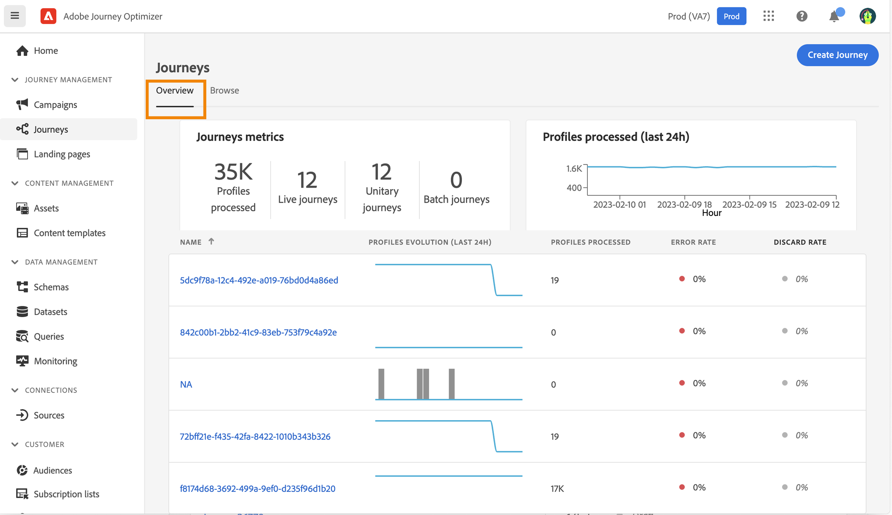
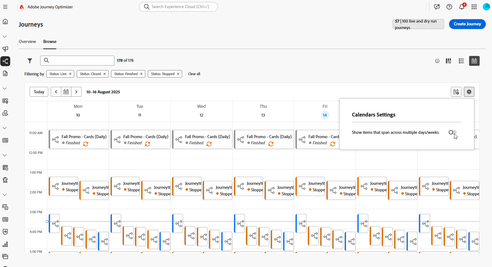
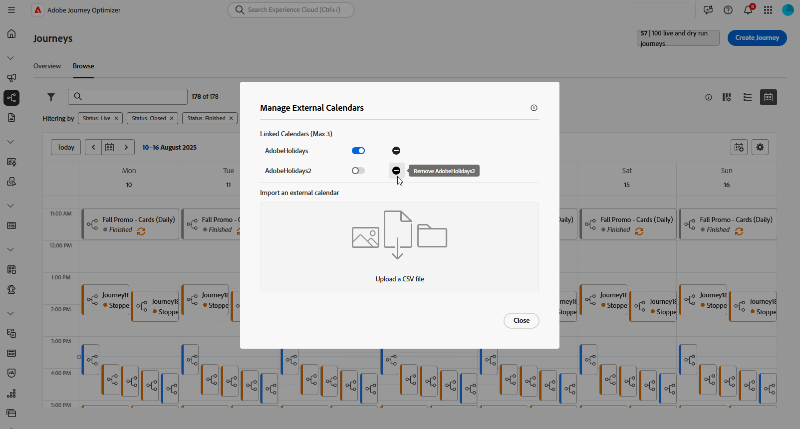
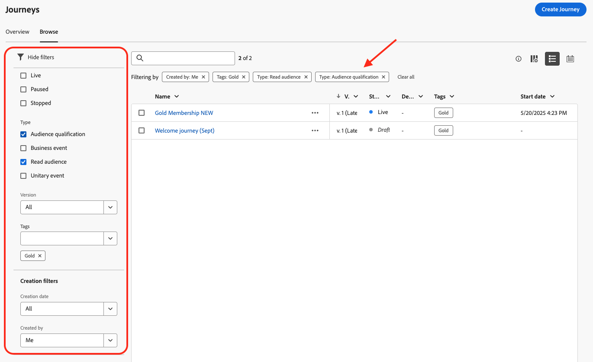

# Procurar e filtrar suas jornadas {#browse-journeys}

>[!BEGINSHADEBOX]

**Nesta página:** saiba como procurar, pesquisar e filtrar suas jornadas usando as exibições de painel, lista e calendário do Adobe Journey Optimizer.

>[!ENDSHADEBOX]

>[!CONTEXTUALHELP]
>id="ajo_journey_view"
>title="Visualizações de jornadas em lista e calendário"
>abstract="Além da lista de jornadas, o [!DNL Journey Optimizer] fornece uma visualização de calendário das suas jornadas, oferecendo uma representação visual clara dos cronogramas. Esses botões alternam entre as visualizações de lista e calendário a qualquer momento."

## Painel da jornada {#dashboard-jo}

Na seção de menu GERENCIAMENTO de JORNADAS, clique em **[!UICONTROL Jornadas]**. Três guias dedicadas estão disponíveis: **[!UICONTROL Visão geral]** (painel), **[!UICONTROL Procurar]** (lista e calendário) e **[!UICONTROL Exibição de pastas]** (organizar jornadas em pastas).

### Visão geral do Jornada

A guia **[!UICONTROL Visão geral]** exibe um painel com as métricas principais relacionadas às suas jornadas.

* **Perfis processados**: número total de perfis processados nas últimas 24 horas
* **Live jornada**: número total de jornadas ativas com tráfego nas últimas 24 horas. O Live jornada inclui **jornadas Unitárias** (baseadas em eventos) e **jornadas em Lote** (ler público).
* **Taxa de erros**: taxa de todos os perfis com erro em comparação ao número total de perfis que entraram nas últimas 24 horas.
* **Taxa de descarte**: taxa de todos os perfis descartados em comparação ao número total de perfis que entraram nas últimas 24 horas. Um perfil descartado representa alguém que não está qualificado para entrar na jornada, por exemplo, devido a um namespace ou a regras de reentrada incorretas.

>[!NOTE]
>
>Esse painel considera as jornadas com tráfego nas últimas 24 horas. Somente as jornadas às quais você tem acesso são exibidas. As métricas são atualizadas a cada 30 minutos e somente quando novos dados estão disponíveis.

### Lista de jornadas

A guia **[!UICONTROL Procurar]** mostra a lista de jornadas existentes. Você pode pesquisar jornadas, usar filtros e executar ações básicas em cada elemento. Por exemplo, você pode duplicar ou excluir um item.

Na lista da jornada, todas as versões da jornada são exibidas com o número da versão. Quando você pesquisa uma jornada, as versões mais recentes são exibidas na parte superior da lista na primeira vez que o aplicativo é aberto. Em seguida, você pode definir a classificação desejada e o aplicativo a manterá como uma preferência de usuário. A versão da jornada também é exibida na parte superior da interface de edição da jornada, acima da tela. Saiba mais sobre o [gerenciamento de versão do jornada](publish-journey.md#journey-versions).

### Calendário do Jornada {#calendar}

Além da lista de jornadas, o [!DNL Journey Optimizer] fornece uma visualização de calendário das suas jornadas, oferecendo uma representação visual clara dos cronogramas.

Como as jornadas são representadas:

* Por padrão, a grade de calendário mostra todas as jornadas ativas e programadas para a semana selecionada. Opções de filtro adicionais podem mostrar ativações ou ativações concluídas, interrompidas e concluídas.
* Jornadas de rascunho e jornadas no modo de teste não são exibidas.
* Jornadas que abrangem vários dias são exibidas na parte superior da grade do calendário.
* Se nenhuma hora de início for especificada, a hora de ativação manual mais próxima será usada para posicioná-la no calendário.
* As jornadas são exibidas como intervalos de tempo de 1 hora, mas isso não reflete a hora real de envio ou de conclusão.

Para navegar no seu calendário do Jornada:

1. Para acessar o modo de exibição de calendário, abra a lista jornadas e clique no ícone .

1. Use os botões de seta ou o seletor de datas acima do calendário para se mover entre semanas.

   O calendário exibe todas as jornadas programadas para a semana atual.

   

1. Clique no ícone  para alternar a exibição de itens que abrangem vários dias ou semanas.

   

1. Clique no ícone  para gerenciar e adicionar até três calendários externos.

   

1. Arraste e solte seus arquivos CSV contendo nomes de evento, datas de início e datas de término.

   Os eventos carregados são exibidos para todos os usuários em sua organização e exibidos nos calendários do Jornada e do Campaign.

   +++O formato CSV deve ser o seguinte:

   | Coluna1 | Coluna2 | Coluna3 |
   |-|-|-|
   | Nome do evento | Data inicial no formato mm/dd/aa | Data final no formato mm/dd/aa |

   +++

1. Se necessário, você pode ocultar, reexibir ou remover calendários externos adicionados.

   

1. Para obter mais detalhes sobre uma jornada, clique no bloco visual para abrir e explorar os detalhes.

   

### Exibição de pastas {#journeys-folders}

Abra o modo de exibição de pastas do jornada com o ícone **[!UICONTROL Mostrar pastas]** na lista de jornadas ou use a guia **[!UICONTROL Modo de exibição de pastas]**. [Saiba como trabalhar com pastas](../start/search-filter-categorize.md#organize-folders)

>[!AVAILABILITY]
>
>As pastas para jornadas estão em disponibilidade limitada. Para obter o status da versão atual, consulte o [ciclo de lançamento do Journey Optimizer](../rn/releases.md).

## Filtrar suas jornadas {#journey-filter}

Na lista de jornadas, use vários filtros para refinar a lista de jornadas.

Você pode filtrar jornadas de acordo com seu [status](#journey-statuses), [tipo](#journey-types), [versão](publish-journey.md#journey-versions) e [marcas](../start/search-filter-categorize.md#tags) atribuídas a partir dos **[!UICONTROL filtros de status e versão]**.

Use os **[!UICONTROL Filtros de criação]** para filtrar jornadas de acordo com a data de criação ou o usuário que as criou.

Exiba jornadas que usam um evento, grupo de campos ou ação específica dos **[!UICONTROL Filtros de atividade]** e **[!UICONTROL Filtros de dados]**.

Use os **[!UICONTROL Filtros de publicação]** para selecionar uma data de publicação ou um usuário. Você pode optar, por exemplo, por exibir as versões mais recentes de jornadas ao vivo que foram publicadas ontem.

Para filtrar jornadas com base em um intervalo de datas específico, selecione **[!UICONTROL Personalizado]** na lista suspensa **[!UICONTROL Publicado]**.

Além disso, nos painéis de configuração Evento, Fonte de dados e Ação, o campo **[!UICONTROL Usado em]** exibe o número de jornadas que usam aquele determinado evento, grupo de campos ou ação. Você pode clicar no botão **[!UICONTROL Exibir jornadas]** para exibir a lista de jornadas correspondentes.

## Tipos de jornada {#journey-types}

O tipo de jornada depende das atividades usadas nessa jornada. Pode ser:

* **[!UICONTROL Evento unitário]** - As jornadas de eventos unitários estão vinculadas a um perfil específico. Os eventos estão relacionados ao comportamento de uma pessoa ou a algo que acontece vinculado a uma pessoa (por exemplo, uma pessoa atingiu 10.000 pontos de fidelidade). [Saiba mais](../event/about-events.md).
* **[!UICONTROL Evento comercial]**. A jornada de eventos comerciais começa com um evento não relacionado a perfis. A configuração do evento é executada por um usuário técnico e não pode ser editada. [Saiba mais](../event/about-events.md).
* **[!UICONTROL Qualificação de público-alvo]** - As jornadas de qualificação de público-alvo ouvem as entradas e saídas dos perfis em [!DNL Adobe Experience Platform] públicos-alvo para fazer com que os indivíduos entrem ou avancem em uma jornada. [Saiba mais](audience-qualification-events.md).
* **[!UICONTROL Ler público-alvo]** - Nas jornadas Ler público-alvo, todos os indivíduos no público-alvo entram na jornada e recebem as mensagens incluídas na jornada.  [Saiba mais](read-audience.md).

Saiba mais sobre os tipos de jornadas e o gerenciamento de entradas associado nesta [página](entry-management.md).

## Jornada status {#journey-statuses}

O status da jornada depende do seu ciclo de vida. Pode ser:

* **Rascunho**: a jornada está em seu primeiro estágio. Ela ainda não foi publicada.
* **Rascunho (Teste)**: o modo de teste foi ativado usando o botão **Modo de teste**. [Saiba mais](../building-journeys/testing-the-journey.md)
* **Concluído**: a jornada alterna automaticamente para este status com base no tipo e na configuração da jornada. Os perfis que já estão na jornada concluem a jornada normalmente. Novos perfis não podem mais entrar na jornada. [Saiba quando as jornadas são consideradas concluídas](end-journey.md#journey-finished-definition).
* **Ao vivo**: a jornada foi publicada usando o botão **Publicar**. [Saiba mais](../building-journeys/publish-journey.md)
* **Pausado**: a jornada em tempo real foi pausada, usando o botão **Pausar**. [Saiba mais](../building-journeys/journey-pause.md)
* **Parada**: a jornada foi desligada usando o botão **Parada**. Todos os indivíduos saem instantaneamente da jornada. [Saiba mais](../building-journeys/end-journey.md#stop-journey)
* **Fechada**: a jornada foi fechada usando o botão **Fechar para novas entradas**. A jornada pára de permitir que novos indivíduos entrem na jornada. As pessoas que já estão na jornada podem terminar a jornada normalmente. [Saiba mais](../building-journeys/end-journey.md)

>[!NOTE]
>
>* O ciclo de vida de criação de Jornada também inclui um conjunto de status intermediários que não estão disponíveis para filtragem: **Publicação** (entre &quot;Rascunho&quot; e &quot;Ao Vivo&quot;), **Ativação do modo de teste** ou **Desativação do modo de teste** (entre **Rascunho** e **Rascunho (teste)**), **Parada** (entre **Ao Vivo** e **Parado**), **Retomando** (entre **Paused** e **Live**), **Pausing** (entre **Live** e **Paused**) Quando uma jornada está em um estado intermediário, ela é somente leitura.
>
>* Se você precisar modificar para uma jornada do **Live**, [crie uma nova versão](#journey-versions) da jornada. Você também pode pausar suas jornadas ativas, executar todas as alterações necessárias e retomá-las a qualquer momento. [Saiba mais sobre como pausar o jornada](../building-journeys/journey-pause.md)

## Duplicar uma jornada {#duplicate-a-journey}

Você pode duplicar uma jornada existente da guia **Procurar**. Todos os objetos e configurações são duplicados na cópia de jornada.

Para fazer isso, siga as etapas abaixo:

1. Navegue até a jornada que deseja copiar e clique no ícone **Mais ações** (os três pontos ao lado do nome da jornada).
1. Selecione **Duplicar**.

   

1. Insira o nome da jornada e confirme. Você também pode alterar o nome na tela de propriedades da jornada. Por padrão, o nome é definido da seguinte maneira: `[JOURNEY-NAME]_copy`

   

1. A nova jornada é criada e está disponível na lista de jornadas.

## Operações em massa {#bulk-operations}

Na lista de suas jornadas, você pode pausar várias jornadas do **Live**. Para pausar um grupo de jornadas (_pausa em massa_), selecione-as na lista e clique no botão **Pausar** na barra azul na parte inferior da tela. O botão **Pausar** só estará disponível quando as jornadas do **Live** forem selecionadas.

Você também pode retomar uma ou várias jornadas **Paused**. Para retomar um grupo de jornadas (_retomada em massa_), selecione-as e clique no botão **Retomar**, localizado na barra azul na parte inferior da tela. Observe que o botão **Retomar** só estará disponível quando as jornadas **Pausadas** forem selecionadas.

[Saiba mais sobre as jornadas Pausar/Retomar](journey-pause.md).

>[!NOTE]
>
>Você pode pausar/retomar até 10 jornadas por operação.

+++ Referência de conhecimento de IA

Esta seção contém conhecimento estruturado destinado a oferecer suporte à interpretação, recuperação e resposta a perguntas relacionadas a este tópico.

Para uma compreensão completa, essas informações devem ser combinadas com a documentação desta página. Nenhuma das origens deve ser independente; a página descreve o recurso, enquanto esta seção fornece um contexto adicional que ajuda a desfazer a ambiguidade da terminologia, intenção, aplicabilidade e restrições.

* **TL;DR:** Esta página explica como procurar, filtrar, exibir (lista e calendário), duplicar e executar operações em massa no jornada a partir do painel do Journey Optimizer.

**Intenções:**

* Procurar e pesquisar jornadas nas guias Visão geral e Procurar
* Filtrar jornadas por status, tipo, versão, tags, data de criação ou data de publicação
* Alternar entre a exibição de lista e a exibição de calendário para visualizar agendamentos de jornada
* Adicionar e gerenciar calendários externos fazendo upload de arquivos CSV
* Duplicação de uma jornada existente para reutilizar suas configurações
* Pausar ou retomar várias jornadas ativas ou pausadas de uma só vez

**Glossário:**

* **Painel de Jornada**: a principal interface do jornada com uma guia Visão geral mostrando as métricas principais e uma guia Procurar listando todas as jornadas. *(específico do produto)*
* **Taxa de descarte**: a proporção de perfis não qualificados para entrar na jornada (por exemplo, devido a namespace incorreto ou regras de reentrada) em comparação ao total de perfis que tentaram entrar nas últimas 24 horas. *(específico do produto)*
* **exibição do calendário do Jornada**: uma representação visual semanal do calendário de jornadas ativas e agendadas, acessível clicando no ícone de calendário na lista de jornadas. *(específico do produto)*
* **Pausa em massa**: uma operação que pausa várias jornadas Ativas ao mesmo tempo (até 10 por operação) da lista de jornadas. *(específico do produto)*

**Medidas de Proteção:**

* As métricas do painel são atualizadas a cada 30 minutos e somente quando novos dados estão disponíveis; elas abrangem apenas as últimas 24 horas
* Jornadas de rascunho e jornadas no modo de teste não são mostradas na exibição de calendário
* A pausa/retomada em massa é limitada a 10 jornadas por operação
* O botão Retomar só estará ativo quando jornadas Pausadas forem selecionadas; o botão Pausar só estará ativo quando jornadas Ativas forem selecionadas
* O calendário exibe jornadas como períodos de 1 hora, independentemente do tempo real de envio ou de conclusão

**Terminologia:**

* Nome canônico: painel de Jornadas — Acrônimo: none — variantes: lista de jornadas, visão geral das jornadas
* Sinônimos: &quot;guia Procurar&quot; = &quot;Lista de jornadas&quot;
* Não confunda: &quot;Discard rate&quot; ≠ &quot;Error rate&quot; — Os perfis de contagens de taxa de descarte não são elegíveis para inserção; As contagens de taxa de erro contam os perfis que entraram, mas encontraram um erro de processamento

**Perguntas frequentes:**

* **P: Onde posso ver as principais métricas de desempenho do jornada rapidamente?** — na guia Visão geral do painel de Jornadas, que mostra perfis processados, jornadas em tempo real, taxa de erros e taxa de descarte nas últimas 24 horas.
* **P: Como faço para encontrar jornadas que usam um evento ou uma ação específica?** — Use os Filtros de atividade e Filtros de dados na lista de jornadas para exibir jornadas que fazem referência a um evento, grupo de campos ou ação específica.
* **P: Posso pausar várias jornadas de uma vez?** — Sim; selecione várias jornadas ativas na lista e clique no botão Pause na barra inferior. É possível pausar até 10 jornadas por operação.
* **P: Como adicionar eventos externos ao calendário de jornadas?** — Clique no ícone de adição do calendário e arraste e solte um arquivo CSV com colunas de nome do evento, data de início e data de término; os eventos carregados ficam visíveis para todos os usuários na organização.
* **P: Por que o calendário mostra uma jornada como 1 hora mesmo que ela seja executada por mais tempo?** — O calendário exibe todas as jornadas como intervalos de tempo de 1 hora para consistência visual; isso não reflete o tempo real de envio ou de conclusão.

+++

