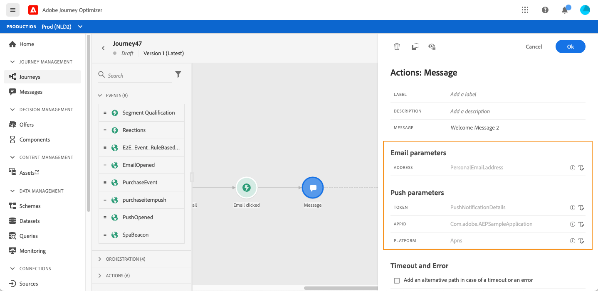

# Adicionar uma mensagem em uma jornada

[!DNL Journey Optimizer] Os recursos de mensagem são integrados, basta criar o conteúdo e publicar a mensagem. Consulte [esta seção](../get-started-content.md). Em seguida, adicione na jornada uma mensagem de push ou email projetada com o Journey Optimizer.

Se você estiver usando um sistema de terceiros para enviar mensagens, é possível criar uma ação personalizada. Saiba mais nesta [seção](../action/action.md).

## Adicionar uma atividade Message

1. Como sempre, inicie a jornada com um evento ou uma atividade **Ler segmento** .

   

1. Na seção **Actions** da paleta, arraste e solte uma atividade **Message** na tela.

   

1. Adicione um rótulo e uma descrição.

   

1. Clique dentro do campo **Message**. A lista de mensagens disponíveis projetadas no Journey Optimizer é exibida. Você pode filtrar a lista por status.

   

1. Escolha uma mensagem e clique em **Select**. Você também pode criar uma nova mensagem diretamente nessa tela clicando em **Create message**.

   

   Se quiser verificar sua mensagem, clique no ícone **Open the message** no campo **Message**. A mensagem será aberta em uma nova guia.

   

1. Adicione as próximas etapas à jornada.

## Parâmetros de email e parâmetros de push

As seções **[!UICONTROL Email parameters]** e **[!UICONTROL Push parameters]** mostram campos somente leitura. Normalmente, você executa essa configuração ao criar a mensagem. Consulte [esta seção](../get-started-content.md).

Para forçar um valor específico, você pode usar o ícone **Enable parameter override** à direita do campo. Essa opção pode ser útil para fins de teste. Por exemplo, para um email, você pode adicionar seu endereço de email. Após publicar a jornada, o email será enviado para você.

## Otimização de tempo de envio{#send-time-optimization}

>[!CONTEXTUALHELP]
>id="jo_bestsendtime_disabled"
>title="Sobre a otimização de tempo enviado"
>abstract="O recurso de Otimização de tempo de envio da Adobe Journey Optimizer, desenvolvido pelos serviços de IA do Adobe, pode prever o melhor momento para enviar um email ou mensagem de push para maximizar o engajamento com base nas taxas de abertura e cliques do histórico."

O recurso de Otimização de tempo de envio da Adobe Journey Optimizer, desenvolvido pelos serviços de IA do Adobe, pode prever o melhor momento para enviar um email ou mensagem de push para maximizar o engajamento com base nas taxas de abertura e cliques do histórico. Use nosso modelo de aprendizado de máquina para agendar tempos de envio personalizados para cada usuário a fim de aumentar as taxas de abertura e cliques de suas mensagens.

>[!NOTE]
>
>No momento, esse recurso está na versão beta e só está disponível para clientes beta. Para participar do programa beta, entre em contato com o Atendimento ao cliente do Adobe.

O modelo de Otimização de tempo de envio assimila seus dados do Adobe Journey Optimizer e verifica as taxas de abertura no nível do usuário (para email e push) e de clique (para email) para determinar quando os clientes têm maior probabilidade de se envolver com suas mensagens. A otimização de tempo de envio requer no mínimo um mês de dados de rastreamento de mensagem para fazer recomendações informadas. Para cada usuário, o sistema selecionará automaticamente o melhor horário usando as seguintes pontuações:

* A melhor hora de cada dia da semana para maximizar o envolvimento
* O melhor dia da semana para maximizar o envolvimento
* A melhor hora do melhor dia da semana para maximizar o envolvimento

O modelo varia se você estiver falando de pontuação ou treinamento. O treinamento é feito semanalmente, inicialmente e depois trimestralmente. A pontuação é semanal inicialmente e mensal.

* Treinamento - o desenvolvimento do algoritmo usado para fazer a pontuação
* Pontuação - a aplicação de uma pontuação a perfis individuais com base no modelo treinado

Essas informações são armazenadas com o perfil do usuário e são referenciadas na execução do jornada para informar ao Adobe Journey Optimizer quando enviar a mensagem.

>[!CAUTION]
>
>* Esse recurso só está disponível para mensagens de canal único por email e push com o rastreamento ativado.
>* A mensagem deve ser publicada.
>* Este recurso não é compatível com o modo de interrupção.

### Ativar otimização de tempo de envio{#activate-send-time-optimization}

>[!CONTEXTUALHELP]
>id="jo_bestsendtime_email"
>title="Ativar otimização de tempo de envio"
>abstract="Escolha se deseja otimizar nas aberturas de email ou click-throughs por email selecionando o botão de opção apropriado. Você também pode optar por colar os tempos de envio usados pelo sistema, inserindo um valor para a opção Enviar na próxima."

>[!CONTEXTUALHELP]
>id="jo_bestsendtime_push"
>title="Ativar otimização de tempo de envio"
>abstract="O padrão das mensagens de push é a opção de abertura, pois os cliques não são aplicáveis às mensagens de push. Você também pode optar por colar os tempos de envio usados pelo sistema, inserindo um valor para a opção Enviar na próxima."

Ative a Otimização de Tempo de Envio em um email ou mensagem de push selecionando o switch **Otimização de Tempo de Envio** nos parâmetros da atividade de Mensagem.

Para mensagens de email, escolha se deseja otimizar as aberturas de email ou click-throughs de email selecionando o botão de opção apropriado. O padrão das mensagens de push é a opção de abertura, pois os cliques não são aplicáveis às mensagens de push.

Você também pode optar por colchar os tempos de envio usados pelo sistema, inserindo um valor para a opção **Send within the next**. Se você escolher &quot;seis horas&quot; como o valor, [!DNL Journey Optimizer]verificará cada perfil de usuário para ver se o tempo de envio ideal ocorre dentro de seis horas do tempo de execução da jornada e selecione o tempo determinado pela Otimização de Tempo de Envio. Se esse tempo não estiver nas próximas seis horas, [!DNL Journey Optimizer] assumirá como padrão o envio da mensagem no tempo de execução da jornada.

