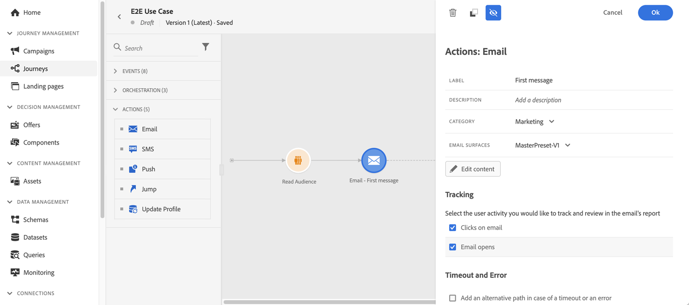

# Caso de uso: enviar mensagens de vários canais{#send-multi-channel-messages}

Esta seção apresenta um caso de uso que combina um Segmento de leitura, um evento, eventos de reação e mensagens de email/push.

## Descrição do caso de uso

Nesse caso de uso, queremos enviar uma primeira mensagem (email e push) para todos os clientes que pertencem a um segmento específico.

Com base na reação deles à primeira mensagem, queremos enviar mensagens específicas.

Após a primeira mensagem, esperamos um dia para que os clientes abram o push ou email. Se não houver reação, enviamos um email de acompanhamento.

Em seguida, aguardamos uma compra e enviamos uma mensagem de push para agradecer ao cliente.

## Pré-requisitos

Para que esse caso de uso funcione, é necessário configurar o seguinte:

* um segmento para todos os clientes que moram em Atlanta, São Francisco ou Seattle e nascem após 1980.
* um evento de compra

### Criar o segmento

Em nossa jornada, queremos aproveitar um segmento específico de clientes. Todos os indivíduos pertencentes ao segmento entram na jornada e seguem as diferentes etapas. Em nosso exemplo, precisamos de um segmento direcionado a todos os clientes que moram em Atlanta, São Francisco ou Seattle e nasceram depois de 1980.

Para obter mais informações sobre segmentos, consulte esta seção [página](../segment/about-segments.md).

1. Na seção do menu CLIENTE , selecione **[!UICONTROL Segmentos]**.

1. Clique no botão **[!UICONTROL Criar segmento]** que está localizado na parte superior direita da lista de segmentos.

1. No **[!UICONTROL Propriedades do segmento]** , insira um nome para o segmento.

1. Arraste e solte os campos desejados do painel esquerdo para o espaço de trabalho central e configure-os de acordo com suas necessidades. Neste exemplo, usamos a variável **Cidade** e **Ano de nascimento** campos de atributos.

1. Clique em **[!UICONTROL Salvar]**.

   

O segmento agora é criado e pronto para ser usado em sua jornada. Uso de uma **Ler segmento** , é possível fazer com que todos os indivíduos pertencentes ao segmento entrem na jornada.

### Configurar o evento

Você precisa configurar um evento enviado para sua jornada quando um cliente fizer uma compra. Quando a jornada recebe o evento, ela aciona a mensagem &quot;obrigado&quot;.

Para isso, usamos um evento com base em regras. Para obter mais informações sobre eventos, consulte esta seção [página](../event/about-events.md).

1. Na seção do menu ADMINISTRATION (ADMINISTRAÇÃO), selecione **[!UICONTROL Configurações]**, depois clique em **[!UICONTROL Eventos]**. Clique em **[!UICONTROL Criar evento]** para criar um novo evento.

1. Insira o nome do evento.

1. No **[!UICONTROL Tipo de ID de evento]** , selecione **[!UICONTROL Baseado em regras]**.

1. Defina as **[!UICONTROL Esquema]** e carga **[!UICONTROL Campos]**. Você pode usar vários campos, por exemplo, o produto comprado, a data de compra e a id de compra.

1. No **[!UICONTROL Condição de ID de evento]** , defina a condição usada pelo sistema para identificar os eventos que acionam a jornada. Por exemplo, é possível adicionar uma `purchaseMessage` e defina a seguinte regra: `purchaseMessage="thank you"`

1. Defina as **[!UICONTROL Namespace]** e **[!UICONTROL Identificador de perfil]**.

1. Clique em **[!UICONTROL Salvar]**.

   

O evento agora está configurado e pronto para ser usado em sua jornada. Usando a atividade de evento correspondente, você pode acionar uma ação sempre que um cliente fizer uma compra.

## Projetar a jornada

1. Inicie a jornada com um **Ler segmento** atividade . Selecione o segmento criado anteriormente. Todos os indivíduos pertencentes ao segmento entram na jornada.

   

1. Solte uma **Email** atividade de ação e defina o conteúdo da &quot;primeira mensagem&quot;. Esta mensagem é enviada a todos os indivíduos na jornada. Consulte esta [seção](../messages/create-email.md) para saber como configurar e criar um email.

   

1. Coloque o cursor na atividade de email e clique no símbolo &quot;+&quot; para criar um novo caminho.

1. No primeiro caminho, adicione um **Reação** e selecione **Empurrar aberto**. O evento é acionado quando um indivíduo pertencente ao segmento abre a versão de push da primeira mensagem.

1. No segundo caminho, adicione um **Reação** e selecione **Email aberto**. O evento é acionado quando o indivíduo abre o email.

1. Em uma das atividades de reação, verifique a **Definir o tempo limite do evento** , defina uma duração (1 dia no nosso exemplo) e marque **Definir um caminho de tempo limite**. Isso cria outro caminho para indivíduos que não abrem a primeira mensagem de push ou email.

   >[!NOTE]
   >
   >Ao configurar um tempo limite em vários eventos (as duas reações, neste caso), é necessário apenas configurar o tempo limite em um desses eventos.

1. No caminho de tempo limite, solte um **Email** atividade de ação e definir o conteúdo da mensagem de &quot;acompanhamento&quot;. Esta mensagem é enviada aos indivíduos que não abrem o email ou enviam a primeira mensagem no dia seguinte. Consulte esta [seção](../messages/create-email.md) para saber como configurar e criar um email.

1. Conecte os três caminhos ao evento de compra criado anteriormente. O evento é acionado quando um indivíduo faz uma compra.

1. Depois do evento , solte uma **Empurrar** atividade de ação e defina o conteúdo da mensagem &quot;obrigado&quot;. Consulte esta [seção](../messages/create-push.md) para saber como configurar e projetar um push.

## Testar e publicar a jornada

1. Antes de testar sua jornada, verifique se ela é válida e se não há erro.

1. Clique no botão **Teste** alterne, localizado no canto superior direito, para ativar o modo de teste. Defina como deseja que os perfis de teste insiram o teste: um único perfil, ou até 100 de uma só vez. Consulte esta [seção](testing-the-journey.md) para saber como usar o modo de teste.

1. Quando a jornada estiver pronta, publique-a usando o **Publicar** , localizado no canto superior direito.
