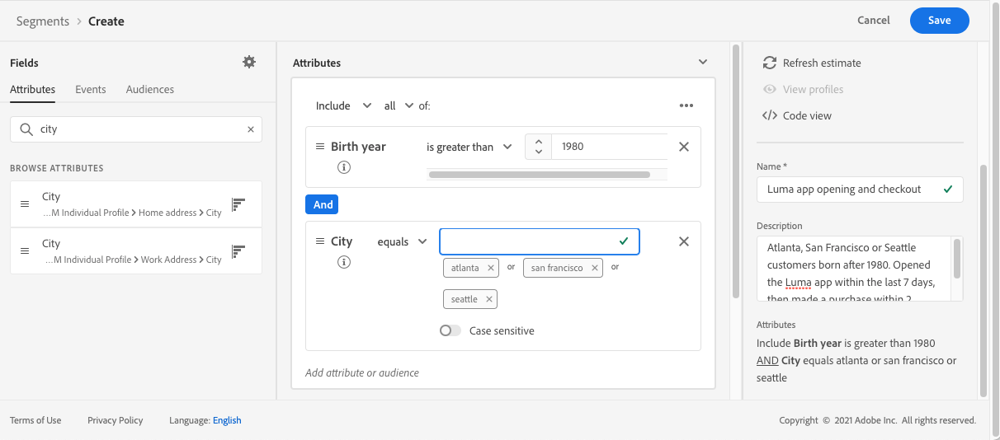

# Envie mensagens multicanal {#send-multi-channel-messages}

>[!BEGINSHADEBOX]

**Nesta página:** saiba como criar uma jornada multicanal que combina um Público de leitura, eventos, eventos de reação e mensagens de email e push com lógica de acompanhamento.

>[!ENDSHADEBOX]

Esta seção apresenta um caso de uso que combina um Público-alvo de leitura, um evento, eventos de reação e mensagens de email/push.

## Descrição do caso de uso

Nesse caso de uso, o objetivo é enviar uma primeira mensagem de email para todos os clientes pertencentes a um público-alvo específico.

Com base na reação deles à primeira mensagem, mensagens de acompanhamento específicas são enviadas.

Se o cliente abrir o email, o sistema aguardará a compra e enviará uma mensagem por push para agradecer ao cliente.

Se não houver reação, um email de acompanhamento será enviado.

## Pré-requisitos

Para que esse caso de uso funcione, configure o seguinte:

* Um público-alvo para todos os clientes que moram em Atlanta, São Francisco ou Seattle e nasceram após 1980
* Um evento de compra

### Criar o público

Nesta jornada, um público-alvo específico de clientes é aproveitado. Todos os indivíduos pertencentes ao público entram na jornada e seguem as diferentes etapas. Neste exemplo, o público-alvo é direcionado a todos os clientes que moram em Atlanta, São Francisco ou Seattle e nascidos após 1980.

Para obter mais informações sobre públicos, [consulte esta página](../audience/about-audiences.md).

1. Na seção de menu CLIENTE, selecione **[!UICONTROL Públicos-alvo]**.
1. Clique no botão **[!UICONTROL Criar público-alvo]** localizado na parte superior direita da lista de públicos-alvo.
1. No painel **[!UICONTROL Propriedades de público-alvo]**, digite um nome para o público-alvo.
1. Arraste e solte os campos desejados do painel esquerdo no espaço de trabalho central e configure-os de acordo com suas necessidades. Neste exemplo, use os campos de atributo **Cidade** e **Ano de nascimento**.
1. Clique em **[!UICONTROL Salvar]**.

   

O público-alvo agora está criado e pronto para ser usado na jornada. Usando uma atividade **Ler público-alvo**, todos os indivíduos pertencentes a esse público-alvo podem entrar na jornada.

### Configurar o evento

Configure um evento que é enviado para a jornada quando um cliente faz uma compra. Quando a jornada recebe o evento, ela aciona a mensagem de &quot;obrigado&quot;.

Para isso, use um [evento baseado em regras](../event/about-events.md).

1. Na seção de menu ADMINISTRAÇÃO, selecione **[!UICONTROL Configurações]** e clique em **[!UICONTROL Eventos]**. Clique em **[!UICONTROL Criar evento]** para criar um novo evento.

1. Insira o nome do evento.

1. No campo **[!UICONTROL Tipo de ID do evento]**, selecione **[!UICONTROL Baseado em Regras]**.

1. Defina o **[!UICONTROL Esquema]** e a carga **[!UICONTROL Campos]**. Use vários campos, por exemplo, o produto comprado, a data de compra e a ID da compra.

1. No campo **[!UICONTROL Condição de ID de evento]**, defina a condição usada pelo sistema para identificar os eventos que acionam a jornada. Por exemplo, adicione um campo `purchaseMessage` e defina a seguinte regra: `purchaseMessage="thank you"`

1. Defina o **[!UICONTROL Namespace]** e o **[!UICONTROL Identificador de Perfil]**.

1. Clique em **[!UICONTROL Salvar]**.

   

Agora o evento está configurado e pronto para ser usado na jornada. Usando a atividade de evento correspondente, uma ação pode ser acionada sempre que um cliente fizer uma compra.

## Projetar a jornada

1. Inicie a jornada com uma atividade **Ler público-alvo**. Selecione o público-alvo criado anteriormente. Todos os indivíduos pertencentes ao público entram na jornada.

   

1. Solte uma atividade de ação **Email** e defina o conteúdo da &quot;primeira mensagem&quot;. Essa mensagem é enviada a todos os indivíduos na jornada. Consulte esta [seção](../email/create-email.md) para saber como configurar e projetar um email.

   

1. Adicione um evento **Reação** e selecione **Email aberto**. O evento é acionado quando um indivíduo pertencente ao público-alvo abre o email.

1. Marque a caixa **Definir o tempo limite do evento**, defina uma duração (1 dia neste exemplo) e marque **Definir um caminho de tempo limite**. Isso cria outro caminho para indivíduos que não abrem a primeira mensagem de push ou email.

1. No caminho de tempo limite, solte uma atividade de ação **Email** e defina o conteúdo da mensagem de &quot;acompanhamento&quot;. Essa mensagem é enviada às pessoas físicas que não abrirem o email ou enviarem a primeira mensagem por push no dia seguinte. [Saiba como configurar e projetar um email](../email/create-email.md).

1. No primeiro caminho, adicione o evento de compra criado anteriormente. O evento é acionado quando um indivíduo faz uma compra.

1. Depois do evento, solte uma atividade de ação **Push** e defina o conteúdo da mensagem de agradecimento. Consulte esta [seção](../push/create-push.md) para saber como configurar e projetar um push.

## Testar e publicar a jornada

1. Antes de testar a jornada, verifique se ela é válida e se não há erros.

1. Use o botão **Testar**, localizado no canto superior direito, para ativar o modo de teste. Consulte esta [seção](testing-the-journey.md) para saber como usar o modo de teste.

1. Quando a jornada estiver pronta, publique-a usando o botão **Publicar**, localizado no canto superior direito.

## Jornada de fidelidade multifásica {#multi-phase-loyalty}

Este exemplo ilustra um padrão de arquitetura de jornada principal: decompondo uma jornada complexa, de várias fases, em sub-jornadas menores e focalizadas conectadas à atividade [**[!UICONTROL Jump]**](jump.md). Um programa de fidelidade serve como cenário, mas esse padrão se aplica a qualquer jornada que abrange vários marcos ou fases de negócios.

Jornadas complexas de várias fases geram rapidamente um grande número de caminhos exclusivos para o cliente. A decomposição em uma subjornada por fase mantém cada jornada gerenciável, testável e com manutenção independente.

### Cenário

Considere um programa de fidelidade que oriente os clientes por três marcos com dois canais de marketing ([email](../email/create-email.md) e [push](../push/create-push.md)):

1. **Fase 1 — Baixar o aplicativo móvel:** as comunicações iniciais incentivam os novos membros do programa de fidelidade a baixar o aplicativo. Um lembrete de acompanhamento será enviado se o cliente não tiver agido dentro de um período definido.
1. **Fase 2 — Faça uma primeira transação:** depois que o aplicativo for baixado, as mensagens direcionadas orientarão os clientes a concluírem sua primeira transação de fidelidade.
1. **Fase 3 — Faça uma segunda transação:** Depois da primeira transação, um conjunto final de comunicações direciona uma segunda transação para aprofundar o engajamento de fidelidade.

Mesmo com essa estratégia simples, essa jornada expõe mais de 20 caminhos únicos que um cliente pode tomar. A complexidade cresce exponencialmente a cada ponto de contato ou canal adicional.

### Decomposição de subjornada

Divida a jornada completa em três sub-jornadas menores e conectadas:

| Subjornada | Condição de entrada | Objetivo comercial |
|---|---|---|
| Fase 1 — Download do aplicativo | O cliente entra no programa de fidelidade | Download do aplicativo móvel da unidade |
| Fase 2 — Primeira transação | O cliente baixa o aplicativo | Impulsionar primeira transação de fidelidade |
| Fase 3 — Segunda operação | O cliente conclui a primeira transação | Dirigir segunda transação de fidelidade |

Conecte as subjornadas usando a atividade [**[!UICONTROL Jump]**](jump.md) para que os perfis passem facilmente de uma fase para a próxima. Cada subjornada permanece simples, legível e com manutenção independente.

<!--
>[!NOTE]
>
>If your goal is to build a gamified loyalty program with challenges, tasks, and built-in reward tracking, Journey Optimizer also offers a dedicated **Loyalty Challenges** capability.
-->

+++ Referência de conhecimento de IA

Esta seção contém conhecimento estruturado destinado a oferecer suporte à interpretação, recuperação e resposta a perguntas relacionadas a este tópico.

Para uma compreensão completa, essas informações devem ser combinadas com a documentação desta página. Nenhuma das origens deve ser independente; a página descreve o recurso, enquanto esta seção fornece um contexto adicional que ajuda a desfazer a ambiguidade da terminologia, intenção, aplicabilidade e restrições.

* **TL;DR:** esta página apresenta dois casos de uso práticos de jornada: um fluxo de mensagens multicanal que combina Leitura de público, eventos de reação, email e push; e um padrão de jornada de fidelidade multifásico que usa a atividade de salto para decompor jornadas complexas em subjornadas gerenciáveis.

**Intenções:**

* Crie uma jornada multicanal que envie um email de acompanhamento ou um push com base no fato de um cliente abrir um email inicial
* Configure um evento de compra para acionar uma notificação por push de agradecimento dentro de uma jornada
* Usar eventos de reação para ramificar uma jornada com base no comportamento de abertura de email
* Decompor uma jornada multifásica complexa em sub-jornadas menores conectadas por atividades de salto
* Crie e configure um evento com base em regras para usar como acionador de jornada
* Definir um público com base nos atributos de cidade e ano de nascimento para a entrada de jornada direcionada

**Glossário:**

* **Evento de reação**: um evento de jornada que é acionado quando um perfil interage com uma mensagem (por exemplo, abre um email ou clica em um link), permitindo a ramificação orientada por comportamento. *(específico do produto)*
* **Atividade Ler público-alvo**: a atividade de entrada de jornada que carrega todos os perfis em um público-alvo do Adobe Experience Platform especificado para iniciar a jornada. *(específico do produto)*
* **Atividade Jump**: uma atividade de ação que envia um perfil de uma jornada (origem) para outra (destino), habilitando a arquitetura de subjornada modular. *(específico do produto)*
* **Evento baseado em regras**: um tipo de evento em que a condição do acionador é definida por uma expressão de regra, em vez de uma ID de orquestração, útil para acionadores de compra ou comportamentais. *(específico do produto)*

**Medidas de Proteção:**

* Um caminho de tempo limite de evento de reação deve ser configurado para lidar com perfis que não interagem com a mensagem dentro da duração definida
* O público-alvo usado no caso de uso deve ser criado antes da criação da jornada
* O evento de compra deve ser configurado antes de ser usado na jornada
* As subjornadas conectadas via Jump devem usar o mesmo namespace que a jornada de origem
* A substituição de endereço de email (substituição de parâmetro) deve ser usada somente para casos de uso específicos, não como uma substituição geral do endereço principal

**Terminologia:**

* Nome canônico: Evento de reação — Acrônimo: none — variantes: atividade de reação, reação de mensagem
* Sinônimos: &quot;jornada de origem&quot; = &quot;jornada de origem&quot;; &quot;jornada de destino&quot; = &quot;jornada de destino&quot;
* Não confunda: &quot;Ler atividade do público-alvo&quot; ≠ &quot;Atividade de qualificação de público-alvo&quot; — Ler público-alvo carrega todos os membros do público-alvo em lote de uma só vez; a qualificação de público-alvo aciona por perfil em tempo real, à medida que a associação muda

**Perguntas frequentes:**

* **P: Como faço para enviar uma mensagem de acompanhamento somente aos clientes que não abriram um email?** — Adicione um evento de reação (Email aberto) com um caminho de tempo limite; os perfis que não abrirem dentro da duração do tempo limite fluem para baixo no caminho de tempo limite onde o email de acompanhamento é colocado.
* **P: Como o evento de compra é configurado no caso de uso de vários canais?** — Como um evento baseado em regras com uma condição como `purchaseMessage="thank you"`, configurada com um esquema, campos de carga (produto, data, ID de compra), namespace e identificador de perfil.
* **P: Por que decompor uma jornada complexa em subjornadas?** — jornadas complexas podem expor 20 ou mais caminhos únicos para o cliente, e a complexidade cresce exponencialmente a cada ponto de contato. As sub-jornadas mantêm cada fase legível, testável e com manutenção independente.
* **P: Um perfil pode estar na jornada de origem e de destino ao mesmo tempo após um salto?** — Sim; quando um perfil atinge uma etapa de salto, ele continua progredindo na jornada de origem enquanto entra simultaneamente na jornada de destino.
* **P: Quantas sub-jornadas são usadas no exemplo de fidelidade multifase?** — Três subjornadas: Fase 1 (download do aplicativo), Fase 2 (primeira transação) e Fase 3 (segunda transação), conectadas sequencialmente usando atividades Jump.

+++

