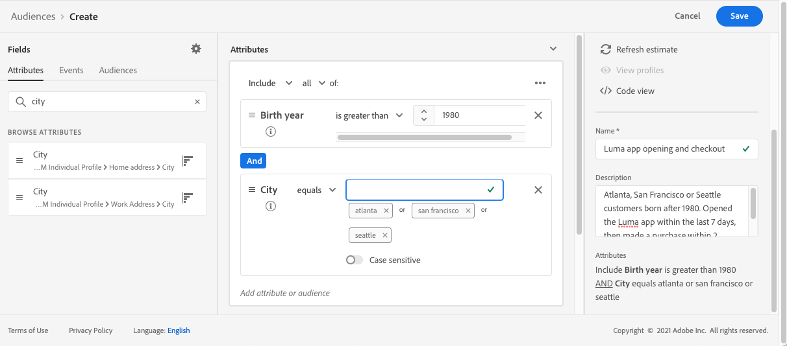

# Enviar mensagens de vários canais {#send-multi-channel-messages}

Esta seção apresenta um caso de uso que combina um Público-alvo de leitura, um evento, eventos de reação e mensagens de email/push.

## Descrição do caso de uso

Nesse caso de uso, o objetivo é enviar uma primeira mensagem de email para todos os clientes pertencentes a um público-alvo específico.

Com base na reação deles à primeira mensagem, mensagens de acompanhamento específicas são enviadas.

Se o cliente abrir o email, o sistema aguardará a compra e enviará uma mensagem por push para agradecer ao cliente.

Se não houver reação, um email de acompanhamento será enviado.

## Pré-requisitos

Para que esse caso de uso funcione, configure o seguinte:

* Um público-alvo para todos os clientes que moram em Atlanta, São Francisco ou Seattle e nasceram após 1980
* Um evento de compra

### Criar o público

Nesta jornada, um público-alvo específico de clientes é aproveitado. Todos os indivíduos pertencentes ao público entram na jornada e seguem as diferentes etapas. Neste exemplo, o público-alvo é direcionado a todos os clientes que moram em Atlanta, São Francisco ou Seattle e nascidos após 1980.

Para obter mais informações sobre públicos, [consulte esta página](../audience/about-audiences.md).

1. Na seção de menu CLIENTE, selecione **[!UICONTROL Públicos-alvo]**.
1. Clique no botão **[!UICONTROL Criar público-alvo]** localizado na parte superior direita da lista de públicos-alvo.
1. No painel **[!UICONTROL Propriedades de público-alvo]**, digite um nome para o público-alvo.
1. Arraste e solte os campos desejados do painel esquerdo no espaço de trabalho central e configure-os de acordo com suas necessidades. Neste exemplo, use os campos de atributo **Cidade** e **Ano de nascimento**.
1. Clique em **[!UICONTROL Salvar]**.

   

O público-alvo agora está criado e pronto para ser usado na jornada. Usando uma atividade **Ler público-alvo**, todos os indivíduos pertencentes a esse público-alvo podem entrar na jornada.

### Configurar o evento

Configure um evento que é enviado para a jornada quando um cliente faz uma compra. Quando a jornada recebe o evento, ela aciona a mensagem de &quot;obrigado&quot;.

Para isso, use um [evento baseado em regras](../event/about-events.md).

1. Na seção de menu ADMINISTRAÇÃO, selecione **[!UICONTROL Configurações]** e clique em **[!UICONTROL Eventos]**. Clique em **[!UICONTROL Criar evento]** para criar um novo evento.

1. Insira o nome do evento.

1. No campo **[!UICONTROL Tipo de ID do evento]**, selecione **[!UICONTROL Baseado em Regras]**.

1. Defina o **[!UICONTROL Esquema]** e a carga **[!UICONTROL Campos]**. Use vários campos, por exemplo, o produto comprado, a data de compra e a ID da compra.

1. No campo **[!UICONTROL Condição de ID de evento]**, defina a condição usada pelo sistema para identificar os eventos que acionam a jornada. Por exemplo, adicione um campo `purchaseMessage` e defina a seguinte regra: `purchaseMessage="thank you"`

1. Defina o **[!UICONTROL Namespace]** e o **[!UICONTROL Identificador de Perfil]**.

1. Clique em **[!UICONTROL Salvar]**.

   

Agora o evento está configurado e pronto para ser usado na jornada. Usando a atividade de evento correspondente, uma ação pode ser acionada sempre que um cliente fizer uma compra.

## Projetar a jornada

1. Inicie a jornada com uma atividade **Ler público-alvo**. Selecione o público-alvo criado anteriormente. Todos os indivíduos pertencentes ao público entram na jornada.

   

1. Solte uma atividade de ação **Email** e defina o conteúdo da &quot;primeira mensagem&quot;. Essa mensagem é enviada a todos os indivíduos na jornada. Consulte esta [seção](../email/create-email.md) para saber como configurar e projetar um email.

   

1. Adicione um evento **Reação** e selecione **Email aberto**. O evento é acionado quando um indivíduo pertencente ao público-alvo abre o email.

1. Marque a caixa **Definir o tempo limite do evento**, defina uma duração (1 dia neste exemplo) e marque **Definir um caminho de tempo limite**. Isso cria outro caminho para indivíduos que não abrem a primeira mensagem de push ou email.

1. No caminho de tempo limite, solte uma atividade de ação **Email** e defina o conteúdo da mensagem de &quot;acompanhamento&quot;. Essa mensagem é enviada às pessoas físicas que não abrirem o email ou enviarem a primeira mensagem por push no dia seguinte. [Saiba como configurar e projetar um email](../email/create-email.md).

1. No primeiro caminho, adicione o evento de compra criado anteriormente. O evento é acionado quando um indivíduo faz uma compra.

1. Depois do evento, solte uma atividade de ação **Push** e defina o conteúdo da mensagem de agradecimento. Consulte esta [seção](../push/create-push.md) para saber como configurar e projetar um push.

## Testar e publicar a jornada

1. Antes de testar a jornada, verifique se ela é válida e se não há erros.

1. Use o botão **Testar**, localizado no canto superior direito, para ativar o modo de teste. Consulte esta [seção](testing-the-journey.md) para saber como usar o modo de teste.

1. Quando a jornada estiver pronta, publique-a usando o botão **Publicar**, localizado no canto superior direito.
