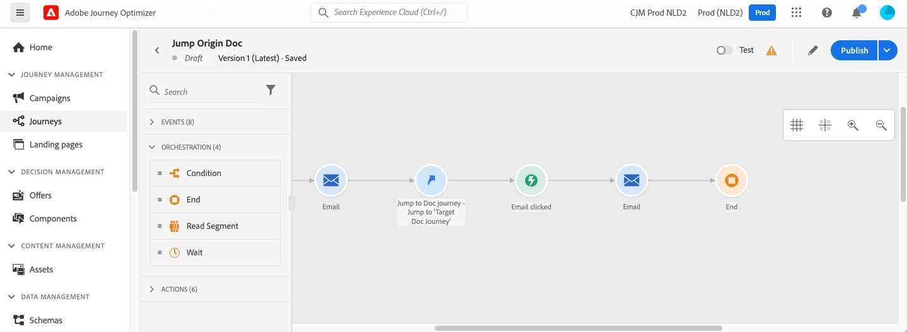

# Mudar de uma jornada para outra {#jump}

>[!CONTEXTUALHELP]
>id="ajo_journey_jump"
>title="Atividade Salto"
>abstract="A ação “Saltar” permite enviar pessoas de uma jornada para outra. Esse recurso permite simplificar o design de jornadas muito complexas e criar jornadas com base em padrões de jornadas comuns e reutilizáveis."

A atividade de ação **[!UICONTROL Pular]** permite enviar indivíduos de uma jornada para outra. Esse recurso permite:

* simplificar o design de jornadas muito complexas dividindo-as em várias jornadas
* criar jornadas com base em padrões de jornada comuns e reutilizáveis

Na jornada de origem, adicione uma atividade **[!UICONTROL Jump]** e selecione uma jornada de destino. Quando o indivíduo entra na etapa **[!UICONTROL Jump]**, um evento interno é enviado para o primeiro evento da jornada de destino. Se a ação **[!UICONTROL Jump]** for bem-sucedida, o indivíduo continuará progredindo na jornada. O comportamento é semelhante a outras ações.

Na jornada de destino, o primeiro evento acionado internamente pela atividade **[!UICONTROL Jump]** gera o fluxo individual na jornada.

## Ciclo de vida {#jump-lifecycle}

Suponha que você tenha adicionado uma atividade de **[!UICONTROL salto]** na jornada A para a jornada B. A Jornada A é a **jornada de origem** e a jornada B é a **jornada de destino**.

Estas são as diferentes etapas do processo de execução:

A **Jornada A** é disparada de um evento externo:

1. A jornada A recebe um evento externo relacionado a um indivíduo.
1. O indivíduo atinge a etapa **[!UICONTROL Salto]**.
1. O indivíduo é encaminhado para a jornada B e avança para as próximas etapas da jornada A, após a etapa **[!UICONTROL Jump]**.

Na jornada B, o primeiro evento é acionado internamente por meio da atividade **[!UICONTROL Jump]** da jornada A:

1. A jornada B recebe um evento interno da jornada A.
1. O indivíduo começa a fluir na jornada B.

>[!NOTE]
>
>A jornada B também pode ser acionada por meio de um evento externo.

### Comportamento do perfil durante um salto {#jump-profile-behavior}

Quando um perfil atinge a etapa **[!UICONTROL Jump]**, ele continua progredindo na jornada de origem (Jornada A) enquanto entra simultaneamente na jornada de destino (Jornada B). Portanto, o perfil está ativo em ambas as jornadas ao mesmo tempo.

Isso significa:

* O perfil conclui todas as etapas restantes na Jornada A após a atividade Jump (por exemplo, uma espera de acompanhamento ou ação de fechamento).
* O perfil também começa a fluir pela Jornada B a partir de seu primeiro evento, independentemente da Jornada A.
* Se o perfil **já estiver ativo** na Jornada B quando o salto for executado, ele **não** inserirá a Jornada B novamente. A jornada A continua normalmente; nenhum erro é relatado.

>[!NOTE]
>
>O caso acima — perfil já ativo na Jornada B — resulta em um **ignorar silencioso**: nenhum erro é gerado e a Jornada A continua normalmente. Em outras situações, o salto pode **falhar** e a Jornada A aplica sua manipulação padrão de erro de ação. Consulte [Falhas em tempo de execução](#jump-troubleshoot) para obter a lista completa de ocorrências.

## Práticas recomendadas e limitações {#jump-limitations}

Use essas diretrizes para manter o comportamento da atividade de salto previsível e seguro.

### Criação {#jump-limitations-authoring}

* A atividade **[!UICONTROL Jump]** só está disponível em jornadas que usam um namespace.
* Você só pode pular para uma jornada que use o mesmo namespace que a jornada de origem.
* Você não pode ir para uma jornada que começa com um evento de **Qualificação de público-alvo** ou **Ler público-alvo**.
* Você não pode ter uma atividade de **[!UICONTROL Salto]** e um evento de **Qualificação de público** ou **Ler público** na mesma jornada.
* Você pode incluir quantas atividades de **[!UICONTROL Salto]** forem necessárias em uma jornada. Após um **[!UICONTROL Jump]**, você pode adicionar qualquer atividade necessária.
* Você pode ter quantos níveis de salto forem necessários. Por exemplo, a jornada A salta para a jornada B, que salta para a jornada C e assim por diante.
* A jornada de destino também pode incluir quantas atividades **[!UICONTROL Jump]** forem necessárias.
* Não há suporte para padrões de loop. Não há como vincular duas ou mais jornadas, o que criaria um loop infinito. A tela de configuração de atividade **[!UICONTROL Jump]** impede que você faça isso.

### Execução {#jump-limitations-exec}

* Quando a atividade **[!UICONTROL Jump]** é executada, a versão mais recente da jornada de destino é acionada.
* Um indivíduo único só pode estar presente uma vez na mesma jornada. Como resultado, se o indivíduo enviado da jornada de origem já estiver na jornada de destino, ele não entrará na jornada de destino. Nenhum erro será relatado na atividade de **[!UICONTROL Salto]** porque esse é um comportamento normal.

## Estratégia de design: sub-jornadas de tamanho reduzido {#jump-strategy}

Jornadas complexas do cliente podem se tornar rapidamente difíceis de criar e manter, especialmente quando canais ou pontos de contato adicionais são introduzidos. Mesmo uma jornada com alguns marcos pode expor 20 ou mais caminhos únicos que um cliente pode tomar e essa complexidade cresce exponencialmente a cada adição.

Uma abordagem prática para gerenciar isso é dividir grandes jornadas em sub-jornadas menores e focadas, uma por fase de negócios ou marco, e conectá-las usando a atividade **[!UICONTROL Jump]**. Isso mantém cada jornada legível, testável e com manutenção independente.

**Etapa 1 — Visualizar a jornada de ponta a ponta**

Mapear a jornada completa do cliente e identificar suas fases de alto nível. Por exemplo, uma jornada de integração de fidelidade pode incluir três fases distintas: baixar o aplicativo móvel, fazer uma primeira transação e fazer uma segunda transação.

**Etapa 2 — Anotar fases e definir subjornadas**

Marcar o limite de cada fase e definir seu objetivo comercial. Cada fase se torna uma subjornada candidata com uma condição de entrada e meta claras.

**Etapa 3 — Criar e conectar subjornadas**

Crie cada fase como uma jornada separada no Journey Optimizer e use as atividades **[!UICONTROL Jump]** para transmitir perfis de uma subjornada para a próxima. O resultado é um conjunto de jornadas mais simples e reutilizáveis que se combinam para produzir a experiência completa, com menos risco de apresentar erros.

>[!TIP]
>
>Para obter um exemplo prático usando um programa de fidelidade multifase, consulte [jornada de fidelidade multifase](journeys-uc.md#multi-phase-loyalty).

## Configuração da atividade Jump {#jump-configure}

1. Projete sua **jornada de origem**.

   

1. Em qualquer etapa da jornada, adicione uma atividade de **[!UICONTROL Salto]**, da categoria **[!UICONTROL AÇÕES]**. Adicione um rótulo e uma descrição.

   

1. Clique dentro do campo **jornada de destino**.
A lista exibe todas as versões do jornada que são modo de rascunho, ativo ou de teste. As jornadas que usam um namespace diferente ou que começam com um evento **Qualificação de público-alvo** não estão disponíveis. As jornadas do Target que criariam um padrão de loop também são filtradas.

   

   >[!NOTE]
   >
   >Você pode clicar no ícone **Abrir jornada de destino**, no lado direito, para abrir a jornada de destino em uma nova guia.

1. Selecione a jornada de destino para a qual deseja ir.
O campo **Primeiro evento** é preenchido previamente com o nome do primeiro evento da jornada de destino. Se a sua jornada de destino incluir vários eventos, o **[!UICONTROL Jump]** só será permitido no primeiro evento.

   

1. A seção **Parâmetros de ação** exibe todos os campos do evento de destino. Mapeie cada campo com campos do evento de origem ou da fonte de dados, como com outros tipos de ações. Essas informações serão passadas para a jornada de destino no tempo de execução.
1. Adicione as próximas atividades para concluir a jornada de origem.

   

   >[!NOTE]
   >
   >A identidade do indivíduo é mapeada automaticamente. Essas informações não estão visíveis na interface.

Sua atividade **[!UICONTROL Jump]** está configurada. Assim que a jornada estiver ativa ou em modo de teste, os indivíduos que atingirem a etapa **[!UICONTROL Jump]** serão encaminhados para a jornada de destino.

Quando uma atividade de **[!UICONTROL Jump]** é configurada em uma jornada, um ícone de entrada **[!UICONTROL Jump]** é adicionado automaticamente no início da jornada de destino. Isso ajuda a identificar que a jornada pode ser acionada externamente, mas também internamente, a partir de uma atividade de **[!UICONTROL Salto]**.

## Solução de problemas {#jump-troubleshoot}

### Erros de configuração

Os seguintes problemas impedem que o salto funcione corretamente e são exibidos como erros na tela de jornada:

* A jornada de destino não existe mais.
* A jornada de destino está em rascunho, fechada ou parada.
* O primeiro evento da jornada de destino foi alterado e o mapeamento foi interrompido.

### Falhas de tempo de execução

Nos seguintes casos, a etapa de salto é tratada como uma **ação com falha** na Jornada A. A Jornada A aplica a manipulação padrão de erros de ação e continua:

* A instância de jornada de destino existente foi encerrada e a jornada de destino não é reentrante.
* Um período de reentrada é configurado na jornada de destino. Mesmo quando a reentrada é permitida em princípio, o perfil não pode entrar novamente até que o período expire (o salto falha com um status &quot;não reentrante para o período&quot;).
* Não é possível localizar a versão de destino do jornada, ela foi excluída, está em um estado concluído ou foi interrompida.
