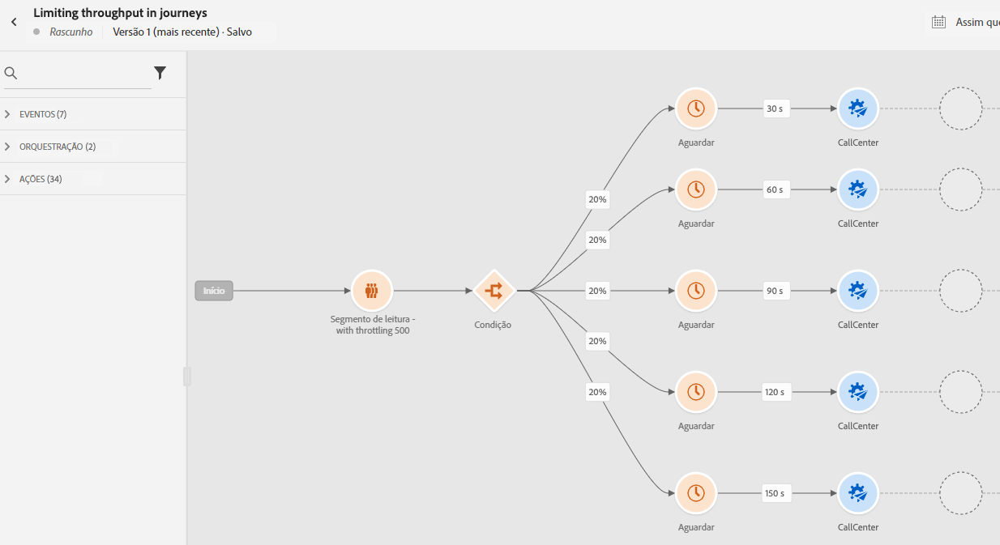

# Caso de uso: limite a taxa de transferência com fontes de dados externas e ações personalizadas{#limit-throughput}

## Descrição do caso de uso

O Adobe Journey Optimizer permite que os profissionais enviem chamadas de API para sistemas externos por meio do uso de Ações personalizadas e Fontes de dados.

Isso pode ser feito com :

* **Fontes de dados**: para coletar informações de sistemas externos e usá-las no contexto de jornada, por exemplo, para obter informações meteorológicas sobre a cidade do perfil e ter um fluxo de jornada dedicado com base nisso.

* **Ações personalizadas**: para enviar informações para sistemas externos, por exemplo, para enviar emails por meio de uma solução externa usando os recursos de orquestração do Journey Optimizer juntamente com informações de perfil, dados do público-alvo e contexto de jornada.

Se você estiver trabalhando com fontes de dados externas ou ações personalizadas, convém proteger seus sistemas externos limitando a taxa de transferência da jornada: até 5000 instâncias/segundo para jornadas unitárias e até 20000 instâncias/segundo para as acionadas por segmento. Você pode definir limites no nível do ponto de extremidade para evitar sobrecarregar esses sistemas externos por meio de APIs de limitação do Journey Optimizer. No entanto, todas as solicitações restantes após o limite ser atingido serão descartadas.

Nesta seção, você encontrará soluções alternativas que podem ser usadas para otimizar sua taxa de transferência. Para obter mais informações sobre como integrar com sistemas externos, consulte esta seção [página](../configuration/external-systems.md).

## Implementação

Para **jornadas acionadas por segmento**, é possível definir a taxa de limitação da atividade Ler segmento que afetará a taxa de transferência da jornada.  [Leia mais](../building-journeys/read-segment.md)

Você pode modificar esse valor de 500 a 20.000 instâncias por segundo. Se você precisar ir além de 500/s, também poderá adicionar condições de &quot;divisão de porcentagem&quot; com atividades de espera para dividir a jornada em várias ramificações e executá-las em um horário específico.

Vejamos um exemplo de um **jornadas acionadas por segmento** trabalhar com uma população de **10.000 perfis** e enviar dados para um sistema externo que ofereça suporte **100 pedidos/segundo**.

1. Você pode definir seu segmento de leitura para ler perfis com uma taxa de transferência de 500 perfis por segundo, o que significa que levará 20 segundos para ler todos os perfis. No segundo 1, você lerá 500, no segundo 2 500, etc.

1. Em seguida, você pode adicionar uma atividade de Condição de &quot;divisão de porcentagem&quot; com uma divisão de 20% para ter 100 perfis a cada segundo em cada ramificação.

1. Depois disso, adicione as atividades Wait com um cronômetro específico em cada ramificação. Aqui nós configuramos um tempo de espera de 30 segundos para cada um. A cada segundo, 100 perfis fluirão em cada ramificação.

   * Na ramificação 1, eles aguardarão 30 segundos, o que significa que:
      * no segundo 1, 100 perfis aguardarão os segundos 31
      * no segundo 2, 100 perfis aguardarão o segundo 32, etc.
   * Na ramificação 2, eles esperarão por 60 segundos, o que significa que:
      * No segundo 1, 100 perfis esperarão pelo segundo 61 (1&#39;01&#39;&#39;)
      * No segundo 2, 100 perfis esperarão pelo segundo 62 (1&#39;02&#39;&#39;), etc.
   * Sabendo que esperamos no máximo 20 segundos para ler todos os perfis, não haverá sobreposição entre cada ramificação, sendo o segundo 20 o último em que os perfis fluirão para a condição. Entre o segundo 31 e o segundo 51, todos os perfis na ramificação 1 serão processados. Entre o segundo 61 (1&#39;01&#39;&#39;) e o segundo 81 (1&#39;21&#39;), todos os perfis na ramificação 2 serão processados etc.

   * Como garantia, também é possível adicionar uma sexta ramificação para ter menos de 100 perfis por ramificação, especialmente se o sistema externo suportar apenas 100 solicitações por segundo.

>[!IMPORTANT]
>
>Como em qualquer solução alternativa, teste essa solução completamente antes de entrar na produção para garantir que ela faça o que você deseja.

Como garantia adicional, você também pode usar os recursos de Limitação.

>[!NOTE]
>
>Ao contrário dos recursos de limitação, que protegem um endpoint ao serem globais para todas as jornadas de uma sandbox, essa solução alternativa funciona somente no nível da jornada. Isso significa que, se várias jornadas estiverem sendo executadas simultaneamente e estiverem direcionando o mesmo endpoint, será necessário levar isso em consideração ao projetar a jornada. Portanto, essa solução alternativa não é adequada para todos os casos de uso.

