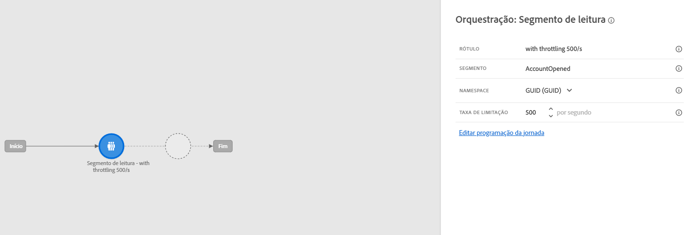
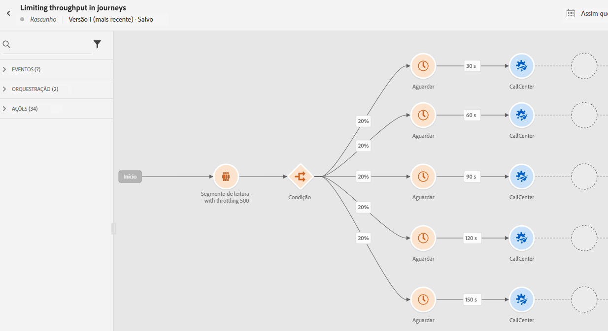

# Caso de uso: limite a taxa de transferência com fontes de dados externas e ações personalizadas{#limit-throughput}

>[!BEGINSHADEBOX]

**Nesta página:** saiba como limitar o processamento de jornadas com ações personalizadas e fontes de dados externas para que os sistemas externos não fiquem sobrecarregados além do número de solicitações por segundo com suporte.

>[!ENDSHADEBOX]

Use esse caso de uso para acelerar o processamento do jornada quando os sistemas externos precisarem lidar com um número limitado de solicitações por segundo.

## Descrição do caso de uso

O [!DNL Adobe Journey Optimizer] permite que os profissionais enviem chamadas de API para sistemas externos por meio do uso de Ações Personalizadas e Fontes de Dados.

Isso pode ser feito com:

* **Fontes de Dados**: para coletar informações de sistemas externos e usá-las no contexto da jornada, por exemplo, para obter informações meteorológicas sobre a cidade do perfil e ter um fluxo de jornada dedicado com base nisso.

* **Ações personalizadas**: para enviar informações a sistemas externos, por exemplo, para enviar emails por meio de uma solução externa usando os recursos de orquestração da Journey Optimizer junto com informações de perfil, dados de público-alvo e contexto de jornada.

>[!NOTE]
>
>Como as respostas agora são compatíveis, você deve usar ações personalizadas em vez de fontes de dados para casos de uso de fontes de dados externas. Para obter mais informações sobre respostas, consulte esta [seção](../action/action-response.md)

Se você estiver trabalhando com fontes de dados externas ou ações personalizadas, convém proteger seus sistemas externos limitando a taxa de transferência do jornada: até 5.000 instâncias/segundo para jornadas unitárias e até 20.000 instâncias/segundo para  acionadas pelo público-alvo. Saiba mais sobre taxas de processamento e taxa de transferência do jornada em [esta seção](entry-management.md#journey-processing-rate).

Para ações personalizadas, os recursos de controle estão disponíveis no nível do produto. Consulte esta [página](../configuration/external-systems.md#capping).

Para fontes de dados externas, é possível definir limites de limite no nível do endpoint para evitar sobrecarregar esses sistemas externos por meio das APIs de limite do Journey Optimizer. No entanto, todas as solicitações restantes depois que o limite for atingido serão descartadas. Nesta seção, você encontrará soluções alternativas que podem ser usadas para otimizar sua taxa de transferência.

Para obter mais informações sobre como integrar com sistemas externos, consulte esta [página](../configuration/external-systems.md).

## Implementação

Para **jornadas acionadas por público-alvo**, você pode definir a taxa de leitura da sua atividade Ler público que afetará a taxa de transferência da jornada. [Leia mais](../building-journeys/read-audience.md)

>[!NOTE]
>
> Esse é o número máximo de perfis que podem entrar na jornada por segundo. Essa taxa se aplica somente a essa atividade e nenhuma outra na jornada. [Leia mais](../building-journeys/read-audience.md)

Você pode modificar esse valor de 500 a 20.000 instâncias por segundo. Se você precisar ir abaixo de 500/s, também poderá adicionar condições de &quot;divisão de porcentagem&quot; com atividades de espera para dividir sua jornada em várias ramificações e executá-las em um momento específico.

Vamos ver um exemplo de **jornadas acionadas por público** que funcionam com uma população de **10.000 perfis** e enviam dados para um sistema externo com suporte a **100 solicitações/segundo**.

1. Você pode definir seu Público-alvo de leitura para ler perfis com uma taxa de transferência de 500 perfis/segundo, o que significa que levará 20 segundos para ler todos os perfis. No segundo 1, você lerá 500 deles, no segundo mais 2 500, etc.

1. Em seguida, você pode adicionar uma atividade de Condição &quot;divisão de porcentagem&quot; com uma divisão de 20% para ter a cada segundo 100 perfis em cada ramificação.

1. Depois disso, adicione as atividades Wait com um temporizador específico em cada ramificação. Aqui, configuramos uma espera de 30 segundos para cada um. A cada segundo, 100 perfis fluirão para cada ramificação.

   * Na ramificação 1, eles aguardarão 30 segundos, o que significa que:
      * no segundo 1, 100 perfis aguardarão pelo segundo 31
      * no segundo 2, 100 perfis aguardarão o segundo 32, etc.

   * Na ramificação 2, eles aguardarão 60 segundos, o que significa que:
      * No segundo 1, 100 perfis aguardarão o segundo 61 (1&#39;01&#39;&#39;)
      * No segundo 2, 100 perfis aguardarão o segundo 62 (1&#39;02&#39;&#39;) etc.

   * Sabendo que esperamos 20 segundos no máximo para ler todos os perfis, não haverá sobreposição entre cada ramificação, sendo os últimos 20 segundos em que os perfis fluirão para a condição. Entre o segundo 31 e o segundo 51, todos os perfis na ramificação 1 serão processados. Entre os segundos 61 (1&#39;01&#39;&#39;) e 81 (1&#39;21&#39;&#39;), todos os perfis na ramificação 2 serão processados etc.

   * Como proteção, você também pode adicionar uma sexta ramificação para ter menos de 100 perfis por ramificação, especialmente se o sistema externo oferecer suporte apenas a 100 solicitações por segundo.

>[!IMPORTANT]
>
>Como em qualquer solução alternativa, teste essa solução completamente antes de entrar em produção para garantir que ela faça o que você deseja.

Como proteção adicional, você também pode usar os recursos de Limite.

>[!NOTE]
>
>Ao contrário dos recursos de Limite, que protegem um endpoint por serem globais para todas as jornadas de uma sandbox, essa solução alternativa funciona somente no nível da jornada. Isso significa que, se várias jornadas estiverem sendo executadas em paralelo e estiverem direcionadas para o mesmo endpoint, será necessário considerar isso ao projetar a jornada. Portanto, essa solução alternativa não é adequada para cada caso de uso.

+++ Referência de conhecimento de IA

Esta seção contém conhecimento estruturado destinado a oferecer suporte à interpretação, recuperação e resposta a perguntas relacionadas a este tópico.

Para uma compreensão completa, essas informações devem ser combinadas com a documentação desta página. Nenhuma das origens deve ser independente; a página descreve o recurso, enquanto esta seção fornece um contexto adicional que ajuda a desfazer a ambiguidade da terminologia, intenção, aplicabilidade e restrições.

* **TL;DR:** Esta página explica como limitar a taxa de transferência de jornada quando fontes de dados externas ou ações personalizadas têm um número limitado de solicitações por segundo, usando a configuração de taxa Ler Público, divisões de porcentagem e atividades de espera.

**Intenções:**

* Limitar a taxa de transferência de uma jornada acionada pelo público-alvo para proteger um sistema externo contra sobrecarga
* Configure a taxa de leitura de uma atividade Read Audience para controlar quantos perfis entram por segundo
* Combinar condições de divisão de porcentagem e atividades de espera para distribuir o processamento do perfil ao longo do tempo
* Entenda a diferença entre as soluções alternativas de taxa de transferência no nível da jornada e os recursos de limite no nível da sandbox
* Aplicar recursos de limitação a ações personalizadas no nível do produto

**Glossário:**

* **Limitação/limitação de taxa de transferência**: controle a taxa na qual os perfis fluem por uma jornada para evitar exceder a capacidade da solicitação de um sistema externo. *(específico do produto)*
* **Taxa de leitura de Público de Leitura**: um parâmetro configurável na atividade de Público de Leitura que define o número máximo de perfis que entram na jornada por segundo (intervalo: 500-20.000 instâncias/segundo). *(específico do produto)*
* **API de limite**: uma API Journey Optimizer que define um limite máximo de solicitações por ponto de extremidade para fontes de dados externas; as solicitações além do limite são descartadas. *(específico do produto)*
* **Condição de divisão de porcentagem**: uma atividade de condição que divide o fluxo do perfil em ramificações por porcentagem, usada aqui para distribuir perfis em caminhos de espera escalonados por tempo. *(específico do produto)*

**Medidas de Proteção:**

* Leitura A taxa de leitura do público pode ser definida entre 500 e 20.000 instâncias por segundo; valores abaixo de 500/s exigem uma solução alternativa usando divisões de porcentagem e atividades de espera
* O Unitary jornada suporta até 5.000 instâncias/segundo; o audience-triggered jornada suporta até 20.000 instâncias/segundo
* A divisão de porcentagem + solução alternativa de espera opera somente no nível da jornada, não em todas as jornadas na sandbox
* Quando várias jornadas têm como alvo o mesmo endpoint externo em paralelo, essa solução alternativa não considera a carga combinada — os recursos de limite devem ser usados
* As solicitações restantes que excedem o limite de limite em fontes de dados externas são descartadas, não enfileiradas
* A solução alternativa deve ser testada minuciosamente antes de ir para a produção

**Terminologia:**

* Nome canônico: Limitação de taxa de transferência — Acrônimo: none — variantes: limitação, limitação de taxa, controle de taxa de transferência de jornada
* Sinônimos: &quot;Limitação&quot; = &quot;limitação&quot; no contexto da proteção de endpoint externa
* Não confunda: &quot;API de limite (nível de ponto de extremidade)&quot; ≠ &quot;taxa de leitura (nível de jornada)&quot; — A API de limite se aplica globalmente a todas as jornadas em uma sandbox direcionada a um ponto de extremidade; a taxa de leitura e a solução alternativa de divisão/espera se aplicam apenas à jornada individual

**Perguntas frequentes:**

* **P: Qual é a taxa de leitura máxima que eu posso definir em uma atividade Read Audience?** — Entre 500 e 20.000 perfis por segundo; para ficar abaixo de 500/s, use uma divisão de porcentagem com atividades de espera.
* **P: Como as divisões de porcentagem e as atividades de espera ajudam a limitar a taxa de transferência?** — Ao dividir perfis em ramificações (por exemplo, 20% cada) e adicionar temporizadores de espera escalonados por ramificação, você garante que somente um número controlado de perfis alcance o sistema externo por segundo.
* **P: A solução alternativa de divisão de porcentagem protege todas as jornadas direcionadas ao mesmo ponto de extremidade?** — Não, só funciona no nível da jornada individual. Se várias jornadas forem executadas em paralelo no mesmo endpoint, use os recursos de Limite no nível da sandbox.
* **P: O que acontece com as solicitações que excedem o limite de limite em uma fonte de dados externa?** — Eles são descartados; a API de limitação não coloca solicitações em fila em excesso.
* **P: Devo usar ações personalizadas ou fontes de dados para casos de uso de dados externos?** — as ações personalizadas são preferidas porque oferecem suporte ao tratamento de respostas; as fontes de dados devem ser usadas somente quando o caso de uso exigir especificamente.

+++
