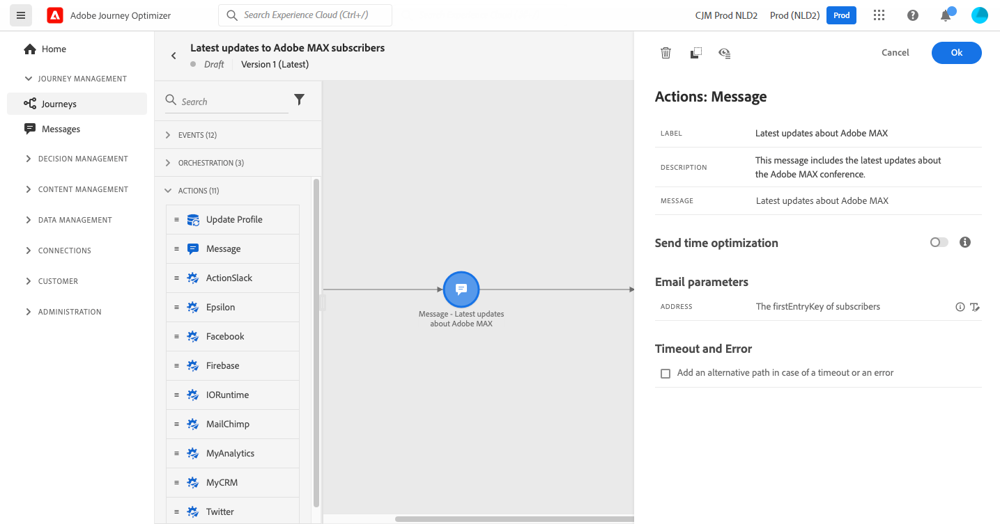

# Enviar uma mensagem aos assinantes de uma lista

A finalidade desse caso de uso é criar uma jornada para enviar uma mensagem aos assinantes de uma lista.

Neste exemplo, a variável **[!UICONTROL Consent and Preference Details]** grupo de campos de [!DNL Adobe Experience Platform] é usada. Para localizar esse grupo de campos, no **[!UICONTROL Data Management]** escolha **[!UICONTROL Schemas]**. No **[!UICONTROL Field groups]** , digite o nome do grupo de campos no campo de pesquisa.


Para configurar essa jornada, siga estas etapas:

1. Crie uma jornada que comece com uma **[!UICONTROL Read]** atividade . [Leia mais](journey-gs.md).
1. Adicione um **[!UICONTROL Message]** , com um email, para a jornada. [Leia mais](journeys-message.md).
1. No **[!UICONTROL Email parameters]** da seção **[!UICONTROL Message]** configurações da atividade, substitua o endereço de email padrão (`PersonalEmail.adress`) com o endereço de email dos assinantes da lista:

   1. Clique no botão **[!UICONTROL Enable parameter override]** ícone à direita do **[!UICONTROL Address]** , em seguida, clique no botão **[!UICONTROL Edit]** ícone .

      

      Para poder modificar o endereço de email, você deve ter publicado a mensagem anteriormente.

   1. No editor de expressão, insira a expressão para recuperar os endereços de email dos assinantes. [Leia mais](https://experienceleague.adobe.com/docs/journeys/using/building-advanced-conditions-journeys/expressionadvanced.html?lang=pt-BR){target=&quot;_blank&quot;}.

      Este exemplo mostra uma expressão que inclui referências para campos de mapa:

      ```json
      #{ExperiencePlatform.Subscriptions.profile.consents.marketing.email.subscriptions.entry('daily-email').subscribers.firstEntryKey()}
      ```

      Neste exemplo, essas funções são usadas:

      | Função | Descrição | Exemplo |
      | --- | --- | --- |
      | `entry` | Consulte um elemento de mapa de acordo com o namespace selecionado | Consulte uma lista de assinaturas específica |
      | `firstEntryKey` | Recuperar a primeira chave de entrada de um mapa | Recuperar o primeiro endereço de email dos assinantes |

      Neste exemplo, a lista de assinaturas é nomeada `daily-email`. Os endereços de email são definidos como chaves na variável `subscribers` , que é vinculado ao mapa de lista de assinaturas.

      Leia mais sobre [referências a campos](https://experienceleague.adobe.com/docs/journeys/using/building-advanced-conditions-journeys/syntax/field-references.html) em expressões.

      

   1. No **[!UICONTROL Add an expression]** , clique em **[!UICONTROL Ok]**.

   

1. Encerre a jornada com uma **[!UICONTROL End]** atividade .


