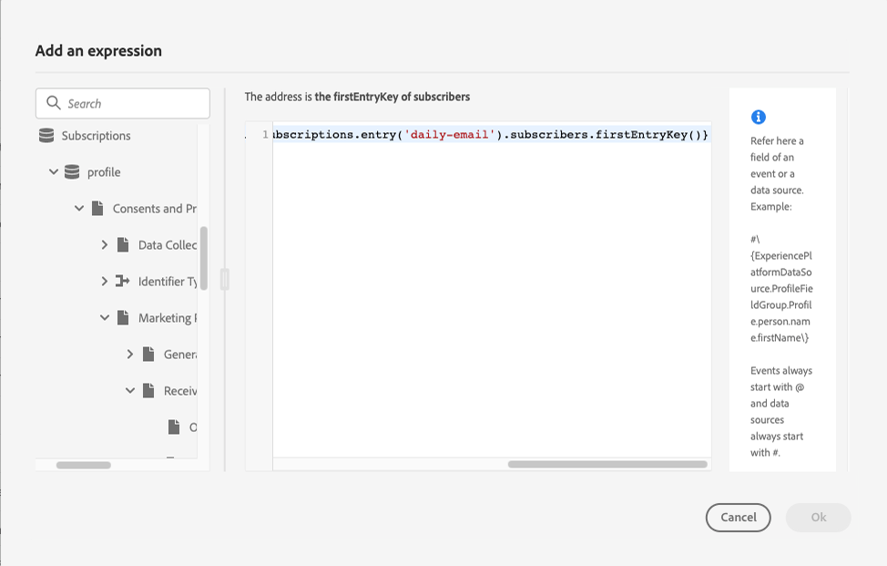

# Caso de uso: enviar uma mensagem aos assinantes de uma lista{#send-a-message-to-the-subscribers-of-a-list}

O objetivo deste caso de uso é criar uma jornada para enviar uma mensagem aos assinantes de uma lista.

Neste exemplo, o grupo de campos **[!UICONTROL Detalhes sobre Consentimento e Preferência]** de [!DNL Adobe Experience Platform] é usado. Para localizar este grupo de campos, no menu **[!UICONTROL Gerenciamento de Dados]**, escolha **[!UICONTROL Esquemas]**. Na guia **[!UICONTROL Grupos de campos]**, digite o nome do grupo de campos no campo de pesquisa.


Para configurar essa jornada, siga estas etapas:

1. Crie uma jornada que comece com uma atividade **[!UICONTROL Read]**. [Leia mais](journey-gs.md).
1. Adicione uma atividade de ação **[!UICONTROL Email]** à jornada. [Leia mais](journeys-message.md).
1. Na seção **[!UICONTROL Parâmetros de email]** das configurações de atividade de **[!UICONTROL Email]**, substitua o endereço de email padrão (`PersonalEmail.adress`) pelo endereço de email dos assinantes da lista:

   1. Clique no ícone **[!UICONTROL Habilitar substituição de parâmetro]** à direita do campo **[!UICONTROL Endereço]** e clique no ícone **[!UICONTROL Editar]**.

      

   1. No editor de expressão, insira a expressão para recuperar os endereços de email dos assinantes. [Leia mais](expression/expressionadvanced.md).

      Este exemplo mostra uma expressão que inclui referências a campos de mapa:

      ```json
      #{ExperiencePlatform.Subscriptions.profile.consents.marketing.email.subscriptions.entry('daily-email').subscribers.firstEntryKey()}
      ```

      Neste exemplo, essas funções são usadas:

      | Função | Descrição | Exemplo |
      | --- | --- | --- |
      | `entry` | Refere-se a um elemento de mapa de acordo com o namespace selecionado | Consultar uma lista de assinaturas específica |
      | `firstEntryKey` | Recupera a primeira chave de entrada de um mapa | Recuperar o primeiro email dos assinantes |

      Neste exemplo, o nome da lista de assinaturas é `daily-email`. Os endereços de email são definidos como chaves no mapa `subscribers`, que está vinculado ao mapa da lista de assinaturas.

      Leia mais sobre [referências a campos](expression/field-references.md) em expressões.

      

   1. Na caixa de diálogo **[!UICONTROL Adicionar uma expressão]**, clique em **[!UICONTROL Ok]**.

>[!CAUTION]
>
>A substituição de endereço de email deve ser usada somente para casos de uso específicos. Na maioria das vezes, não é necessário alterar o endereço de email, pois o valor definido como o endereço principal nos **[!UICONTROL Campos de execução]** é o que deve ser usado. [Saiba mais](../configuration/primary-email-addresses.md)
