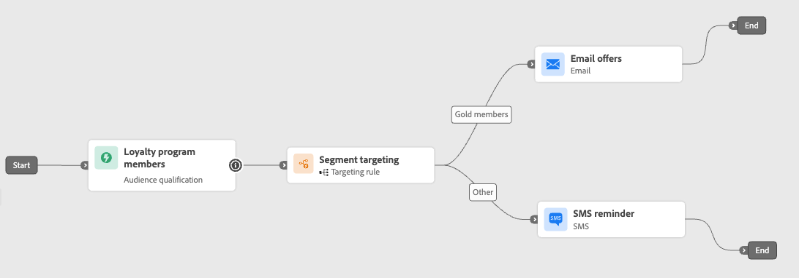
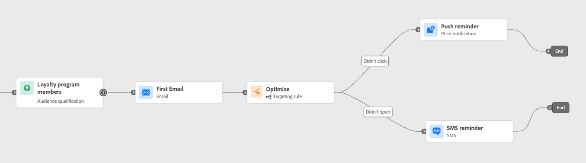

# Otimizar atividade {#journey-path-optimization}

>[!CONTEXTUALHELP]
>id="ajo_journey_optimize"
>title="Otimizar atividade"
>abstract="A Atividade **otimizar** permite definir como as pessoas avançam pela jornada ao criar vários caminhos com base em critérios específicos, incluindo experimentação, direcionamento e condições específicas. "

>[!AVAILABILITY]
>
>Este recurso é oferecido com disponibilidade limitada. Entre em contato com o representante da Adobe para obter acesso.

A atividade **Otimizar** permite definir como as pessoas avançam na sua jornada criando vários **caminhos** com base em critérios específicos, incluindo experimentação, direcionamento e condições específicas, garantindo o máximo de envolvimento e sucesso na criação de jornadas altamente personalizadas e eficazes.

Um **caminho** de jornada pode consistir em qualquer um dos seguintes: sequenciamento de comunicações, tempo entre elas, número de comunicações ou qualquer combinação dessas três variáveis.

Por exemplo, um caminho pode conter um email, outro pode conter duas mensagens SMS e um terceiro pode conter um email, um nó de espera de duas horas e, em seguida, uma mensagem SMS.

<!--With this feature, [!DNL Journey Optimizer] empowers you with the tools to deliver personalized and optimized paths to your audience, ensuring maximum engagement and success to create highly customized and effective journeys.-->

Através da atividade **Otimizar**, você pode executar as seguintes ações nos caminhos resultantes:

* Executar [experimentos de caminho](#experimentation)
* Aproveite as regras de [direcionamento](#targeting) em cada caminho de jornada
* Aplicar [condições](#conditions) aos seus caminhos

Quando a jornada estiver ativa, os perfis serão avaliados de acordo com os critérios definidos e, com base nos critérios de correspondência, serão enviados pelo caminho apropriado da jornada.

## Usar experimentação {#experimentation}

>[!CONTEXTUALHELP]
>id="ajo_path_experiment_success_metric"
>title="Métricas de sucesso"
>abstract="As métricas de sucesso são usadas para controlar e avaliar o tratamento com melhor desempenho em um experimento."
>additional-url="https://experienceleague.adobe.com/en/docs/journey-optimizer/using/orchestrate-journeys/create-journey/success-metrics" text="Configurar e rastrear as métricas da jornada"

A experimentação permite testar caminhos diferentes com base em uma divisão aleatória para determinar qual tem o melhor desempenho com base em métricas de sucesso predefinidas.

Para configurar a experimentação de caminho em uma jornada, siga as etapas abaixo.

Digamos que você deseje comparar três caminhos:

* um caminho com um email;
* um segundo caminho com um nó **[!UICONTROL Wait]** de dois dias e um email;
* um terceiro caminho com um email e, em seguida, uma mensagem SMS.

1. Na seção **[!UICONTROL Orquestração]**, arraste e solte a atividade **[!UICONTROL Otimizar]** na tela de jornada.

1. Adicione um rótulo opcional, que pode ser útil para identificar a atividade em relatórios e logs do modo de teste.

1. Selecione **[!UICONTROL Experimento]** na lista suspensa **[!UICONTROL Método]**.

   {width=65%}

1. Clique em **[!UICONTROL Criar experimento]**.

1. Selecione a **[!UICONTROL Métrica de sucesso]** que você deseja definir para o seu experimento. Saiba mais sobre as métricas disponíveis e como configurar a lista em [esta seção](success-metrics.md).

   {width=80%}

1. Você pode optar por adicionar um grupo de **[!UICONTROL Contenção]** à sua entrega. Este grupo não irá inserir nenhum caminho a partir deste experimento.

   >[!NOTE]
   >
   >A ativação da barra de alternância ocupará automaticamente 10% da sua população. Você pode ajustar essa porcentagem, se necessário.

   <!--
    DOES THIS APPLY TO PATH EXPERIMENT?
    IMPORTANT: When a holdout group is used in an action for path experimentation, the holdout assignment only applies to that specific action. After the action is completed, profiles in the holdout group will continue down the journey path and can receive messages from other actions. Therefore, ensure that any subsequent messages do not rely on the receipt of a message by a profile that might be in a holdout group. If they do, you may need to remove the holdout assignment.-->

1. Você pode alocar uma porcentagem precisa para cada **[!UICONTROL Tratamento]** ou simplesmente alternar na barra de alternância **[!UICONTROL Distribuir uniformemente]**.

   {width=80%}

1. Clique em **[!UICONTROL Criar]**.

1. Defina os elementos desejados para cada ramificação resultante do experimento, por exemplo:

   * Arraste e solte uma atividade [Email](../email/create-email.md) na primeira ramificação (**Tratamento A**).

   * Arraste e solte uma atividade [Aguardar](wait-activity.md) de dois dias na primeira ramificação, seguida por uma atividade [Email](../email/create-email.md) (**Tratamento B**).

   * Arraste e solte uma atividade [Email](../email/create-email.md) na terceira ramificação, seguida por uma atividade [SMS](../sms/create-sms.md) (**Tratamento C**).

   {width=100%}

1. Opcionalmente, use o **[!UICONTROL Adicionar um caminho alternativo em caso de tempo limite ou erro]** para definir uma ação de fallback. [Saiba mais](using-the-journey-designer.md#paths)

1. Selecione uma ação de canal e use o botão **[!UICONTROL Editar conteúdo]** para acessar as ferramentas de design.

   {width=70%}

1. A partir daí, usando o painel esquerdo, você pode navegar entre os diferentes conteúdos para cada ação em seu experimento. Selecione cada conteúdo e crie-o conforme necessário.

   {width=100%}

1. [Publique](publish-journey.md) sua jornada.

Quando a jornada estiver ativa, os usuários serão atribuídos aleatoriamente para percorrer caminhos diferentes. [!DNL Journey Optimizer] rastreia qual caminho tem melhor desempenho e fornece insights acionáveis.

Siga o sucesso da sua jornada com o relatório Experimento de caminho de Jornada. [Saiba mais](../reports/journey-global-report-cja-experimentation.md)

>[!CAUTION]
>
>Não edite os metadados de um experimento de caminho depois de ele ter sido publicado. A edição dos metadados interromperá o cálculo e o relatório dos resultados do experimento.

### Casos de uso de experimentos {#uc-experiment}

Os exemplos a seguir mostram como usar a atividade **[!UICONTROL Otimizar]** com o método **[!UICONTROL Experimento]** para determinar qual caminho funciona melhor em geral.

+++Eficácia do canal

Teste se o envio da primeira mensagem por email ou por SMS gera conversões mais altas.

➡️ Use a taxa de conversão como métrica de sucesso (por exemplo: compras, inscrições).

+++

+++Frequência da mensagem

Execute um experimento para verificar se o envio de um email contra três emails em uma semana resulta em mais compras.

➡️ Use compras ou a taxa de cancelamento de inscrição como métrica de sucesso.

+++

+++Tempo de espera entre as comunicações

Compare uma espera de 24 horas com uma de 72 horas antes de um acompanhamento para determinar qual tempo maximiza o engajamento.

➡️ Use a taxa de click-through ou a receita como métrica de sucesso.

+++

## Aproveitar o direcionamento {#targeting}

>[!CONTEXTUALHELP]
>id="ajo_path_targeting_fallback"
>title="O que é um caminho substituto?"
>abstract="Os caminhos substitutos permitem que o público-alvo entre em um caminho alternativo quando nenhuma regra de direcionamento for qualificada.  Se não selecionar essa opção, qualquer público-alvo que não se qualifique para uma regra de direcionamento não entrará no caminho de substituição e sairá da jornada."

As regras de direcionamento permitem determinar regras ou qualificações específicas que devem ser atendidas para que um cliente possa se qualificar para inserir um dos caminhos de jornada, com base em segmentos específicos de público-alvo<!-- depending on profile attributes or contextual attributes-->.

Ao contrário da experimentação, que é uma atribuição aleatória de um determinado caminho, o direcionamento é determinístico em termos de garantir que o público ou perfil correto entre no caminho especificado.

<!--With targeting, specific rules can be defined based on:

* **User profile attributes** such as location (eg. geo-targeting), age, or preferences. For example, users in the US receive a "Golden Gate" promotion, while users in France receive an "Eiffel Tower" promotion.

* **Contextual data** such as device type (eg. device-targeting), time of day, or session details. For example, desktop users receive desktop-optimized content, while mobile users receive mobile-optimized content.

* **Audiences** which can be used to include or exclude profiles that have a particular audience membership.-->

Para configurar o direcionamento em uma jornada, siga as etapas abaixo.

1. Na seção **[!UICONTROL Orquestração]**, arraste e solte a atividade **[!UICONTROL Otimizar]** na tela de jornada.

1. Adicione um rótulo opcional, que pode ser útil para identificar a atividade em relatórios e logs do modo de teste.

1. Selecione **[!UICONTROL Regra de direcionamento]** na lista suspensa **[!UICONTROL Método]**.

   {width=60%}

1. Clique em **[!UICONTROL Criar regra de direcionamento]**.

1. Clique em **[!UICONTROL Criar regra]** > **[!UICONTROL Criar novo]** e use o construtor de regras para definir seus critérios.

   {width=100%}

   Por exemplo, defina uma regra para membros Gold do programa de Fidelidade (`loyalty.status.equals("Gold", false)`) e uma regra para os outros membros (`loyalty.status.notEqualTo("Gold", false)`).

   

1. Você também pode clicar em **[!UICONTROL Criar regra]** > **[!UICONTROL Selecionar regra]** para selecionar uma regra de direcionamento existente criada no menu **[!UICONTROL Regras]**. [Saiba mais](../experience-decisioning/rules.md)

   {width=70%}

   Nesse caso, a fórmula que compõe a regra é simplesmente copiada para a atividade de jornada. Quaisquer alterações subsequentes dessa regra no menu **[!UICONTROL Regras]** não afetarão a cópia da jornada.

   >[!AVAILABILITY]
   >
   >[A criação de regras de direcionamento](../experience-decisioning/rules.md#create) pelo menu dedicado [!DNL Journey Optimizer] está disponível no momento para organizações que compraram a oferta complementar do Decisioning e estão disponíveis sob demanda para as outras organizações (Disponibilidade limitada).
   >
   >Essa capacidade será implantada progressivamente para todos os clientes. Enquanto isso, entre em contato com o representante da Adobe para obter acesso.

1. Depois de adicionar uma regra, você ainda pode modificá-la. Escolha **[!UICONTROL Editar em linha]** para atualizá-la em movimento usando o construtor de regras ou **[!UICONTROL Selecione a regra]** para escolher outra regra existente.

   {width=100%}

   >[!NOTE]
   >
   >Editar uma regra em linha não afeta a regra existente da qual ela se origina.

1. Selecione a opção **[!UICONTROL Habilitar caminho de fallback]**, conforme necessário. Essa ação cria um caminho de fallback para o público-alvo que não atende a nenhuma das regras de direcionamento definidas acima.

   >[!NOTE]
   >
   >Se você não selecionar essa opção, qualquer público-alvo que não se qualifique para uma regra de direcionamento não entrará no caminho de fallback e sairá da jornada.

1. Clique em **[!UICONTROL Criar]** para salvar suas configurações de regra de direcionamento.

1. De volta à jornada, solte ações específicas para personalizar cada caminho. Por exemplo, crie um email com ofertas personalizadas para membros do Gold Loyalty e um lembrete SMS para todos os outros membros.

   

1. Se você selecionou a opção **[!UICONTROL Habilitar conteúdo de fallback]** ao definir as configurações de regra, defina uma ou mais ações para o caminho de fallback que foi adicionado automaticamente.

   {width=70%}

1. Opcionalmente, use o **[!UICONTROL Adicionar um caminho alternativo em caso de tempo limite ou erro]** para definir uma ação alternativa se ocorrerem problemas. [Saiba mais](using-the-journey-designer.md#paths)

1. Crie o conteúdo apropriado para cada ação correspondente a cada grupo definido pelas suas configurações de regra de direcionamento. É possível navegar facilmente entre os diferentes conteúdos de cada ação.

   

   Neste exemplo, crie um email com ofertas especiais para membros Gold e um lembrete SMS para os outros membros.

1. [Publique](publish-journey.md) sua jornada.

Quando a jornada estiver ativa, o caminho especificado para cada segmento será processado para que os membros Gold insiram o caminho com as ofertas de email, enquanto os outros membros insiram o caminho com o lembrete SMS.

Siga o sucesso da sua jornada com o relatório de Jornada. [Saiba mais](../reports/journey-global-report-cja.md#targeting)

### Casos de uso da regra de direcionamento {#uc-targeting}

Os exemplos a seguir mostram como usar a atividade **[!UICONTROL Otimizar]** com o método **[!UICONTROL Regra de direcionamento]** para personalizar caminhos para diferentes subpúblicos.

+++Canais específicos do segmento

Os membros do programa de fidelidade com o status Gold podem receber ofertas personalizadas por email, enquanto todos os outros membros são direcionados a lembretes de SMS.

<!--➡️ Use the revenue per profile or conversion rate as the optimization metric.-->

+++

+++Segmentação baseada em comportamento

Os clientes que abriram um email, mas não clicaram, podem receber uma notificação por push, enquanto aqueles que não abriram recebem um SMS.

<!--➡️ Use the click-through rate or downstream conversions as the optimization metric.-->

+++

+++Direcionamento do histórico de compras

Os clientes que compraram recentemente podem entrar em um caminho curto de &quot;Obrigado + Venda cruzada&quot;, enquanto aqueles sem histórico de compra entram em uma jornada de criação mais longa.

<!--➡️ Use the repeat purchase rate or engagement rate as the optimization metric.-->

+++

### Adicionar uma condição {#conditions}

As condições são um tipo de regras de [direcionamento](#targeting) que permitem definir como os indivíduos avançam pela sua jornada criando vários caminhos com base em critérios específicos.

Saiba como definir uma condição em [esta seção](conditions.md).

Os seguintes tipos de condições estão disponíveis:

* [Condição do Source de dados](condition-activity.md#data_source_condition)
* [Condição de tempo](condition-activity.md#time_condition)
* [Divisão de porcentagem](condition-activity.md#percentage_split)
* [Condição de data](condition-activity.md#date_condition)
* [Limite de perfil](condition-activity.md#profile_cap)
