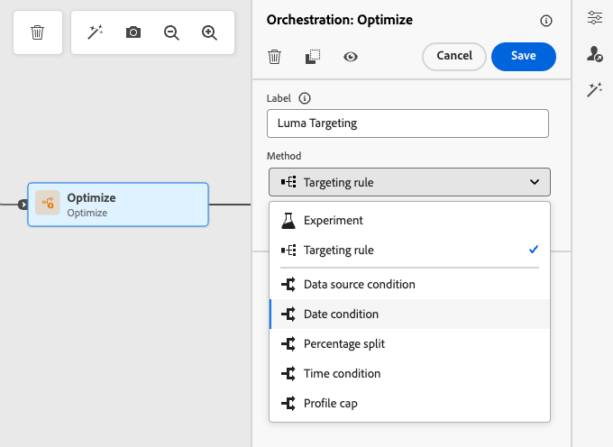
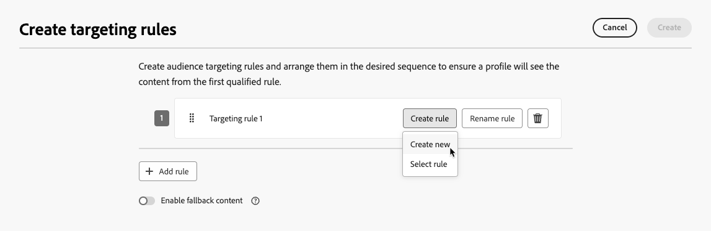
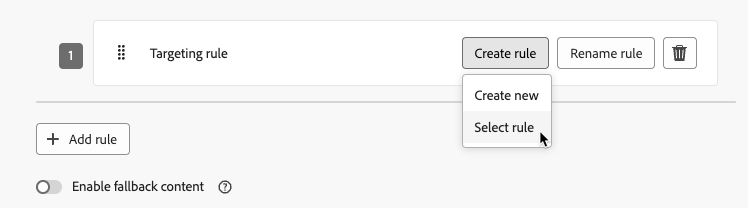
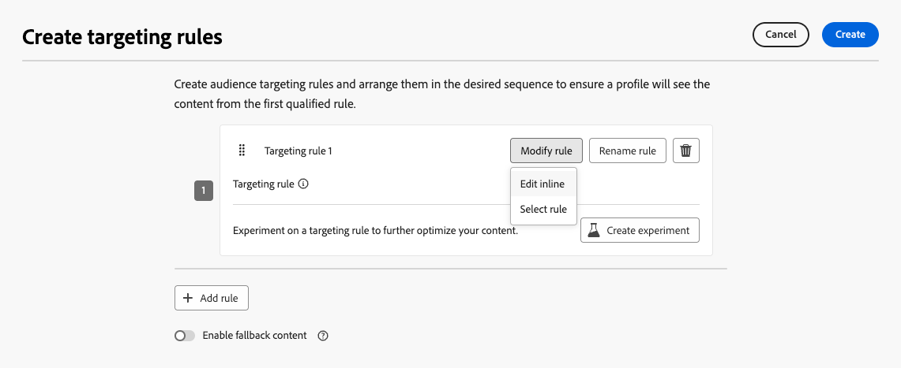
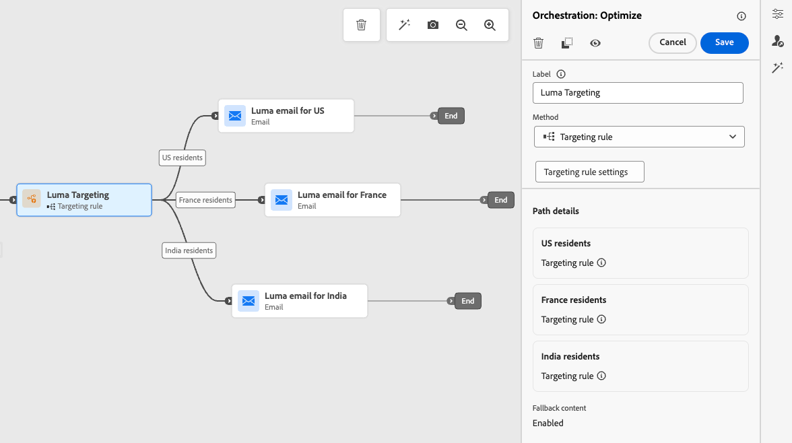

# Aproveitar o direcionamento de caminho {#targeting}

>[!CONTEXTUALHELP]
>id="ajo_path_targeting_fallback"
>title="O que é um caminho substituto?"
>abstract="Os caminhos substitutos permitem que o público-alvo entre em um caminho alternativo quando nenhuma regra de direcionamento for qualificada.  Se não selecionar essa opção, qualquer público-alvo que não se qualifique para uma regra de direcionamento não entrará no caminho de substituição e sairá da jornada."

>[!AVAILABILITY]
>
>No momento, esse recurso está com a Disponibilidade limitada. Para solicitar acesso, entre em contato com o representante da Adobe.

As regras de direcionamento permitem determinar regras ou qualificações específicas que devem ser atendidas para que um cliente possa se qualificar para inserir um dos caminhos de jornada, com base em segmentos específicos de público-alvo<!-- depending on profile attributes or contextual attributes-->.

Ao contrário da experimentação, que é uma atribuição aleatória de um determinado caminho, o direcionamento é determinístico em termos de garantir que o público ou perfil correto entre no caminho especificado.

<!--With targeting, specific rules can be defined based on:

* **User profile attributes** such as location (eg. geo-targeting), age, or preferences. For example, users in the US receive a "Golden Gate" promotion, while users in France receive an "Eiffel Tower" promotion.

* **Contextual data** such as device type (eg. device-targeting), time of day, or session details. For example, desktop users receive desktop-optimized content, while mobile users receive mobile-optimized content.

* **Audiences** which can be used to include or exclude profiles that have a particular audience membership.-->

Para configurar o direcionamento em uma jornada, siga as etapas abaixo.

1. Na seção **[!UICONTROL Orquestração]**, arraste e solte a atividade **[!UICONTROL Otimizar]** na tela de jornada.

1. Adicione um rótulo opcional, que pode ser útil para identificar a atividade em relatórios e logs do modo de teste.

1. Selecione **[!UICONTROL Regra de direcionamento]** na lista suspensa **[!UICONTROL Método]**.

   {width=60%}

1. Clique em **[!UICONTROL Criar regra de direcionamento]**.

1. Clique em **[!UICONTROL Criar regra]** > **[!UICONTROL Criar novo]** e use o construtor de regras para definir seus critérios.

   {width=100%}

   Por exemplo, defina uma regra para membros Gold do programa de Fidelidade (`loyalty.status.equals("Gold", false)`) e uma regra para os outros membros (`loyalty.status.notEqualTo("Gold", false)`).

   

1. Você também pode clicar em **[!UICONTROL Criar regra]** > **[!UICONTROL Selecionar regra]** para selecionar uma regra de direcionamento existente criada no menu **[!UICONTROL Regras]**. [Saiba mais](../experience-decisioning/rules.md)

   {width=70%}

   Nesse caso, a fórmula que compõe a regra é simplesmente copiada para a atividade de jornada. Quaisquer alterações subsequentes dessa regra no menu **[!UICONTROL Regras]** não afetarão a cópia da jornada.

   >[!AVAILABILITY]
   >
   >[A criação de regras de direcionamento](../experience-decisioning/rules.md#create) pelo menu dedicado [!DNL Journey Optimizer] está disponível no momento para organizações que compraram a oferta complementar do Decisioning e estão disponíveis sob demanda para as outras organizações (Disponibilidade limitada).
   >
   >Essa capacidade será implantada progressivamente para todos os clientes. Enquanto isso, entre em contato com o representante da Adobe para obter acesso.

1. Depois de adicionar uma regra, você ainda pode modificá-la. Escolha **[!UICONTROL Editar em linha]** para atualizá-la em movimento usando o construtor de regras ou **[!UICONTROL Selecione a regra]** para escolher outra regra existente.

   {width=100%}

   >[!NOTE]
   >
   >Editar uma regra em linha não afeta a regra existente da qual ela se origina.

1. Selecione a opção **[!UICONTROL Habilitar caminho de fallback]**, conforme necessário. Essa ação cria um caminho de fallback para o público-alvo que não atende a nenhuma das regras de direcionamento definidas acima.

   >[!NOTE]
   >
   >Se você não selecionar essa opção, qualquer público-alvo que não se qualifique para uma regra de direcionamento não entrará no caminho de fallback e sairá da jornada.

1. Clique em **[!UICONTROL Criar]** para salvar suas configurações de regra de direcionamento.

1. De volta à jornada, solte ações específicas para personalizar cada caminho. Por exemplo, crie um email com ofertas personalizadas para membros do Gold Loyalty e um lembrete SMS para todos os outros membros.

   

1. Se você selecionou a opção **[!UICONTROL Habilitar conteúdo de fallback]** ao definir as configurações de regra, defina uma ou mais ações para o caminho de fallback que foi adicionado automaticamente.

   {width=70%}

1. Opcionalmente, use o **[!UICONTROL Adicionar um caminho alternativo em caso de tempo limite ou erro]** para definir uma ação alternativa se ocorrerem problemas. [Saiba mais](using-the-journey-designer.md#paths)

1. Crie o conteúdo apropriado para cada ação correspondente a cada grupo definido pelas suas configurações de regra de direcionamento.

   Neste exemplo, crie um email com ofertas especiais para membros Gold e um lembrete SMS para os outros membros.<!--You can seamlessly navigate between the different contents for each action. -->

1. [Publique](publish-journey.md) sua jornada.

Quando a jornada estiver ativa, o caminho especificado para cada segmento será processado para que os membros Gold insiram o caminho com as ofertas de email, enquanto os outros membros insiram o caminho com o lembrete SMS.

Siga o sucesso da sua jornada com o relatório de Jornada. [Saiba mais](../reports/journey-global-report-cja.md#targeting)

## Casos de uso da regra de direcionamento {#uc-targeting}

Os exemplos a seguir mostram como usar a atividade **[!UICONTROL Otimizar]** com o método **[!UICONTROL Regra de direcionamento]** para personalizar caminhos para diferentes subpúblicos.

+++Canais específicos do segmento

Os membros do programa de fidelidade com o status Gold podem receber ofertas personalizadas por email, enquanto todos os outros membros são direcionados a lembretes de SMS.

<!--➡️ Use the revenue per profile or conversion rate as the optimization metric.-->

+++

+++Segmentação baseada em comportamento

Os clientes que abriram um email, mas não clicaram, podem receber uma notificação por push, enquanto aqueles que não abriram recebem um SMS.

<!--➡️ Use the click-through rate or downstream conversions as the optimization metric.-->

+++

+++Direcionamento do histórico de compras

Os clientes que compraram recentemente podem entrar em um caminho curto de &quot;Obrigado + Venda cruzada&quot;, enquanto aqueles sem histórico de compra entram em uma jornada de criação mais longa.

<!--➡️ Use the repeat purchase rate or engagement rate as the optimization metric.-->

+++

