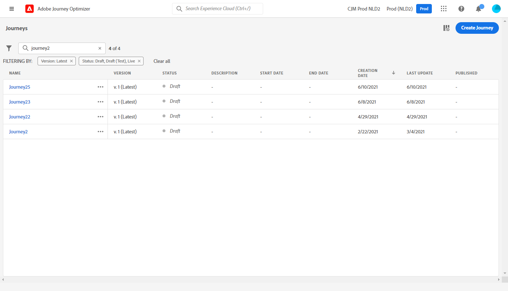

# Publicar a jornada {#publishing-the-journey}

>[!BEGINSHADEBOX]

**Nesta página:** saiba como publicar uma jornada para configurá-la em tempo real, incluindo pré-requisitos, processo de publicação, gerenciamento de versão e requisitos de republicação.

>[!ENDSHADEBOX]

A publicação de uma jornada a ativa: ela muda para o status **[!UICONTROL Live]**, torna-se disponível para entrada de novos perfis e alterna para o modo somente leitura. Não é possível publicar uma jornada que contém erros.

>[!NOTE]
>
>Ao salvar ou publicar uma jornada, o Journey Optimizer valida o tamanho total do conteúdo da jornada e pode avisar ou bloquear a publicação se você se aproximar ou exceder o limite. Saiba mais em [validação do tamanho da carga da Jornada](../start/guardrails.md#journey-payload-size).

➡️ [Conheça este recurso no vídeo](#video)

## Antes de publicar {#before-you-publish}

Antes de publicar, verifique se sua jornada atende aos seguintes pré-requisitos:

* **Nenhum erro de validação** — Não é possível publicar uma jornada que contenha erros. [Teste sua jornada](testing-the-journey.md) primeiro e [solucione quaisquer erros de atividade](../building-journeys/troubleshooting.md#activity-errors).
* **Permissão de publicação** — a publicação requer a permissão de alto nível **[!DNL Publish journeys]**. Saiba mais sobre [gerenciamento de direitos de acesso](../administration/permissions-overview.md).
* **Carga dentro do limite** — A carga da jornada deve estar dentro do limite configurado (4 MB por padrão). Consulte [validação do tamanho da carga da Jornada](../start/guardrails.md#journey-payload-size).
* **Aprovação obtida** — Se a sua jornada estiver sujeita a uma política de aprovação, solicite e obtenha aprovação antes de publicar. [Saiba mais](../test-approve/gs-approval.md).

>[!TIP]
>
>Antes de publicar, valide sua jornada usando uma das opções de teste disponíveis:
>
>* [Simulação](simulate-journey-gs.md) — teste com usuários simulados, sem usar perfis de teste persistentes no Adobe Experience Platform.
>* [Modo de teste](testing-the-journey.md) — teste com perfis persistentes sinalizados como perfis de teste no Adobe Experience Platform.
>* [Execução a seco](journey-dry-run.md) — teste com dados de produção reais, sem entrar em contato com os perfis.

## Processo de publicação {#journey-publication}

As etapas para publicar uma jornada são detalhadas abaixo:

1. Verifique se a jornada é válida e não apresenta erros, e se atende aos [pré-requisitos acima](#before-you-publish).

1. Para publicar a jornada, clique na opção **[!UICONTROL Publicar]**, localizada no menu suspenso no canto superior direito.

   >[!NOTE]
   >
   > Se sua jornada estiver sujeita a uma política de aprovação, será necessário solicitar aprovação para publicar sua jornada. [Saiba mais](../test-approve/gs-approval.md)

   

Quando a jornada é publicada, ela está no modo **somente leitura**. No modo somente leitura, você só pode modificar os rótulos e as descrições da atividade, o nome da jornada e a descrição da jornada. Se precisar fazer modificações adicionais em uma jornada publicada, crie [uma nova versão](journey-ui.md#journey-filter) da jornada.

### Jornada status {#journey-statuses}

Após a publicação, uma jornada passa por vários status:

* **[!UICONTROL Ao vivo]** — A jornada é publicada e os perfis podem inseri-la.
* **[!UICONTROL Fechado]** — Uma versão anterior que foi encerrada automaticamente quando uma nova versão foi publicada. Nenhuma entrada pode acontecer.
* **[!UICONTROL Concluído]** — A jornada foi concluída de acordo com seus critérios finais. Para obter a definição exata de quando uma jornada é considerada concluída, consulte [Como o jornada termina](end-journey.md#journey-finished-definition).

### Parar uma jornada {#stop-journey}

Quando você interrompe uma jornada, ela é interrompida permanentemente. Todos os indivíduos que fluem pela jornada são permanentemente interrompidos e a jornada para de permitir novas entradas. Se precisar executar a jornada novamente, duplique-a e publique a nova jornada. Para obter mais informações sobre como as jornadas terminam, consulte [Como as jornadas terminam](end-journey.md).

### Requisitos de republicação {#republishing}

Em alguns casos, é necessário republicar uma jornada para que as alterações ou os ativos permaneçam em vigor:

>[!IMPORTANT]
>
>* Se forem feitas alterações em uma decisão de oferta usada na mensagem de uma jornada, será necessário desfazer a publicação da jornada e republicá-la. Isso garante que as alterações sejam incorporadas à mensagem da jornada e que ela seja consistente com as atualizações mais recentes.
>
>* O Assets/Images pode ser acessado em conteúdo entregue por até 2 anos (730 dias) desde sua primeira publicação em qualquer fragmento/mensagem em linha. A republicação é necessária após esse período de expiração (a qualquer momento após 730 dias) para mantê-las acessíveis por mais 2 anos. Qualquer republicação feita dentro de 730 dias da primeira publicação não estenderá a expiração de ativos/imagens para os próximos 730 dias.

## Versões de jornada {#journey-versions}

Na lista da jornada, todas as versões da jornada são exibidas com o número da versão. Quando você pesquisa uma jornada, as versões mais recentes são exibidas na parte superior da lista na primeira vez que o aplicativo é aberto. Em seguida, você pode definir a classificação desejada e o aplicativo a manterá como uma preferência de usuário. A versão da jornada também é exibida na parte superior da interface de edição da jornada, acima da tela.

>[!NOTE]
>
>Normalmente, um perfil não pode estar presente várias vezes na mesma jornada, ao mesmo tempo, para todas as versões ativas da jornada. Se a reentrada estiver habilitada, um perfil poderá ser inserido em uma jornada novamente, mas não poderá fazer isso até que tenha saído totalmente da instância anterior da jornada. [Leia mais](entry-management.md).

### Criar uma nova versão de uma jornada {#journey-create-new-version}

Se precisar modificar para uma jornada em tempo real, crie uma nova versão da jornada. Para criar uma nova versão de uma jornada existente, siga as etapas abaixo:

1. Abra a versão mais recente da jornada ativa, clique em **[!UICONTROL Criar uma nova versão]** e confirme.

   

   >[!NOTE]
   >
   >Só é possível criar uma nova versão com base na versão mais recente de uma jornada.

1. Faça as modificações, clique em **[!UICONTROL Publicar]** e confirme.

A partir do momento em que a jornada for publicada, pessoas físicas começarão a acessar a versão mais recente da jornada. As pessoas que já acessaram uma versão anterior permanecerão nela até que concluam a jornada. Se mais tarde entrarem novamente na mesma jornada, a versão mais recente será acessada.

As versões da jornada podem ser interrompidas individualmente. Todas as versões das jornadas possuem o mesmo nome.

Ao publicar uma nova versão de uma jornada, a versão anterior encerra automaticamente e alterna para o status **Fechado**. Nenhuma entrada na jornada pode acontecer. Mesmo que você interrompa a versão mais recente, a versão anterior permanecerá fechada.

>[!NOTE]
>
>Medidas de proteção e limitações específicas se aplicam ao controle de versão das jornadas. Saiba mais [nesta página](../start/guardrails.md#journey-versions-g).

## Perguntas frequentes {#faq}

**Por que não posso publicar minha jornada?**

O motivo mais comum é que a jornada contém erros de validação — não é possível publicar uma jornada com erros. Outros bloqueadores incluem exceder o [limite de tamanho de carga](../start/guardrails.md#journey-payload-size), permissão **[!DNL Publish journeys]** ausente ou uma [aprovação](../test-approve/gs-approval.md) pendente. Consulte [Antes de publicar](#before-you-publish) e [solucionar erros de atividade](../building-journeys/troubleshooting.md#activity-errors).

**É possível editar uma jornada após sua publicação?**

Uma jornada publicada está no modo somente leitura. Você só pode alterar os rótulos e as descrições da atividade, o nome da jornada e a descrição da jornada. Para qualquer outra alteração, [crie uma nova versão](#journey-create-new-version) da jornada.

**O que acontece com os perfis que já estão na jornada quando eu publicar uma nova versão?**

Novos perfis fluem para a versão mais recente. Os perfis que já estão em uma versão anterior ficam lá até que sejam concluídos; se forem inseridos novamente mais tarde, eles entrarão na versão mais recente. A versão anterior alterna automaticamente para **[!UICONTROL Fechada]** e não aceita novas entradas. Consulte [versões do Jornada](#journey-versions).

**Como executar novamente uma jornada interrompida?**

Interromper uma jornada é permanente. Para executá-la novamente, duplique-a e publique a nova jornada. Consulte [Parar uma jornada](#stop-journey).

**Preciso republicar depois de alterar uma decisão de oferta ou atualizar os ativos?**

Sim. Se você alterar uma decisão de oferta usada na mensagem de uma jornada, desfaça a publicação e republique a jornada para que a alteração seja aplicada. O Assets e as imagens expiram 730 dias após a primeira publicação; republique após esse período para mantê-las acessíveis. Consulte [Republicação de requisitos](#republishing).

**Posso publicar uma jornada que exija aprovação?**

Se a jornada estiver sujeita a uma política de aprovação, será necessário solicitar aprovação antes de publicar. [Saiba mais sobre aprovação](../test-approve/gs-approval.md).

## Tópicos relacionados {#related-topics}

* [Testar sua jornada](testing-the-journey.md) - Valide sua jornada com perfis de teste antes de publicar
* [Simulação de Jornada](simulate-journey-gs.md) - Valide sua jornada com usuários simulados antes de publicar
* [Jornada execução seca](journey-dry-run.md) - Testar com dados de produção reais sem contatar perfis
* [Solução de problemas](../building-journeys/troubleshooting.md#activity-errors) - Resolver erros de atividade e publicação
* [Como o jornada termina](end-journey.md#journey-finished-definition) - Entender a conclusão e os status da jornada
* [Gerenciamento de entrada de perfil](entry-management.md) - Configure como os perfis entram e entram novamente nas jornadas
* [medidas de proteção e limitações de Jornada](../start/guardrails.md#journeys-guardrails-journeys) - Revise as medidas de proteção de publicação e controle de versão

## Vídeo tutorial {#video}

Saiba como publicar uma jornada neste vídeo:

>[!VIDEO](https://video.tv.adobe.com/v/3424998?quality=12)

+++ Referência de conhecimento de IA

Esta seção contém conhecimento estruturado destinado a oferecer suporte à interpretação, recuperação e resposta a perguntas relacionadas a este tópico.

Para uma compreensão completa, essas informações devem ser combinadas com a documentação desta página. Nenhuma das origens deve ser independente; a página descreve o recurso, enquanto esta seção fornece um contexto adicional que ajuda a desfazer a ambiguidade da terminologia, intenção, aplicabilidade e restrições.

* **TL;DR:** Esta página explica como publicar uma jornada do Adobe Journey Optimizer, gerenciar versões de jornadas e entender as restrições que se aplicam quando uma jornada está ativa.

**Intenções:**
* Publicar uma jornada para ativá-la e disponibilizá-la para entrada de perfil
* Verifique a validade da jornada e resolva os erros antes de publicar
* Criar uma nova versão de uma jornada em tempo real para fazer modificações
* Entender as restrições de somente leitura que se aplicam após a publicação de uma jornada
* Interromper uma jornada permanentemente ou gerenciar transições entre versões

**Glossário:**
* **Versão da Jornada**: uma iteração numerada de uma jornada; novas versões são criadas para modificar uma jornada em tempo real sem interromper perfis que já estão em andamento *(específico do produto)*
* **Status fechado**: o estado em que uma versão anterior do jornada entra automaticamente quando uma nova versão é publicada; nenhum perfil novo pode inserir uma jornada Fechada *(específico do produto)*
* **Política de aprovação**: um fluxo de trabalho de governança opcional que requer aprovação explícita antes que uma jornada possa ser publicada *(específico do produto)*

**Medidas de Proteção:**
* Uma jornada com erros não pode ser publicada.
* O Journey Optimizer valida o tamanho total do conteúdo da jornada no momento de salvar e publicar. A publicação pode ser bloqueada se o limite for excedido.
* Após a publicação, uma jornada fica no modo somente leitura; somente rótulos, descrições e o nome da jornada podem ser editados.
* Uma nova versão só pode ser criada a partir da versão mais recente de uma jornada.
* Quando uma jornada é interrompida, ela é interrompida permanentemente; ela deve ser duplicada para ser executada novamente.
* O Assets e as imagens no conteúdo entregue ficam acessíveis por até 730 dias a partir da primeira publicação; a republicação é necessária após esse período.
* Se uma decisão de oferta usada em uma mensagem de jornada for alterada, a publicação da jornada deverá ser desfeita e republicada.
* As medidas de proteção específicas se aplicam ao controle de versão do jornada (consulte a página de medidas de proteção).

**Terminologia:**
* Nome canônico: Publicar Jornada — Acrônimo: none — variantes: ativar jornada, entrar em funcionamento
* Sinônimos: &quot;Publish&quot; = &quot;ativate&quot; = &quot;go live&quot;
* Não confundir: Parar (paragem de emergência de todos os perfis) ≠ Fechar para novas entradas (fechamento normal manual; acabamento de perfis existentes) ≠ Status Closed (automático quando uma nova versão é publicada ou depois de fechar manualmente para novas entradas)

**Perguntas frequentes:**
* **P: Posso editar uma jornada após sua publicação?** — Somente rótulos, descrições e o nome da jornada podem ser alterados. Para fazer outras modificações, crie uma nova versão da jornada.
* **P: O que acontece com os perfis em uma versão mais antiga do jornada quando uma nova versão é publicada?** — Os perfis já existentes na versão anterior permanecem lá até que sejam concluídos; novos perfis entram na versão mais recente.
* **P: Posso republicar uma versão do Closed jornada?** — Não. Quando uma versão anterior estiver fechada, ela permanecerá fechada mesmo se a versão mais recente estiver interrompida.
* **P: O que devo fazer se uma decisão de oferta usada na jornada for alterada?** — Desfaça a publicação da jornada e publique-a novamente para incorporar a decisão de oferta atualizada.
* **P: É necessária aprovação antes da publicação?** — Somente se sua jornada estiver sujeita a uma política de aprovação; nesse caso, você deve solicitar aprovação primeiro.

+++
