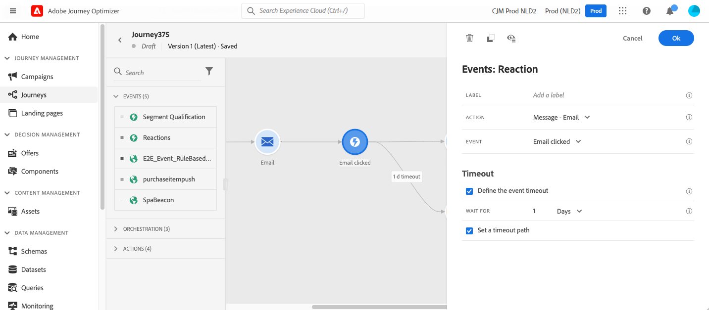

# Eventos de reação {#reaction-events}

>[!CONTEXTUALHELP]
>id="ajo_journey_event_reaction"
>title="Eventos de reação"
>abstract="Essa atividade permite reagir a dados de rastreamento relacionados a uma mensagem enviada na mesma jornada. Capturamos essas informações em tempo real no momento em que são compartilhadas com a [!DNL Adobe Experience Platform]."

## Visão geral {#overview}

Entre as diferentes atividades de evento disponíveis na paleta, você encontrará o evento **[!UICONTROL Reações]** interno. Essa atividade permite reagir a dados de rastreamento relacionados a uma mensagem enviada na mesma jornada. Capturamos essas informações em tempo real no momento em que são compartilhadas com a [!DNL Adobe Experience Platform].

Você pode reagir a mensagens clicadas ou abertas. Por exemplo, você pode enviar outra mensagem se um indivíduo tiver aberto o email anterior ou clicado nele, ou enviar uma mensagem de acompanhamento diferente se ele não interagiu com a sua comunicação.

Consulte [Atividades de ação](../building-journeys/about-journey-activities.md#action-activities).

Você pode usar a atividade **[!UICONTROL Reação]** para executar uma ação quando não houver reação às suas mensagens. Para fazer isso, crie um segundo caminho paralelo à atividade **[!UICONTROL Reaction]** e adicione uma atividade **[!UICONTROL Wait]**. Se não houver reação durante o período definido na atividade **[!UICONTROL Wait]**, o segundo caminho será escolhido. Você pode optar por enviar, por exemplo, uma mensagem de acompanhamento.

## Como configurar eventos de reação {#configure}

Siga estas etapas para configurar os eventos de reação:

1. Coloque uma atividade **[!UICONTROL Reação]** **imediatamente** após uma [atividade de ação de canal](journey-action.md) na tela de jornada.
1. Adicione um **[!UICONTROL Rótulo]** à reação. Esta etapa é opcional.
1. Na lista suspensa, selecione a atividade de ação à qual deseja reagir. Você pode selecionar qualquer atividade de ação posicionada nas etapas anteriores do caminho.
1. Dependendo da ação selecionada, escolha a que deseja reagir.
1. Você pode definir um tempo limite de evento (entre 40 segundos e 90 dias) e um caminho de tempo limite. Isso cria um segundo caminho para indivíduos que não reagiram dentro da duração definida. Ao testar uma jornada que usa um evento de reação, o padrão do modo de teste **[!UICONTROL Tempo de espera]** e o valor mínimo é de 40 segundos. Consulte [esta seção](../building-journeys/testing-the-journey.md).

## Medidas de proteção e limitações {#guardrails-limitations}

* Uma atividade **[!UICONTROL Reação]** deve ser colocada **imediatamente** após uma [atividade de ação de canal](journey-action.md) na tela de jornada.
* Você não pode usar uma atividade **[!UICONTROL Reação]** se não houver uma atividade de ação de canal antes dela.
* Não há suporte para a colocação de uma atividade **[!UICONTROL Wait]** ou qualquer outra atividade entre a ação de canal e a atividade **[!UICONTROL Reaction]** e pode fazer com que a Reação não funcione conforme esperado.
* Os eventos de reação só podem rastrear mensagens enviadas na mesma jornada. Eles não podem rastrear mensagens que ocorrem em uma jornada diferente.
* Os eventos de reação rastreiam cliques em links do tipo &quot;rastreado&quot;. Links de unsubscription e mirror pages não são considerados.
* As aberturas de email são rastreadas usando uma imagem de 0 pixel incluída no email. Se os clientes de email (como o Gmail) bloquearem imagens, as aberturas de email não serão consideradas.
