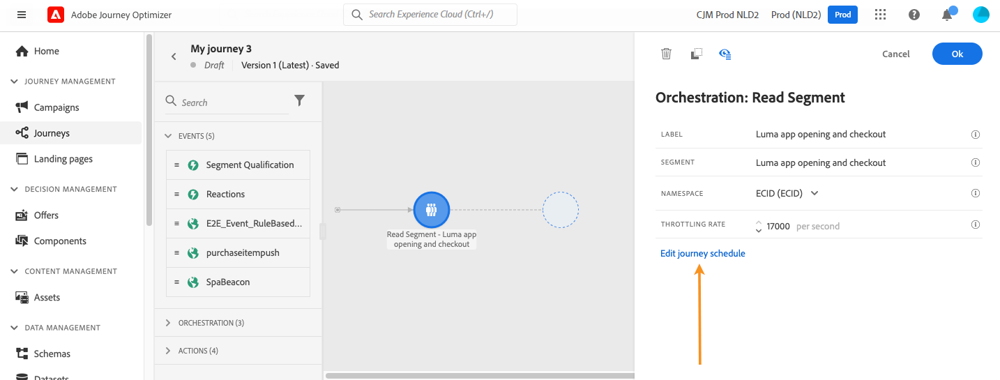
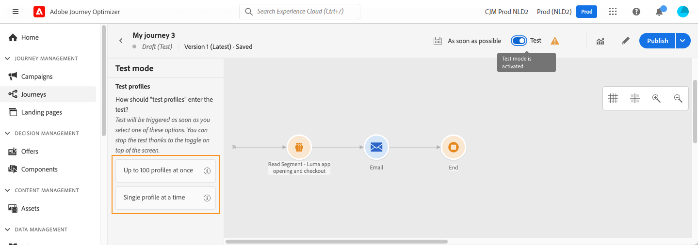
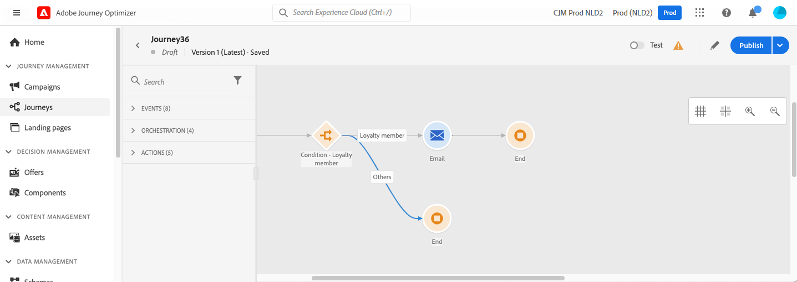

# Usar um público em uma jornada {#segment-trigger-activity}

>[!BEGINSHADEBOX]

**Nesta página:** saiba como configurar a atividade Ler público-alvo para trazer perfis de um público-alvo da Adobe Experience Platform para uma jornada, sob demanda ou de acordo com um agendamento, e personalizar o caminho de cada perfil.

>[!ENDSHADEBOX]

Use a atividade Ler público-alvo para iniciar jornadas com públicos-alvo definidos. Você escolhe a audiência e quando ela é executada; em seguida, usa [condições](#audience-targeting-in-journeys), temporizadores e ações para personalizar o caminho de cada perfil.

## Sobre a Atividade ler público-alvo {#about-segment-trigger-activity}

>[!CONTEXTUALHELP]
>id="ajo_journey_read_segment"
>title="Atividade Ler público-alvo"
>abstract="Adicione todos os perfis qualificados de um público-alvo [!DNL Adobe Experience Platform] selecionado a esta jornada. Executa uma vez ou de acordo com uma programação."

A atividade **Ler Público** é a atividade de ponto de entrada de jornada que adiciona todos os perfis de um público-alvo [!DNL Adobe Experience Platform] selecionado a uma jornada. Você pode executar a entrada uma vez ou de acordo com uma programação recorrente. Nas APIs e referências técnicas, essa atividade também é chamada de acionador de segmento ou entrada de jornada baseada no público-alvo.

**Quando usar a Leitura de Público vs. a Qualificação de Público**

| Usar **Público-alvo de leitura** quando | Usar **[Qualificação de público-alvo](audience-qualification-events.md)** quando |
|----------------------------|-----------------------------------------------------------------------|
| Você deseja executar uma jornada uma vez ou em um agendamento (lote). | Os perfis precisam ser inseridos na jornada em tempo real à medida que se qualificam. |
| Seu público é avaliado em lote (por exemplo, instantâneo diário). | Seu público-alvo é de transmissão ou baseado em eventos. |
| Você pode aceitar um atraso entre a avaliação do público-alvo e a entrada da jornada. | Você precisa de uma entrada imediata quando um perfil se qualifica. |

>[!TIP]
>
>**Exemplos reais**
>* **Informativo semanal** → Ler público. Seu público-alvo é um instantâneo diário em lote. Você agenda a jornada todas as segundas-feiras às 9 horas. Todos os perfis qualificados são inseridos juntos.
>* **Atualização da camada de fidelidade** → Qualificação do público-alvo. Assim que um perfil atinge o status Gold em um público-alvo de transmissão, ele entra na jornada imediatamente para receber um email de parabéns.
>* **Série de reengajamento** → Ler público. Você executa uma jornada recorrente a cada 30 dias, direcionando perfis inativos por mais de 90 dias.

**Limites de chave:** um público-alvo de leitura por jornada (deve ser a primeira atividade); um público-alvo por atividade; até cinco execuções simultâneas de público-alvo de leitura por organização; 20.000 perfis por segundo por sandbox; tempo limite de trabalho de 12 horas. Detalhes completos em [Medidas de proteção e limitações](../start/guardrails.md#read-segment-g).

**Pré-requisitos:** um público-alvo de [!DNL Adobe Experience Platform] que é compilado e avaliado (status realizado), um namespace de identidade baseado em pessoas selecionado para a jornada e, para execuções recorrentes, que entende os [limites de agendamento e taxa de transferência](../start/guardrails.md#read-segment-g).

Por exemplo, o público-alvo `Luma app opening and checkout` criado no caso de uso [Criar públicos-alvo](../audience/about-audiences.md) pode ser usado como ponto de entrada. Todos os perfis qualificados entram na jornada e avançam por caminhos individualizados usando condições, temporizadores, eventos e ações.

➡️ [Conheça este recurso no vídeo](#video)

>[!CAUTION]
>
>* Antes de usar a atividade Ler público, [leia as Medidas de Proteção e as Limitações](#must-read).

## Configure a atividade {#configuring-segment-trigger-activity}

Você definirá: **Público** (obrigatório), **Namespace** (obrigatório), **Taxa de leitura** (obrigatório, padrão 5.000/s) e **Agendamento** (quando a jornada for executada). Opcionalmente, adicione um **Rótulo** e **Identificador complementar**. As etapas abaixo orientam você em cada configuração.

### Adicione atividade e selecione o público-alvo {#add-activity-and-select-audience}

>[!CONTEXTUALHELP]
>id="ajo_journey_read_segment_label"
>title="Rótulo"
>abstract="Um rótulo opcional para identificar a atividade nos relatórios e logs do modo de teste."

>[!CONTEXTUALHELP]
>id="ajo_journey_read_segment_audience"
>title="Público-alvo"
>abstract="O público-alvo [!DNL Adobe Experience Platform] cujos perfis devem entrar nesta jornada. Todos os perfis qualificados são lidos. Os públicos-alvo em lote são recomendados para contagens confiáveis e consistentes, e somente um público-alvo pode ser lido por atividade."

>[!CONTEXTUALHELP]
>id="ajo_journey_read_segment_namespace"
>title="Namespace"
>abstract="A identidade (por exemplo, email, ECID) usada para identificar as pessoas que entram na jornada. Somente namespaces com base em pessoas estão disponíveis. Os perfis que não têm essa identidade não podem entrar. Por padrão, o campo é pré-preenchido com o último namespace usado."

1. Expanda a categoria **[!UICONTROL Orquestração]** e solte uma atividade **[!UICONTROL Ler público]** na tela.

   A atividade deve ser posicionada como a primeira etapa de uma jornada.

1. Adicione um **[!UICONTROL Rótulo]** à atividade (opcional). Um rótulo opcional ajuda a identificar a atividade nos relatórios e logs do modo de teste.

1. No campo **[!UICONTROL Público-alvo]**, escolha o público-alvo [!DNL Adobe Experience Platform] que inserirá a jornada e clique em **[!UICONTROL Salvar]**. Você pode selecionar qualquer [!DNL Adobe Experience Platform] público-alvo gerado usando [definições de segmento](../audience/creating-a-segment-definition.md).

   >[!NOTE]
   >
   >Além disso, você pode direcionar [!DNL Adobe Experience Platform] públicos-alvo criados usando [composições de público-alvo](../audience/get-started-audience-orchestration.md).
   >Você também pode direcionar públicos-alvo [carregados de um arquivo CSV](https://experienceleague.adobe.com/docs/experience-platform/segmentation/ui/overview.html#import-audience){target="_blank"}.
   >[Saiba mais sobre como gerar e direcionar públicos no Journey Optimizer](../audience/about-audiences.md).

   Observe que é possível personalizar as colunas exibidas na lista e classificá-las.

   ![Interface de seleção de público-alvo mostrando os [!DNL Adobe Experience Platform] públicos-alvo](assets/read-segment-selection.png) disponíveis

   Depois que o público-alvo é adicionado, o botão **[!UICONTROL Copiar]** permite copiar seu nome e ID:

   `{"name":"Luma app opening and checkout","id":"8597c5dc-70e3-4b05-8fb9-7e938f5c07a3"}`

   

   >[!NOTE]
   >
   >Somente os indivíduos com o status de participação de público **Realizado** entrarão na jornada. Para obter mais informações sobre como avaliar um público, consulte a [documentação do Serviço de segmentação](https://experienceleague.adobe.com/docs/experience-platform/segmentation/tutorials/evaluate-a-segment.html#interpret-segment-results){target="_blank"}.

1. No campo **[!UICONTROL Namespace]**, escolha o namespace a ser usado para identificar os indivíduos. Por padrão, o campo é pré-preenchido com o último namespace usado. [Saiba mais sobre namespaces](../event/about-creating.md#select-the-namespace).

   >[!NOTE]
   >
   >Os indivíduos pertencentes a um público-alvo que não tem a identidade (namespace) selecionada entre suas diferentes identidades não podem entrar na jornada. Você só pode selecionar um namespace de identidade com base em pessoas. Se você tiver definido um namespace para uma tabela de pesquisa (por exemplo: namespace ProductID para uma pesquisa de Produto), ele não estará disponível na lista suspensa **Namespace**.

### Identificador complementar {#read-audience-supplemental-id}

Opcionalmente, você pode habilitar **Usar um identificador complementar** para executar a jornada no contexto de um identificador secundário (por exemplo, uma ID de pedido ou de reserva) além da ID de perfil. Isso permite várias entradas do mesmo perfil quando o identificador complementar é diferente.

[Saiba como usar identificadores complementares no jornada](supplemental-identifier.md). Para jornadas de Leitura de público, o identificador complementar é preparado a partir do **esquema de união/perfil** para **públicos-alvo do Unified Profile Service**, ou selecionado a partir de atributos qualificados em **públicos-alvo externos** (por exemplo, públicos-alvo [importados de um arquivo CSV](https://experienceleague.adobe.com/docs/experience-platform/segmentation/ui/overview.html#import-audience){target="_blank"} ou resultantes de [fluxos de trabalho de composição](../audience/get-started-audience-orchestration.md)). A taxa de leitura é limitada a 500 perfis por segundo por instância do jornada quando a ID complementar é usada.

### Medidas de proteção e recomendações {#must-read}

Todas as medidas de proteção e limitações para a atividade **Ler público-alvo** (simultaneidade, taxa de transferência, um público-alvo por atividade, tempo limite do trabalho, tentativas e muito mais) estão listadas em [Medidas de proteção e limitações](../start/guardrails.md#read-segment-g).

**Recomendações**

* Como prática recomendada, use públicos em lote em uma atividade **Ler público** para contagens confiáveis e consistentes. O público-alvo de leitura foi projetado para casos de uso em lote. Se o seu caso de uso precisar de dados em tempo real, use a atividade [Qualificação de público-alvo](audience-qualification-events.md).
* Os públicos-alvo [importados de um arquivo CSV](https://experienceleague.adobe.com/docs/experience-platform/segmentation/ui/overview.html#import-audience) ou resultantes de [fluxos de trabalho de composição](../audience/get-started-audience-orchestration.md) podem ser selecionados na atividade **Ler Público**. Estes públicos-alvo não estão disponíveis na atividade **Qualificação de público-alvo**.
* Para obter informações sobre o tempo de instantâneo do público-alvo, as janelas de conclusão de segmentação em lote e como garantir que sua jornada sempre seja executada nos dados mais recentes, consulte [Tempo e propagação de dados](#timing-and-data-propagation). Para jornadas recorrentes, habilite a opção **[!UICONTROL Acionar após a avaliação de público-alvo em lote]** para atrasar automaticamente a execução até que o instantâneo de público-alvo mais recente esteja pronto. [Saiba mais](#schedule).

>[!CAUTION]
>
>As [Medidas de proteção para dados e segmentação de Perfil do cliente em tempo real](https://experienceleague.adobe.com/docs/experience-platform/profile/guardrails.html?lang=pt-BR){target="_blank"} também se aplicam a [!DNL Adobe Journey Optimizer].

**Próximo:** Defina a [taxa de leitura](#profile-entry-and-reading-rate) e a [programação](#schedule), depois [testar e publicar](#testing-publishing).

### Entrada de perfil e taxa de leitura {#profile-entry-and-reading-rate}

>[!CONTEXTUALHELP]
>id="ajo_journey_read_segment_reading_rate"
>title="Taxa de leitura"
>abstract="O máximo de perfis que entram na jornada por segundo (500–20.000). O padrão é 5.000."

Defina a **[!UICONTROL Taxa de leitura]** (obrigatório). Esse é o número máximo de perfis que podem entrar na jornada por segundo. Essa taxa se aplica somente a essa atividade e nenhuma outra na jornada. Se você deseja definir uma taxa de limitação em ações personalizadas, por exemplo, é necessário usar a API de limitação. Consulte esta [página](../configuration/throttling.md).

Esse valor é armazenado na carga da versão do jornada. O valor padrão é de 5.000 perfis por segundo. Você pode modificar esse valor de 500 para 20.000 perfis por segundo.

>[!NOTE]
>
>A taxa de leitura geral por sandbox está definida como 20.000 perfis por segundo. Portanto, a taxa de leitura de todos os públicos-alvo de leitura executados simultaneamente na mesma sandbox totaliza no máximo 20.000 perfis por segundo. Não é possível modificar esse limite. Saiba mais sobre taxas de processamento e taxa de transferência do jornada em [esta seção](entry-management.md#journey-processing-rate).

### Agendar a jornada {#schedule}

>[!CONTEXTUALHELP]
>id="ajo_journey_read_segment_scheduler_start_date"
>title="Data/hora inicial"
>abstract="A data e a hora em que a jornada começa a ler o público-alvo e em que os perfis começam a entrar. Combine-a com as opções de recorrência abaixo para programar execuções recorrentes."

>[!CONTEXTUALHELP]
>id="ajo_journey_read_segment_scheduler_repeat_until"
>title="Repetir até"
>abstract="A data em que as execuções recorrentes param. Após essa data, a jornada não lê mais o público-alvo ou admite novos perfis."

>[!CONTEXTUALHELP]
>id="ajo_journey_read_segment_scheduler_repeat_every"
>title="Repetir a cada"
>abstract="A frequência com que a jornada relê o público-alvo e é executada novamente. Por exemplo, diariamente ou semanalmente. Determina o intervalo de recorrência entre execuções até que a data Repetir até seja atingida."

>[!CONTEXTUALHELP]
>id="ajo_journey_read_segment_scheduler_incremental_read"
>title="Leitura incremental"
>abstract="Após a primeira execução, só entram na jornada os novos perfis adicionados ao público-alvo."

>[!CONTEXTUALHELP]
>id="ajo_journey_read_segment_scheduler_force_reentrance"
>title="Forçar reentrada"
>abstract="Apaga todos os participantes da jornada antes da leitura de cada novo público-alvo. Dessa forma, cada execução começa de novo e os perfis podem ser reinseridos em cada ocorrência."

>[!CONTEXTUALHELP]
>id="ajo_journey_read_segment_scheduler_synchronize_audience"
>title="Acionar após a avaliação do público-alvo em lote"
>abstract="Atrasa cada execução até que o público-alvo em lote seja avaliado novamente, para que a jornada leia o instantâneo do público-alvo mais atualizado em vez dos dados desatualizados. Recomendado para jornadas recorrentes que dependem dos resultados da segmentação mais recentes."

>[!CONTEXTUALHELP]
>id="ajo_journey_read_segment_scheduler_synchronize_audience_wait_time"
>title="Tempo de espera para a nova avaliação do público-alvo"
>abstract="O tempo que a jornada aguarda pelos novos dados do público-alvo (1 a 6 horas, em minutos ou horas)."

Por padrão, as jornadas são configuradas para serem executadas uma vez. Para definir uma data/hora e uma frequência específicas na qual a jornada deve ser executada, siga as etapas abaixo.

>[!NOTE]
>
>**Status da Jornada e o tempo limite global de 91 dias:**
>
>* **Não recorrente** jornadas de leitura de público fazem a transição automática para o status **Parado** quando o último perfil ativo sai, a menos que a jornada inclua nós que causem períodos de espera (nós de espera, nós de reação ou transições acionadas por eventos); nesse caso, o [tempo limite global de 91 dias](journey-properties.md#global_timeout) padrão se aplica. [Saiba mais](end-journey.md#auto-stop-non-recurring)
>* **jornadas de leitura de público-alvo** recorrentes **permanecem online** enquanto a jornada for publicada. Eles são movidos para o status **Concluído** 91 dias após a execução de sua **última ocorrência**.
>* O tempo limite de 91 dias se aplica a **perfis** individuais que fluem pela jornada (tempo máximo que um perfil pode permanecer ativo), não ao status Live da jornada.
>* A **janela de relatórios** de 91 dias é um conceito separado: a interface do usuário mostra dados de desempenho referentes aproximadamente aos últimos 91 dias. Os dados mais antigos não estão acessíveis na interface do usuário, mas a jornada continua a ser executada. [Saiba mais](journey-properties.md#global_timeout)

1. Nas propriedades da atividade **[!UICONTROL Ler público]**, selecione **[!UICONTROL Editar agendamento de jornada]**.

   

1. As propriedades da jornada são exibidas. Na lista suspensa **[!UICONTROL Tipo de agendador]**, selecione a frequência com que deseja executar a jornada.

   

Para jornadas recorrentes, opções específicas estão disponíveis para ajudar você a gerenciar a entrada de perfis na jornada. Expanda as seções abaixo para obter mais informações sobre cada opção.

>[!NOTE]
>
>**Como os instantâneos de público-alvo são usados**
>
>Cada execução de Read Audience usa a associação de público-alvo disponível no momento em que a execução é executada. Para públicos-alvo em lote, [!DNL Journey Optimizer] lê o último instantâneo de público-alvo em lote disponível. Ela não recalcula o público-alvo em tempo real quando a jornada é iniciada.
>
>Para jornadas recorrentes, cada ocorrência usa o instantâneo disponível para essa ocorrência. Se você quiser que a jornada aguarde a última avaliação de público-alvo em lote antes de ser executada, habilite o **[!UICONTROL Acionar após a avaliação de público-alvo em lote]**.

+++**[!UICONTROL Leitura incremental]**

Quando uma jornada com um **Público-alvo de leitura** recorrente é executada pela primeira vez, todos os perfis do público-alvo entram na jornada. Essa opção permite direcionar, após a primeira ocorrência, somente os indivíduos que entraram no público-alvo desde a última execução da jornada.

Ao usar esta opção, o sistema retroage **24 horas** a partir do último trabalho de avaliação de público executado pelo serviço de segmentação do [!DNL Adobe Experience Platform].

Após a conclusão da segmentação, é iniciado um trabalho de exportação de instantâneo de perfil, o que permite que o Journey Optimizer detecte e processe novos perfis. Se a jornada estiver agendada entre esses dois trabalhos, a leitura incremental não coletará perfis que se tornaram membros do público-alvo desde a última execução da jornada.

Para minimizar o risco de perfis ausentes:
* Habilite a opção **[!UICONTROL Acionar após avaliação de público-alvo em lote]** para estender o período de retrospectiva até o momento da última execução bem-sucedida da jornada, independentemente de há quanto tempo ela ocorreu
* Agendar jornadas para serem executadas bem após a conclusão diária de trabalhos de segmentação em lote (normalmente de 2 a 3 horas de buffer)
* Para casos de uso críticos que exigem inclusão imediata de perfil, considere usar atividades de [Qualificação de público-alvo](audience-qualification-events.md) com públicos-alvo de streaming

>[!CAUTION]
>
>Hoje, não há suporte funcional para [audiences de upload personalizado](../audience/custom-upload.md) (upload de CSV) e outros públicos externos (por exemplo, Federated Audience Composition), **[!UICONTROL Leitura incremental]**. Em cada recorrência, o **público-alvo inteiro** é processado, independentemente da configuração de alternância de leitura incremental.
>
>Para controlar entradas recorrentes, use [Forçar reentrada na recorrência](#schedule).

+++

+++**[!UICONTROL Forçar reentrada na recorrência]**

Essa opção permite fazer com que todos os perfis ainda presentes na jornada saiam automaticamente na próxima execução.

Por exemplo, se você tiver uma espera de dois dias em uma jornada recorrente diária, a ativação dessa opção moverá os perfis para a próxima execução da jornada. Isso acontece no dia seguinte, independentemente de estarem ou não no próximo público-alvo de execução.

Se a duração dos perfis nesta jornada for maior que a frequência de recorrência, não ative essa opção para garantir que os perfis possam concluir a jornada.

+++

+++**Como a [!UICONTROL Leitura incremental] e a [!UICONTROL Reentrada forçada na recorrência] trabalham juntas**

Essas duas opções controlam partes diferentes da execução da jornada:

* **[!UICONTROL Leitura incremental]** controla **quais perfis são selecionados do público-alvo** para a próxima execução recorrente.
* **[!UICONTROL Forçar a reentrada na recorrência]** controla **o que acontece com os perfis que ainda estão ativos na jornada** quando a próxima execução recorrente começa.

Use a tabela abaixo para entender o comportamento combinado na próxima execução.

| [!UICONTROL Leitura incremental] | [!UICONTROL Forçar reentrada na recorrência] | Comportamento na próxima execução |
| ------------------------------ | ------------------------------------------- | ------------------------ |
| Desligado | Desligado | [!DNL Journey Optimizer] lê todo o público dessa execução. Os perfis que ainda estão ativos na jornada não são redefinidos automaticamente. |
| Em | Desligado | [!DNL Journey Optimizer] lê somente os perfis que foram adicionados ao público desde a última execução. Os perfis que ainda estão ativos na jornada não são redefinidos automaticamente. |
| Desligado | Em | [!DNL Journey Optimizer] remove os participantes ativos da execução de jornada atual antes de iniciar a próxima execução e lê o público completo novamente. Isso permite que os perfis sejam iniciados novamente na nova ocorrência. |
| Em | Em | [!DNL Journey Optimizer] remove os participantes ativos da execução de jornada atual antes de iniciar a próxima execução e lê somente os perfis que foram adicionados ao público desde a última execução. Forçar a reentrada redefine a participação ativa da jornada, mas a leitura incremental ainda limita a seleção a membros do público recém-adicionado. |

Em outras palavras, a **[!UICONTROL Reentrada forçada na recorrência] não desabilita a [!UICONTROL Leitura incremental]**. Se ambas as opções estiverem ativadas, os perfis serão removidos da instância ativa do jornada antes que a próxima ocorrência comece, mas a próxima ocorrência ainda selecionará somente os membros do público-alvo considerados novos desde a última execução.

>[!IMPORTANT]
>
>Um perfil removido por **[!UICONTROL Forçar reentrada na recorrência]** não é tratado automaticamente como um novo membro do público-alvo para **[!UICONTROL Leitura incremental]**. A seleção de público-alvo ainda depende de o perfil ter sido adicionado recentemente ao público-alvo desde a última execução.

+++

+++**[!UICONTROL Acionar após a avaliação de público-alvo em lotes]**

Para jornadas agendadas diariamente e públicos-alvo em lote de direcionamento, é possível definir uma janela de tempo de até 6 horas para a jornada aguardar os novos dados do público-alvo de trabalhos de segmentação em lote. Se o trabalho de segmentação for concluído dentro da janela de tempo, a jornada será acionada. Caso contrário, ela ignorará a jornada até sua próxima ocorrência. Essa opção garante que as jornadas sejam executadas com dados de público-alvo precisos e atualizados.

Por exemplo, se uma jornada estiver programada para 18h por dia, você poderá especificar um número de minutos ou horas de espera antes da execução da jornada. Quando a jornada acorda às 18h, ela verifica se há um público-alvo novo, ou seja, um público mais recente do que o usado na execução anterior da jornada. Durante a janela de tempo especificada, a jornada será executada imediatamente após a detecção do novo público-alvo. Se nenhum público novo for detectado, a execução da jornada será ignorada para esse dia.

+++

<!--
### Segment filters {#segment-filters}

[!CONTEXTUALHELP]
>id="jo_segment_filters"
>title="About segment filters"
>abstract="This option targets only the individuals who entered or exited a specific segment during a specific time window. For example, it can retrieve only the customers who entered the VIP segment since last week."

You can choose to target only the individuals who entered or exited a specific segment during a specific time window. For example, you can decide to only retrieve all the customers who entered the VIP segment since last week. Only the new VIP customers will be targeted. All the customers who were already part of the VIP segment before will be excluded.

To activate this mode, click the **Segment Filters** toggle. Two fields are displayed:

**Segment membership**: choose whether you want to listen to segment entrances or exits. 

**Lookback window**: define when you want to start to listen to entrances or exits. This lookback window is expressed in hours, starting from the moment the journey is triggered.  If you set this duration to 0, the journey will target all members of the segment. For recurring journeys, it will take into account all entrances/exits since the last time the journey was triggered.
-->

## Testar e publicar a jornada {#testing-publishing}

A atividade **[!UICONTROL Ler público-alvo]** permite testar a jornada em um perfil unitário.

Para fazer isso, ative o modo de teste.

Configure e execute o modo de teste como de costume. [Saiba como testar uma jornada](testing-the-journey.md).

Depois que o teste estiver em execução, o botão **[!UICONTROL Mostrar logs]** permitirá que você veja os resultados do teste. Para obter mais informações, consulte [esta seção](testing-the-journey.md#viewing_logs)

Depois que os testes forem concluídos com êxito, você poderá publicar sua jornada (consulte [Publicando a jornada](../building-journeys/publish-journey.md)). Os indivíduos pertencentes ao público inserirão a jornada na data/hora especificada na seção **[!UICONTROL Scheduler]** das propriedades da jornada.

>[!NOTE]
>
>Para jornadas recorrentes baseadas em público-alvo, a jornada será fechada automaticamente assim que sua última ocorrência for executada. Se nenhuma data/hora final tiver sido especificada, será necessário fechar a jornada para novas entradas manualmente para encerrá-la.

## Direcionamento de público-alvo no jornada {#audience-targeting-in-journeys}

As jornadas baseadas em público-alvo sempre começam com uma atividade **Ler público-alvo** para recuperar indivíduos pertencentes a um público-alvo [!DNL Adobe Experience Platform]. Esses perfis são lidos uma vez ou de acordo com uma programação recorrente.

Depois que eles entram na jornada, você as orquestra usando as atividades **Condition**: segmente por atributos ou comportamento, exclua parte da população ou mescle ramificações novamente (união). As seções abaixo descrevem cada padrão.

**Segmentação**

Você pode usar condições para executar a segmentação usando a atividade **Condição**. Por exemplo, você pode fazer com que as pessoas da VIP tomem um determinado caminho e o fluxo não-VIP em outro caminho.

A segmentação pode ser baseada em:

* dados da fonte de dados
* o contexto de eventos que faz parte dos dados de jornada, por exemplo: uma pessoa clicou na mensagem recebida há uma hora?
* uma data, por exemplo: estamos em junho quando uma pessoa passa pela jornada?
* uma hora, por exemplo: é de manhã no fuso horário da pessoa?
* um algoritmo que divide o público-alvo fluindo na jornada com base em uma porcentagem, por exemplo: 90% - 10% para excluir um grupo de controle

>[!NOTE]
>
>Ao usar o tipo de scheduler &quot;Diário&quot; com uma atividade **[!UICONTROL Ler público-alvo]**, você pode definir uma janela de tempo para a jornada aguardar os novos dados do público-alvo. Isso garante o direcionamento preciso e evita problemas causados por atrasos em tarefas de segmentação em lote. [Saiba como agendar uma jornada](#schedule)

**Exclusão**

A mesma atividade **Condition** usada para segmentação (veja acima) também permite excluir parte da população. Por exemplo, você pode excluir pessoas do VIP fazendo com que elas fluam para uma ramificação com uma etapa final logo após.

Essa exclusão pode ocorrer logo após a recuperação do público-alvo, para fins de contagem de população ou ao longo de uma jornada em várias etapas.

**União**

As jornadas permitem criar N ramificações e juntá-las após uma segmentação. Como resultado, você pode fazer com que dois públicos-alvo retornem a uma experiência comum.

Por exemplo, depois de seguir uma experiência diferente durante dez dias em uma jornada, os clientes da VIP e de terceiros podem retornar ao mesmo caminho. Após uma união, é possível dividir o público novamente executando uma segmentação ou exclusão.

## Solução de problemas {#audience-count-mismatch}

Esta seção ajuda a resolver **incompatibilidades de contagem de público-alvo** (menos ou mais perfis entrando do que o esperado), **zero perfis processados** (Alerta de leitura de público ou nenhuma entrada) e **entradas atrasadas ou ausentes** (tempo e propagação de dados).

>[!NOTE]
>
>Quando uma atividade Read Audience é executada, o sistema gera eventos internos (chamados de `segmentExportJob` eventos) para rastrear o ciclo de vida da operação de exportação de público. Esses eventos são registrados no nível da atividade, não por perfil individual, e podem ser consultados para fins de monitoramento e solução de problemas. Saiba mais sobre [consulta de eventos de Leitura de Público](../reports/query-examples.md#read-segment-queries).

**Localize seu problema:**

| Sintoma | Ir para |
|---------|--------|
| Menos (ou mais) perfis inseridos do que o tamanho do público | [Tempo e propagação de dados](#timing-and-data-propagation), [Validação e monitoramento de dados](#data-validation-and-monitoring) |
| Ler público-alvo processou zero perfil; alerta acionado | [Nenhum perfil processado](#zero-profiles-processed) |
| Entradas atrasadas ou ausentes para públicos-alvo em lote | [Tempo e propagação de dados](#timing-and-data-propagation) |
| É necessário verificar o status do trabalho de segmento ou o namespace | [Validação e monitoramento de dados](#data-validation-and-monitoring) |

### Nenhum perfil processado {#zero-profiles-processed}

Se a atividade **Ler público-alvo** não processou nenhum perfil (por exemplo, você vê o [Alerta de ler público-alvo](../reports/alerts.md#alert-read-audiences)):

1. **Verifique se o público-alvo está vazio** - Em [!DNL Adobe Experience Platform], verifique se o tamanho do público-alvo e se os perfis estão no status **Realizado**. Um público-alvo vazio ou ainda não avaliado resultará em zero entradas.
2. **Verificar namespace** - O namespace selecionado na atividade Ler Público deve estar presente nos perfis do seu público. Perfis sem esta identidade não podem entrar na jornada. [Saiba mais sobre namespaces](../event/about-creating.md#select-the-namespace).
3. **Revisar Alertas e Tentativas** - Falhas relatadas em **Alertas**. O sistema tenta novamente a criação do trabalho de exportação a cada 10 minutos por até 1 hora. [Saiba mais sobre tentativas e alertas](#read-audience-retry).

Se o problema persistir após essas verificações, consulte [Tempo e propagação de dados](#timing-and-data-propagation) e [Validação e monitoramento de dados](#data-validation-and-monitoring) para causas de lote e configuração.

### Tempo e propagação de dados {#timing-and-data-propagation}

* **Conclusão do trabalho de segmentação em lotes**: para públicos em lotes, verifique se o trabalho diário de segmentação em lotes foi concluído e se os instantâneos são atualizados antes da execução da jornada. Os públicos-alvo em lote ficam prontos para uso aproximadamente **2 horas** após a conclusão do trabalho de segmentação. Saiba mais sobre [métodos de avaliação de público-alvo](https://experienceleague.adobe.com/docs/experience-platform/segmentation/home.html#evaluate-segments){target="_blank"}.

* **Tempo de assimilação de dados**: verifique se a assimilação de dados do perfil foi totalmente concluída antes da execução da jornada. Se os perfis tiverem sido assimilados pouco antes do início da jornada, talvez eles não sejam refletidos no público-alvo ainda. Saiba mais sobre a [assimilação de dados em [!DNL Adobe Experience Platform]](https://experienceleague.adobe.com/docs/experience-platform/ingestion/home.html?lang=pt-BR){target="_blank"}.

* **Use a opção &quot;Acionar após avaliação de público-alvo em lotes&quot;**: para jornadas agendadas diariamente usando públicos-alvo em lotes, considere habilitar a opção **[!UICONTROL Acionar após avaliação de público-alvo em lotes]**. Isso garante que o jornada aguarde os dados novos do público-alvo (até 6 horas) antes da execução. [Saiba mais sobre o agendamento](#schedule)

* **Adicione uma atividade de espera**: para públicos-alvo de streaming com dados assimilados recentemente, considere adicionar uma atividade de **Espera** no início da jornada para permitir tempo para propagação de dados e qualificação de perfil. [Saiba mais sobre a atividade de espera](wait-activity.md)

* **`inAudience()`tempo da condição:** Ao usar `inAudience()` em um nó de condição em uma jornada de Leitura de Público, a associação de segmento é lida a partir da projeção em lote do perfil. Os dados nesta projeção são atualizados em **2 horas** após a assimilação. Para obter detalhes completos sobre cenários de tempo de propagação, consulte a [documentação da função inAudience](functions/functioninaudience.md#propagation-timing).

### Validação de dados {#data-validation-and-monitoring}

* **Verificar status do trabalho de segmentação**: Monitorar tempos de conclusão de trabalhos de segmentação em lotes no [!DNL Adobe Experience Platform] [painel de monitoramento](https://experienceleague.adobe.com/docs/experience-platform/dataflows/ui/monitor-segments.html){target="_blank"}. Use-o para verificar quando os dados do público-alvo estão prontos.

* **Verificar políticas de mesclagem**: verifique se a política de mesclagem configurada para seu público-alvo corresponde ao comportamento esperado para combinar dados de perfil de fontes diferentes. Saiba mais sobre [políticas de mesclagem em [!DNL Adobe Experience Platform]](https://experienceleague.adobe.com/docs/experience-platform/profile/merge-policies/overview.html){target="_blank"}.

* **Revisar definições de segmento**: Confirme se as definições de segmento estão configuradas corretamente e inclua todos os critérios de qualificação esperados. Saiba mais sobre [criação de públicos-alvo](../audience/creating-a-segment-definition.md). Preste atenção especial a:
   * Condições baseadas em tempo que podem excluir perfis com base nos carimbos de data e hora do evento
   * Qualificações de atributo que dependem de dados atualizados recentemente
   * Métodos de avaliação de fluxo vs. em lote

* **Validar configuração de namespace**: verifique se o namespace selecionado na atividade **Ler Público** corresponde à identidade principal usada pelos perfis em seu público. Perfis sem o namespace selecionado não entrarão na jornada. Saiba mais sobre [namespaces de identidade](../event/about-creating.md#select-the-namespace).

### Práticas recomendadas

* **Agendar jornadas após a segmentação**: para públicos-alvo em lote, agendar a execução da jornada pelo menos 2 a 3 horas após o tempo médio de conclusão do trabalho de segmentação em lote. [Saiba mais sobre o agendamento de jornadas](#schedule)

* **Usar públicos de streaming para casos de uso em tempo real**: se você precisar de qualificação de perfil imediata e entrada de jornada, use as atividades de [Qualificação de público](audience-qualification-events.md) com públicos de streaming em vez de **Ler público** com públicos em lote.

* **Testar com públicos-alvo menores primeiro**: antes de iniciar jornadas de grande escala, teste com um subconjunto menor para validar se as contagens correspondem às expectativas. [Saiba como testar uma jornada](testing-the-journey.md)

* **Monitorar regularmente**: configure o monitoramento regular de tamanhos de público-alvo e métricas de entrada de jornada para detectar discrepâncias antecipadamente. Saiba mais sobre [taxas de processamento de jornada e gerenciamento de entradas](entry-management.md).

### Quando contatar o suporte

Se as incompatibilidades de contagem ou execuções de perfil zero persistirem após seguir as etapas acima, entre em contato com o suporte da Adobe. Prepare-se: nome/ID do público-alvo, nome/ID da jornada, tempo(s) de execução agendado(s), sandbox e uma breve descrição da discrepância (por exemplo, &quot;O público-alvo mostra 10K realizados, apenas 2K entraram na jornada em [data]&quot;).

## Tentativas {#read-audience-retry}

As novas tentativas são aplicadas por padrão em jornadas acionadas por público-alvo (começando com um **público-alvo de leitura** ou um **evento de negócios**) ao recuperar o processo de exportação. Se ocorrer um erro durante a criação do processo de exportação, as novas tentativas serão realizadas a cada 10 minutos por, no máximo, 1 hora. Depois disso, vamos considerá-la como uma falha. Esses tipos de jornada podem, portanto, ser executados até 1 hora após o horário agendado.

Os acionadores **Read Audience** malsucedidos são capturados e exibidos em **Alertas**. O **alerta de Leitura de Público** avisa se uma atividade de **Leitura de Público** não processou nenhum perfil 10 minutos após o tempo de execução agendado. Essa falha pode ser causada por problemas técnicos ou por um público-alvo vazio. Se a falha for devido a problemas técnicos, ainda poderão ocorrer tentativas, dependendo do tipo de problema. Por exemplo, se a criação de um trabalho de exportação falhar, tentaremos novamente a cada 10 minutos por até 1 hora. [Saiba mais](../reports/alerts.md#alert-read-audiences)

Para obter a lista completa das medidas de proteção de Leitura de público (incluindo limites de repetição e taxa de transferência), consulte [Medidas de proteção e limitações](../start/guardrails.md#read-segment-g).

## Tópicos relacionados

* [Criar públicos-alvo](../audience/about-audiences.md) - Crie e gerencie os segmentos de público-alvo que deseja direcionar em suas jornadas de Leitura de Público-alvo.
* [Atividade de Qualificação de público-alvo](audience-qualification-events.md) - Acione jornadas em tempo real à medida que os perfis entram ou saem de um público-alvo, em vez de processá-los em lote.
* [Usar identificadores complementares no jornada](supplemental-identifier.md) - Estender jornadas de Leitura de Público para entidades secundárias de destino, como reservas, contratos ou assinaturas vinculadas a um perfil.
* [Medidas de proteção e limitações](../start/guardrails.md#read-segment-g) - Revise os limites de taxa de transferência, o comportamento de repetição e os limites de tamanho do público antes de iniciar em escala.
* [Taxas de processamento de Jornada e gerenciamento de entradas](entry-management.md) - Entenda como os perfis são inseridos na jornada e o que controla a entrada e a reentrada.
* [Testar uma jornada](testing-the-journey.md) - Valide sua lógica de jornada usando perfis de teste antes de entrar em funcionamento.
* [Publicar uma jornada](../building-journeys/publish-journey.md) - Ative a jornada e monitore sua execução inicial.
* [Enviar uma mensagem aos assinantes](message-to-subscribers-uc.md) - Caso de uso completo: direcionar uma lista de assinaturas com uma jornada Ler Público, da configuração à entrega.
* [Práticas recomendadas para jornadas de leitura de público-alvo](https://experienceleaguecommunities.adobe.com/t5/journey-optimizer-blogs/mastering-read-audience-journeys-in-adobe-journey-optimizer-a/ba-p/761445){target="_blank"} - Blog da comunidade que cobre armadilhas comuns, discrepâncias na contagem e práticas recomendadas comprovadas.

## Vídeo tutorial {#video}

Entenda os casos de uso aplicáveis para uma jornada acionada pela atividade de leitura de público-alvo. Saiba como criar jornadas baseadas em lote e quais práticas recomendadas devem ser aplicadas.

>[!VIDEO](https://video.tv.adobe.com/v/3424997?quality=12)

+++ Referência de conhecimento de IA

Esta seção contém conhecimento estruturado destinado a oferecer suporte à interpretação, recuperação e resposta a perguntas relacionadas a este tópico.

Para uma compreensão completa, essas informações devem ser combinadas com a documentação desta página. Nenhuma das origens deve ser independente; a página descreve o recurso, enquanto esta seção fornece um contexto adicional que ajuda a desfazer a ambiguidade da terminologia, intenção, aplicabilidade e restrições.

* **TL;DR:** Esta página explica como configurar e usar a atividade Ler público no Adobe Journey Optimizer para adicionar perfis de um público do Adobe Experience Platform a uma jornada, uma vez ou de acordo com um agendamento recorrente, com orientação sobre agendamento, taxa de transferência, solução de problemas e práticas recomendadas.

**Intenções:**
* Configurar uma atividade Ler público como ponto de entrada de uma jornada
* Selecionar um público-alvo e um namespace de identidade da Adobe Experience Platform para a jornada
* Defina a taxa de leitura para controlar quantos perfis inserir por segundo
* Agendar uma jornada para ser executada uma vez, diariamente, semanalmente ou em uma recorrência personalizada
* Habilitar Leitura incremental para processar somente novos membros do público-alvo em execuções recorrentes
* Solucionar problemas de incompatibilidades de contagem de público-alvo, execuções de perfil zero e entradas atrasadas
* Decida entre o Público-alvo de leitura e a Qualificação do Público-alvo com base nas necessidades em lote versus em tempo real

**Glossário:**
* **Atividade Ler público-alvo**: a atividade de ponto de entrada do jornada que lê todos os perfis qualificados de um público-alvo selecionado do Adobe Experience Platform e os adiciona à jornada *(específico do produto)*
* **Taxa de leitura**: o número máximo de perfis que podem inserir a jornada por segundo (500-20.000; padrão 5.000) *(específico do produto)*
* **Leitura incremental**: uma opção de jornada recorrente que processa somente perfis recém-adicionados ao público desde a última execução da jornada *(específico do produto)*
* **Forçar reentrada na recorrência**: uma opção de agendamento que remove todos os participantes ativos do jornada antes de cada nova execução para que os perfis possam inserir novamente novos *(específico do produto)*
* **Acionar após a avaliação do público-alvo em lote**: uma opção de agendamento que atrasa a execução da jornada até que um novo instantâneo do público-alvo em lote esteja disponível (até 6 horas) *(específico do produto)*
* **Identificador complementar**: um identificador secundário (por exemplo, ID de pedido) que permite que o mesmo perfil entre na jornada várias vezes quando o identificador for diferente de *(específico do produto)*

**Medidas de Proteção:**
* Somente uma atividade Read Audience é permitida por jornada e deve ser a primeira atividade.
* Somente um público pode ser selecionado por atividade Ler público.
* Até cinco execuções simultâneas de Público-alvo de leitura por organização.
* A taxa máxima de leitura é de 20.000 perfis por segundo por sandbox (soma de todas as atividades simultâneas Read Audience).
* A taxa de leitura é limitada a 500 perfis por segundo quando um identificador complementar é usado.
* Somente perfis com status de participação de público-alvo realizado entram na jornada.
* Somente namespaces de identidade com base em pessoas estão disponíveis; perfis sem o namespace selecionado não podem ser inseridos.
* O tempo limite de 12 horas se aplica a trabalhos de exportação de Leitura de público.
* As tentativas de trabalhos de exportação com falha ocorrem a cada 10 minutos por até 1 hora.
* Para públicos de upload personalizados com Leitura incremental ativada, os perfis são recuperados somente na primeira recorrência (esses públicos são corrigidos).
* Dimensionar o vencedor não está disponível para jornadas de leitura de público-alvo (experimentação de caminho).

**Terminologia:**
* Nome canônico: Read Audience — Acrônimo: none — variantes: acionador de segmento, entrada de jornada baseada em público, Segmento de leitura (nome da API herdada)
* Sinônimos: &quot;Público-alvo de leitura&quot; = &quot;acionador de segmento&quot; = &quot;jornada acionada pelo público-alvo&quot;
* Não confunda: &quot;Ler público-alvo&quot; ≠ &quot;Qualificação de público-alvo&quot; (Ler público-alvo é batch/agendado; a qualificação de público-alvo é transmissão em tempo real)

**Perguntas frequentes:**
* **P: Quando devo usar Ler Público em vez de Qualificação de Público?** — use o Read Audience para casos de uso agendados e em lote (por exemplo, boletins informativos semanais, campanhas de reengajamento). Use a qualificação de público-alvo quando os perfis precisarem entrar na jornada imediatamente à medida que forem qualificados em tempo real.
* **P: Por que há menos perfis entrando na jornada do que o tamanho do público-alvo?** — causas comuns incluem perfis que não têm o namespace selecionado, processos de segmentação em lote ainda não concluídos antes da execução da jornada ou perfis que não estão no status Realizado. Habilite &quot;Acionar após a avaliação do público-alvo em lote&quot; e verifique a configuração do namespace.
* **P: O que a leitura incremental faz na primeira execução?** — Na primeira execução, todos os perfis de público-alvo são inseridos. Nas execuções subsequentes, somente os perfis recém-adicionados ao público-alvo desde a última execução são processados.
* **P: O que acontece se o trabalho de exportação falhar?** — O sistema tenta novamente a cada 10 minutos por até 1 hora. As falhas são relatadas em Alertas. Após 1 hora sem sucesso, a execução é considerada reprovada.
* **P: O mesmo perfil pode inserir uma jornada de Leitura de Público-Alvo várias vezes?** — Sim, se um identificador complementar estiver configurado e for diferente entre as entradas, ou se a opção Forçar reentrada na recorrência estiver habilitada. Sem eles, um perfil não pode estar presente várias vezes ao mesmo tempo.
* **P: Por quanto tempo uma jornada de Leitura de Público-Alvo de uma só vez permanece ativa?** — Ele pára automaticamente para Parado quando o último perfil sai, a menos que a jornada inclua transições de Espera, Reação ou acionadas por evento — nesse caso, o tempo limite global de 91 dias se aplica. Ele não permanece Ativo até ser Concluído em 91 dias por padrão.

+++
