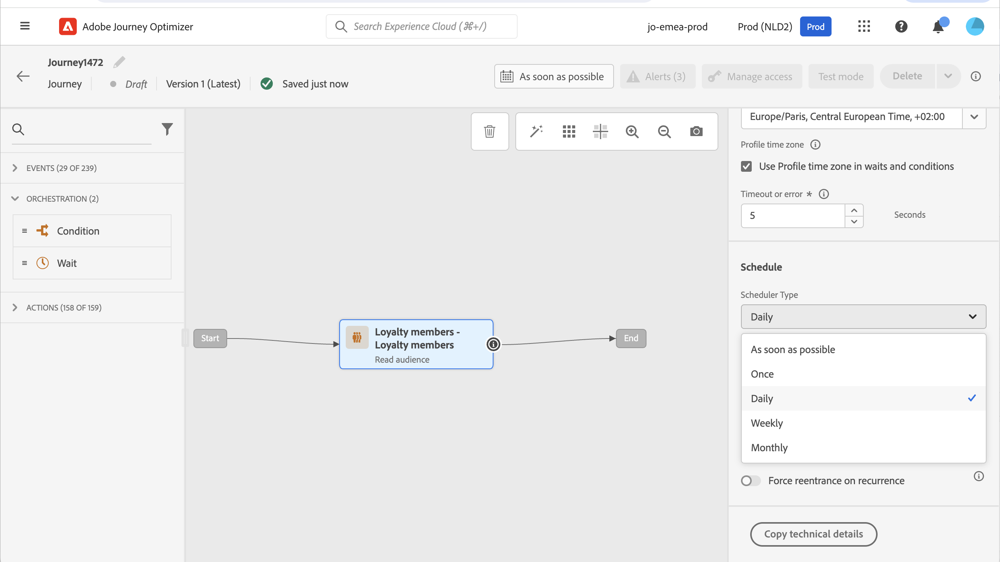

# Usar um público em uma jornada {#segment-trigger-activity}

## Adicionar uma atividade Ler público {#about-segment-trigger-actvitiy}

>[!CONTEXTUALHELP]
>id="ajo_journey_read_segment"
>title="Atividade Ler público-alvo"
>abstract="A atividade Ler público-alvo permite que todas as pessoas pertencentes a um público-alvo da Adobe Experience Platform entrem em uma jornada. A entrada em uma jornada pode ser efetuada uma vez ou regularmente."

Use o **Ler público-alvo** atividade para fazer com que todos os indivíduos de um público-alvo entrem na jornada. A entrada em uma jornada pode ser efetuada uma vez ou regularmente.

Vamos ver como exemplo o público-alvo &quot;Abertura e finalização do aplicativo Luma&quot; criado no [Criar públicos-alvo](../audience/about-audiences.md) caso de uso. Com a atividade Ler público-alvo, você pode fazer com que todos os indivíduos pertencentes a esse público-alvo insiram uma jornada e façam com que eles fluam para jornadas individualizadas que aproveitarão todas as funcionalidades da jornada: condições, temporizadores, eventos, ações.

## Leitura obrigatória {#must-read}

* Para jornadas que usam uma atividade Público-alvo de leitura, há um número máximo de jornadas que podem ser iniciadas exatamente ao mesmo tempo. Novas tentativas serão executadas pelo sistema, mas evite ter mais do que cinco jornadas (com Público-alvo de leitura, programadas ou iniciando “o mais rápido possível”), iniciando exatamente ao mesmo tempo, espalhando-as ao longo do tempo, por exemplo, com intervalos de 5 a 10 minutos.

* Os grupos de campos de evento de experiência não podem ser usados em jornadas que comecem com atividades de Público-alvo de leitura, de Qualificação de público-alvo ou de evento comercial.

* Por enquanto, o uso de públicos-alvo [importado de um arquivo CSV](https://experienceleague.adobe.com/docs/experience-platform/segmentation/ui/overview.html#import-audience) ou resultantes de [workflows de composição](../audience/get-started-audience-orchestration.md) no jornada está disponível como um beta privado. Para obter mais informações, entre em contato com o seu representante da Adobe.

## Configurar a atividade {#configuring-segment-trigger-activity}

As etapas para configurar a atividade Ler público-alvo são as seguintes:

1. Expanda o **[!UICONTROL Orquestração]** category e solte uma **[!UICONTROL Ler público-alvo]** atividade na tela.

   A atividade deve ser posicionada como a primeira etapa de uma jornada.

1. Adicionar um **[!UICONTROL Rótulo]** à atividade (opcional).

1. No **[!UICONTROL Público]** escolha o público-alvo da Adobe Experience Platform que entrará na jornada e clique em **[!UICONTROL Salvar]**.

   Observe que é possível personalizar as colunas exibidas na lista e classificá-las.

   >[!NOTE]
   >
   >Somente os indivíduos com o **Realizado** e **Existente** os status de participação do público-alvo entrarão na jornada. Para obter mais informações sobre como avaliar um público-alvo, consulte a [Documentação do Serviço de segmentação](https://experienceleague.adobe.com/docs/experience-platform/segmentation/tutorials/evaluate-a-segment.html#interpret-segment-results){target="_blank"}.

   

   Depois que o público-alvo é adicionado, a variável **[!UICONTROL Copiar]** permite copiar o nome e a ID:

   `{"name":"Luma app opening and checkout","id":"8597c5dc-70e3-4b05-8fb9-7e938f5c07a3"}`

   

1. No **[!UICONTROL Namespace]** escolha o namespace a ser usado para identificar os indivíduos. Por padrão, o campo é pré-preenchido com o último namespace usado. [Saiba mais sobre namespaces](../event/about-creating.md#select-the-namespace).

   >[!NOTE]
   >
   >Os indivíduos pertencentes a um público-alvo que não tem a identidade (namespace) selecionada entre suas diferentes identidades não podem entrar na jornada. Você só pode selecionar um namespace de identidade com base em pessoas. Se você tiver definido um namespace para uma tabela de pesquisa (por exemplo: Namespace de ProductID para uma pesquisa de Produto), ele não estará disponível na **Namespace** lista suspensa.

1. Defina o **[!UICONTROL Taxa de leitura]**. Esse é o número máximo de perfis que podem entrar na jornada por segundo. Essa taxa se aplica somente a essa atividade e nenhuma outra na jornada. Se você deseja definir uma taxa de limitação em ações personalizadas, por exemplo, é necessário usar a API de limitação. Consulte esta [página](../configuration/throttling.md).

   Esse valor é armazenado na carga da versão do jornada. O valor padrão é de 5.000 perfis por segundo. Você pode modificar esse valor de 500 para 20.000 perfis por segundo.

   >[!NOTE]
   >
   >A taxa de leitura geral por sandbox está definida como 20.000 perfis por segundo. Portanto, a taxa de leitura de todos os públicos-alvo de leitura executados simultaneamente na mesma sandbox totaliza no máximo 20.000 perfis por segundo. Não é possível modificar esse limite.

1. A variável **[!UICONTROL Ler público-alvo]** A atividade permite especificar a hora em que o público-alvo inserirá a jornada. Para fazer isso, clique no link **[!UICONTROL Editar programação de jornada]** link para acessar as propriedades da jornada e configurar o **[!UICONTROL Tipo de scheduler]** campo.

   

   Por padrão, os públicos-alvo entram na jornada **[!UICONTROL Assim que possível]**. Se você quiser que o público-alvo insira a jornada em uma data/hora específica ou de forma recorrente, selecione o valor desejado na lista.

   >[!NOTE]
   >
   >Observe que **[!UICONTROL Agendar]** A seção só está disponível quando um **[!UICONTROL Ler público-alvo]** A atividade de foi solta na tela.

   

   **Leitura incremental** opção: quando uma jornada com um evento recorrente **Ler público** O executa pela primeira vez, todos os perfis no público-alvo entram na jornada. Essa opção permite direcionar, após a primeira ocorrência, somente os indivíduos que entraram no público-alvo desde a última execução da jornada.

   **Forçar reentrada na recorrência**: essa opção permite fazer com que todos os perfis ainda presentes no jornada saiam automaticamente na próxima execução. Por exemplo, se você tiver 2 dias de espera em uma jornada recorrente diária, ao ativar essa opção os perfis sempre serão movidos na próxima execução da jornada (ou seja, no dia seguinte), estejam ou não no público da próxima execução. Se a duração dos perfis nesta jornada for maior que a frequência de recorrência, não ative essa opção para garantir que os perfis possam concluir a jornada.

<!--

### Segment filters {#segment-filters}

[!CONTEXTUALHELP]
>id="jo_segment_filters"
>title="About segment filters"
>abstract="You can choose to target only the individuals who entered or exited a specific segment during a specific time window. For example, you can decide to only retrieve all the customers who entered the VIP segment since last week."

You can choose to target only the individuals who entered or exited a specific segment during a specific time window. For example, you can decide to only retrieve all the customers who entered the VIP segment since last week. Only the new VIP customers will be targeted. All the customers who were already part of the VIP segment before will be excluded.

To activate this mode, click the **Segment Filters** toggle. Two fields are displayed:

**Segment membership**: choose whether you want to listen to segment entrances or exits. 

**Lookback window**: define when you want to start to listen to entrances or exits. This lookback window is expressed in hours, starting from the moment the journey is triggered.  If you set this duration to 0, the journey will target all members of the segment. For recurring journeys, it will take into account all entrances/exits since the last time the journey was triggered.

-->

>[!NOTE]
>
>As jornadas de público-alvo de Leitura única são movidas para o status Concluído 30 dias após a execução da jornada. Para públicos-alvo de leitura agendados, isso acontece 30 dias após a execução da última ocorrência.

## Testar e publicar a jornada {#testing-publishing}

A variável **[!UICONTROL Ler público-alvo]** A atividade permite testar a jornada em um perfil unitário.

Para fazer isso, ative o modo de teste.

Configure e execute o modo de teste como de costume. [Saiba como testar uma jornada](testing-the-journey.md).

Quando o teste estiver em execução, a variável **[!UICONTROL Mostrar logs]** permite ver os resultados do teste. Para obter mais informações, consulte [esta seção](testing-the-journey.md#viewing_logs)

Depois que os testes forem concluídos com êxito, você poderá publicar sua jornada (consulte [Publicação da jornada](publishing-the-journey.md)). Os indivíduos pertencentes ao público inserirão a jornada na data/hora especificada nas propriedades da jornada **[!UICONTROL Scheduler]** seção.

>[!NOTE]
>
>Para jornadas recorrentes baseadas em público-alvo, a jornada será fechada automaticamente assim que sua última ocorrência for executada. Se nenhuma data/hora final tiver sido especificada, será necessário fechar a jornada para novas entradas manualmente para encerrá-la.

## Direcionamento de público em jornadas baseadas em público

As jornadas baseadas em público sempre começam com um **Ler público-alvo** atividade para recuperar indivíduos pertencentes a um público-alvo do Adobe Experience Platform.

O público-alvo pertencente ao público-alvo é recuperado uma vez ou regularmente.

Depois de inserir a jornada, você pode criar casos de uso de orquestração de público, fazendo com que os indivíduos do público inicial fluam para diferentes ramificações da jornada.

**Segmentação**

É possível usar as condições para executar a segmentação usando o **Condição** atividade. Por exemplo, você pode fazer com que as pessoas VIP sigam um determinado caminho e o não-VIP flua outro caminho.

A segmentação pode ser baseada em:

* dados da fonte de dados
* o contexto de eventos que faz parte dos dados de jornada, por exemplo: uma pessoa clicou na mensagem recebida há uma hora?
* uma data, por exemplo: estamos em junho quando uma pessoa passa pela jornada?
* uma hora, por exemplo: é de manhã no fuso horário da pessoa?
* um algoritmo que divide o público-alvo fluindo na jornada com base em uma porcentagem, por exemplo: 90% - 10% para excluir um grupo de controle

**Exclusão**

O mesmo **Condição** a atividade usada para segmentação (veja acima) também permite excluir parte da população. Por exemplo, você pode excluir pessoas VIP fazendo com que elas fluam para uma ramificação com uma etapa final logo após.

Essa exclusão pode ocorrer logo após a recuperação do público-alvo, para fins de contagem de população ou ao longo de uma jornada em várias etapas.

**União**

As jornadas permitem criar N ramificações e juntá-las após uma segmentação.

Como resultado, você pode fazer com que dois públicos-alvo retornem a uma experiência comum.

Por exemplo, depois de seguir uma experiência diferente durante dez dias em uma jornada, os clientes VIP e não VIP podem retornar ao mesmo caminho.

Após uma união, é possível dividir o público novamente executando uma segmentação ou exclusão.

