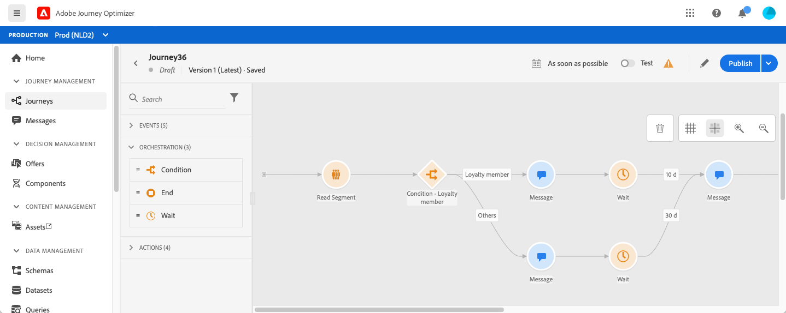

# Usar um segmento em uma jornada {#segment-trigger-activity}

## Sobre a atividade Ler segmento {#about-segment-trigger-actvitiy}

A atividade Ler segmento permite que você faça com que todos os indivíduos pertencentes a um segmento do Adobe Experience Platform entrem em uma jornada. A entrada em uma jornada pode ser efetuada uma vez ou regularmente.

Considere como exemplo o segmento &quot;Abertura e check-out do aplicativo Luma&quot; criado no caso de uso [Criar segmentos](../segment/about-segments.md). Com a atividade Ler segmento , é possível fazer com que todos os indivíduos pertencentes a esse segmento entrem em uma jornada e façam com que eles fluam em jornadas individualizadas que aproveitarão todas as funcionalidades de jornada: condições, cronômetros, eventos, ações.

>[!NOTE]
>
>O complemento Burst paid permite o envio muito rápido de mensagens de push em grandes volumes para jornadas simples que incluem um segmento de leitura e uma mensagem de push simples. Para saber mais, consulte [esta seção](../building-journeys/journey-gs.md#burst)

### Configurar a atividade {#configuring-segment-trigger-activity}

As etapas para configurar a atividade Ler segmento são as seguintes:

1. Expanda a categoria **[!UICONTROL Orchestration]** e solte uma atividade **[!UICONTROL Read Segment]** na tela.

   A atividade deve ser posicionada como a primeira etapa de uma jornada.

1. Adicione um **[!UICONTROL Label]** à atividade (opcional).

1. No campo **[!UICONTROL Segment]**, escolha Adobe Experience Platform segment que inserirá a jornada e, em seguida, clique em **[!UICONTROL Save]**.

   Observe que você pode personalizar as colunas exibidas na lista e classificá-las.

   >[!NOTE]
   >
   >Somente os indivíduos com os status de participação do segmento **Realizado** e **Existente** entrarão na jornada. Para obter mais informações sobre como avaliar um segmento, consulte a [documentação do Serviço de segmentação](https://experienceleague.adobe.com/docs/experience-platform/segmentation/tutorials/evaluate-a-segment.html?lang=en#interpret-segment-results).

   

   Depois que o segmento é adicionado, o botão **[!UICONTROL Copy]** permite copiar o nome e a ID:

   `{"name":"Luma app opening and checkout",”id":"8597c5dc-70e3-4b05-8fb9-7e938f5c07a3"}`

   

1. No campo **[!UICONTROL Namespace]**, escolha o namespace a ser usado para identificar os indivíduos. [Saiba mais sobre namespaces](../event/about-creating.md#select-the-namespace).

   >[!NOTE]
   >
   >Os indivíduos pertencentes a um segmento que não tem a identidade (namespace) selecionada entre suas identidades diferentes não podem inserir a jornada.

1. A atividade **[!UICONTROL Read Segment]** permite especificar a hora em que o segmento entrará na jornada. Para fazer isso, clique no link **[!UICONTROL Edit journey schedule]** para acessar as propriedades da jornada e configure o campo **[!UICONTROL Scheduler type]**.

   

   Por padrão, os segmentos entram na jornada **[!UICONTROL As soon as possible]**. Se desejar que o segmento insira a jornada em uma data/hora específica ou em uma base recorrente, selecione o valor desejado na lista.

   >[!NOTE]
   >
   >Observe que a seção **[!UICONTROL Schedule]** só está disponível quando uma atividade **[!UICONTROL Read Segment]** foi solta na tela.

   

### Testar e publicar a jornada {#testing-publishing}

A atividade **[!UICONTROL Read Segment]** permite testar a jornada em um perfil unitário ou em 100 perfis de teste aleatório selecionados entre os perfis qualificados para o segmento.

Para fazer isso, ative o modo de teste e selecione a opção desejada no painel esquerdo.

Em seguida, você pode configurar e executar o modo de teste como de costume. [Saiba como testar uma jornada](testing-the-journey.md).

Quando o teste estiver em execução, o botão **[!UICONTROL Show logs]** permitirá que você veja os resultados do teste de acordo com a opção de teste selecionada:

* **[!UICONTROL Single profile at a time]**: os registros de teste exibem as mesmas informações que ao usar o modo de teste unitário. Para obter mais informações, consulte [esta seção](testing-the-journey.md#viewing_logs)

* **[!UICONTROL Up to 100 profiles at once]**: os logs de teste permitem rastrear a progressão da exportação do segmento do Adobe Experience Platform, bem como o progresso individual de todas as pessoas que entraram na jornada.

   Observe que testar a jornada usando até 100 perfis simultaneamente não permite rastrear o progresso dos indivíduos na jornada usando o fluxo visual.

   

Depois que os testes forem bem-sucedidos, você poderá publicar sua jornada (consulte [Publicação da jornada](publishing-the-journey.md)). Os indivíduos pertencentes ao segmento inserirão a jornada na data/hora especificada na seção de propriedades da jornada **[!UICONTROL Scheduler]**.

>[!NOTE]
>
>Para jornadas recorrentes baseadas em segmentos, a jornada será fechada automaticamente quando sua última ocorrência for executada. Se nenhuma data/hora final tiver sido especificada, será necessário fechar a jornada a novas entradas manualmente para finalizá-la.

## Direcionamento de público-alvo em jornadas baseadas em segmentos

As jornadas baseadas em segmentos sempre começam com uma atividade **Ler segmento** para recuperar indivíduos pertencentes a um segmento do Adobe Experience Platform.

O público-alvo pertencente ao segmento é recuperado uma vez ou regularmente.

Depois de inserir a jornada, você pode criar casos de uso de orquestração de público-alvo, fazendo com que os indivíduos do segmento inicial fluam para diferentes ramificações da jornada.

**Segmentação**

Você pode usar condições para executar a segmentação usando a atividade **Condição**. Por exemplo, você pode fazer com que VIP pessoas sigam um caminho específico e não VIP fluxo em outro caminho.

A segmentação pode ser baseada em:

* dados da fonte de dados
* o contexto dos eventos faz parte dos dados de jornada, por exemplo: uma pessoa clicou na mensagem que ela recebeu há uma hora?
* uma data, por exemplo: estamos em junho quando uma pessoa passa pela jornada?
* uma hora, por exemplo: é manhã no fuso horário da pessoa?
* um algoritmo que divide o público-alvo fluindo na jornada com base em uma porcentagem, por exemplo: 90% - 10% para excluir um grupo de controle

**Exclusão**

A mesma atividade **Condition** usada para segmentação (veja acima) também permite excluir parte da população. Por exemplo, você pode excluir VIP pessoas fazendo com que elas fluam para uma ramificação com uma etapa final logo em seguida.

Essa exclusão pode ocorrer logo após a recuperação do segmento, para fins de contagem de população ou ao longo de uma jornada de várias etapas.

**União**

As jornadas permitem criar N ramificações e uni-las após uma segmentação.

Como resultado, você pode fazer com que dois públicos retornem a uma experiência comum.

Por exemplo, depois de seguir uma experiência diferente durante dez dias em uma jornada, VIP e clientes não VIP podem retornar ao mesmo caminho.

Após uma união, você pode dividir o público novamente executando uma segmentação ou uma exclusão.

