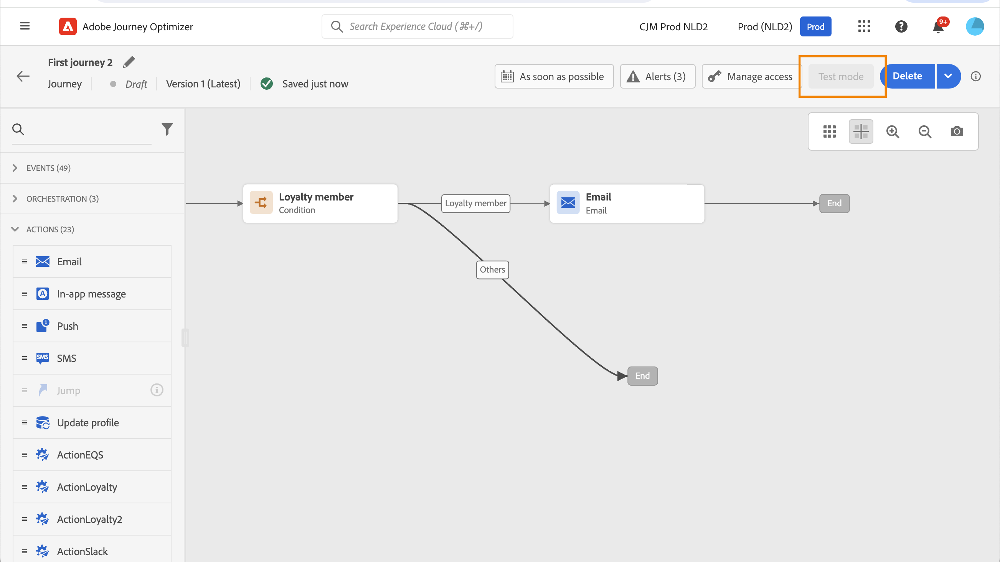

# Usar um segmento em uma jornada {#segment-trigger-activity}

## Adicionar uma atividade Ler segmento {#about-segment-trigger-actvitiy}

>[!CONTEXTUALHELP]
>id="ajo_journey_read_segment"
>title="Atividade Ler segmento"
>abstract="A atividade Ler segmento permite que você faça com que todos os indivíduos pertencentes a um segmento do Adobe Experience Platform entrem em uma jornada. A entrada em uma jornada pode ser efetuada uma vez ou regularmente."

Use o **Ler segmento** atividade para fazer com que todos os indivíduos de um segmento entrem na jornada. A entrada em uma jornada pode ser efetuada uma vez ou regularmente.

Vejamos como exemplo o segmento &quot;Abertura e check-out do aplicativo Luma&quot; criado na [Construir segmentos](../segment/about-segments.md) caso de uso. Com a atividade Ler segmento , é possível fazer com que todos os indivíduos pertencentes a esse segmento entrem em uma jornada e façam com que eles fluam em jornadas individualizadas que aproveitarão todas as funcionalidades de jornada: condições, cronômetros, eventos, ações.

>[!NOTE]
>
>Para jornadas que usam uma atividade Ler segmento , há um número máximo de jornadas que podem ser iniciadas exatamente ao mesmo tempo. As tentativas serão executadas pelo sistema, mas evite ter mais de cinco jornadas (com Segmento de leitura, programado ou iniciando &quot;o mais rápido possível&quot;), iniciando exatamente ao mesmo tempo, espalhando-as ao longo do tempo, por exemplo, com intervalos de 5 a 10 minutos.
>
>Os grupos de campos de evento da experiência não podem ser usados em jornadas que começam com um segmento Lido, uma qualificação de Segmento ou uma atividade de evento comercial.

### Configurar a atividade {#configuring-segment-trigger-activity}

As etapas para configurar a atividade Ler segmento são as seguintes:

1. Expanda a **[!UICONTROL Orquestração]** categoria e solte uma **[!UICONTROL Ler segmento]** atividade na tela.

   A atividade deve ser posicionada como a primeira etapa de uma jornada.

1. Adicione um **[!UICONTROL Rótulo]** à atividade (opcional).

1. No **[!UICONTROL Segmento]** escolha o segmento do Adobe Experience Platform que irá inserir a jornada e clique em **[!UICONTROL Salvar]**.

   Observe que você pode personalizar as colunas exibidas na lista e classificá-las.

   >[!NOTE]
   >
   >Somente os indivíduos com a variável **Realizado** e **Existente** os status de participação do segmento inserirão a jornada. Para obter mais informações sobre como avaliar um segmento, consulte [Documentação do Serviço de segmentação](https://experienceleague.adobe.com/docs/experience-platform/segmentation/tutorials/evaluate-a-segment.html#interpret-segment-results){target=&quot;_blank&quot;}.

   

   Depois que o segmento é adicionado, a variável **[!UICONTROL Copiar]** permite copiar o nome e a ID:

   `{"name":"Luma app opening and checkout",”id":"8597c5dc-70e3-4b05-8fb9-7e938f5c07a3"}`

   

1. No **[!UICONTROL Namespace]** escolha o namespace a ser usado para identificar os indivíduos. [Saiba mais sobre namespaces](../event/about-creating.md#select-the-namespace).

   >[!NOTE]
   >
   >Os indivíduos pertencentes a um segmento que não tem a identidade (namespace) selecionada entre suas identidades diferentes não podem inserir a jornada.

1. Defina as **[!UICONTROL Taxa de limitação]** para o limite de taxa de transferência da atividade de segmento de leitura.

   Esse valor é armazenado na carga da versão do jornada. O valor padrão é 20.000 mensagens por segundo. Você pode modificar esse valor de 500 a 20.000 mensagens por segundo.

   >[!NOTE]
   >
   >A taxa de limitação geral por sandbox é definida como 20.000 mensagens por segundo. Portanto, a taxa de limitação de todos os segmentos de leitura executados simultaneamente na mesma sandbox adiciona até no máximo 20.000 mensagens por segundo. Não é possível modificar esta tampa.

1. O **[!UICONTROL Ler segmento]** permite especificar a hora em que o segmento entrará na jornada. Para fazer isso, clique no botão **[!UICONTROL Editar programação de jornada]** para acessar as propriedades da jornada e configure a variável **[!UICONTROL Tipo de agendador]** campo.

   

   Por padrão, os segmentos entram na jornada **[!UICONTROL Logo que possível]**. Se desejar que o segmento insira a jornada em uma data/hora específica ou em uma base recorrente, selecione o valor desejado na lista.

   >[!NOTE]
   >
   >Observe que a variável **[!UICONTROL Agendar]** só estará disponível quando uma **[!UICONTROL Ler segmento]** A atividade foi solta na tela.

   

   **Leitura incremental** opção: quando uma jornada com uma **Ler segmento** é executado pela primeira vez, todos os perfis no segmento entram na jornada. Essa opção permite direcionar, após a primeira ocorrência, apenas os indivíduos que entraram no segmento desde a última execução da jornada.

   **Forçar a reentrada na recorrência**: essa opção permite fazer com que todos os perfis ainda estejam presentes na jornada automaticamente os saia na próxima execução. Por exemplo, se você tiver 2 dias de espera em uma jornada diária recorrente ativando essa opção, os perfis sempre serão movidos na próxima execução da jornada (ou seja, no dia seguinte), estejam ou não no próximo público-alvo de execução. Se a duração dos perfis nessa jornada for maior que a frequência de recorrência, não ative essa opção para garantir que os perfis possam concluir a jornada.

<!--

### Segment filters {#segment-filters}

[!CONTEXTUALHELP]
>id="jo_segment_filters"
>title="About segment filters"
>abstract="You can choose to target only the individuals who entered or exited a specific segment during a specific time window. For example, you can decide to only retrieve all the customers who entered the VIP segment since last week."

You can choose to target only the individuals who entered or exited a specific segment during a specific time window. For example, you can decide to only retrieve all the customers who entered the VIP segment since last week. Only the new VIP customers will be targeted. All the customers who were already part of the VIP segment before will be excluded.

To activate this mode, click the **Segment Filters** toggle. Two fields are displayed:

**Segment membership**: choose whether you want to listen to segment entrances or exits. 

**Lookback window**: define when you want to start to listen to entrances or exits. This lookback window is expressed in hours, starting from the moment the journey is triggered.  If you set this duration to 0, the journey will target all members of the segment. For recurring journeys, it will take into account all entrances/exits since the last time the journey was triggered.

-->

>[!NOTE]
>
>As jornadas de segmento de Leitura única são movidas para o status Finished 30 dias após a execução da jornada. Para segmentos de leitura agendados, isso acontece 30 dias após a execução da última ocorrência.

### Testar e publicar a jornada {#testing-publishing}

O **[!UICONTROL Ler segmento]** A atividade permite testar a jornada em um perfil unitário ou em 100 perfis de teste aleatório selecionados entre os perfis qualificados para o segmento.

Para fazer isso, ative o modo de teste e selecione a opção desejada no painel esquerdo.

Em seguida, você pode configurar e executar o modo de teste como de costume. [Saiba como testar uma jornada](testing-the-journey.md).

Quando o teste estiver em execução, a função **[!UICONTROL Mostrar logs]** permite ver os resultados do teste de acordo com a opção de teste selecionada:

* **[!UICONTROL Perfil único por vez]**: os registros de teste exibem as mesmas informações que ao usar o modo de teste unitário. Para obter mais informações, consulte [esta seção](testing-the-journey.md#viewing_logs)

* **[!UICONTROL Até 100 perfis ao mesmo tempo]**: os logs de teste permitem rastrear a progressão da exportação do segmento do Adobe Experience Platform, bem como o progresso individual de todas as pessoas que entraram na jornada.

   Observe que testar a jornada usando até 100 perfis simultaneamente não permite rastrear o progresso dos indivíduos na jornada usando o fluxo visual.

   

Após os testes serem bem-sucedidos, você pode publicar sua jornada (consulte [Publicar a jornada](publishing-the-journey.md)). Os indivíduos pertencentes ao segmento inserirão a jornada na data/hora especificada nas propriedades da jornada **[!UICONTROL Scheduler]** seção.

>[!NOTE]
>
>Para jornadas recorrentes baseadas em segmentos, a jornada será fechada automaticamente quando sua última ocorrência for executada. Se nenhuma data/hora final tiver sido especificada, será necessário fechar a jornada a novas entradas manualmente para finalizá-la.

## Direcionamento de público-alvo em jornadas baseadas em segmentos

As jornadas baseadas em segmentos sempre começam com um **Ler segmento** atividade para recuperar indivíduos pertencentes a um segmento do Adobe Experience Platform.

O público-alvo pertencente ao segmento é recuperado uma vez ou regularmente.

Depois de inserir a jornada, você pode criar casos de uso de orquestração de público-alvo, fazendo com que os indivíduos do segmento inicial fluam para diferentes ramificações da jornada.

**Segmentação**

Você pode usar as condições para executar a segmentação usando o **Condição** atividade . Por exemplo, você pode fazer com que VIP pessoas sigam um caminho específico e não VIP fluxo em outro caminho.

A segmentação pode ser baseada em:

* dados da fonte de dados
* o contexto dos eventos faz parte dos dados de jornada, por exemplo: uma pessoa clicou na mensagem recebida há uma hora?
* uma data, por exemplo: estamos em junho quando uma pessoa passa pela jornada?
* uma hora, por exemplo: é manhã no fuso horário da pessoa?
* um algoritmo que divide o público-alvo fluindo na jornada com base em uma porcentagem, por exemplo: 90% - 10% para excluir um grupo de controle

**Exclusão**

O mesmo **Condição** A atividade usada para segmentação (veja acima) também permite excluir parte da população. Por exemplo, você pode excluir VIP pessoas fazendo com que elas fluam para uma ramificação com uma etapa final logo em seguida.

Essa exclusão pode ocorrer logo após a recuperação do segmento, para fins de contagem de população ou ao longo de uma jornada de várias etapas.

**União**

As jornadas permitem criar N ramificações e uni-las após uma segmentação.

Como resultado, você pode fazer com que dois públicos retornem a uma experiência comum.

Por exemplo, depois de seguir uma experiência diferente durante dez dias em uma jornada, VIP e clientes não VIP podem retornar ao mesmo caminho.

Após uma união, você pode dividir o público novamente executando uma segmentação ou uma exclusão.

