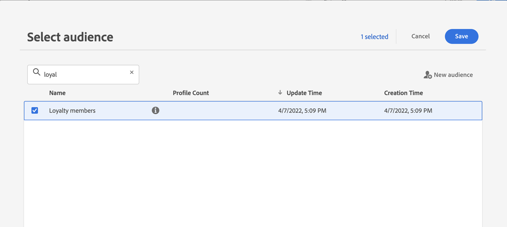
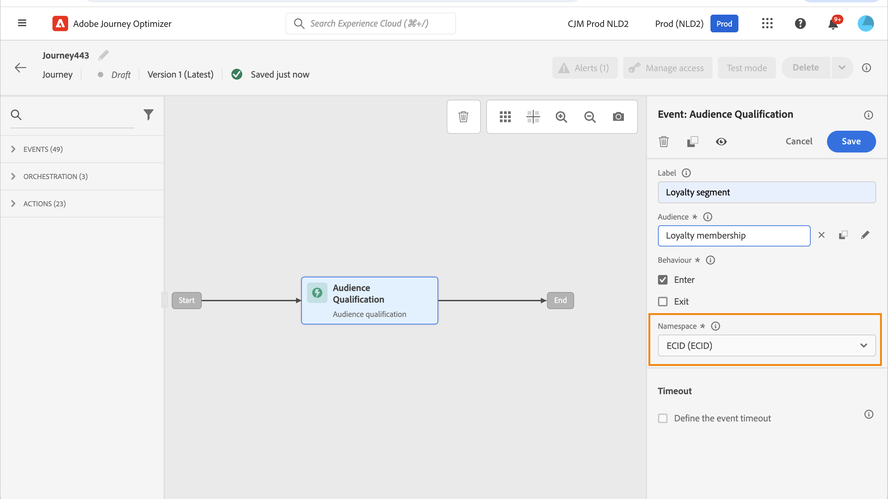

# Eventos de qualificação de segmento {#segment-qualification}

## Sobre eventos de qualificação de segmento{#about-segment-qualification}

>[!CONTEXTUALHELP]
>id="ajo_journey_event_segment_qualification"
>title="Eventos de qualificação de segmento"
>abstract="Essa atividade permite que sua jornada considere as entradas e saídas dos perfis nos segmentos da Adobe Experience Platform, fazendo com que as pessoas entrem ou avancem em uma jornada."

Essa atividade permite que sua jornada considere as entradas e saídas dos perfis nos segmentos da Adobe Experience Platform, fazendo com que as pessoas entrem ou avancem em uma jornada. Para obter mais informações sobre a criação de segmentos, consulte esta [seção](../segment/about-segments.md).

Digamos que você tenha um segmento de &quot;cliente prata&quot;. Com essa atividade, você pode fazer com que todos os novos clientes Silver insiram uma jornada e enviem a eles uma série de mensagens personalizadas.

Esse tipo de evento pode ser posicionado como a primeira etapa ou posteriormente na jornada.

>[!IMPORTANT]
>
>Lembre-se de que os segmentos do Adobe Experience Platform são calculados uma vez por dia (**lote** segmentos) ou em tempo real (**transmitido** segmentos, usando a opção Públicos-alvo de alta frequência do Adobe Experience Platform).
>
>Se o segmento selecionado for transmitido, os indivíduos pertencentes a esse segmento potencialmente entrarão na jornada em tempo real. Se o segmento for em lote, as pessoas recém-qualificadas para esse segmento potencialmente inserirão a jornada quando o cálculo do segmento for executado no Adobe Experience Platform.
>
>Grupos de campos de evento de experiência não podem ser usados em jornadas que começam com um Segmento de Leitura, uma qualificação de Segmento ou uma atividade de evento comercial.

1. Expanda o **[!UICONTROL Eventos]** category e solte uma **[!UICONTROL Qualificação do segmento]** atividade na tela.

   

1. Adicionar um **[!UICONTROL Rótulo]** à atividade. Esta etapa é opcional.

1. Clique em **[!UICONTROL Segmento]** e selecione os segmentos que deseja aproveitar.

   >[!NOTE]
   >
   >Observe que é possível personalizar as colunas exibidas na lista e classificá-las.

   

   Depois que o segmento é adicionado, a variável **[!UICONTROL Copiar]** permite copiar o nome e a ID:

   `{"name":"Loyalty membership“,”id":"8597c5dc-70e3-4b05-8fb9-7e938f5c07a3"}`

   

1. No **[!UICONTROL Comportamento]** escolha se deseja acompanhar entradas de segmento, saídas ou ambas.

   >[!NOTE]
   >
   >Observe que **[!UICONTROL Enter]** e **[!UICONTROL Sair]** correspondem à variável **Realizado** e **Sair** status de participação do segmento da Adobe Experience Platform. Para obter mais informações sobre como avaliar um segmento, consulte [Documentação do Serviço de segmentação](https://experienceleague.adobe.com/docs/experience-platform/segmentation/tutorials/evaluate-a-segment.html#interpret-segment-results){target="_blank"}.

1. Selecione um namespace. Isso só será necessário se o evento for posicionado como a primeira etapa da jornada. Por padrão, o campo é pré-preenchido com o último namespace usado.

   >[!NOTE]
   >
   >Você só pode selecionar um namespace de identidade com base em pessoas. Se você tiver definido um namespace para uma tabela de pesquisa (por exemplo: Namespace de ProductID para uma pesquisa de Produto), ele não estará disponível na **Namespace** lista suspensa.

   

A carga contém as seguintes informações de contexto, que podem ser usadas em condições e ações:

* o comportamento (entrada, saída)
* o carimbo de data e hora da qualificação
* a id do segmento

Ao usar o editor de expressão em uma condição ou ação que segue um **[!UICONTROL Qualificação do segmento]** atividade, você terá acesso à **[!UICONTROL QualificaçãoSegmento]** nó. Você pode escolher entre as opções **[!UICONTROL Hora da última qualificação]** e a variável **[!UICONTROL status]** (entre ou saia).

Consulte [Atividade de condição](../building-journeys/condition-activity.md#about_condition).

Uma nova jornada que inclui um evento de qualificação de segmento fica operacional dez minutos após a sua publicação. Esse intervalo corresponde ao intervalo de atualização do cache do serviço dedicado. Portanto, é necessário aguardar dez minutos antes de usar essa jornada.

## Práticas recomendadas {#best-practices-segments}

A variável **[!UICONTROL Qualificação do segmento]** A atividade permite a entrada imediata em jornadas de indivíduos que estão sendo qualificados ou desqualificados de um segmento do Adobe Experience Platform.

A velocidade de recepção dessas informações é alta. As medições efetuadas mostram uma velocidade de 10 000 eventos recebidos por segundos. Como resultado, você deve entender como os picos de entrada podem acontecer, como evitá-los e como preparar sua jornada para eles.

### Segmentos em lote{#batch-speed-segment-qualification}

Ao usar a qualificação de segmento para um segmento em lote, observe que um pico de entrada ocorrerá no momento do cálculo diário. O tamanho do pico dependerá do número de indivíduos entrando (ou saindo) do segmento diariamente.

Além disso, se o segmento em lote for recém-criado e usado imediatamente em uma jornada, o primeiro lote de cálculo pode fazer com que um número muito grande de indivíduos entre na jornada.

### Segmentos transmitidos{#streamed-speed-segment-qualification}

Ao usar a qualificação de segmento para segmentos transmitidos, há menos risco de obter grandes picos de entradas/saídas devido à avaliação contínua do segmento. Ainda assim, se a definição do segmento levar a fazer com que um grande volume de clientes se qualifiquem ao mesmo tempo, também poderá haver um pico.

Para obter mais informações sobre a segmentação por transmissão, consulte [Documentação do Adobe Experience Platform](https://experienceleague.adobe.com/docs/experience-platform/segmentation/api/streaming-segmentation.html#api)

### Como evitar sobrecargas{#overloads-speed-segment-qualification}

Estas são algumas das práticas recomendadas que ajudarão a evitar sobrecarga dos sistemas aproveitados no jornada (fontes de dados, ações personalizadas, atividades de ação de canal).

Não use, em um **[!UICONTROL Qualificação do segmento]** atividade, um segmento em lote imediatamente após a sua criação. Evitará o primeiro pico de cálculo. Observe que haverá um aviso amarelo na tela de jornada se você estiver prestes a usar um segmento que nunca foi calculado.

Coloque uma regra de limitação para fontes de dados e ações usadas em jornadas para evitar sobrecarga. Saiba mais em [Documentação do Journey Orchestration](https://experienceleague.adobe.com/docs/journeys/using/working-with-apis/capping.html){target="_blank"}. Observe que a regra de limitação não tem repetição. Se precisar tentar novamente, use um caminho alternativo na jornada marcando a caixa **[!UICONTROL Adicionar um caminho alternativo em caso de tempo limite ou erro]** em condições ou ações.

Antes de usar o segmento em uma jornada de produção, sempre avalie primeiro o volume de indivíduos qualificados para esse segmento todos os dias. Para fazer isso, você pode verificar o **[!UICONTROL Segmentos]** , abra o segmento e observe o **[!UICONTROL Perfis ao longo do tempo]** gráfico.

