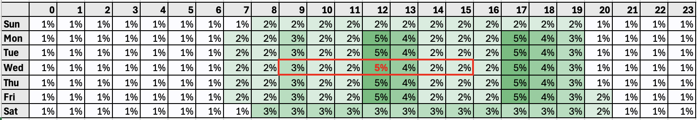

# Otimização de tempo de envio{#send-time-optimization}

>[!CONTEXTUALHELP]
>id="jo_bestsendtime_disabled"
>title="Sobre a otimização da hora de envio"
>abstract="O recurso Otimização da hora de envio do Adobe Journey Optimizer, desenvolvido pelos serviços de IA da Adobe, pode prever o melhor momento para enviar um email ou uma mensagem por push para maximizar o engajamento com base nas taxas históricas de abertura e clique."

>[!CONTEXTUALHELP]
>id="jo_bestsendtime_email"
>title="Ativar otimização da hora de envio"
>abstract="Escolha se deseja otimizar nas aberturas de email ou em click-throughs de email selecionando o botão de opção apropriado. Você também pode optar por agrupar as horas de envio usadas pelo sistema inserindo um valor para Enviar na próxima opção."

>[!CONTEXTUALHELP]
>id="jo_bestsendtime_push"
>title="Ativar otimização da hora de envio"
>abstract="O padrão das mensagens por push é a opção de abertura, pois cliques não são aplicáveis para mensagens por push. Você também pode optar por agrupar as horas de envio usadas pelo sistema inserindo um valor para Enviar na próxima opção."

O recurso de Otimização de hora de envio da Adobe Journey Optimizer, viabilizado pelos serviços de IA de Jornada da Adobe, escolhe o tempo de envio ideal para mensagens de email e push para maximizar o engajamento do cliente, com base no histórico do comportamento de abertura e de cliques dos clientes.

A Otimização de tempo de envio está disponível apenas para os tipos de ação de Email e Push integrados da Journey Optimizer e não está disponível no momento para mensagens enviadas por meio de ações personalizadas ou para outros tipos de ação. A Otimização de tempo de envio só está disponível para ações de Email e Push no Jornada e não está disponível no momento para mensagens enviadas por meio de Campanhas.

>[!AVAILABILITY]
>
>* O recurso de Otimização de tempo de envio é ativado para clientes do Adobe Journey Optimizer mediante solicitação. Entre em contato com o Atendimento ao cliente da Adobe ou com seu representante da Adobe para ativar o recurso para sua organização.
>
>* A Otimização de Tempo de Envio se aplica somente aos canais de **Email** e **Notificação por push**.
>

## Usar otimização de hora de envio{#use-send-time-optimization}

Use a Otimização de tempo de envio em um email ou ação de push ativando o switch Otimização de tempo de envio nos parâmetros de ação.

A Otimização de tempo de envio não deve ser usada para mensagens operacionais urgentes e sensíveis ao tempo - por exemplo, uma confirmação de pedido, uma notificação de redefinição de senha ou uma notificação de alteração da porta de voo. A Otimização de tempo de envio é melhor usada em comunicações de marketing menos urgentes - por exemplo, um anúncio semanal, informações promocionais sobre um novo produto ou informações sobre uma venda de um mês.

Para mensagens de email, escolha se deseja otimizar as aberturas de email ou click-throughs de email selecionando o botão de opção apropriado. As mensagens de push são sempre otimizadas para aberturas.

>[!TIP]
>
>Para obter os melhores resultados, a maioria das mensagens de email deve ser otimizada para cliques. Escolha otimizar para Aberturas se sua mensagem de email for de natureza informativa e não se destinar a direcionar uma ação diretamente.

Para mensagens de email e por push, escolha o número máximo de horas que o sistema aguardará antes de enviar a mensagem, definindo um valor para a opção &quot;Enviar na próxima&quot;. Você pode escolher um valor de 1 a 168 horas.

>[!TIP]
>
>Para obter os melhores resultados, escolha um tempo máximo de espera entre 6 e 24 horas. A escolha de um valor menor para o tempo máximo de espera reduz o número de tempos de envio disponíveis e, portanto, pode reduzir o valor potencial da Otimização de tempo de envio. Escolher um valor mais alto para o tempo máximo de espera pode resultar na desatualização ou irrelevância de uma mensagem no momento em que ela é enviada.

Quando sua jornada é ativada e um cliente atinge a ação de Email ou Push na jornada, a Otimização de tempo de envio escolherá o melhor tempo de envio previsto disponível para cada usuário dentro dos limites especificados.

## Como funciona a Otimização de tempo de envio {#how-send-time}

O modelo de Otimização de tempo de envio assimila os dados de comportamento do cliente da Adobe Journey Optimizer de sua organização e examina eventos de abertura e de clique no nível do usuário para determinar quando seus clientes têm maior probabilidade de se envolver com suas mensagens.

A Otimização de tempo de envio faz previsões para cada hora da semana, para cada usuário, com base em três tipos de dados comportamentais:

1. O comportamento dos usuários em geral
1. O comportamento de usuários semelhantes no mesmo fuso horário
1. O comportamento desse usuário individual

Essas previsões são ponderadas e combinadas usando uma abordagem Bayesiana, resultando em um &quot;mapa de calor&quot; para cada métrica (aberturas de email, cliques de email e aberturas por push), para cada cliente, que indica as horas da semana em que entrar em contato com esse usuário tem maior e menor probabilidade de resultar no resultado do engajamento desejado (abrir/clicar), conforme ilustrado no exemplo de mapa de calor abaixo:

Se um usuário com as probabilidades previstas acima for direcionado para uma mensagem às 9:00 AM de quarta-feira com a Otimização de tempo de envio ativada e um tempo de espera máximo de 7 horas, o tempo de envio selecionado para a mensagem será 12:00:

## Detalhes de treinamento e pontuação do modelo de Otimização de tempo de envio  {#model-send-time}

Quando o recurso de Otimização de tempo de envio está habilitado para sua organização, o modelo de IA de Jornada é treinado em eventos de envio de email e push, abertura e cliques em todas as jornadas e ações da organização nas últimas 16 semanas, independentemente de essas ações usarem a Otimização de tempo de envio. Isso permite que a Otimização de tempo de envio se beneficie de todos os dados gerados pelos clientes.

Os modelos são inicialmente treinados e pontuados semanalmente. Após 16 semanas, os modelos são retreinados e remarcados mensalmente. A pontuação do modelo inclui todos os perfis de clientes, existentes e novos, desde a última execução de pontuação.

As mensagens enviadas pela Otimização de tempo de envio recebem um tempo de envio de mensagem de &quot;exploração&quot; selecionado para testar diferentes tempos de envio e observar como os clientes respondem, ou um tempo de envio de mensagem &quot;otimizado&quot; selecionado para maximizar as taxas de clique/abertura. 5% dos eventos de envio recebem um tempo de envio de &quot;exploração&quot; e 95% dos eventos de envio são &quot;otimizados&quot;.

Os tempos de envio de exploração são selecionados aleatoriamente a partir dos tempos de envio disponibilizados pelo tempo máximo de espera configurado. Por exemplo, caso uma mensagem seja selecionada às 9h de quarta-feira com a Otimização de tempo de envio ativada e um tempo de espera máximo de 3 horas, os tempos de envio de exploração para a mensagem serão divididos uniformemente entre 9h, 10h, 11h e 12h.

## Perguntas frequentes {#faq-send-time}

+++Por quanto tempo preciso aguardar antes de usar a Otimização de tempo de envio?

Sua organização deve usar a ação Email no Journey Optimizer por um mínimo de 30 dias antes de usar a Otimização de tempo de envio no email para permitir a coleta de alguns eventos de envio, abertura e clique de email.

Sua organização deve usar a ação de push no Journey Optimizer por um mínimo de 30 dias antes de usar a Otimização de tempo de envio no Push para permitir a coleta de alguns eventos de envio e abertura por push.

Se sua organização já estiver usando os tipos de ação de email e/ou push por pelo menos 30 dias, sua organização não precisará aguardar mais para usar a Otimização de tempo de envio depois que ela for ativada pelo Adobe. Os resultados continuarão a melhorar à medida que sua organização coleta dados por até 16 semanas.

+++

+++Como posso ver a hora de envio em que um usuário específico receberá uma mensagem?

Para minimizar o impacto do modelo na riqueza do perfil, as pontuações do modelo são armazenadas compactadas em três atributos de perfil armazenados no `_experience.intelligentServices.journeyAI.sendTimeOptimization` e não foram projetadas para serem legíveis por humanos.

+++

+++Qual é o benefício médio da Otimização de tempo de envio?

A Otimização de tempo de envio pode aumentar a taxa de cliques no email e a taxa de abertura de push no intervalo de aproximadamente 2% a 10% em todas as mensagens otimizadas por uma organização.

Por exemplo, se uma organização que envia emails sem otimização de tempo de envio tiver uma taxa de cliques de 5,0% em média, o mesmo conjunto de emails com otimização de tempo de envio pode resultar em uma taxa de cliques de até 5,5% em média (5,0% * (1+10%) = 5,5%).

Devido à variabilidade em tamanhos pequenos de amostra, um benefício da Otimização de tempo de envio pode não ser observável em envios de mensagem única.

É mais provável que as organizações aproveitem melhor a Otimização de tempo de envio quando:

* As jornadas existentes usam tempos de envio fixos e não bem otimizados
* A variação no comportamento do cliente (cliques e aberturas) corresponde ao local do cliente e às preferências do cliente
* As organizações usam a Otimização de tempo de envio em uma fração maior de mensagens de email e por push
* As organizações escolhem o tempo máximo de espera dentro do intervalo recomendado de 6 a 12 horas

+++

+++Eu sempre clico em emails ou mensagens por push às 12h, por que o algoritmo não me enviou uma mensagem às 12h?

Isso pode ocorrer por vários motivos:

* Sua mensagem foi selecionada como uma hora de envio de mensagem de &quot;Exploração&quot; em vez de uma hora de envio de mensagem &quot;Otimizada&quot;.
* O comportamento de usuários semelhantes influenciou o modelo a recomendar outro horário de envio.

+++

+++Como a Otimização de hora de envio sabe o fuso horário de um usuário?

A Otimização de tempo de envio usa o campo de perfil `timeZone` para determinar o fuso horário de um usuário. Se não estiver disponível para esse usuário, a Otimização de tempo de envio tenta inferir o fuso horário de um usuário a partir de outras informações geográficas no perfil do usuário, como país e estado.

+++

+++A Otimização de hora de envio enviará mensagens de push aos usuários durante a noite no fuso horário local?

A Otimização de tempo de envio pode enviar mensagens de push aos usuários durante a noite em seu fuso horário local nas seguintes circunstâncias:

* Quando os usuários apresentam um comportamento que indica a probabilidade de interagir com uma mensagem enviada à noite
* Quando o modelo escolhe uma hora de envio de &quot;Exploração&quot;

Para evitar o envio de mensagens de push aos clientes durante o horário noturno, agende o envio de mensagens de push em lote para a manhã ou o início da tarde e escolha uma duração mais curta para a Otimização de tempo de envio. (Por exemplo, um tempo de envio de 9 horas e um tempo de espera máximo de 8 horas.)

+++

