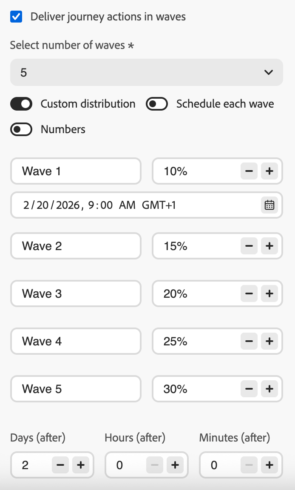

# Enviar usando ondas em jornadas {#send-using-waves-journeys}

>[!BEGINSHADEBOX]

**Nesta página:** saiba como entregar mensagens de saída de uma jornada de público-alvo de leitura em lotes agendados, chamados ondas, para balancear a carga, proteger sistemas downstream e oferecer suporte à capacidade de entrega.

>[!ENDSHADEBOX]

Você pode entregar mensagens de saída de uma jornada em lotes (ondas) ao longo do tempo, em vez de todas de uma só vez. O envio de ondas ajuda a balancear a carga, evitar sistemas downstream esmagadores (como centrais de atendimento ou páginas de aterrissagem) e oferecer suporte à capacidade de entrega e reputação do remetente, especialmente para jornadas de alto volume de público-alvo de leitura.

<!--
>[!CAUTION]
>
>Wave sending is available for read audience journeys only and applies to **outbound** actions only (Email, SMS, Push, Direct mail).
-->

Você a configura no nível da jornada ao definir como o público-alvo entra e como as ações são agendadas. Você define o número de ondas, seu tamanho (como uma porcentagem do público ou como números absolutos) e quando cada onda é executada.

## Limitações e medidas de proteção {#limitations-guardrails}

* O envio de onda só está disponível para jornadas de público-alvo de leitura com os tipos de agendador **[!DNL As soon as possible]** e **[!UICONTROL Once]**. Saiba mais sobre o [cronograma de jornadas](read-audience.md#schedule).
* O envio de onda não está disponível para jornadas recorrentes, acionadas por eventos, de eventos comerciais, de modo de teste ou de simulação.
* Você deve definir pelo menos **2 ondas** e pode adicionar até **10 ondas**.
* O intervalo mínimo entre o início de duas ondas é de **30 minutos**.
* Um início de onda não pode ser anterior ao início da jornada ou no passado.
* A divisão do público em ondas pode levar até 1 hora. Os perfis não podem entrar na jornada até lá.
* Em uma única versão do jornada, duas ondas nunca são executadas ao mesmo tempo. A próxima onda começa somente após a conclusão da onda anterior. Por exemplo, se as ondas forem agendadas com 1 hora de diferença, mas a primeira onda ocorrer por 2 horas, a segunda onda começará quando a primeira onda terminar, não no horário agendado.
* Os inícios de onda podem ser atrasados quando a plataforma aplicar limites de cota ou quando a capacidade do sistema estiver sob carga pesada.

## Configurar o envio de ondas em uma jornada {#configure-wave-sending}

1. Inicie sua jornada com uma atividade [Ler público-alvo](read-audience.md).

1. Clique duas vezes na atividade **[!UICONTROL Ler público-alvo]** para abrir suas propriedades e selecione a opção **[!UICONTROL Fornecer ação de jornada em ondas]**.

   {width="100%"}

1. Defina o **número de ondas** (por exemplo, 4).

   {width="80%"}

   >[!NOTE]
   >
   >Você deve definir pelo menos 2 ondas e pode adicionar até 10 ondas.

1. Escolha como definir o tamanho e o tempo da onda conforme detalhado abaixo.

### Ondas iguais {#equal-waves}

Por padrão, o público-alvo é dividido em ondas de tamanho igual. Defina um intervalo fixo entre o início de cada onda (por exemplo, 2 horas).

{width="70%"}

>[!NOTE]
>
>O intervalo mínimo entre o início de duas ondas é de **30 minutos**.

O sistema então agenda ondas subsequentes automaticamente (por exemplo, primeira onda às 9:00 AM, segunda às 11:00 AM, terceira às 1:00 PM, quarta às 3:00 PM).

### Distribuição personalizada {#custom-distribution}

Selecione a opção **[!UICONTROL Custom distribution]** para definir o tamanho de cada onda como uma porcentagem do público total (por exemplo, 15%, 20%, 25%, 40%).

{width="70%"}

Selecione **[!UICONTROL Números]** para definir o tamanho de cada onda como um número absoluto de perfis (por exemplo, 10.000; 50.000).

{width="70%"}

>[!NOTE]
>* Ao usar porcentagens, o total de todas as ondas deve ser 100%. Um aviso será exibido se esse não for o caso.
>* Ao usar números, o sistema não valida a cobertura. Certifique-se de que os tamanhos de onda cubram o público-alvo desejado. [Saiba mais](#faq)

### Agendamento personalizado {#custom-schedule}

Selecione **[!UICONTROL Agendar cada onda]** para definir uma data e hora de início específicas para cada onda. As ondas não precisam ter espaçamento uniforme (por exemplo, 9h00, 11h00, 17h00, 24h20, 20h30).:00:00:00:30

{width="70%"}

>[!NOTE]
>
>O intervalo mínimo entre o início de duas ondas é de **30 minutos**.

## Casos de uso {#use-cases}

O envio de onda ajuda você a controlar quando e quantas mensagens são enviadas, o que pode melhorar a capacidade de entrega, proteger a reputação do remetente e alinhar os envios à sua capacidade operacional. Considere usar ondas nestes cenários:

* **Call center ou gestor de resposta:** limite quantas mensagens saem por dia ou por hora para que as equipes downstream (por exemplo, atendimento ao cliente) possam lidar com as respostas. Por exemplo, envie 20 mensagens por dia para corresponder à capacidade da central de atendimento.

  {width="55%"}

* **Alto volume e capacidade de entrega:** Evite enviar uma jornada muito grande de uma só vez. Espalhe a entrega ao longo do tempo para ajudar a manter a reputação do remetente e reduzir o risco de ser sinalizado como spam.

  {width="55%"}

* **Aumento:** ao usar uma nova plataforma ou IP, aumente progressivamente o volume (por exemplo, 10% na primeira onda, depois 15%, 20% e assim por diante) para criar a reputação gradualmente.

  {width="55%"}

## Perguntas frequentes {#faq}

+++ O que acontece se a soma dos tamanhos de onda não for igual ao público total?

* Se a soma dos tamanhos das ondas **exceder** o público-alvo (por exemplo, você agendar 100.000 na primeira onda para um público-alvo de 100.000), a primeira onda enviará para o público-alvo completo e as ondas restantes não terão mais para enviar; elas não serão executadas.
* Se a soma **for menor** do que o público-alvo (por exemplo, você define quatro ondas totalizando 40.000 perfis para um público-alvo de 100.000), somente os perfis incluídos nessas ondas receberão a mensagem. O restante do público-alvo não receberá a comunicação e não será repetido em ondas posteriores.

+++

+++ Posso atribuir diferentes segmentos ou critérios a ondas individuais?

Você só pode definir o tamanho e o tempo das ondas. O mesmo público-alvo flui pela jornada; não é possível atribuir segmentos ou critérios diferentes a ondas individuais.

+++

## Consulte também {#see-also}

* [Usar um público em uma jornada](read-audience.md)—configure a atividade Ler Público.

+++ Referência de conhecimento de IA

Esta seção contém conhecimento estruturado destinado a oferecer suporte à interpretação, recuperação e resposta a perguntas relacionadas a este tópico.

Para uma compreensão completa, essas informações devem ser combinadas com a documentação desta página. Nenhuma das origens deve ser independente; a página descreve o recurso, enquanto esta seção fornece um contexto adicional que ajuda a desfazer a ambiguidade da terminologia, intenção, aplicabilidade e restrições.

* **TL;DR:** esta página explica como configurar o envio de som wave nas jornadas de público-alvo de leitura do Adobe Journey Optimizer para entregar mensagens de saída em lotes controlados ao longo do tempo, melhorando a capacidade de entrega e protegendo a reputação do remetente.

**Intenções:**
* Ativar o envio de ondas em uma jornada Ler público para entregar mensagens em lotes
* Configurar ondas iguais com um intervalo fixo entre cada onda
* Definir tamanhos de onda personalizados como porcentagens ou contagens absolutas de perfil
* Agendar cada onda com uma data e hora iniciais específicas usando um agendamento personalizado
* Controlar o volume de delivery para proteger a reputação do remetente ou alinhar-se à capacidade operacional

**Glossário:**
* **Envio de onda**: um modo de entrega que divide a Audiência de Leitura em lotes (ondas) e envia mensagens para cada lote em intervalos agendados, em vez de todas de uma vez *(específico do produto)*
* **Ondas iguais**: uma configuração de onda em que o público é dividido em partes de tamanho igual com um intervalo fixo entre os inícios de onda *(específico do produto)*
* **Distribuição personalizada**: uma configuração de onda em que o tamanho de cada onda é definido manualmente como uma porcentagem ou número absoluto de perfis *(específico do produto)*
* **Agenda personalizada**: uma configuração de onda em que cada onda tem uma data e hora de início específicas, permitindo um espaçamento não uniforme *(específico do produto)*

**Medidas de Proteção:**
* O envio de onda só está disponível para jornadas de público-alvo de leitura com os tipos de scheduler &quot;Assim que possível&quot; e &quot;Uma vez&quot;; não está disponível para jornadas recorrentes, acionadas por eventos, de negócios, de teste ou de simulação.
* Devem ser definidas no mínimo 2 ondas e no máximo 10 ondas.
* O intervalo mínimo entre o início de duas ondas consecutivas é de 30 minutos.
* Uma hora de início de onda não pode ser anterior ao início da jornada ou no passado.
* A divisão do público em ondas pode levar até 1 hora; os perfis não podem entrar até lá.
* Dentro de uma única versão do jornada, duas ondas nunca são executadas simultaneamente; a próxima onda começa somente após a anterior terminar.
* Os inícios de onda podem ser atrasados por limites de cota de plataforma ou pela carga pesada do sistema.
* Ao usar a distribuição personalizada com base em porcentagem, todas as ondas devem totalizar 100%.
* Ao usar a distribuição personalizada baseada em números, o sistema não valida a cobertura total; o usuário deve garantir que os tamanhos das ondas cubram o público-alvo desejado.
* Se os tamanhos das ondas excederem o público-alvo, a primeira onda enviará para o público-alvo completo e as ondas restantes não serão executadas.
* Se os tamanhos das ondas totalizarem menos do que o público-alvo, somente os perfis em ondas definidas receberão a mensagem; o restante não será repetido.

**Terminologia:**
* Nome canônico: Wave sending — Acrônimo: none — variantes: entrega em lote, entrega baseada em onda, envio em fases
* Sinônimos: &quot;ondas&quot; = &quot;lotes&quot; = &quot;fases de entrega&quot;
* Não confunda: &quot;Wave sending&quot; ≠ &quot;jornada recorrente&quot; (o envio de onda divide um único público-alvo em lotes cronometrados; as jornadas recorrentes leem novamente o público-alvo de acordo com uma programação)

**Perguntas frequentes:**
* **P: O envio da onda pode ser usado em jornadas recorrentes?** — Não; o envio de onda só está disponível para jornadas Ler público-alvo com o tipo de scheduler &quot;O mais rápido possível&quot; ou &quot;Uma vez&quot;.
* **P: Qual é o tempo mínimo entre duas ondas?** — 30 minutos entre o início de duas ondas consecutivas.
* **P: O que acontecerá se meus tamanhos de onda totalizarem mais do que o público-alvo?** — A primeira onda envia para o público-alvo completo e as ondas subsequentes não têm perfis para os quais enviar; elas não são executadas.
* **P: Posso atribuir conteúdo ou segmentos diferentes a ondas individuais?** — Não; todas as ondas usam o mesmo público-alvo e conteúdo de jornada. Somente o tamanho e o tempo podem ser personalizados por onda.
* **P: Quantas ondas posso configurar?** — Entre 2 e 10 ondas por jornada.
* **P: Quando devo usar o envio por ondas?** — use-a para proteger a reputação do remetente para envios de alto volume, alinhar o delivery com a capacidade downstream da equipe (por exemplo, call centers) ou aumentar progressivamente o volume em um novo IP ou plataforma.

+++
