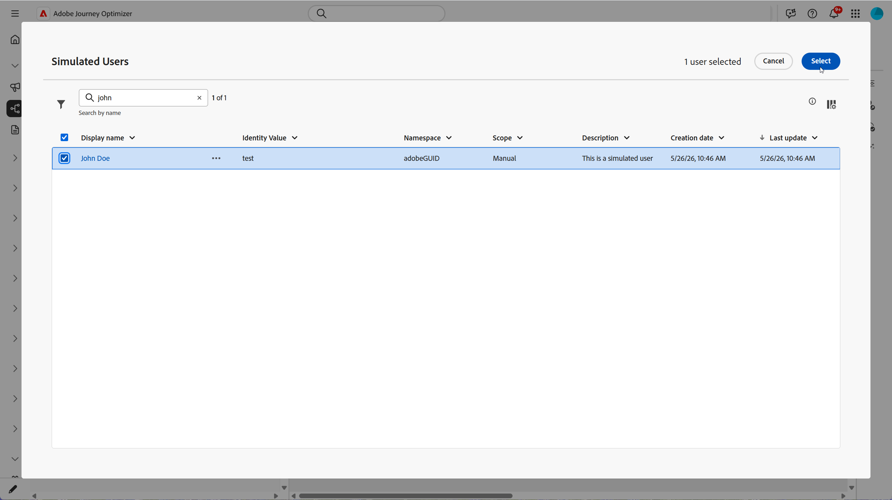
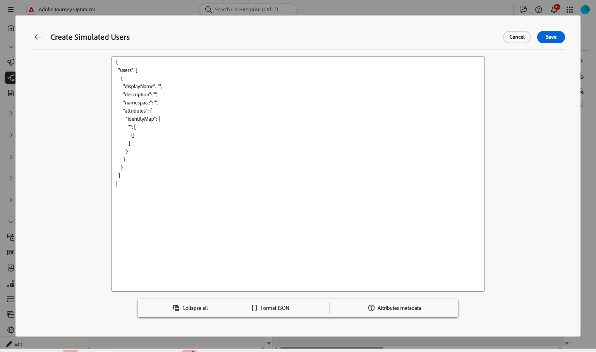

# Simular a jornada{#simulate-journey}

Use a **[!UICONTROL Simulação]** para validar sua jornada com **usuários simulados** antes de publicar. Esta página o orienta durante a **[!UICONTROL Simulação rápida]** e a **[!UICONTROL Simulação manual]**, criando e enviando usuários simulados, acionando eventos unitários quando a jornada precisar deles e revisando o log de **[!UICONTROL Resultados]**.

Para obter uma visão geral por tipo de jornada, consulte [Introdução à simulação de Jornada](simulate-journey-gs.md).

## Tipos de simulação {#simulation-types}

Após a ativação, as jornadas em lote com entrada de público-alvo de leitura oferecem duas maneiras de executar uma simulação:

* A **[!UICONTROL Simulação rápida]** é executada de ponta a ponta com usuários gerados e padrões. Observe que a simulação rápida não está disponível com jornadas unitárias.

* **[!UICONTROL A simulação manual]** permite escolher os usuários, enviar pedido, cargas de evento e aguardar substituições passo a passo.

### Simulação rápida {#quick-simulation}

Em uma jornada em lote em **[!UICONTROL Simulação]**, a **[!UICONTROL Simulação rápida]** executa a jornada com usuários gerados e configurações preenchidas previamente.

1. Selecione **[!UICONTROL Simulação rápida]**.

1. Revise os campos que o Adobe Journey Optimizer reuniu para a execução. Clique em **[!UICONTROL Atualizar valores]** para alterar as configurações de prova ou canal ou continuar sem alterações.

   

1. Se você abriu **[!UICONTROL Atualizar valores]**, edite as configurações, por exemplo, o endereço usado para provas de mensagem e, em seguida, confirme para iniciar a simulação.

   

1. O Adobe Journey Optimizer gera usuários simulados a partir da definição da jornada e aciona cada usuário na jornada.

1. Quando a execução for concluída, clique em **[!UICONTROL Exibir resultados]** para examinar caminhos, erros e ramificações descobertas. Ver [Exibir resultados](#viewing-results).

   

### Simulação manual {#manual-simulation}

Escolha **[!UICONTROL Simulação manual]** quando precisar escolher cada usuário simulado, controlar ordem de envio, configurar cargas de evento e substituir as durações de **[!UICONTROL Espera]** para a execução. Esse fluxo se aplica a jornadas em lote e unitárias.

Continue com [Criar e gerenciar usuários simulados](#test-users), [Acionar seus eventos](#firing_events) e [Exibir resultados](#viewing-results).

## Criar e gerenciar usuários simulados {#test-users}

>[!IMPORTANT]
>
>Você precisa de pelo menos uma das seguintes permissões para acessar o recurso **[!UICONTROL Simulação]**: **Simular jornadas**, **Publicar jornadas** ou **Aprovar e Publicar jornadas**. [Saiba mais](../administration/permissions.md)

Os usuários simulados são entidades temporárias semelhantes a perfis definidas em **[!UICONTROL Configurações de simulação]**. Esta seção aborda como criá-los, salvá-los para reutilização, ajustá-los ou removê-los da lista e enviá-los para a jornada.

1. Comece preenchendo a lista **[!UICONTROL Usuários de teste]**:

   +++ Gerar usuários com IA

   O Adobe Journey Optimizer gera um conjunto de usuários simulados a partir da definição de jornada.

   Para jornadas com um nó de Email ou SMS, a IA solicita que você confirme o endereço de email ou o número de telefone a ser usado. Depois de concluído, clique em **[!UICONTROL Gerar]**.

   

   +++

   +++ Procurar inventário

   Escolha **[!UICONTROL Procurar inventário]** para adicionar usuários simulados que você já salvou, por exemplo, usuários criados a partir de um formulário ou JSON ou usuários mantidos após a execução de uma geração de IA.

   

   +++

   +++ Criar a partir do formulário

   1. Insira um **[!UICONTROL Nome de exibição]** e **[!UICONTROL Descrição]** para identificar este usuário simulado.

      

   1. Em seguida, selecione os atributos do esquema Union que deseja preencher para este usuário.

   1. Clique em **[!UICONTROL Adicionar associação de público-alvo]** para simular associações de segmento.

   1. Clique em **[!UICONTROL Adicionar perfil]** para criar vários usuários simulados em uma única sessão.

   1. No menu, use **[!UICONTROL Duplicar]** para copiar um usuário, **[!UICONTROL Aplicar a todos]** para copiar os atributos de um usuário para todos os outros usuários na sessão ou **[!UICONTROL Excluir]** para remover um usuário.

      

   1. Clique em **[!UICONTROL Salvar]** quando terminar de configurar os usuários nesta sessão.

   +++

   +++ Criar a partir de JSON

   Defina novos usuários simulados atualizando os campos correspondentes com os dados do usuário simulados.

   

   +++

1. Os usuários simulados que você criou aparecem na lista **[!UICONTROL Usuários de teste]**. Para cada entrada, selecione uma das seguintes opções:

   * : atualizar os detalhes do usuário simulado.
   * : Executar a simulação somente para este usuário simulado.
   * : Remova o usuário desta lista. O usuário simulado não é excluído e permanece disponível na seleção Usuários simulados.

   

1. Para alterar a lista após sua seleção, clique em **[!UICONTROL Gerenciar usuários]** para adicionar mais usuários simulados, a partir do inventário ou criando novos. Para remover todos os usuários da lista de **[!UICONTROL Usuários de teste]** para esta execução, escolha **[!UICONTROL Limpar todos os usuários]**.

   

1. Se sua jornada incluir uma atividade **[!UICONTROL Aguardar]**, abra a guia **[!UICONTROL Configurações de teste]** para ajustar quanto tempo a espera dura durante a simulação. Por exemplo, se a atividade ativa **[!UICONTROL Wait]** estiver configurada por vários dias, você poderá substituí-la por 10 segundos para que o usuário simulado passe somente esse tempo no nó antes de passar para a próxima atividade.

1. Clique em **[!UICONTROL Enviar tudo]** para enviar todos os usuários simulados da lista para a jornada ou clique em  em uma linha para enviar somente esse usuário. Uma mensagem de confirmação `Simulated users have entered the journey successfully.` é exibida quando os usuários simulados entram com êxito na jornada.

   

1. Se a jornada incluir eventos unitários, será necessário selecionar o evento a ser acionado. Consulte [Acionar seus eventos](#firing_events).

1. Acesse a guia **[!UICONTROL Resultados]** para abrir o log de execução e analisar como cada etapa foi executada. Para obter mais informações, consulte [Exibir resultados](#viewing-results).

Depois de validar a jornada em **[!UICONTROL Simulação]**, examine o log de **[!UICONTROL Resultados]**. Se ocorrerem erros, deixe **[!UICONTROL Simulação]**, aplique as alterações necessárias à jornada e execute **[!UICONTROL Simulação]** novamente até que a execução pareça correta. Em seguida, você pode publicar a jornada. Consulte [Publicar sua jornada](../building-journeys/publish-journey.md).

## Acionar os eventos {#firing_events}

Se a jornada incluir um ou mais eventos unitários, você os acionará enquanto a Simulação estiver ativa.

1. Em **[!UICONTROL Selecionar tipo de evento]**, selecione o evento a ser acionado para esta simulação.

   

1. Para aplicar a mesma alteração a todos os usuários da lista, use a opção **[!UICONTROL Gerenciar eventos]** para:

   * **[!UICONTROL Gerar valores de evento]** para permitir que o Adobe Journey Optimizer gere a carga usando IA. Quando os valores são gerados, o usuário é marcado como **[!UICONTROL Pronto para enviar]**.
   * **[!UICONTROL Edite a data do evento]** para alterar a carga somente desse usuário simulado.

   

1. Configure a carga do evento para cada usuário clicando no  ao lado de um usuário para:

   * **[!UICONTROL Gerar valores de evento]** para permitir que o Adobe Journey Optimizer gere a carga usando IA. Quando os valores são gerados, o usuário é marcado como **[!UICONTROL Pronto para enviar]**.
   * **[!UICONTROL Edite a data do evento]** para alterar a carga somente desse usuário simulado.

   

1. Em **[!UICONTROL Eventos de teste]**, selecione **[!UICONTROL Enviar todos]** para enviar todos os usuários simulados listados em **[!UICONTROL Usuários de teste]** para a jornada, ou selecione  para que um único usuário execute a simulação somente para ele.

   

1. Depois que os eventos são acionados, a tela é atualizada para refletir a progressão de cada usuário. Clique em qualquer linha da lista **[!UICONTROL Usuários de teste]** para ver o novo caminho que o usuário tomou pela jornada.

1. Acesse a guia **[!UICONTROL Resultados]** para abrir o log de execução e analisar como cada etapa foi executada. Para obter mais informações, consulte [Exibir resultados](#viewing-results).

## Exibir resultados {#viewing-results}

A guia **[!UICONTROL Resultados]** permite exibir os resultados do teste. No menu suspenso **[!UICONTROL Usuário de teste]**, selecione o usuário simulado cuja execução você deseja inspecionar.

Selecione **[!UICONTROL Todos]** para ver os resultados agregados em cada usuário simulado na execução. Essa exibição ajuda a examinar a simulação completa num relance, atividades, resultados e erros, sem escolher um único usuário simulado primeiro.

Para cada atividade, o log pode mostrar se o usuário simulado entrou ou saiu da etapa e os erros que ocorreram durante a simulação.

Para atividades de **Aguardar**, o log inclui dois valores relacionados à duração:

* **Duração definida**: a duração especificada na atividade **Wait** para a jornada publicada e aplicada quando a jornada estiver ativa. O log registra se Simulation aplica uma substituição das configurações de teste, por exemplo, 10 segundos, em vez de depender exclusivamente do valor definido na jornada.
* **Duração real**: o tempo decorrido em que o usuário simulado permaneceu na atividade **Wait**. Este valor é definido na guia **[!UICONTROL Configurações de teste]**.

Quando aparecerem erros no log, deixe **Simulação**, aplique as alterações necessárias à jornada e execute **Simulação** novamente. Após a validação ser bem-sucedida, publique a jornada. Consulte [Publicar sua jornada](../building-journeys/publish-journey.md).
