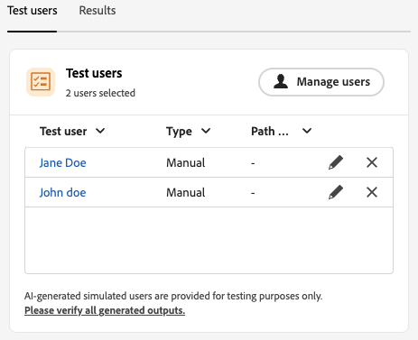
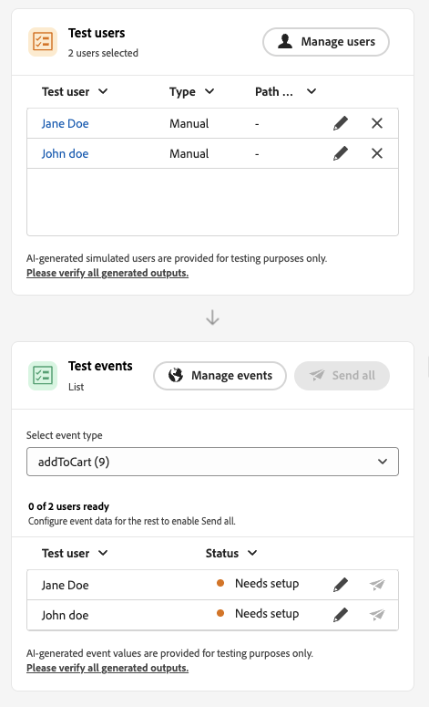

# Introdução à simulação de Jornada {#simulate-journey-gs}

>[!BEGINSHADEBOX]

**Nesta página:** saiba como a simulação de jornada permite testar com usuários simulados e como a experiência de simulação varia dependendo do tipo de jornada, antes de publicar.

>[!ENDSHADEBOX]

>[!IMPORTANT]
>
>* Para usar a **[!UICONTROL Simulação]**, atribua pelo menos uma permissão do recurso **[!UICONTROL Jornada]**: **Simular jornada**, **Publicar jornada** ou **Aprovar e Publicar jornada**. As mesmas permissões permitem criar e gerenciar usuários simulados, **[!UICONTROL Usuários Simulados]** permissões não são necessárias. [Saiba mais](../administration/permissions.md)
>
>* Para gerenciar usuários simulados sem **[!UICONTROL Simulação]**, atribua **Gerenciar Usuários Simulados** ou **Exibir Usuários Simulados** a partir do recurso **[!UICONTROL Usuários Simulados]**.
>
>* Para a IA na simulação (**[!UICONTROL Simulação rápida]**, usuários gerados pela IA, **[!UICONTROL Gerar valores de evento]**), atribua **[!UICONTROL Gerar conteúdo]** pelo recurso **[!UICONTROL Assistente de IA]**.

Você pode definir a jornada como **[!UICONTROL Simulação]** além de **Rascunho**, **Modo de teste** e **Live**. Em Simulação, você testa com **usuários simulados**: entidades temporárias semelhantes a perfis que você adiciona, sem usar perfis de teste persistentes no Adobe Experience Platform.

A Adobe Journey Optimizer oferece duas maneiras de testar e validar sua jornada:

* **[Simulação](simulate-journey.md#test-users)**: use o recurso de jornada **[!UICONTROL Simulação]** e os usuários simulados sem perfis pré-criados no Adobe Experience Platform, com suporte para usuários habilitados por IA e criados manualmente.

* **[Modo de teste](testing-the-journey.md)**: use perfis persistentes sinalizados como perfis de teste no Adobe Experience Platform, reutilizáveis entre sessões. Escolha essa abordagem quando precisar de dados consistentes e predefinidos. [Saiba como criar perfis de teste](../audience/creating-test-profiles.md).

## Simulação por tipo de jornada {#by-journey-type}

O painel **[!UICONTROL Simulação]** mostra apenas as etapas necessárias para a jornada. Isso depende de como os perfis entram na jornada. A partir desses fatores, o Adobe Journey Optimizer exibe diferentes experiências de simulação. Expanda cada tipo abaixo para ver como a execução difere e quais painéis você usa.

Para obter detalhes, consulte [Simular sua jornada](simulate-journey.md).

+++ Jornada em lote com um público-alvo de leitura

A jornada é acionada por um **[!UICONTROL Público-alvo de leitura]** e a tela não tem atividades de evento unitárias. Durante a simulação, a população do público-alvo não é acionada. Somente usuários simulados entram na jornada.
Os usuários simulados selecionados para a simulação aparecem na seção **Usuários de teste**:

+++

+++ Jornada em lote com um público-alvo de leitura e eventos unitários

Uma jornada acionadora de segmento que inclui um ou mais eventos unitários no caminho. Primeiro, acione os usuários simulados para entrar na simulação e, em seguida, acionar os eventos para os usuários que aguardam em um nó de evento.
Os usuários simulados selecionados para a simulação e os eventos configurados estarão visíveis, respectivamente, nas seções Usuários de teste e Eventos de teste. A seção Eventos de teste não estará visível até que um usuário simulado entre na jornada.

+++

+++ Jornada unitária

A jornada começa com um evento unitário, não com um público lido. Um usuário simulado não entra na jornada até que o evento de início seja acionado para ele.
Os usuários simulados selecionados para a simulação e os eventos configurados estarão visíveis, respectivamente, nas seções **Usuários de teste** e **Eventos de teste**. A seção **Usuários de teste** não inclui uma ação para acionar um usuário simulado na jornada. Você aciona uma entrada de **Eventos de teste**.

+++

## Simulação de lançamento {#launch}

Alternar a jornada para **[!UICONTROL Simulação]** para testar com usuários simulados. As tarefas passo a passo são detalhadas em [Simular sua jornada](simulate-journey.md).

1. Na sua jornada, clique em **[!UICONTROL Simular]** e escolha **[!UICONTROL Simulação]**.

   

1. Aguarde a ativação ser concluída. Enquanto a jornada muda para **[!UICONTROL Simulação]**, os controles no painel são desabilitados e reabilitados automaticamente após a conclusão da ativação.

## Limitações {#limitations}

Nesta versão, a **[!UICONTROL Simulação]** talvez não ofereça suporte a todas as atividades, canais ou integrações compatíveis com o **[!UICONTROL Modo de teste]** ou uma jornada em tempo real, e o comportamento poderá mudar à medida que o recurso for amadurecendo. Use este artigo para fluxos de trabalho compatíveis.

Consulte os menus suspensos abaixo para saber mais sobre Limitações de simulação.

+++ Restrições no nível do nó

Alguns nós impedem que a **[!UICONTROL Simulação]** seja iniciada. Outros são executados em simulação com o comportamento descrito abaixo. Quando um nó precisar ser removido ou alterado antes da simulação, atualize a jornada primeiro.

| Nó restrito | Notas |
| --- | --- |
| Eventos comerciais | Você não pode executar jornadas que iniciam com um evento comercial em **[!UICONTROL Simulação]**. |
| ID complementar (várias reentradas) | **[!UICONTROL A simulação]** não é iniciada quando várias reentradas estão habilitadas e o mesmo usuário simulado pode ter várias instâncias ativas ao mesmo tempo. |
| Nó Content Decision | Remova ou altere esta atividade antes de simular a jornada. |
| Pesquisa de conjunto de dados | **[!UICONTROL A simulação]** não oferece suporte a pesquisas de conjuntos de dados de clientes por chave. Remova ou altere esta atividade antes de executar uma simulação. |
| **[!UICONTROL Otimizar]** atividade | Não há suporte para **[!UICONTROL Experimento]** e **[!UICONTROL regra de direcionamento]**. Remova ou altere o nó antes de simular.  Outros métodos **[!UICONTROL Otimizar]** se comportam da seguinte maneira:  **[!UICONTROL Divisão de porcentagem ]**: a Journey Agent cria um usuário simulado por ramificação, não de acordo com as porcentagens de ramificação. No tempo de execução, a avaliação ao vivo escolhe a ramificação e pode diferir do caminho gerado. Não é possível simular uma opção de ramificação. Para orientar os usuários, confie na ordem da ramificação na tela. A ramificação superior é sempre escolhida.  **[!UICONTROL Condição de tempo]**: as condições se aplicam no tempo de execução como em uma jornada em tempo real. Por exemplo, uma janela de 8:00 a 20:00 permite somente aos usuários passar enquanto a simulação é executada dentro dessa janela. Não é possível simular o tempo de execução. Defina a condição para corresponder à hora atual quando você testar.  **[!UICONTROL Condição de data ]**: as condições se aplicam em tempo de execução como em uma jornada em tempo real. Por exemplo, uma data de 8 de junho de 2026 permite que os usuários somente acessem quando a simulação for executada nessa data. Não é possível simular a data de execução. Defina a condição para a data atual ao testar.  **[!UICONTROL Limite de perfil]**: as limitações não são aplicadas durante a simulação. O Journey Agent cria um usuário simulado por ramificação. Não é possível simular uma opção de ramificação. Para orientar os usuários, confie na ordem da ramificação na tela. A ramificação superior é sempre escolhida. |
| Ramificações de tempo limite e erro | A Journey Agent não gera usuários para ramificações de tempo limite ou erro de atividades. Os usuários só inserem esses caminhos se ocorrer um tempo limite real ou um erro durante a simulação. |
| Ramificação de tempo limite (atividades de evento) | Os usuários simulados são criados, mas na **[!UICONTROL Simulação manual]** a Journey Agent não decide quem entra em uma ramificação de tempo limite de evento. Controle o caminho enviando ou não o evento. Por exemplo, para testar uma ramificação de tempo limite, aguarde o tempo limite configurado e não envie o evento. **[!UICONTROL A simulação rápida]** pode enviar ou reter eventos automaticamente para abranger ramificações de tempo limite. |
| Eventos de reação | Os eventos de reação são executados em simulação, mas a ação deve ocorrer na vida real. Por exemplo, uma reação de email **abrir** requer a abertura da mensagem de prova. Não é possível simular reações na interface da simulação. |
| Fontes de dados externas | As chamadas são executadas durante a simulação da mesma forma que em uma jornada em tempo real. As atividades downstream podem usar a resposta, mas você não pode simulá-la. Quando um valor de resposta alimenta uma atividade **[!UICONTROL Otimizar]**, o Journey Agent não pode inventar essa saída. Ele gera apenas entradas para a chamada. Por exemplo, se uma chamada pegar uma cidade de perfil e retornar o tempo, o Agente definirá uma cidade no usuário simulado e a chamada em tempo real retornará o tempo. |
| Ações personalizadas | O comportamento corresponde às fontes de dados externas. Chamadas de saída são executadas de verdade. O Journey Agent preenche as entradas. As saídas vêm da resposta em tempo real. Você não pode simular respostas. |
| Enriquecimento do atributo de público-alvo externo | As jornadas que usam atributos personalizados de fontes de público-alvo externas não iniciam em **[!UICONTROL Simulação]** quando esta validação se aplica. |

+++

 

+++ Limitações funcionais

Os recursos a seguir não têm suporte em **[!UICONTROL Simulação]**.

| Recurso | Notas |
| --- | --- |
| Critérios de saída | Os critérios de saída não são aplicados quando você executa **[!UICONTROL Simulação]**. |
| [!DNL Adobe Journey Optimizer] decisão dentro de uma ação, por exemplo, conteúdo de email com Adobe Journey Optimizer decisão | Provas de ação para conteúdo que usam a decisão [!DNL Adobe Journey Optimizer] não são geradas. |
| Simular uma resposta de ação personalizada | [!UICONTROL Por padrão, as ações personalizadas] executam uma chamada de saída real. Não há suporte para zombar da resposta para que nenhuma chamada externa seja executada. |
| Avaliação da política de consentimento | O consentimento não pode ser ridicularizado no nível do usuário simulado e as políticas de consentimento não são avaliadas durante a simulação. |
| Limite de jornada e arbitragem | Não avaliado nem aplicado durante a simulação. |
| Limite de frequência (por canal ou tipo de comunicação) | Não avaliado nem aplicado durante a simulação. |
| Gerenciamento, supressão e listas de permissões de recusa | Não avaliado nem aplicado durante a simulação. |
| Subdomínio dinâmico e atributos dinâmicos em configurações de canal | Não suportado. |
| Otimização de tempo de envio (STO) | Não avaliado nem aplicado durante a simulação. |
| Ferramentas de sandbox (copiar usuários simulados em sandboxes) | Não suportado. |
| Envio de onda em jornadas | Não suportado. |
| Horário de silêncio | Não avaliado nem aplicado durante a simulação. |
| Privacy Service | Os usuários simulados não são perfis persistentes compatíveis com o GDPR. Não inclua dados reais do cliente em usuários simulados. |

+++

 

+++ Medidas de proteção quantitativas 

Estas medidas de proteção se aplicam a **[!UICONTROL Simulação]**. As letras maiúsculas numéricas são aplicadas na interface do jornada e no tempo de execução. Os limites podem mudar em uma versão posterior. Se você estiver correndo perto de um teto, verifique o comportamento na sua sandbox.

| Grade de Proteção | Limite | Notas |
| --- | --- | --- |
| Máximo de usuários simulados que podem ser selecionados e acionados em um lote (jornadas em lote, fluxos acionados por eventos e fluxos de qualificação de público-alvo) | 20 | Contado para cada **[!UICONTROL Enviar todos]** ou **[!UICONTROL Acionar eventos selecionados]**, não um limite cumulativo para toda a jornada. |
| Máximo de usuários simulados por solicitação de geração | 50 | Máximo de usuários simulados que o Journey Agent gera em uma solicitação por meio de **[!UICONTROL Simulação rápida]** ou **[!UICONTROL Gerar com IA]** em **[!UICONTROL Simulação manual]**. Se a jornada tiver mais de **50** caminhos, o Journey Agent selecionará aleatoriamente caminhos para produzir esses **50** usuários simulados. |
| Máximo de usuários únicos simulados testados em uma única execução de simulação | 100 | Alcançando **100** usuários únicos em um bloco de execução **[!UICONTROL Selecione usuários simulados]** para novos usuários simulados. Se você estiver em **90**, poderá adicionar no máximo **10** antes do mesmo bloco. |
| Máximo de jornadas que podem ser executadas em **[!UICONTROL Simulação]** ao mesmo tempo em uma sandbox | 20 | O limite é compartilhado por cada jornada **[!UICONTROL Simulação]** nessa sandbox de uma só vez. |
| Máximo de usuários simulados ativos em uma sandbox | 2,000 | Máximo de usuários simulados que podem existir na sandbox de uma vez. A Adobe pode ajustar esse limite com base no feedback dos clientes. |
| Preenchimento prévio de evento (somente navegador) | — | Você pode preencher previamente os campos de carga útil do evento somente na interface de simulação baseada em navegador. Os valores pré-preenchidos permanecem nesse navegador e não são sincronizados com outros navegadores, dispositivos ou sessões, de modo que você pode ver dados de pré-preenchimento diferentes em cada local testado. |

+++
