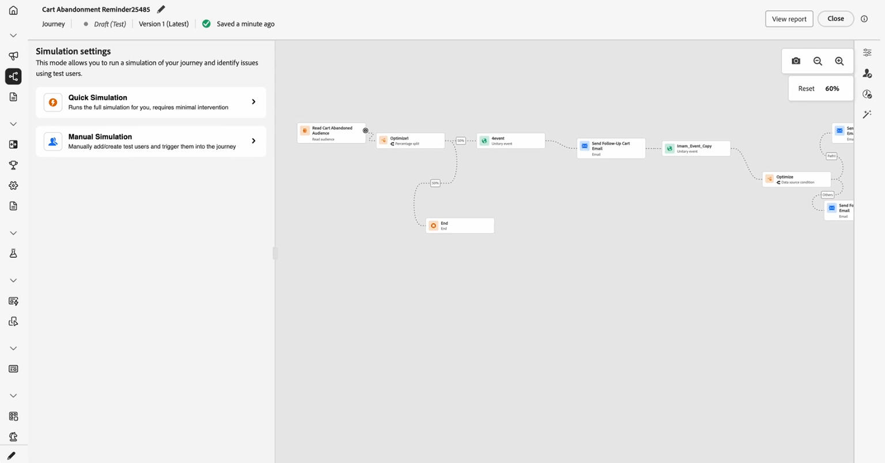

# Introdução à simulação de Jornada {#simulate-journey-gs}

Você pode definir a jornada como **[!UICONTROL Simulação]** além de **Rascunho**, **Modo de teste** e **Live**. Em Simulação, você testa com **usuários simulados**: entidades temporárias semelhantes a perfis que você adiciona, sem usar perfis de teste persistentes no Adobe Experience Platform.

A Adobe Journey Optimizer oferece duas maneiras de testar e validar sua jornada:

* **[Simulação](#test-users)**: use o recurso de jornada **[!UICONTROL Simulação]** e os usuários simulados para execuções rápidas sem perfis pré-criados no Adobe Experience Platform.

* **[Modo de teste](testing-the-journey.md)**: use perfis persistentes sinalizados como perfis de teste no Adobe Experience Platform, reutilizáveis entre sessões. Escolha essa abordagem quando precisar de dados consistentes e predefinidos. [Saiba como criar perfis de teste](../audience/creating-test-profiles.md).

## Simulação por tipo de jornada {#by-journey-type}

O painel **[!UICONTROL Simulação]** mostra apenas as etapas necessárias para a jornada. Isso depende de como os perfis entram na jornada. A partir desses fatores, o Adobe Journey Optimizer exibe diferentes experiências de simulação. Expanda cada tipo abaixo para ver como a execução difere e quais painéis você usa.

Para obter detalhes, consulte [Simular sua jornada](simulate-journey.md).

+++ Jornada em lote com um público-alvo de leitura

A jornada foi acionada por um **público-alvo de leitura**. A tela não tem atividades de evento unitárias. Os perfis se movem somente por condições, esperas e ações de canal.

Com a **jornada em lote com um público-alvo de leitura**, você pode acessar a Simulação rápida ou a Simulação manual.

+++

+++ Jornada em lote com um público-alvo de leitura e eventos unitários

Uma jornada acionadora de segmento que inclui um ou mais eventos unitários no caminho. Depois de enviar usuários para o, você aciona eventos para os usuários que aguardam em um nó de evento.

Com a **jornada em lote com um público-alvo de leitura e eventos unitários**, você pode acessar a Simulação rápida ou a Simulação manual.

+++

+++ Jornada unitária

A jornada **começa** com um evento unitário, não com um público lido. Um usuário simulado não entra na jornada até que o evento de início seja acionado para ele.

Com a **jornada Unitária**, você acessa diretamente o menu de simulação Manual.

+++

## Simulação de lançamento {#launch}

Alternar a jornada para **[!UICONTROL Simulação]** para testar com usuários simulados. As tarefas passo a passo são detalhadas em [Simular sua jornada](simulate-journey.md).

1. Na sua jornada, clique em **[!UICONTROL Simular]** e escolha **[!UICONTROL Simulação]**.

   

1. Aguarde a ativação ser concluída. Enquanto a jornada muda para **[!UICONTROL Simulação]**, os controles no painel são desabilitados e reabilitados automaticamente após a conclusão da ativação.

## Limitações {#limitations}

Nesta versão, a **[!UICONTROL Simulação]** talvez não ofereça suporte a todas as atividades, canais ou integrações compatíveis com o **[!UICONTROL Modo de teste]** ou uma jornada em tempo real, e o comportamento poderá mudar à medida que o recurso for amadurecendo. Use este artigo para fluxos de trabalho compatíveis.

Consulte os menus suspensos abaixo para saber mais sobre Limitações de simulação.

+++ Restrições no nível do nó

Se uma jornada contiver qualquer um dos nós a seguir, ela não poderá ser iniciada em **[!UICONTROL Simulation]**. A jornada deve ser modificada ou o nó relevante removido para que a simulação possa ser executada.

| Nó restrito | Notas |
| --- | --- |
| Eventos comerciais | As jornadas que começam com um evento comercial não podem ser executadas em **[!UICONTROL Simulação]**. |
| ID complementar (várias reentradas) | A reentrada simultânea (várias instâncias ativas para o mesmo usuário simulado) impede que a **[!UICONTROL Simulação]** seja iniciada. |
| Nó Content Decision | Esta atividade deve ser removida ou alterada antes que você possa simular a jornada. |
| Pesquisa de conjunto de dados | Não há suporte para pesquisas do conjunto de dados do cliente por chave; as jornadas que incluem esta atividade não podem ser executadas em **[!UICONTROL Simulação]**. |
| Experimentação de caminho (Otimizar — Variante de experimento) | Sem suporte em **[!UICONTROL Simulação]**. Você ainda pode usar **[!UICONTROL Otimizar]** para fluxos que viviam sob **[!UICONTROL Condição]** (por exemplo, condições da fonte de dados). |
| Direcionamento de caminho (Otimizar, Variante de regra de direcionamento) | Sem suporte em **[!UICONTROL Simulação]**. |
| Enriquecimento do atributo de público-alvo externo | As jornadas que usam atributos personalizados de fontes de público-alvo externas não serão iniciadas em **[!UICONTROL Simulação]** quando essa validação estiver ativa. |

+++

 

+++ Limitações funcionais

Os recursos a seguir não têm suporte em **[!UICONTROL Simulação]**.

| Recurso | Notas |
| --- | --- |
| Critérios de saída | Os critérios de saída não são aplicados quando você executa **[!UICONTROL Simulação]**. |
| [!DNL Adobe Journey Optimizer] decisão dentro de uma ação (por exemplo, conteúdo de email com a Adobe Journey Optimizer decisioning) | Provas de ação para conteúdo que usam a decisão [!DNL Adobe Journey Optimizer] não são geradas. |
| Simular uma resposta de ação personalizada | [!UICONTROL Por padrão, as ações personalizadas] executam uma chamada de saída real. Não há suporte para zombar da resposta para que nenhuma chamada externa seja executada. |
| Avaliação da política de consentimento | O consentimento não pode ser zombado no nível do usuário simulado. |
| Limite de jornada e arbitragem | Sem suporte em **[!UICONTROL Simulação]**. |
| Limite de frequência (por canal ou tipo de comunicação) | Sem suporte em **[!UICONTROL Simulação]**. |
| Gerenciamento, supressão e listas de permissões de recusa | Segue a configuração de roteamento de mensagens onde se aplica. |
| Subdomínio dinâmico e atributos dinâmicos em configurações de canal | Segue a configuração de roteamento de mensagens onde se aplica. |
| Otimização de tempo de envio (STO) | Sem suporte em **[!UICONTROL Simulação]**. |
| Ferramentas de sandbox (copiar usuários simulados em sandboxes) | Não suportado. |
| Envio de onda em jornadas | Não suportado. |
| Horário de silêncio | Não suportado. |
| Gerenciamento, supressão e listas de permissões de recusa | Não suportado. |
| Subdomínio dinâmico e atributos dinâmicos em configurações de canal | Não suportado. |
| Privacy Service | Os usuários simulados não são perfis persistentes compatíveis com o GDPR. Não inclua dados reais do cliente em usuários simulados. |

+++

 

+++ Medidas de proteção quantitativas 

Estas medidas de proteção se aplicam a **[!UICONTROL Simulação]**. As letras maiúsculas numéricas são aplicadas na interface do jornada e no tempo de execução. Os limites podem mudar em uma versão posterior; se você estiver correndo perto de um teto, verifique o comportamento na sandbox.

| Grade de Proteção | Limite | Notas |
| --- | --- | --- |
| Máximo de usuários simulados que podem ser selecionados e acionados em um lote (jornadas em lote, fluxos acionados por eventos e fluxos de qualificação de público-alvo) | 20 | Contado para cada **[!UICONTROL Enviar todos]** ou **[!UICONTROL Acionar eventos selecionados]**; não é um limite cumulativo para toda a jornada. |
| Máximo de usuários únicos simulados testados em uma única execução de simulação | 100 | Alcançando **100** usuários únicos em um bloco de execução **[!UICONTROL Selecione usuários simulados]** para novos usuários simulados. Se você estiver em **90**, poderá adicionar no máximo **10** antes do mesmo bloco. |
| Máximo de jornadas que podem ser executadas em **[!UICONTROL Simulação]** ao mesmo tempo em uma sandbox | 20 | O limite é compartilhado por cada jornada **[!UICONTROL Simulação]** nessa sandbox de uma só vez. |
| Máximo de usuários simulados ativos em uma sandbox | 2,000 | Máximo de usuários simulados que podem existir na sandbox de uma vez. A Adobe pode ajustar esse limite com base no feedback dos clientes. |
| Preenchimento prévio de evento (somente navegador) | — | Você pode preencher previamente os campos de carga útil do evento somente na interface de simulação baseada em navegador. Os valores pré-preenchidos permanecem nesse navegador e não são sincronizados com outros navegadores, dispositivos ou sessões, de modo que você pode ver dados de pré-preenchimento diferentes em cada local testado. |

+++
