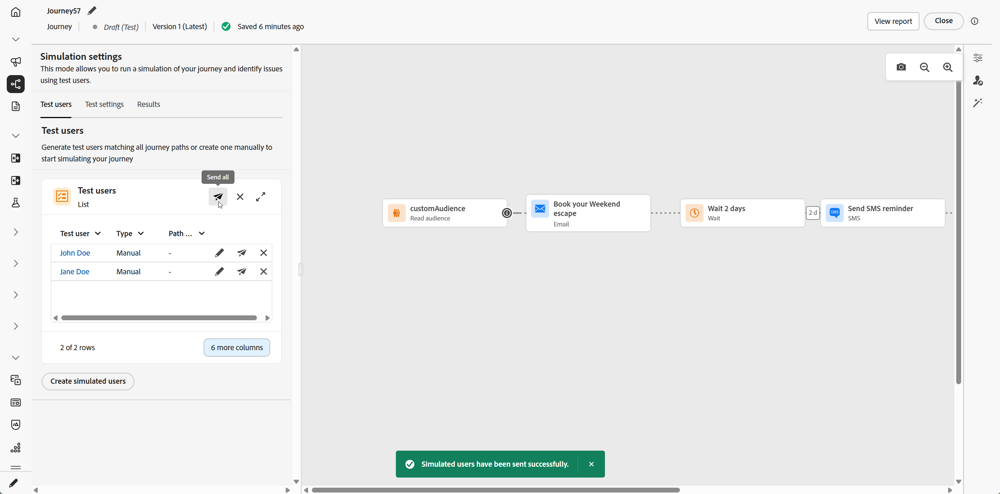
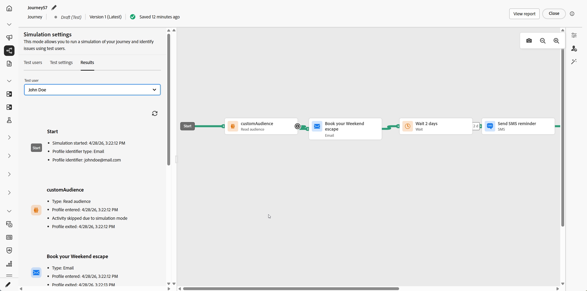

# Simular a jornada{#simulate-journey}

>[!IMPORTANT]
>
> Esse recurso está disponível para todos os clientes como uma Disponibilidade limitada com recursos essenciais.

Você pode definir a jornada como **[!UICONTROL Simulação]** além de **Rascunho**, **Modo de teste** e **Live**. Em Simulação, você testa com **usuários simulados**: entidades temporárias semelhantes a perfis que você adiciona, sem usar perfis de teste persistentes no Adobe Experience Platform.

A Adobe Journey Optimizer oferece duas maneiras de testar e validar sua jornada:

* **[Simulação](#test-users)**: use o recurso de jornada **[!UICONTROL Simulação]** e os usuários simulados para execuções rápidas sem perfis pré-criados no Adobe Experience Platform.

* **[Modo de teste](testing-the-journey.md)**: use perfis persistentes sinalizados como perfis de teste no Adobe Experience Platform, reutilizáveis entre sessões. Escolha essa abordagem quando precisar de dados consistentes e predefinidos. [Saiba como criar perfis de teste](../audience/creating-test-profiles.md).

Observe que a Simulação de Jornada está em **Disponibilidade limitada**. Para compartilhar feedback e nos ajudar a melhorar a experiência, abra o **[!UICONTROL Feedback]** na barra superior.

## Criar e gerenciar usuários simulados {#test-users}

>[!IMPORTANT]
>
>Você precisa da permissão **Simular jornadas** para acessar o recurso **[!UICONTROL Simulação]**. [Saiba mais](../administration/permissions.md)

Os usuários simulados são entidades temporárias semelhantes a perfis definidas em **[!UICONTROL Configurações de simulação]**. Esta seção aborda como criá-los a partir da interface ou de um arquivo JSON, salvá-los para reutilização, ajustá-los ou removê-los da lista e enviá-los para a jornada.

### Criar usuários simulados

As etapas a seguir mostram como criar usuários simulados por meio da interface ou importando um arquivo JSON.

1. Na sua Jornada, abra **[!UICONTROL Simular]** e escolha **[!UICONTROL Simulação]**.

   

1. Clique em **[!UICONTROL Criar Usuários Simulados]** para criar novos usuários e escolher se deseja criar usuários a partir da interface ou importá-los do JSON.

   Para reutilizar usuários simulados, clique em **[!UICONTROL Selecionar usuários simulados]** e escolha as entradas que você salvou anteriormente.

   

1. Se você criar usuários simulados do JSON, atualize os campos correspondentes com os dados do usuário simulados.

1. Se você criar usuários simulados na interface, digite um **[!UICONTROL Nome de exibição]** e uma **[!UICONTROL Descrição]** para identificar esse usuário simulado. Em seguida, selecione os atributos do esquema Union que deseja preencher para este usuário.

   

1. Clique em adicionar **[!UICONTROL Associação de público-alvo]** para simular associações de segmento.

1. Clique em **[!UICONTROL Adicionar perfil]** para criar vários usuários simulados em uma única sessão.

1. Para cada usuário simulado adicionado nesta sessão, você pode usar as seguintes ações:

   * **[!UICONTROL Duplicar]**: adiciona um novo usuário simulado que replica a configuração concluída de uma entrada existente, e você pode editar a duplicação conforme necessário.
   * **[!UICONTROL Aplicar a todos]**: propaga os valores ou configurações de atributo de um usuário simulado para todos os outros usuários simulados da lista.
   * **[!UICONTROL Excluir]**: remove da lista o usuário simulado selecionado.

1. Clique em **[!UICONTROL Salvar]** para armazenar um ou mais usuários simulados para uso futuro.

1. Após salvar, os usuários simulados criados aparecem na lista **[!UICONTROL Usuários de teste]**. Para cada entrada, abra o menu de opções e selecione uma das seguintes opções:

   * : atualizar os detalhes do usuário simulado.
   * : Executar a simulação somente para este usuário simulado.
   * : Remova o usuário desta lista. O usuário simulado não é excluído e permanece disponível na seleção Usuários simulados.

   

1. Se sua jornada incluir uma atividade **[!UICONTROL Aguardar]**, abra a guia **[!UICONTROL Configurações de teste]** para ajustar quanto tempo a espera dura durante a simulação.

1. Clique em **[!UICONTROL Enviar tudo]** para enviar todos os usuários simulados da lista para a jornada. Uma mensagem de confirmação `Simulated users have been sent successfully.` é exibida quando os usuários simulados entram com êxito na jornada.

   

1. Acesse a guia **[!UICONTROL Resultados]** para abrir o log de execução e analisar como cada etapa foi executada. Para obter mais informações, consulte [Exibir resultados](#viewing-results).

Depois de validar a jornada em **[!UICONTROL Simulação]**, examine o log de **[!UICONTROL Resultados]**. Se ocorrerem erros, deixe **[!UICONTROL Simulação]**, aplique as alterações necessárias à jornada e execute **[!UICONTROL Simulação]** novamente até que a execução pareça correta. Em seguida, você pode publicar a jornada. Consulte [Publicar sua jornada](../building-journeys/publish-journey.md).

### Selecionar usuários simulados

Os usuários simulados criados manualmente são armazenados e podem ser selecionados na lista quando a Simulação está habilitada em outras jornadas.

1. Defina a jornada como **[!UICONTROL Simulação]**. Abra o ponto de entrada **[!UICONTROL Simular]** e escolha **[!UICONTROL Simulação]** para que a jornada use o recurso Simulação, por exemplo, com o modo de Teste ou Ativo, dependendo do seu espaço de trabalho.

   

1. No painel **[!UICONTROL Configurações de simulação]**, você pode selecionar usuários simulados criados anteriormente clicando em **[!UICONTROL Selecionar usuários simulados]**.

   

1. Selecione na lista de usuários simulados que foram criados e salvos anteriormente.

1. Após selecionar os usuários simulados, eles agora estarão disponíveis na lista **[!UICONTROL Usuários de teste]**. No menu de opções, escolha entre as seguintes opções:

   *  para editar usuários e alterar seus detalhes.
   *  para enviar sua simulação para apenas um usuário simulado.
   *  para limpar da lista os usuários simulados. Observe que limpá-lo não o exclui, ele ainda pode ser selecionado na lista Usuários simulados.

   

1. Clique em **[!UICONTROL Enviar tudo]** para enviar todos os usuários simulados da lista para a jornada. Uma mensagem de confirmação `Simulated users entered the journey successfully.` é exibida quando os usuários simulados entram com êxito na jornada.

   

1. Acesse a guia **[!UICONTROL Resultados]** para abrir o log de execução e analisar como cada etapa foi executada. Para obter mais informações, consulte [Exibir resultados](#viewing-results).

Depois de validar a jornada em **[!UICONTROL Simulação]**, examine o log de **[!UICONTROL Resultados]**. Se ocorrerem erros, deixe **[!UICONTROL Simulação]**, aplique as alterações necessárias à jornada e execute **[!UICONTROL Simulação]** novamente até que a execução pareça correta. Em seguida, você pode publicar a jornada. Consulte [Publicar sua jornada](../building-journeys/publish-journey.md).

## Acionar os eventos {#firing_events}

Se sua jornada incluir um ou mais eventos, é possível acioná-los enquanto a Simulação estiver ativa.

1. Em **[!UICONTROL Selecionar tipo de evento]**, selecione o evento a ser acionado para esta simulação.

   

1. Clique em **[!UICONTROL Configurar eventos]** para abrir o editor e ajustar o evento conforme necessário. Para alterar a carga de um usuário simulado específico, clique em  ao lado desse usuário.

   

1. Na exibição **[!UICONTROL Evento de acionador]**, especifique quais usuários simulados incluir na execução. A configuração do evento se aplica a um único evento por vez. Modificar o evento selecionado ou o conjunto de usuários incluídos redefine os valores de campo inseridos anteriormente. Conclua a configuração atual antes de alterar qualquer seleção.

   

1. Clique em **[!UICONTROL Concluído]**.

1. Em seguida, em **[!UICONTROL Eventos de teste]**, selecione **[!UICONTROL Enviar todos]** para enviar todos os usuários simulados listados em **[!UICONTROL Usuários de teste]** para a jornada, ou selecione  para que um único usuário execute a simulação somente para ele.

1. Acesse a guia **[!UICONTROL Resultados]** para abrir o log de execução e analisar como cada etapa foi executada. Para obter mais informações, consulte [Exibir resultados](#viewing-results).

## Exibir resultados {#viewing-results}

A guia **[!UICONTROL Resultados]** permite exibir os resultados do teste. No menu suspenso **[!UICONTROL Usuário de teste]**, selecione o usuário simulado cuja execução você deseja inspecionar.

<!--
* **All simulated users**: Select **[!UICONTROL All]** to see results aggregated across every simulated user in the run. This view helps you scan the full simulation at a glance, activity, outcomes, and errors, without picking a single simulated user first.
-->

Para cada atividade, o log pode mostrar se o usuário simulado entrou ou saiu da etapa e os erros que ocorreram durante a simulação.

Para atividades de **Aguardar**, o log inclui dois valores relacionados à duração:

* **Duração definida**: a duração especificada na atividade **Wait** para a jornada publicada e aplicada quando a jornada estiver ativa. O log registra se Simulation aplica uma substituição das configurações de teste, por exemplo, 10 segundos, em vez de depender exclusivamente do valor definido na jornada.
* **Duração real**: o tempo decorrido em que o usuário simulado permaneceu na atividade **Wait**. Este valor é definido na guia **[!UICONTROL Configurações de teste]**.

Quando aparecerem erros no log, deixe **Simulação**, aplique as alterações necessárias à jornada e execute **Simulação** novamente. Após a validação ser bem-sucedida, publique a jornada. Consulte [Publicar sua jornada](../building-journeys/publish-journey.md).

## Limitações {#limitations}

Nesta versão, a **[!UICONTROL Simulação]** talvez não ofereça suporte a todas as atividades, canais ou integrações compatíveis com o **[!UICONTROL Modo de teste]** ou uma jornada em tempo real, e o comportamento poderá mudar à medida que o recurso for amadurecendo. Use os procedimentos deste artigo para workflows compatíveis.

Consulte os menus suspensos abaixo para saber mais sobre Limitações de simulação.

+++ Restrições no nível do nó

Se uma jornada contiver qualquer um dos nós a seguir, ela não poderá ser iniciada em **[!UICONTROL Simulation]**. A jornada deve ser modificada ou o nó relevante removido para que a simulação possa ser executada.

| Nó restrito | Notas |
| --- | --- |
| Eventos comerciais | As jornadas que começam com um evento comercial não podem ser executadas em **[!UICONTROL Simulação]**. |
| ID complementar (várias reentradas) | A reentrada simultânea (várias instâncias ativas para o mesmo usuário simulado) impede que a **[!UICONTROL Simulação]** seja iniciada. |
| Nó Content Decision | Esta atividade deve ser removida ou alterada antes que você possa simular a jornada. |
| Pesquisa de conjunto de dados | Não há suporte para pesquisas do conjunto de dados do cliente por chave; as jornadas que incluem esta atividade não podem ser executadas em **[!UICONTROL Simulação]**. |
| Experimentação de caminho (Otimizar — Variante de experimento) | Sem suporte em **[!UICONTROL Simulação]**. Você ainda pode usar **[!UICONTROL Otimizar]** para fluxos que viviam sob **[!UICONTROL Condição]** (por exemplo, condições da fonte de dados). |
| Direcionamento de caminho (Otimizar, Variante de regra de direcionamento) | Sem suporte em **[!UICONTROL Simulação]**. |
| Enriquecimento do atributo de público-alvo externo | As jornadas que usam atributos personalizados de fontes de público-alvo externas não serão iniciadas em **[!UICONTROL Simulação]** quando essa validação estiver ativa. |

+++

 

+++ Limitações funcionais

Os recursos a seguir não têm suporte em **[!UICONTROL Simulação]**.

| Recurso | Notas |
| --- | --- |
| Critérios de saída | Os critérios de saída não são aplicados quando você executa **[!UICONTROL Simulação]**. |
| [!DNL Adobe Journey Optimizer] decisão dentro de uma ação (por exemplo, conteúdo de email com a Adobe Journey Optimizer decisioning) | Provas de ação para conteúdo que usam a decisão [!DNL Adobe Journey Optimizer] não são geradas. |
| Simular uma resposta de ação personalizada | [!UICONTROL Por padrão, as ações personalizadas] executam uma chamada de saída real. Não há suporte para zombar da resposta para que nenhuma chamada externa seja executada. |
| Avaliação da política de consentimento | O consentimento não pode ser zombado no nível do usuário simulado. |
| Limite de jornada e arbitragem | Sem suporte em **[!UICONTROL Simulação]**. |
| Limite de frequência (por canal ou tipo de comunicação) | Sem suporte em **[!UICONTROL Simulação]**. |
| Gerenciamento, supressão e listas de permissões de recusa | Segue a configuração de roteamento de mensagens onde se aplica. |
| Subdomínio dinâmico e atributos dinâmicos em configurações de canal | Segue a configuração de roteamento de mensagens onde se aplica. |
| Otimização de tempo de envio (STO) | Sem suporte em **[!UICONTROL Simulação]**. |
| Ferramentas de sandbox (copiar usuários simulados em sandboxes) | Não suportado. |
| Envio de onda em jornadas | Não suportado. |
| Horário de silêncio | Não suportado. |
| Gerenciamento, supressão e listas de permissões de recusa | Não suportado. |
| Subdomínio dinâmico e atributos dinâmicos em configurações de canal | Não suportado. |
| Privacy Service | Os usuários simulados não são perfis persistentes compatíveis com o GDPR. Não inclua dados reais do cliente em usuários simulados. |

+++

 

+++ Medidas de proteção quantitativas 

Estas medidas de proteção se aplicam a **[!UICONTROL Simulação]**. As letras maiúsculas numéricas são aplicadas na interface do jornada e no tempo de execução. Os limites podem mudar em uma versão posterior; se você estiver correndo perto de um teto, verifique o comportamento na sandbox.

| Grade de Proteção | Limite | Notas |
| --- | --- | --- |
| Máximo de usuários simulados que podem ser selecionados e acionados em um lote (jornadas em lote, fluxos acionados por eventos e fluxos de qualificação de público-alvo) | 20 | Contado para cada **[!UICONTROL Enviar todos]** ou **[!UICONTROL Acionar eventos selecionados]**; não é um limite cumulativo para toda a jornada. |
| Máximo de usuários únicos simulados testados em uma única execução de simulação | 100 | Alcançando **100** usuários únicos em um bloco de execução **[!UICONTROL Selecione usuários simulados]** para novos usuários simulados. Se você estiver em **90**, poderá adicionar no máximo **10** antes do mesmo bloco. |
| Máximo de jornadas que podem ser executadas em **[!UICONTROL Simulação]** ao mesmo tempo em uma sandbox | 20 | O limite é compartilhado por cada jornada **[!UICONTROL Simulação]** nessa sandbox de uma só vez. |
| Máximo de usuários simulados ativos em uma sandbox | 2,000 | Máximo de usuários simulados que podem existir na sandbox de uma vez. A Adobe pode ajustar esse limite com base no feedback dos clientes. |
| Preenchimento prévio de evento (somente navegador) | — | Você pode preencher previamente os campos de carga útil do evento somente na interface de simulação baseada em navegador. Os valores pré-preenchidos permanecem nesse navegador e não são sincronizados com outros navegadores, dispositivos ou sessões, de modo que você pode ver dados de pré-preenchimento diferentes em cada local testado. |

+++
