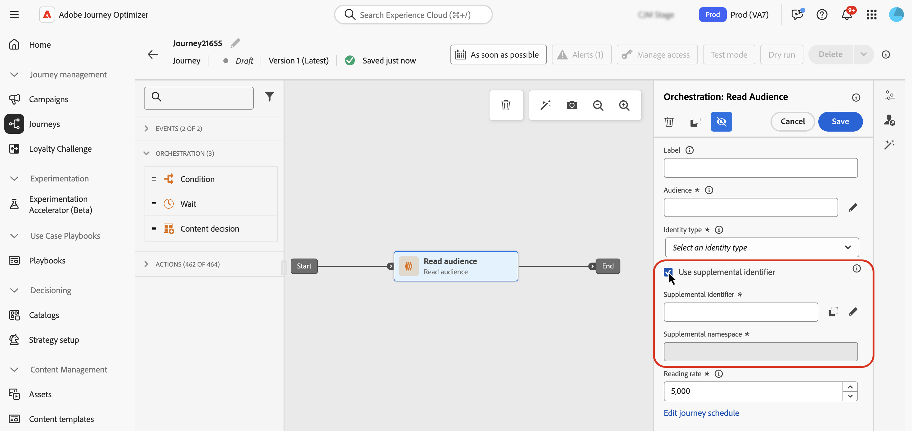

# Usar identificadores complementares em jornadas {#supplemental-id}

>[!BEGINSHADEBOX]

**Nesta página:** Saiba como usar identificadores complementares — identificadores secundários como uma ID de pedido ou de reserva — para executar uma instância do jornada separada por identificador e personalizar mensagens com seus atributos.

>[!ENDSHADEBOX]

>[!CONTEXTUALHELP]
>id="ajo_journey_parameters_supplemental_identifier"
>title="Usar identificador complementar"
>abstract="O identificador complementar é um identificador secundário que fornece contexto adicional para a execução de uma jornada. Para defini-lo, selecione qualquer atributo que não seja de identidade (ou identidade que não seja de pessoa) do público-alvo ou evento para usar como o identificador complementar."

<table style="border-collapse: collapse; width: 100%;">
  <tr>
    <td style="vertical-align: top; padding-right: 20px; border: none;">
      <p>Por padrão, as jornadas são executadas no contexto de uma <b>ID de perfil</b>. Isso significa que, desde que o perfil esteja ativo em uma determinada jornada, ele não poderá inserir outra jornada novamente. Para evitar isso, o Journey Optimizer permite capturar um <b>identificador complementar</b>, como uma ID de pedido, ID de assinatura, ID de receita, além da ID de perfil.  
      <p>Neste exemplo, adicionamos uma <b>ID de reserva</b> como identificador complementar.</p>
      <p>Ao fazer isso, as jornadas são executadas no contexto da ID de perfil associada ao identificador complementar (aqui, a ID de reserva). Uma instância da jornada é executada para cada iteração do identificador complementar. Isso permite várias entradas da mesma ID de perfil no jornada, caso tenham feito reservas diferentes.</p>
      <p>Além disso, o Journey Optimizer permite aproveitar os atributos do identificador complementar (por exemplo, número de reserva, data de renovação da prescrição, tipo de produto) para personalização de mensagens, garantindo comunicações altamente relevantes.</p>
    </td>
    <td style="vertical-align: top; border: none; text-align: center; width: 40%;">
      
    </td>
  </tr>
</table>

➡️ [Conheça este recurso no vídeo](#video)

## Medidas de proteção e limitações {#guardrails}

* **jornadas com suporte**: os identificadores complementares têm suporte para jornadas **acionadas por evento** e **Ler público**. Eles **não são suportados** para jornadas de qualificação de público-alvo (ou seja, jornadas que começam com uma atividade de qualificação de público-alvo).

* **Ações de entrada**: identificadores complementares não têm suporte atualmente para ações de entrada, como ações no aplicativo e na Web.

* **Limites de instância simultânea**: os perfis não podem ter mais de 10 instâncias de jornada simultâneas.

* **Tipo de dados e estrutura de esquema**: o identificador complementar deve ser do tipo `string`. Ele pode ser um atributo de string independente ou pode ser um atributo de string dentro de uma matriz de objetos. O atributo de string independente resultará em uma única instância de jornada, enquanto o atributo de string dentro de uma matriz de objetos resultará em uma instância de jornada exclusiva por iteração da matriz de objetos. Não há suporte para matrizes de cadeia de caracteres e mapas.

* **reentrada de Jornada**

  O comportamento de reentrada da jornada com identificadores complementares segue a política de reentrada existente:

   * Se a jornada não for reentrante, a mesma ID de perfil + ID complementar não poderá entrar na jornada novamente.
   * Se a jornada for reentrante com uma janela de tempo, a mesma combinação de ID de perfil + ID complementar poderá entrar novamente após a janela de tempo definida.

* **DULE (Rotulagem e Imposição de Uso de Dados)** - Nenhuma verificação de validação de DULE é executada na ID complementar. Isso significa que esse atributo não será considerado quando a jornada estiver procurando por violações da política de governança de dados.

* **Configuração de eventos downstream**

  Se você estiver usando outro evento downstream na jornada, ela deverá usar a mesma ID complementar e ter o mesmo namespace de ID.

* **Ler jornadas de público-alvo**

   * **Eventos comerciais**: a ID complementar estará desabilitada se você usar um evento comercial.
   * **Campos de evento e contexto**: o identificador complementar não deve ser originado de um campo de contexto de jornada ou evento.
   * **Seleção de atributo**: qualquer atributo que não seja de identidade (ou identidade que não seja de pessoa) pode ser usado como ID complementar para todos os tipos de público-alvo (Serviço de Perfil Unificado, importação de CSV e Composição de Público Federado). Atributos de identidade baseados em pessoas não são permitidos. Para públicos externos, consulte [Identificadores complementares com públicos externos](#external-audiences) para obter padrões de dados e requisitos de configuração compatíveis.
   * **Taxa de leitura**: para jornadas de leitura de público-alvo usando um campo de ID complementar do tipo matriz, a taxa de leitura da atividade Read audience é limitada a no máximo 500 perfis por segundo.

## Comportamento dos critérios de saída com IDs complementares {#exit-criteria}

Pré-condição: Jornada ativada para ID complementar (por meio de atividades de evento unitário ou público-alvo de leitura)

A tabela abaixo explica o comportamento dos perfis em uma jornada complementar habilitada para ID quando os critérios de saída são configurados:

| Configuração dos critérios de saída | Comportamento quando os critérios de saída são atendidos |
| ---------------------------- | ---------------------------------- |
| Com base em um evento de ID não complementar | Todas as instâncias do perfil correspondente nessa jornada são encerradas. |
| Com base em um evento de ID complementar <br/>*Observação: o namespace de ID complementar deve corresponder ao do nó inicial.* | Somente o perfil correspondente + instância de ID complementar é encerrado. |
| Com base em um público-alvo | Todas as instâncias do perfil correspondente nessa jornada são encerradas. |

## Adicionar um identificador complementar e aproveitá-lo em uma jornada {#add}

>[!BEGINTABS]

>[!TAB jornada acionada por evento]

Para usar um identificador complementar em uma jornada acionada por evento, siga estas etapas:

1. **Adicionar a ID complementar ao evento**

   1. Crie ou edite o evento desejado. [Saiba como configurar um evento unitário](../event/about-creating.md)

   1. Na tela de configuração do evento, marque a opção **[!UICONTROL Usar identificador complementar]**.

      

   1. Use o editor de expressão para selecionar o campo que deseja usar como a ID complementar (por exemplo, ID de reserva, ID de assinatura).

      >[!NOTE]
      >
      >Verifique se você está usando o editor de expressão no **[!UICONTROL modo Avançado]** para selecionar o atributo.

1. **Adicionar o evento à jornada**

   Arraste o evento configurado para a tela de jornada. Ela acionará uma entrada de jornada com base na ID do perfil e na ID complementar.

   

>[!TAB Ler jornada de público-alvo]

Para usar um identificador complementar em uma jornada Ler público, siga estas etapas:

1. **Adicionar e configurar uma atividade Ler público na jornada**

   1. Arraste uma atividade **[!UICONTROL Ler público-alvo]** na sua jornada.

   1. No painel de propriedades da atividade, alterne a opção **[!UICONTROL Usar identificador complementar]**.

      

   1. No campo **[!UICONTROL Identificador complementar]**, use o editor de expressão para selecionar o atributo de identificador complementar.

   Para públicos-alvo [importados de um arquivo CSV](https://experienceleague.adobe.com/docs/experience-platform/segmentation/ui/overview.html#import-audience){target="_blank"}, se o público-alvo de CSV contiver várias linhas por ID de perfil, verifique se a Ativação Expressa está habilitada primeiro. Consulte [Identificadores complementares com públicos-alvo externos](#external-audiences).

       >[!NOTE]
     >
     >Verifique se você está usando o editor de expressão em **[!UICONTROL Modo avançado]** para selecionar o atributo.
   
>[!ENDTABS]

## Aproveitar atributos de ID complementares

Use o editor de expressão e o editor de personalização para fazer referência a atributos do identificador complementar para personalização ou lógica condicional. Os atributos podem ser acessados pelo menu **[!UICONTROL Atributos contextuais]**.


Para jornadas acionadas por eventos se estiver trabalhando com arrays (por exemplo, várias receitas ou políticas), use uma fórmula para extrair elementos específicos.

+++ Ver exemplos

Em uma matriz de objetos com a ID complementar como `bookingNum` e um atributo no mesmo nível chamado `bookingCountry`, a jornada percorrerá o objeto de matriz com base no bookingNum e criará uma instância de jornada para cada objeto.

* A seguinte expressão na atividade de condição iterará por meio da matriz de objetos e verificará se o valor de `bookingCountry` é igual a &quot;FR&quot;:

  ```
  @event{<event_name>.<object_path>.<object_array_name>.all(currentEventField.<attribute_path>.bookingNum==${supplementalId}).at(0).<attribute_path>.bookingCountry}=="FR"
  ```

* A seguinte expressão no editor de personalização de email iterará por meio da matriz de objetos, obterá o `bookingCountry` aplicável à instância atual do jornada e o exibirá no conteúdo:

  ```
  {{#each context.journey.events.<event_ID>.<object_path>.<object_array_name> as |l|}} 
  
   {{l.<attribute_path>.bookingCountry}}  
  
  {{/each}}
  ```

* Exemplo do evento usado para acionar a jornada:

  ```
  "bookingList": [
        {
            "bookingInfo": {
                "bookingNum": "x1",
                      "bookingCountry": "US"
            }
        },
        {
            "bookingInfo": {
                "bookingNum": "x2",
                "bookingCountry": "FR"
            }
        }
    ]
  ```

+++

## ID suplementar e arbitragem de jornada {#arbitration}

A arbitragem de jornada (incluindo limites de simultaneidade e contagem de entradas em conjuntos de regras) opera no nível da ID de perfil, não no nível do par (ID de perfil, ID complementar). Isso significa que um limite de simultaneidade de 1 pode bloquear uma segunda instância do jornada para o mesmo perfil, mesmo quando ela carrega um valor de ID complementar diferente.

Entre em contato com seu representante da Adobe para obter orientação sobre o comportamento de arbitragem antes de depender de configurações de arbitragem específicas na produção.

**Documentação relacionada:**

* [Limite e arbitragem de jornada](../conflict-prioritization/journey-capping.md)
* [Trabalhar com conjuntos de regras](../conflict-prioritization/rule-sets.md)
* [Gerenciamento de conflitos e priorização](../conflict-prioritization/gs-conflict-prioritization.md)

## Identificadores complementares com públicos externos {#external-audiences}

A ID complementar é compatível com públicos externos, incluindo públicos [importados de um arquivo CSV](https://experienceleague.adobe.com/docs/experience-platform/segmentation/ui/overview.html#import-audience){target="_blank"} e públicos criados com [Composição de Público Federado](../audience/get-started-audience-orchestration.md). Ao configurar uma jornada que lê de um público de composição de público-alvo CSV ou Federated Audience, você pode designar qualquer atributo que não seja de identidade nesse público-alvo como a ID complementar. Em seguida, o Journey Optimizer cria uma instância do jornada separada por perfil exclusivo + combinação de ID complementar.

* Caso de uso 1: uma linha por perfil exclusivo + par de ID complementar

  Este é o principal caso de uso para públicos-alvo de CSV e Composição de público-alvo federado. O público-alvo contém várias linhas, onde cada linha representa uma combinação única de um perfil (por exemplo, um cliente) e uma ID complementar (por exemplo, uma ID de conta ou de pedido). Cada linha é tratada como um registro de ativação independente.

  | profile_id | account_id *(ID Suplementar)* | other_attributes |
  | --- | --- | --- |
  | customer_001 | ACC-1001 | .. |
  | customer_001 | ACC-1002 | .. |
  | customer_002 | ACC-2001 | .. |

  Neste exemplo, `customer_001` tem duas contas. O Journey Optimizer cria uma instância do jornada separada para cada perfil exclusivo + par `account_id`.

* Caso de uso 2: uma linha por perfil com uma matriz de IDs complementares

  Esse caso de uso está disponível para tipos de público-alvo que aceitam arrays. Uma única linha no público-alvo contém um perfil com um atributo de matriz que contém vários valores de ID complementares. O Journey Optimizer cria uma instância do jornada por valor na matriz.

  | profile_id | account_ids *(matriz, ID Suplementar)* | other_attributes |
  | --- | --- | --- |
  | customer_001 | [ACC-1001, ACC-1002] | .. |
  | customer_002 | [ACC-2001] | .. |

  Neste exemplo, o Journey Optimizer gera duas instâncias do jornada para `customer_001` (uma por ID de conta) e uma instância para `customer_002`. Isso se comporta de forma consistente com a forma como a ID complementar funciona para os públicos-alvo do Unified Profile Service.

### Como configurar {#external-configuration}

Para públicos-alvo de CSV que usam o Caso de uso 1 (em que o público-alvo intencionalmente contém várias linhas para a mesma ID de perfil), você deve ativar a Ativação expressa antes de configurar a jornada. Consulte o pré-requisito abaixo. Para todos os outros casos, configure a jornada diretamente.

+++ Pré-requisito: habilitar a Ativação expressa em públicos CSV por meio da API

>[!IMPORTANT]
>
>Esse pré-requisito se aplica somente a públicos-alvo de CSV nos quais o público-alvo intencionalmente contém várias linhas para a mesma ID de perfil (Caso de uso 1). Os públicos-alvo da Composição de público-alvo federado têm a Ativação expressa habilitada por padrão e não exigem essa etapa. A interface do portal de público-alvo não suporta a configuração `expressActivation` — você deve usar a API de público-alvo externa.

Você deve habilitar `expressActivation` no público-alvo no momento da criação. Isso instrui o Journey Optimizer a ativar cada registro independentemente, sem desduplicação por ID de perfil. Esse sinalizador não pode ser alterado após a criação do público-alvo.

Use a seguinte chamada de API ao criar o público-alvo:

Ponto de extremidade:

```http
POST https://platform.adobe.io/data/core/ais/external-audience
```

Cabeçalhos obrigatórios:

```http
Authorization: Bearer {ACCESS_TOKEN}
Content-Type: application/json
x-api-key: {API_KEY}
x-gw-ims-org-id: {IMS_ORG}
x-sandbox-name: {SANDBOX_NAME}
```

Corpo da solicitação (conjunto `expressActivation: true`):

```json
{
  "name": "my_audience_name",
  "fields": [ ... ],
  "sourceSpec": { ... },
  "audienceType": "people",
  "namespace": "CustomerAudienceUpload",
  "expressActivation": true
}
```

>[!NOTE]
>
>O padrão de `expressActivation` é `false`. Ele deve ser definido no momento da criação do público-alvo e não pode ser alterado após a criação. Todos os públicos-alvo da Composição de Público-Alvo Federado têm a Ativação Expressa habilitada por padrão e não exigem esse sinalizador.

Consulte a [documentação da API de criação de público-alvo externo](https://experienceleague.adobe.com/en/docs/experience-platform/segmentation/tutorials/create-external-audience#create){target="_blank"} para obter a referência completa.

+++

Para configurar a jornada:

1. Abra ou crie uma jornada com um nó **[!UICONTROL Read audience]**.
1. Nas configurações do nó **[!UICONTROL Ler público-alvo]**, selecione seu público-alvo CSV ou Federated Audience Composition.
1. Ative a opção **[!UICONTROL Usar identificador complementar]** e, no campo **[!UICONTROL Identificador complementar]**, use o editor de expressão no **[!UICONTROL Modo avançado]** para escolher o atributo que você deseja usar como identificador secundário (por exemplo, `account_id`, `order_number`).
1. O atributo selecionado é tratado como a ID complementar da jornada — nenhum registro de identidade é necessário.

### Comportamento de desduplicação {#external-dedup}

Quando um público-alvo tem a Ativação expressa ativada (sempre verdadeiro para a Composição de público-alvo federado - deve ser definido explicitamente para CSV), o Journey Optimizer lida com a desduplicação com base em como a jornada é configurada:

| Cenário | Exemplo de linhas de público | Comportamento |
| --- | --- | --- |
| **Jornada com ID complementar — sem pares duplicados (ID de perfil, ID complementar)** | (P1, S1), (P1, S2) | Caso de uso pretendido. O Journey Optimizer cria uma instância do jornada separada por perfil exclusivo + combinação de ID complementar. Todas as linhas são admitidas. |
| **Jornada com ID complementar — existem pares duplicados (ID de perfil, ID complementar)** | (P1, S1), (P1, S1), (P1, S2) | As linhas que compartilham a mesma combinação (ID de perfil, ID complementar) são filtradas pela lógica normal de reentrada da jornada. Somente a primeira linha correspondente por combinação única é admitida. |
| **Jornada sem ID complementar configurada** | (P1, S1), (P1, S2) | Sem uma ID complementar, o Journey Optimizer trata todas as linhas da mesma ID de perfil como o mesmo perfil. Somente uma instância do jornada por ID de perfil é admitida; linhas adicionais para o mesmo perfil são descartadas. |

## Exemplo de casos de uso

Estes exemplos mostram como os identificadores complementares suportam vários registros relacionados.

### **Notificações de renovação de política**

* **Cenário**: um provedor de seguro envia lembretes de renovação para cada política ativa mantida por um cliente.
* **Execução**:
   * Perfil: &quot;John&quot;.
   * IDs complementares: `"AutoPolicy123", "HomePolicy456"`.
   * O Jornada é executado separadamente para cada política, com datas de renovação personalizadas, detalhes de cobertura e informações sobre prêmios.

### **Gerenciamento de Assinaturas**

* **Cenário**: um serviço de assinatura envia mensagens personalizadas para cada assinatura quando um evento é acionado para essa assinatura.
* **Execução**:
   * Perfil: &quot;Jane&quot;.
   * IDs complementares: `"Luma Yoga Program ", "Luma Fitness Program"`.
   * Cada evento inclui uma ID de assinatura e detalhes sobre essa assinatura. O Jornada é executado separadamente para cada evento/assinatura, permitindo ofertas de renovação personalizadas por assinatura.

### **Recomendações de produto**

* **Cenário**: uma plataforma de comércio eletrônico envia recomendações com base em produtos específicos comprados por um cliente.
* **Execução**:
   * Perfil: &quot;Alex&quot;.
   * IDs complementares: `"productID1234", "productID5678"`.
   * O Jornada é executado separadamente para cada produto, com oportunidades personalizadas de venda adicional.

## Vídeo tutorial {#video}

Saiba como habilitar e aplicar um identificador complementar no [!DNL Adobe Journey Optimizer].

>[!VIDEO](https://video.tv.adobe.com/v/3464792?quality=12)

+++ Referência de conhecimento de IA

Esta seção contém conhecimento estruturado destinado a oferecer suporte à interpretação, recuperação e resposta a perguntas relacionadas a este tópico.

Para uma compreensão completa, essas informações devem ser combinadas com a documentação desta página. Nenhuma das origens deve ser independente; a página descreve o recurso, enquanto esta seção fornece um contexto adicional que ajuda a desfazer a ambiguidade da terminologia, intenção, aplicabilidade e restrições.

* **TL;DR:** Esta página explica como usar identificadores complementares no Adobe Journey Optimizer jornada para permitir que um único perfil tenha várias instâncias simultâneas do jornada, cada uma com escopo para uma ID secundária distinta, como uma reserva, assinatura ou ID de política.

**Intenções:**
* Entenda quando e por que usar um identificador complementar em vez de depender exclusivamente de uma ID de perfil
* Configure um identificador complementar em uma jornada acionada por evento marcando um atributo como uma identidade no esquema de evento
* Configure um identificador complementar em uma jornada Ler público ativando a opção na atividade Ler público
* Atributos de identificador de referência complementares para personalização de mensagens e lógica condicional usando o editor de expressão
* Aplique a sintaxe de expressão correta para iterar sobre matrizes de objetos digitadas por uma ID complementar
* Identificar medidas de proteção e limitações antes de implementar identificadores complementares em uma jornada

**Glossário:**
* **Identificador complementar**: um identificador secundário (por exemplo, ID de pedido, ID de reserva, ID de assinatura) usado junto com a ID de perfil para definir o escopo de uma instância do jornada para um registro específico, habilitando várias instâncias simultâneas por perfil *(específico do produto)*
* **ID de Perfil**: o identificador principal usado por padrão para executar jornadas; um perfil ativo em uma jornada não pode inserir outra jornada novamente sem uma ID complementar
* **Namespace de identificador que não seja de pessoa**: um namespace de identidade que não representa uma pessoa (necessário para IDs suplementares); deve ser diferente do namespace de identidade principal
* **namespace joai**: não aplicável a esta página (consulte a solução de problemas de ações de entrada)
* **DULE**: Rotulagem e Imposição de Uso de Dados — a estrutura de validação da política de governança de dados no Adobe Experience Platform; as IDs complementares não estão sujeitas às verificações DULE

**Medidas de Proteção:**
* Os identificadores complementares são compatíveis somente com jornadas de público-alvo de leitura e acionadas por eventos; não há suporte para jornadas de qualificação de público-alvo
* Um perfil não pode ter mais de 10 instâncias simultâneas do jornada
* Cada instância do jornada conta para o limite de frequência, mesmo quando criada por meio de identificadores complementares
* O identificador complementar deve ser do tipo `string`; matrizes de cadeias de caracteres e mapas não têm suporte
* O atributo ID complementar não deve ser marcado como identidade Primária no esquema
* O namespace usado para a ID complementar deve ser um namespace de identificador que não seja de pessoa
* Depois de aplicar o namespace de identidade que não seja de pessoa a um esquema, um novo evento ou grupo de campos deve ser criado; as entidades existentes não podem ser atualizadas
* Para jornadas de leitura de público-alvo com IDs complementares: a taxa de leitura é limitada a 500 perfis por segundo por instância do jornada; somente os públicos-alvo do Serviço de perfil unificado são compatíveis; a ID complementar deve ser um campo de perfil (não um campo de evento/contexto)
* Eventos downstream na mesma jornada devem usar a mesma ID complementar e o mesmo namespace
* A ID complementar está desabilitada para jornadas Ler público que usam um evento comercial

**Terminologia:**
* Nome canônico: Identificador complementar — Acrônimo: none — variantes: ID complementar, identificador secundário
* Sinônimos: &quot;identificador complementar&quot; = &quot;ID complementar&quot; (usado alternadamente na interface e na documentação)
* Não confunda: &quot;identificador suplementar&quot; ≠ &quot;identidade principal&quot; — a ID suplementar nunca deve ser marcada como a identidade principal no schema

**Perguntas frequentes:**
* **P: O que é um identificador complementar usado para?** — permite que um único perfil entre e execute uma jornada várias vezes simultaneamente, com cada instância atribuída a um registro secundário diferente, como uma reserva, uma assinatura ou uma ID de política.
* **P: Quais tipos de jornada oferecem suporte a identificadores complementares?** — jornadas acionadas por eventos e jornadas Read audience. As jornadas de qualificação de público-alvo não oferecem suporte a identificadores complementares.
* **P: Quantas instâncias simultâneas do jornada um perfil pode ter com identificadores complementares?** — Um máximo de 10 instâncias simultâneas do jornada por perfil.
* **P: Posso usar os atributos de ID complementares para a personalização da mensagem?** — Sim. Faça referência a eles pelo menu Contextual attributes no editor de expressão ou no editor de personalização.
* **P: A ID complementar precisa ser marcada como uma identidade principal no esquema?** — Não. Deve ser marcado como uma identidade, mas não deve ser definido como a identidade principal.
* **P: as políticas de governança DULE são aplicadas ao identificador complementar?** — Não. As verificações de validação de DULE não são executadas na ID complementar.

+++
