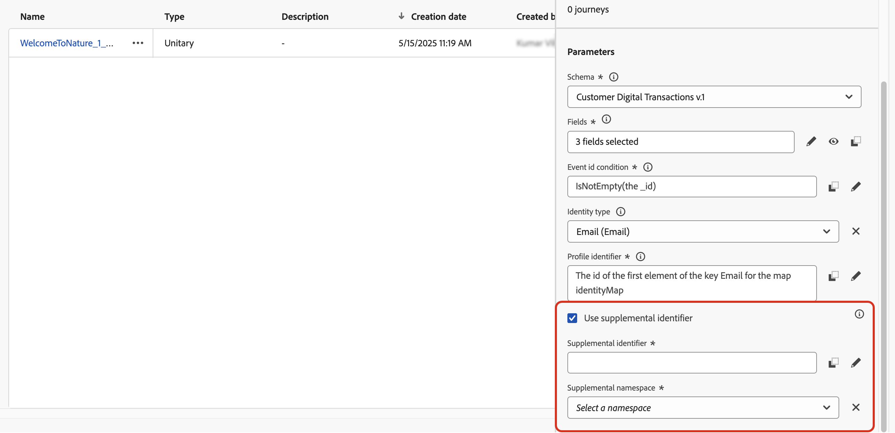
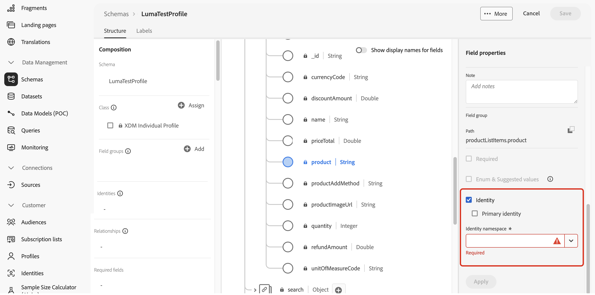
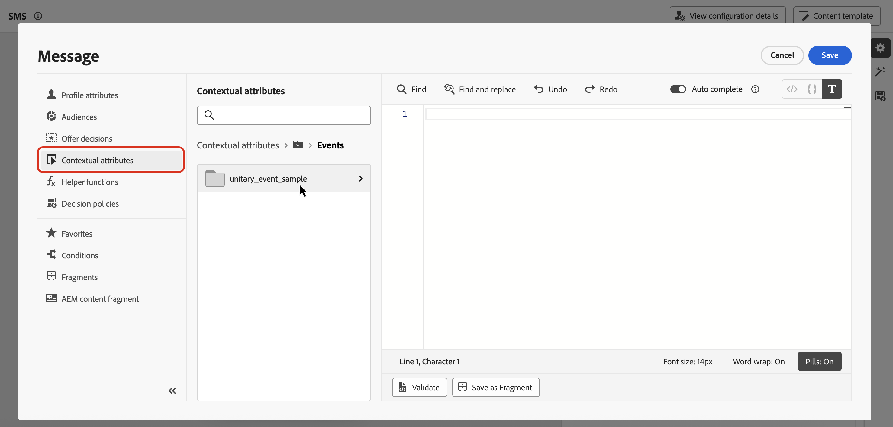

# Usar identificadores complementares em jornadas {#supplemental-id}

>[!CONTEXTUALHELP]
>id="ajo_journey_parameters_supplemental_identifier"
>title="Usar identificador complementar"
>abstract="O identificador complementar é um identificador secundário que fornece contexto adicional para a execução de uma jornada. Para defini-lo, selecione o campo a ser usado como o identificador complementar e escolha um namespace para associar a ele."

<table style="border-collapse: collapse; width: 100%;">
  <tr>
    <td style="vertical-align: top; padding-right: 20px; border: none;">
      <p>Por padrão, as jornadas são executadas no contexto de uma <b>ID de perfil</b>. Isso significa que, desde que o perfil esteja ativo em uma determinada jornada, ele não poderá inserir outra jornada novamente. Para evitar isso, o Journey Optimizer permite capturar um <b>identificador complementar</b>, como uma ID de pedido, ID de assinatura, ID de receita, além da ID de perfil.  
      <p>Neste exemplo, adicionamos uma <b>ID de reserva</b> como identificador complementar.</p>
      <p>Ao fazer isso, as jornadas são executadas no contexto da ID de perfil associada ao identificador complementar (aqui, a ID de reserva). Uma instância da jornada é executada para cada iteração do identificador complementar. Isso permite várias entradas da mesma ID de perfil no jornada, caso tenham feito reservas diferentes.</p>
      <p>Além disso, o Journey Optimizer permite aproveitar os atributos do identificador complementar (por exemplo, número de reserva, data de renovação da prescrição, tipo de produto) para personalização de mensagens, garantindo comunicações altamente relevantes.</p>
    </td>
    <td style="vertical-align: top; border: none; text-align: center; width: 40%;">
      
    </td>
  </tr>
</table>

➡️ [Conheça este recurso no vídeo](#video)

## Medidas de proteção e limitações {#guardrails}

* **jornadas com suporte**: os identificadores complementares têm suporte para jornadas **acionadas por evento** e **Ler público**. Eles **não são suportados** para jornadas de qualificação de público-alvo (ou seja, jornadas que começam com uma atividade de qualificação de público-alvo).

* **Limites de instância simultânea**: os perfis não podem ter mais de 10 instâncias de jornada simultâneas.

* **Regras de frequência**: cada instância do jornada criada a partir do uso de identificador complementar conta para o limite de frequência, mesmo que o uso de identificadores complementares resulte em várias instâncias do jornada.

* **Tipo de dados e estrutura de esquema**: o identificador complementar deve ser do tipo `string`. Ele pode ser um atributo de string independente ou pode ser um atributo de string dentro de uma matriz de objetos. O atributo de string independente resultará em uma única instância de jornada, enquanto o atributo de string dentro de uma matriz de objetos resultará em uma instância de jornada exclusiva por iteração da matriz de objetos. Não há suporte para matrizes de cadeia de caracteres e mapas.

* **reentrada de Jornada**

  O comportamento de reentrada da jornada com identificadores complementares segue a política de reentrada existente:

   * Se a jornada não for reentrante, a mesma ID de perfil + ID complementar não poderá entrar na jornada novamente.
   * Se a jornada for reentrante com uma janela de tempo, a mesma combinação de ID de perfil + ID complementar poderá entrar novamente após a janela de tempo definida.

* **DULE (Rotulagem e Imposição de Uso de Dados)** - Nenhuma verificação de validação de DULE é executada na ID complementar. Isso significa que esse atributo não será considerado quando a jornada estiver procurando por violações da política de governança de dados.

* **Configuração de eventos downstream**

  Se você estiver usando outro evento downstream na jornada, ela deverá usar a mesma ID complementar e ter o mesmo namespace de ID.

* **Ler jornadas de público-alvo**

   * A ID complementar estará desativada se você usar um evento comercial.
   * A ID complementar deve ser um campo do perfil (ou seja, não um campo de evento/contexto).
   * Para jornadas de público-alvo de leitura usando IDs complementares, a taxa de leitura da atividade de público-alvo de leitura para cada instância do jornada é limitada a no máximo 500 perfis por segundo.
   * Somente públicos-alvo do Serviço de Perfil Unificado são suportados ao usar jornadas de Leitura de público-alvo com IDs suplementares.

## Comportamento dos critérios de saída com IDs complementares {#exit-criteria}

Pré-condição: Jornada ativada para ID complementar (por meio de atividades de evento unitário ou público-alvo de leitura)

A tabela abaixo explica o comportamento dos perfis em uma jornada complementar habilitada para ID quando os critérios de saída são configurados:

| Configuração dos critérios de saída | Comportamento quando os critérios de saída são atendidos |
| ---------------------------- | ---------------------------------- |
| Com base em um evento de ID não complementar | Todas as instâncias do perfil correspondente nessa jornada são encerradas. |
| Com base em um evento de ID complementar <br/>*Observação: o namespace de ID complementar deve corresponder ao do nó inicial.* | Somente o perfil correspondente + instância de ID complementar é encerrado. |
| Com base em um público-alvo | Todas as instâncias do perfil correspondente nessa jornada são encerradas. |

## Adicionar um identificador complementar e aproveitá-lo em uma jornada {#add}

>[!BEGINTABS]

>[!TAB jornada acionada por evento]

Para usar um identificador complementar em uma jornada acionada por evento, siga estas etapas:

1. **Marcar o atributo como um identificador no esquema de evento**

   1. Acesse o esquema de evento e localize o atributo que deseja usar como um identificador complementar (por exemplo, ID de reserva, ID de assinatura) e marque-o como uma ID. [Saiba como trabalhar com esquemas](../data/get-started-schemas.md)

   1. Marcar o identificador como uma **[!UICONTROL Identidade]**.

      

      >[!IMPORTANT]
      >
      >Certifique-se de não marcar o atributo como **Identidade principal**.

   1. Selecione o namespace a ser associado à ID complementar. Deve ser um namespace de identificador não pessoal.

      Depois de aplicar o namespace de identidade não pessoal a um esquema, você deve criar um novo evento para usar o identificador complementar. As entidades existentes não podem ser atualizadas para reconhecer o novo identificador.

1. **Adicionar a ID complementar ao evento**

   1. Crie ou edite o evento desejado. [Saiba como configurar um evento unitário](../event/about-creating.md)

   1. Na tela de configuração do evento, marque a opção **[!UICONTROL Usar identificador complementar]**.

      

   1. Use o editor de expressão para selecionar o atributo marcado como a ID complementar.

      >[!NOTE]
      >
      >Verifique se você está usando o editor de expressão no **[!UICONTROL modo Avançado]** para selecionar o atributo.

   1. Depois de selecionar a ID complementar, o namespace associado é exibido na tela de configuração do evento como somente leitura.

1. **Adicionar o evento à jornada**

   Arraste o evento configurado para a tela de jornada. Ela acionará uma entrada de jornada com base na ID do perfil e na ID complementar.

   

>[!TAB Ler jornada de público-alvo]

Para usar um identificador complementar em uma jornada Ler público, siga estas etapas:

1. **Marcar o atributo como um identificador no esquema de união/perfil**

   1. Acesse o esquema de união/perfil e localize o atributo que deseja usar como um identificador complementar (por exemplo, ID de reserva, ID de assinatura) e marque-o como uma ID. [Saiba como trabalhar com esquemas](../data/get-started-schemas.md)

   1. Marcar o identificador como uma **[!UICONTROL Identidade]**.

      

      >[!IMPORTANT]
      >
      >Certifique-se de não marcar o atributo como **Identidade principal**.

   1. Selecione o namespace a ser associado à ID complementar. Deve ser um namespace de identificador não pessoal.

      Depois de aplicar o namespace de identidade que não seja de pessoa a um esquema, você deve criar um novo grupo de campos para usar o identificador complementar. As entidades existentes não podem ser atualizadas para reconhecer o novo identificador.

<!--1. **Add the supplemental ID field to the data source**

    1. Navigate to the **[!UICONTROL Configuration]** / **[!UICONTROL Data Sources]** menu, then locate the "ExperiencePlatformDataSource" data source.

        

    1. Open the field selector then select the attribute you want to use as a supplemental identifier (e.g., booking ID, subscription ID).-->

1. **Adicionar e configurar uma atividade Ler público na jornada**

   1. Arraste uma atividade **[!UICONTROL Ler público-alvo]** na sua jornada.

   1. No painel de propriedades da atividade, alterne a opção **[!UICONTROL Usar identificador complementar]**.

      

   1. No campo **[!UICONTROL Identificador de suplemento]**, use o editor de expressão para selecionar o atributo marcado como a ID complementar.

      >[!NOTE]
      >
      >Verifique se você está usando o editor de expressão no **[!UICONTROL modo Avançado]** para selecionar o atributo.

   1. Depois de selecionar a ID complementar, o namespace associado é exibido no campo **[!UICONTROL Namespace complementar]** como somente leitura.

>[!ENDTABS]

## Aproveitar atributos de ID complementares

Use o editor de expressão e o editor de personalização para fazer referência a atributos do identificador complementar para personalização ou lógica condicional. Os atributos podem ser acessados pelo menu **[!UICONTROL Atributos contextuais]**.



Para jornadas acionadas por eventos se estiver trabalhando com arrays (por exemplo, várias receitas ou políticas), use uma fórmula para extrair elementos específicos.

+++ Ver exemplos

Em uma matriz de objetos com a ID complementar como `bookingNum` e um atributo no mesmo nível chamado `bookingCountry`, a jornada percorrerá o objeto de matriz com base no bookingNum e criará uma instância de jornada para cada objeto.

* A seguinte expressão na atividade de condição iterará por meio da matriz de objetos e verificará se o valor de `bookingCountry` é igual a &quot;FR&quot;:

  ```
  @event{<event_name>.<object_path>.<object_array_name>.all(currentEventField.<attribute_path>.bookingNum==${supplementalId}).at(0).<attribute_path>.bookingCountry}=="FR"
  ```

* A seguinte expressão no editor de personalização de email iterará por meio da matriz de objetos, obterá o `bookingCountry` aplicável à instância atual do jornada e o exibirá no conteúdo:

  ```
  {{#each context.journey.events.<event_ID>.<object_path>.<object_array_name> as |l|}} 
  
   {{l.<attribute_path>.bookingCountry}}  
  
  {{/each}}
  ```

* Exemplo do evento usado para acionar a jornada:

  ```
  "bookingList": [
        {
            "bookingInfo": {
                "bookingNum": "x1",
                      "bookingCountry": "US"
            }
        },
        {
            "bookingInfo": {
                "bookingNum": "x2",
                "bookingCountry": "FR"
            }
        }
    ]
  ```

+++

## Exemplo de casos de uso

### **Notificações de Renovação de Política**

* **Cenário**: um provedor de seguro envia lembretes de renovação para cada política ativa mantida por um cliente.
* **Execução**:
   * Perfil: &quot;John&quot;.
   * IDs complementares: `"AutoPolicy123", "HomePolicy456"`.
   * O Jornada é executado separadamente para cada política, com datas de renovação personalizadas, detalhes de cobertura e informações sobre prêmios.

### **Gerenciamento de Assinaturas**

* **Cenário**: um serviço de assinatura envia mensagens personalizadas para cada assinatura quando um evento é acionado para essa assinatura.
* **Execução**:
   * Perfil: &quot;Jane&quot;.
   * IDs complementares: `"Luma Yoga Program ", "Luma Fitness Program"`.
   * Cada evento inclui uma ID de assinatura e detalhes sobre essa assinatura. O Jornada é executado separadamente para cada evento/assinatura, permitindo ofertas de renovação personalizadas por assinatura.

### **Recomendações de produto**

* **Cenário**: uma plataforma de comércio eletrônico envia recomendações com base em produtos específicos comprados por um cliente.
* **Execução**:
   * Perfil: &quot;Alex&quot;.
   * IDs complementares: `"productID1234", "productID5678"`.
   * O Jornada é executado separadamente para cada produto, com oportunidades personalizadas de venda adicional.

## Vídeo tutorial {#video}

Saiba como habilitar e aplicar um identificador complementar no [!DNL Adobe Journey Optimizer].

>[!VIDEO](https://video.tv.adobe.com/v/3464792?quality=12)
