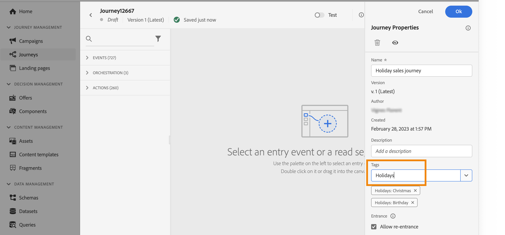

# Gerenciar tags no jornada {#journey_tags}

Como um profissional da Journey Optimizer, você pode organizar suas jornadas usando tags. Tags são uma maneira rápida e fácil de classificar objetos para melhorar a pesquisa.

## Tags versus convenções de nomenclatura {#tags-vs-naming}

As equipes geralmente dependem de convenções de nomenclatura complexas para armazenar metadados diretamente em nomes de jornadas — por exemplo: *Lifecycle Marketing - Educação - Integração do cliente V2 - Educação para aplicativos - 3º trimestre de 2025*. Embora bem-intencionada, essa abordagem tem um ponto fraco: à medida que o trabalho é dimensionado entre os membros da equipe, a convenção raramente é aplicada de forma consistente e as listas de jornadas se tornam difíceis de navegar.

**As categorias de marcas** no Journey Optimizer oferecem uma alternativa melhor. Em vez de codificar metadados no nome, você anexa tags categorizadas a cada jornada (por exemplo, equipe, objetivo, fase, trimestre) e usa filtros para localizá-las. Os nomes das jornadas podem então se concentrar no que realmente importa: o marco do cliente que está sendo conduzido.

Benefícios das categorias de tags em relação às convenções de nomenclatura:

* **Consistência** — as marcas são selecionadas em uma lista controlada, não são digitadas livremente.
* **Filterability** — qualquer combinação de valores de marca pode ser usada para dividir a lista de jornadas instantaneamente.
* **Clareza** — os nomes das jornadas permanecem curtos e focados em marcos.
* **Escalabilidade** — adicionar uma nova dimensão de metadados significa criar uma nova categoria de marca, e não regravar uma convenção de nomenclatura.

Para obter um fluxo de trabalho de configuração recomendado, consulte [Configurar categorias de marcas para gerenciamento de jornadas](#tags-setup) abaixo.

## Adicionar tags a uma jornada

O campo **Marcas**, nas propriedades da jornada, permite definir marcas para a jornada. É possível selecionar uma tag já existente ou criar uma nova. Comece a digitar o nome da tag desejada e selecione-a na lista. Se não estiver disponível, clique em **Criar** para criar um novo e adicioná-lo à jornada. É possível definir quantas tags forem necessárias.

A lista de tags definidas é exibida abaixo do campo **Tags**.

>[!NOTE]
>
> As tags não fazem distinção entre maiúsculas e minúsculas
> 
> Se você duplicar ou criar uma nova versão de uma jornada, as tags serão preservadas.

## Filtrar por tags

A lista de Jornadas exibe uma coluna dedicada para que você possa visualizar facilmente suas tags.

Um filtro também está disponível para exibir apenas jornadas com determinadas tags.

É possível adicionar ou remover tags de qualquer tipo de jornada (ativa, rascunho etc.). Clique no ícone **Mais ações** ao lado da jornada e selecione **Editar marcas**.

## Gerenciar tags

Os administradores podem excluir tags e organizá-las por categorias usando o menu **Tags** em **ADMINISTRAÇÃO**. Consulte esta [documentação](https://experienceleague.adobe.com/docs/experience-platform/administrative-tags/overview.html?lang=pt-BR).

>[!NOTE]
>
> As tags definidas no jornada são adicionadas à categoria &quot;Não categorizada&quot; integrada.

## Configurar categorias de tags para gerenciamento de jornadas {#tags-setup}

Siga estas etapas para substituir uma convenção de nomenclatura complexa por uma abordagem baseada em tags na sua equipe.

**Etapa 1 — Criar categorias de marca (Admin)**

Em **[!UICONTROL Administração]** > **[!UICONTROL Marcas]**, crie uma categoria para cada atributo de metadados que sua equipe codifica atualmente em nomes de jornadas — por exemplo: *Equipe*, *Objetivo de marketing*, *Campanha*, *Fase*, *Trimestre*.

**Etapa 2 — Preencher cada categoria com valores de marca (Admin)**

Em cada categoria, crie as tags que representam todos os valores possíveis. Por exemplo, a categoria *Fase* pode conter: *Percepção*, *Integração*, *Retenção*, *Win-back*.

**Etapa 3 — Aplicar marcas ao criar jornadas (Profissionais)**

Cada vez que uma nova jornada é criada, selecione a tag apropriada de cada categoria nas propriedades da jornada. Uma jornada normalmente carrega uma tag por categoria.

**Etapa 4 — jornadas de nome para o marco, filtrar por marcas**

Mantenha o nome da jornada focado no marco do cliente que ela direciona (por exemplo, *Primeira transação de fidelidade*). Use filtros de tags na lista de jornadas para localizar jornadas por qualquer combinação de metadados, sem depender da análise de nomes.

>[!TIP]
>
>Para uma discussão mais ampla desta abordagem e seus benefícios em escala, consulte [Práticas recomendadas para jornadas avançadas no Journey Optimizer](https://experienceleague.adobe.com/en/perspectives/best-practices-for-advanced-journeys-in-journey-optimizer){target="_blank"}.
