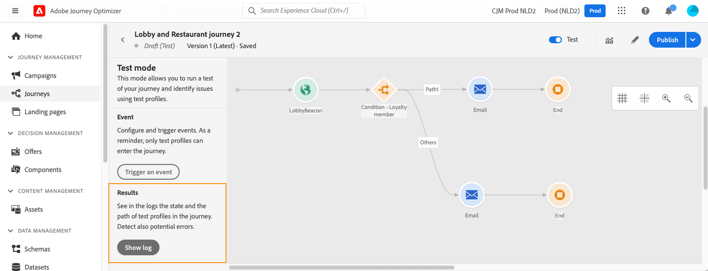
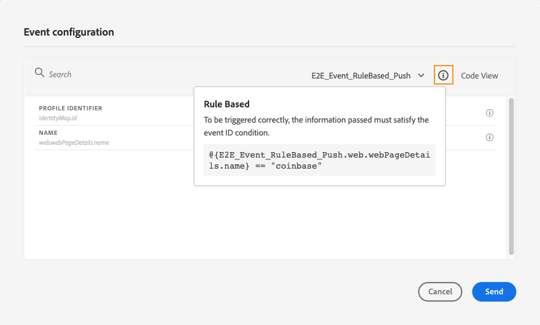
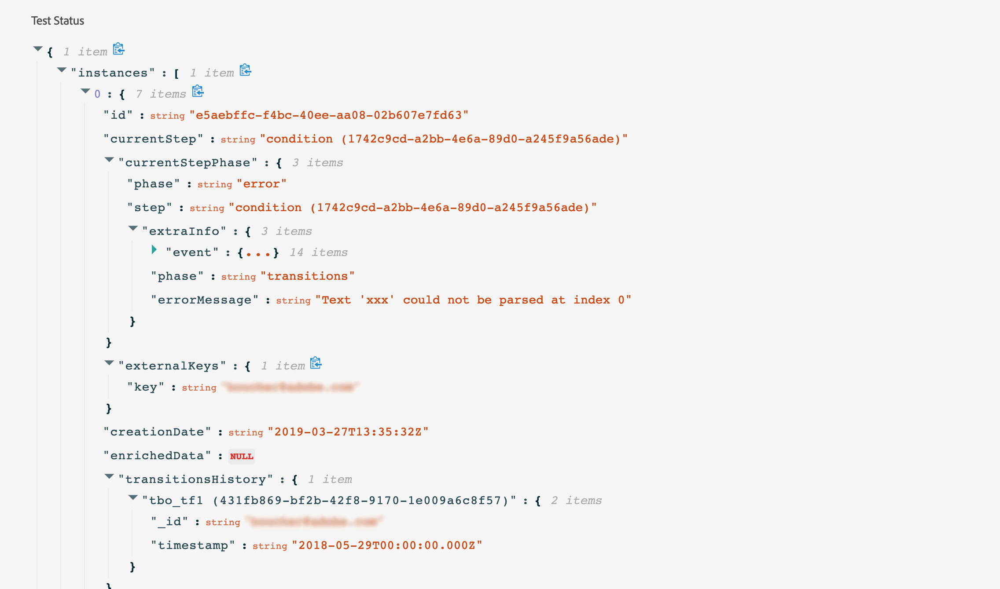

# Teste a jornada{#testing_the_journey}

>[!BEGINSHADEBOX]

**Nesta página:** saiba como validar sua jornada antes de publicá-la usando a simulação com usuários simulados ou o modo de teste com perfis de teste para detectar erros antecipadamente.

>[!ENDSHADEBOX]

>[!CONTEXTUALHELP]
>id="ajo_journey_test"
>title="Testar a jornada"
>abstract="Perfis de teste permitem testar a jornada antes de publicá-la. Isso permite analisar como as pessoas fluem na jornada e solucionam problemas antes da publicação."
>additional-url="https://experienceleague.adobe.com/pt-br/docs/journey-optimizer/using/orchestrate-journeys/create-journey/journey-dry-run" text="Teste de simulação de jornada"

Depois de criar a jornada, você pode testá-la antes de publicar. O [!DNL Adobe Journey Optimizer] oferece o &quot;Modo de teste&quot; como uma maneira de exibir perfis de teste conforme eles se movem ao longo da jornada, detectando possíveis erros antes da ativação. A execução de testes rápidos permite verificar se as jornadas funcionam corretamente para que você possa publicá-las com confiança.

Somente perfis de teste podem entrar em uma jornada no modo de teste. Você pode criar novos perfis de teste ou transformar perfis existentes em perfis de teste. Saiba mais sobre perfis de teste em [esta seção](../audience/creating-test-profiles.md).

O Adobe Jornada Otimizer oferece duas maneiras de testar e validar sua jornada:

* **[Simulação](simulate-journey.md#test-users)**: Defina a jornada como **[!UICONTROL Simulação]** e use usuários simulados (perfis temporários que você cria ou gera instantaneamente sem perfis pré-criados no Adobe Experience Platform).

* **[Modo de teste](#test-profiles)**: perfis persistentes explicitamente sinalizados como perfis de teste no Adobe Experience Platform. Eles podem ser reutilizados em várias sessões de teste. Esse método é recomendado para testes com dados de perfil consistentes e predefinidos. [Saiba como criar perfis de teste](../audience/creating-test-profiles.md).

>[!NOTE]
>
>Antes de testar a jornada, você deve resolver todos os erros, se houver. Saiba como verificar erros antes de testar em [esta seção](../building-journeys/troubleshooting.md). Se os perfis de teste não progredirem no modo de teste, consulte [solução de problemas de transições do modo de teste](troubleshooting-execution.md#troubleshooting-test-transitions).

## Observações importantes {#important_notes}

Revise essas notas antes de executar testes em sua jornada.

### Limitações gerais

* **Perfis de teste somente** - Somente indivíduos sinalizados como &quot;perfis de teste&quot; no Serviço de Perfil do Cliente em Tempo Real podem inserir uma jornada no modo de teste. [Saiba como criar perfis de teste](../audience/creating-test-profiles.md).
* **Requisito de namespace** - O modo de teste está disponível somente para jornadas de rascunho que usam um namespace. O modo de teste precisa verificar se uma pessoa que entra na jornada é um perfil de teste ou não e, portanto, deve ser capaz de alcançar [!DNL Adobe Experience Platform].
* **Limite de perfil** - Um máximo de 100 perfis de teste podem inserir uma jornada durante uma única sessão de teste.
* **Acionamento de evento** - Os eventos só podem ser acionados na interface. Eventos não podem ser disparados de sistemas externos usando uma API.
* **Públicos-alvo de carregamento personalizados** - o modo de teste de Jornada não oferece suporte ao enriquecimento de atributo de [público-alvo de carregamento personalizado](../audience/custom-upload.md).

### Comportamento durante e após o teste

* **Desabilitando o modo de teste** - Quando você desabilita o modo de teste, todos os perfis que estão ou foram inseridos na jornada são removidos e os relatórios são limpos.
* **Flexibilidade de reativação** - Você pode habilitar e desabilitar o modo de teste quantas vezes forem necessárias.
* **Desativação automática** — as Jornadas que permanecem inativas no modo de teste por **mais de uma semana** saem automaticamente do modo de teste e retornam ao status Rascunho. Nenhum conteúdo de jornada é perdido; somente a sessão do modo de teste termina.
* **Edição e publicação** - Enquanto o modo de teste estiver ativo, você não poderá modificar a jornada. No entanto, você pode publicar a jornada diretamente. Não é necessário desativar o modo de teste antes de.
* **Entrega de mensagem** - No modo de teste, as mensagens são enviadas para as caixas de entrada reais dos perfis de teste usando o mesmo pipeline de entrega que a produção. Isso é diferente de [Jornada Dry Run](journey-dry-run.md), que simula a execução da jornada sem entregar mensagens ou acionar ações de canal reais. Nenhum dos métodos replica cada aspecto de um envio em tempo real; use um ambiente de preparo para uma validação completa.

### Execução

* **Comportamento de divisão** - Quando a jornada atinge uma divisão, a ramificação superior é sempre selecionada no modo de teste. Isso não reflete o caminho selecionado estatisticamente durante a execução ao vivo. Reordene as ramificações se desejar que um caminho diferente seja testado.
* **Tempo do evento** - Se a jornada incluir vários eventos, acione cada evento em sequência. Enviar um evento muito cedo (antes da conclusão do primeiro nó de espera) ou muito tarde (após o tempo limite configurado) descartará o evento. O perfil será enviado para um caminho de tempo limite. Sempre confirme se as referências aos campos de payload do evento permanecem válidas, enviando o payload na janela definida.
* **Janela de data ativa** - Verifique se a janela [de datas/hora de início e término](journey-properties.md#dates) configurada da jornada inclui a hora atual ao iniciar o modo de teste. Caso contrário, os eventos de teste disparados serão descartados silenciosamente com a mensagem de log `DISPATCHER DISCARD #16 — unqualified on journey version enablements`. Para contornar isso durante o teste, defina temporariamente a data de início da jornada para uma hora antes do momento atual e, em seguida, restaure-a antes de publicar. Saiba mais sobre como solucionar esse problema [nesta página](troubleshooting-execution.md#troubleshooting-test-transitions).
* **Eventos de reação** - Para eventos de reação com tempo limite, o tempo de espera mínimo e padrão é de 40 segundos.
* **Conjuntos de dados de teste** - Os eventos acionados no modo de teste são armazenados em conjuntos de dados dedicados rotulados da seguinte maneira: `JOtestmode - <schema of your event>`
* **Infraestrutura compartilhada** - O Modo de Teste é executado na mesma infraestrutura que a produção. Durante períodos de alto tráfego, você pode notar atrasos nos envios de email ou no processamento de eventos. Nesse caso, verifique os painéis de tráfego da plataforma ou repita os testes fora do horário de pico.

<!--
* Fields from related entities are hidden from the test mode.
-->

## Ativar o modo de teste

Use o método **[!UICONTROL Modo de teste]** quando quiser testar sua jornada com perfis de teste pré-existentes que você já criou no Adobe Experience Platform.

1. Para ativar o modo de teste, clique no botão **[!UICONTROL Simular]** e selecione **[!UICONTROL Modo de teste]**.

   

1. Se a jornada tiver pelo menos uma atividade **Wait**, defina o parâmetro **[!UICONTROL Wait time]** para definir o tempo que cada atividade de espera e tempo limite de evento durarão no modo de teste. O tempo padrão é de 10 segundos para esperas e tempos limite de evento. Isso garantirá que você obtenha os resultados do teste rapidamente.

   

   >[!NOTE]
   >
   >Quando um evento de reação com um tempo limite é usado em uma jornada, o valor padrão e mínimo do tempo de espera é de 40 segundos. Consulte [esta seção](../building-journeys/reaction-events.md).

1. Use o botão **[!UICONTROL Acionar um evento]** para configurar e enviar eventos para a jornada.

   

1. Configure os diferentes campos esperados. No campo **Identificador de Perfil**, insira o valor do campo usado para identificar o perfil de teste. Pode ser o endereço de email, por exemplo. Envie eventos relacionados a perfis de teste. Consulte [esta seção](#firing_events).

   

1. Depois que os eventos forem recebidos, clique no botão **[!UICONTROL Mostrar log]** para exibir o resultado do teste e verificá-los. Consulte [esta seção](#viewing_logs).

   

1. Se houver algum erro, desative o modo de teste, modifique sua jornada e teste novamente. Depois que os testes forem concluídos, você poderá publicar sua jornada. Consulte [esta página](../building-journeys/publish-journey.md).

## Exemplo funcionado: validar uma jornada simples {#test-walkthrough}

O exemplo a seguir aborda o teste de uma jornada que começa com um evento unitário, envia um email, aguarda 10 minutos e envia uma notificação por push.

Para validar a jornada de ponta a ponta:

1. Ative o modo de teste clicando em **[!UICONTROL Modo de teste]** no canto superior direito. A tela muda para o modo de teste e um botão **[!UICONTROL Acionar um evento]** é exibido.
1. Defina o **[!UICONTROL Tempo de espera]** como **10 segundos** para que o nó de espera seja concluído rapidamente durante o teste.
1. Clique em **[!UICONTROL Acionar um evento]**, selecione seu evento e insira um identificador de perfil de teste (por exemplo, o endereço de email de um perfil sinalizado como perfil de teste no Adobe Experience Platform).
1. Clique em **[!UICONTROL Enviar]**. O fluxo visual é exibido na tela e fica verde à medida que o perfil avança em cada etapa.
1. Clique em **[!UICONTROL Mostrar log]** e confirme o seguinte na saída JSON:
   * `currentstep` corresponde à atividade na qual você espera que o perfil esteja.
   * `phase` mostra `running` enquanto o perfil está em um nó de espera e `finished` quando ele atinge o fim.
   * Nenhuma entrada `actionExecutionErrors` está presente.
1. Após 10 segundos, atualize o log. O perfil deve ter avançado após o nó de espera e acionado a ação de push.
1. Quando todas as etapas mostrarem `finished` e nenhum erro for registrado, desative o modo de teste e publique a jornada.

>[!TIP]
>
>Se o perfil não for exibido no log, verifique se:
>* O identificador de perfil inserido está sinalizado como um perfil de teste em [!DNL Adobe Experience Platform].
>* As datas de início e término configuradas da jornada incluem a hora atual. Os eventos acionados fora dessa janela são descartados silenciosamente. [Saiba mais](troubleshooting-execution.md#troubleshooting-test-transitions).

## Solução de problemas do modo de teste {#troubleshoot-test-mode}

Use essa tabela para autodiagnosticar falhas comuns do modo de teste antes de abrir um tíquete de suporte.

| Sintoma | Causa provável | Resolução |
| --- | --- | --- |
| O evento é enviado com sucesso, mas o perfil nunca é exibido no log de jornadas | Incompatibilidade de namespace no Identificador de perfil — o valor de namespace não corresponde ao namespace definido no esquema de evento | Verifique o formato do identificador: `@{<EventName>.identityMap.entry('<NamespaceName>').first().id}`. `<NamespaceName>` deve corresponder exatamente ao esquema do evento (diferencia maiúsculas de minúsculas). Consulte [Pré-requisitos](#trigger-events-prerequisites). |
| Eventos aceitos (resposta 200), mas o jornada nunca é acionado; o log mostra `DISPATCHER DISCARD #16 — unqualified on journey version enablements` | A data de início da jornada é definida no futuro; os eventos de teste são descartados silenciosamente fora da janela de data ativa | Defina temporariamente a data de início da jornada como anterior à hora atual. Restaure-o antes de publicar. Consulte [datas de jornada](journey-properties.md#dates). |
| Ler jornada de público mostra um log de avaliação de segmento em lote, mas nenhuma entrada de perfil | A avaliação de segmentos em lote é registrada separadamente da entrada de perfil individual; o log em lote não confirma se os perfis entraram na jornada | Aguarde até que a janela de processamento em lote seja concluída. Para obter feedback de log em tempo real, teste com uma jornada de evento unitária. |
| O modo de teste não pode ser habilitado; erro `ERR_MODEL_RULES_16` | O evento não inclui um namespace de identidade, necessário quando a jornada usa uma ação de canal | Adicione um [namespace de identidade](../audience/get-started-identity.md) à configuração do evento. |

## Acionar os eventos {#firing_events}

>[!CONTEXTUALHELP]
>id="ajo_journey_test_configuration"
>title="Configurar o modo de teste"
>abstract="Se uma jornada contiver vários eventos, use a lista suspensa para selecionar um evento. Para cada evento, são configurados os campos transmitidos e a execução do envio do evento."

Use o botão **[!UICONTROL Acionar um evento]** para configurar um evento que fará com que uma pessoa entre na jornada.

### Pré-requisitos {#trigger-events-prerequisites}

Como pré-requisito, você deve saber quais perfis são sinalizados como perfis de teste no [!DNL Adobe Experience Platform]. Na verdade, o modo de teste permite apenas esses perfis na jornada.

O evento deve conter uma ID. A ID esperada depende da configuração do evento. Pode ser uma ECID ou um endereço de email, por exemplo. O valor dessa chave precisa ser adicionado no campo **Identificador de Perfil**.

O valor **Identificador de Perfil** deve corresponder exatamente à identidade armazenada no esquema de evento. O formato usado para fazer referência a uma identidade na carga do evento é:

`@{<EventName>.identityMap.entry('<NamespaceName>').first().id}`

Substitua `<NamespaceName>` pelo namespace exatamente como definido no esquema de evento (por exemplo, `Email` ou `Phone`). Uma incompatibilidade de namespace causa uma **queda silenciosa**: o evento é aceito e retorna uma resposta bem-sucedida, mas o perfil nunca entra na jornada e nenhum erro é exibido na interface. Se um perfil não aparecer nos logs de teste após disparar um evento, verifique se o namespace no seu **Identificador de Perfil** corresponde exatamente ao namespace de esquema de evento.

Se a jornada não conseguir habilitar o modo de teste com erro `ERR_MODEL_RULES_16`, verifique se o evento usado inclui um [namespace de identidade](../audience/get-started-identity.md) ao usar uma ação de canal.

O namespace de identidade é usado para identificar exclusivamente os perfis de teste. Por exemplo, se o email for usado para identificar os perfis de teste, o namespace de identidade **Email** deverá ser selecionado. Se o identificador exclusivo for o número de telefone, o namespace de identidade **Telefone** deverá ser selecionado.

>[!NOTE]
>
>* Quando você aciona um evento no modo de teste, um evento real é gerado, o que significa que ele também atingirá outras jornadas que ouvem esse evento.
>
>* Verifique se cada evento no modo de teste é acionado na ordem correta e dentro da janela de espera configurada. Por exemplo, se houver uma espera de 60 segundos, o segundo evento deverá ser acionado somente após essa espera de 60 segundos ter decorrido e antes que o tempo limite expire.
>

### Configuração de evento {#trigger-events-configuration}

Se a jornada contiver vários eventos, use a lista suspensa para selecionar um evento. Em seguida, para cada evento, configure os campos transmitidos e a execução do envio do evento. A interface ajuda você a passar as informações certas na carga do evento e garante que o tipo de informação esteja correto. O modo de teste salva os últimos parâmetros usados em uma sessão de teste para uso posterior.

A interface permite transmitir parâmetros de evento simples. Se você quiser passar coleções ou outros objetos avançados no evento, selecione **[!UICONTROL Visualização de código]** para ver todo o código da carga e modificá-lo. Por exemplo, você pode copiar e colar informações de evento preparadas por um usuário técnico.

Um usuário técnico também pode usar essa interface para compor cargas de evento e acionar eventos sem precisar usar uma ferramenta de terceiros.

Ao clicar no botão **[!UICONTROL Enviar]**, o teste é iniciado. A progressão do indivíduo na jornada é representada por um fluxo visual. O caminho torna-se progressivamente verde à medida que o indivíduo se move pela jornada. Se ocorrer um erro, um símbolo de aviso será exibido na etapa correspondente. Você pode colocar o cursor nele para exibir mais informações sobre o erro e acessar detalhes completos (quando disponíveis).

Quando você seleciona um perfil de teste diferente na tela de configuração do evento e executa o teste novamente, o fluxo visual é limpo e mostra o caminho do novo indivíduo.

Ao abrir uma jornada no teste, o caminho exibido corresponde ao último teste executado.

## Modo de teste para jornadas baseadas em regras {#test-rule-based}

O modo de teste também está disponível para jornadas que usam um evento com base em regras. Para obter mais informações sobre eventos baseados em regras, consulte [esta página](../event/about-events.md).

Ao acionar um evento, a tela **Configuração de evento** permite que você defina os parâmetros de evento que serão aprovados no teste. Você pode visualizar a condição da ID de evento clicando no ícone de dica de ferramenta no canto superior direito. Uma dica de ferramenta também está disponível ao lado de cada campo que faz parte da avaliação da regra.

## Modo de teste para eventos comerciais {#test-business}

Ao usar um [evento comercial](../event/about-events.md), use o modo de teste para acionar uma única entrada de perfil de teste na jornada, simular o evento e passar a ID de perfil correta. Você precisa passar os parâmetros de evento e o identificador do perfil de teste que inserirá a jornada em teste. No modo de teste, não há modo de &quot;Visualização de código&quot; disponível para jornadas com base em eventos comerciais.

Observe que, quando você aciona um evento de negócios pela primeira vez, não é possível alterar a definição do evento de negócios na mesma sessão de teste. Você só pode fazer com que a mesma pessoa ou uma pessoa diferente insira a jornada que passa o mesmo ou outro identificador. Se quiser alterar os parâmetros do evento comercial, você deverá interromper e iniciar novamente o modo de teste.

## Exibir logs {#viewing_logs}

>[!CONTEXTUALHELP]
>id="ajo_journey_test_logs"
>title="Logs do modo de teste"
>abstract="O botão **Mostrar log** exibe os resultados do teste no formato JSON. Esses resultados exibem o número de pessoas dentro da jornada e seu status."

O botão **[!UICONTROL Mostrar log]** permite exibir os resultados do teste. Esta página exibe as informações atuais da jornada em formato JSON. Um botão permite copiar nós inteiros. É necessário atualizar manualmente a página para atualizar os resultados do teste da jornada.

>[!NOTE]
>
>Nos logs de teste, em caso de erro ao chamar um sistema de terceiros (fonte de dados ou ação), o código de erro e a resposta do erro são exibidos.

O número de indivíduos (tecnicamente chamados de instâncias) atualmente dentro da jornada é exibido. As seguintes informações são exibidas para cada indivíduo:

* _Id_: a ID interna do indivíduo na jornada. Ele pode ser usado para fins de depuração.
* _currentstep_: a etapa em que o indivíduo está na jornada. Recomendamos adicionar rótulos às suas atividades para identificá-las mais facilmente.
* _currentstep_ > fase: o status da jornada do indivíduo (em execução, concluída, com erro ou expirada). Consulte mais informações abaixo.
* _currentstep_ > _extraInfo_: descrição do erro e outras informações contextuais.
* _currentstep_ > _fetchErrors_: informações sobre erros de busca de dados ocorridos durante esta etapa.
* _externalKeys_: o valor da fórmula de chave definida no evento.
* _enrichedData_: os dados que a jornada recuperou se ela usa fontes de dados.
* _transitionHistory_: a lista de etapas seguidas pelo indivíduo. Para eventos, a carga é exibida.
* _actionExecutionErrors_ : informações sobre os erros ocorridos.

>[!NOTE]
>
>O log de teste mostra entradas somente para **eventos de entrada de perfil unitário**. Se você estiver testando uma jornada Ler público, o log de avaliação do segmento em lote será separado do log de entrada de perfil individual. Um segmento em lote que está sendo avaliado não confirma se perfis individuais avançaram pelas etapas de jornada. Se nenhuma entrada de perfil for exibida depois de acionar uma jornada Ler público-alvo, aguarde a conclusão da janela de processamento em lote antes de tirar conclusões.

Estes são os diferentes status da jornada de um indivíduo:

* _Em execução_: o indivíduo está atualmente na jornada.
* _Concluído_: o indivíduo está no final da jornada.
* _Erro_: o indivíduo foi interrompido na jornada devido a um erro.
* _Tempo limite_: o indivíduo parou na jornada devido a uma etapa que demorou muito.

Quando um evento é acionado usando o modo de teste, um conjunto de dados é gerado automaticamente com o nome da origem.

O modo de teste cria automaticamente um Evento de Experiência e o envia para [!DNL Adobe Experience Platform]. O nome da origem deste evento de experiência é &quot;Eventos de teste da Journey Orchestration&quot;.

+++ Referência de conhecimento de IA

Esta seção contém conhecimento estruturado destinado a oferecer suporte à interpretação, recuperação e resposta a perguntas relacionadas a este tópico.

Para uma compreensão completa, essas informações devem ser combinadas com a documentação desta página. Nenhuma das origens deve ser independente; a página descreve o recurso, enquanto esta seção fornece um contexto adicional que ajuda a desfazer a ambiguidade da terminologia, intenção, aplicabilidade e restrições.

* **TL;DR:** esta página explica como usar o modo de Teste no Adobe Journey Optimizer para validar uma jornada com perfis de teste persistentes antes da publicação, incluindo a ativação do modo de teste, o acionamento de eventos, a leitura de logs e a manipulação de eventos comerciais e baseados em regras.

**Intenções:**
* Ativar o modo Teste em uma jornada de rascunho para validá-la com perfis de teste do AEP pré-existentes
* Configure e acione eventos para perfis de teste usando a interface Acionar um evento
* Substitua as durações da atividade de espera no modo de teste para acelerar a progressão da jornada
* Leia e interprete a saída JSON Mostrar log para verificar a progressão do perfil e identificar erros
* Testar jornadas com base em regras e jornadas de eventos comerciais no modo de teste
* Entenda as limitações e as diferenças comportamentais do modo de Teste em comparação à Simulação

**Glossário:**
* **Modo de teste**: um estado de validação de jornada que permite que perfis de teste persistentes do AEP atravessem uma jornada de rascunho antes de ser publicado *(específico do produto)*
* **Perfis de teste**: perfis explicitamente sinalizados como perfis de teste no Serviço de Perfil de Cliente em Tempo Real da Adobe Experience Platform; o único tipo de perfil permitido para inserir uma jornada no modo de teste *(específico do produto)*
* **Fluxo visual**: a representação da tela que fica verde para mostrar o caminho que um perfil de teste seguiu pela jornada
* **Mostrar log**: um recurso de modo de teste que exibe o estado de execução de jornada em formato JSON para cada instância de perfil de teste *(específico do produto)*
* **Eventos de teste do Journey Orchestration**: o nome de origem sob o qual os eventos de experiência do modo de teste são armazenados no Adobe Experience Platform

**Medidas de Proteção:**
* Somente perfis sinalizados como perfis de teste no AEP podem inserir uma jornada no modo de teste
* O modo de teste exige que a jornada use um namespace para verificar a identidade do perfil de teste
* Máximo de 100 perfis de teste por sessão de teste única
* Eventos só podem ser acionados a partir da interface do modo de teste; não há suporte para o acionamento por API externa
* O enriquecimento personalizado do atributo de público de upload não é suportado no modo de teste
* Eventos acionados no modo Teste geram eventos de experiência reais que também podem acionar outras jornadas que estejam ouvindo o mesmo evento
* No modo Teste, as atividades de espera e a maioria dos tempos limite do evento assumem o padrão de 10 segundos; os tempos limite do evento de reação assumem o padrão de no mínimo 40 segundos
* Desativação automática — Jornadas que permanecem inativas no modo de teste por mais de uma semana saem automaticamente do modo de teste e retornam ao status Rascunho. Nenhum conteúdo de jornada é perdido; somente a sessão do modo de teste termina.
* As edições de jornada são bloqueadas enquanto o modo de teste está ativo, mas a publicação direta é permitida
* Em uma divisão, a ramificação superior é sempre selecionada; reordene ramificações para testar caminhos diferentes
* O tempo limite mínimo do evento de reação e o tempo de espera padrão são de 40 segundos
* Eventos enviados fora da janela de data de início/término configurada da jornada são silenciosamente descartados
* Desativar o modo de teste remove todos os perfis da jornada e limpa os relatórios

**Terminologia:**
* Nome canônico: Modo de teste — Acrônimo: none — variantes: modo de teste, modo de teste de jornada
* Nome canônico: Perfis de teste — Acrônimo: none — variantes: usuários de teste (somente rótulo da interface de simulação)
* Sinônimos: &quot;Mostrar log&quot; = log de resultados de teste; &quot;fluxo visual&quot; = visualização do caminho da tela
* Não confunda: &quot;Modo de teste&quot; ≠ &quot;Simulação&quot; — O modo de teste usa perfis de teste persistentes do AEP; A simulação usa usuários temporários simulados gerados em tempo real

**Perguntas frequentes:**
* **P: Quem pode inserir uma jornada no modo de teste?** — Somente perfis explicitamente sinalizados como perfis de teste no Serviço de perfil do cliente em tempo real da Adobe Experience Platform.
* **P: Quantos perfis de teste podem ser executados em uma única sessão de teste?** — Um máximo de 100 perfis de teste por sessão de teste.
* **P: O que acontece quando eu desabilitar o modo de teste?** — Todos os perfis que estão ou foram inseridos na jornada são removidos e os relatórios são apagados.
* **P: Posso editar uma jornada enquanto o modo de teste estiver ativo?** — Não. A jornada não pode ser modificada enquanto o modo de teste estiver ativo, mas você pode publicá-la diretamente sem desativar o modo de teste primeiro.
* **P: Por que meus eventos de teste estão sendo descartados silenciosamente?** — Os eventos acionados fora da janela de data/hora ativa configurada da jornada são descartados silenciosamente. Verifique se as datas de início e término da jornada incluem a hora atual.
* **P: O que o campo de fase no log de teste indica?** — Ela mostra o status atual do perfil: em execução (ativo no jornada), concluído (concluído), erro (interrompido devido a erro) ou tempo limite (interrompido devido ao tempo limite).

+++
