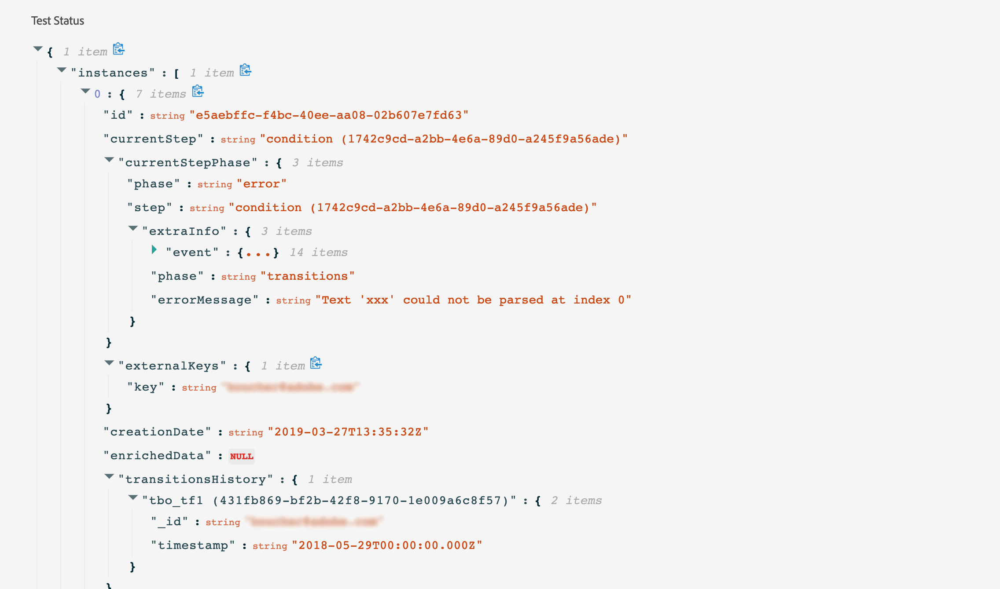

# Teste a jornada{#testing_the_journey}

>[!CONTEXTUALHELP]
>id="ajo_journey_test"
>title="Teste a jornada"
>abstract="Use perfis de teste para testar sua jornada antes de publicá-la. Isso permite analisar como os indivíduos fluem na jornada e solucionam problemas antes da publicação."

Use perfis de teste para testar sua jornada antes de publicá-la. Esse modo permite que você execute um teste de sua jornada e identifique problemas usando perfis de teste.

Somente perfis de teste podem inserir uma jornada no modo de teste. Você pode criar novos perfis de teste ou transformar perfis existentes em perfis de teste. Saiba mais sobre perfis de teste em [esta seção](../segment/creating-test-profiles.md).

>[!NOTE]
>
>Antes de testar sua jornada, você deve resolver todos os erros, se houver. Saiba como verificar erros antes de testar na [esta seção](../building-journeys/troubleshooting.md#checking-for-errors-before-testing).

Para usar o modo de teste, siga estas etapas:

1. Para ativar o modo de teste, ative o **[!UICONTROL Test]** alternar, localizado no canto superior direito.

   

1. Se a jornada tiver pelo menos um **Aguardar** , defina a variável **[!UICONTROL Wait time]** para definir o tempo que cada atividade de espera e o tempo limite do evento durarão no modo de teste. O tempo padrão é de 10 segundos para esperas e tempos limite do evento. Isso garantirá que os resultados do teste sejam obtidos rapidamente.

   

   >[!NOTE]
   >
   >Quando um evento de reação com tempo limite é usado em uma jornada, o tempo de espera padrão e o valor mínimo são 40 segundos. Consulte [esta seção](../building-journeys/reaction-events.md).

1. Use o **[!UICONTROL Trigger an event]** para configurar e enviar eventos para a jornada.

   

1. Configure os diferentes campos esperados. No **Identificador de perfil** , insira o valor do campo usado para identificar o perfil de teste. Pode ser o endereço de email, por exemplo. Certifique-se de enviar eventos relacionados a perfis de teste. Consulte [esta seção](#firing_events).

   

1. Depois que os eventos forem recebidos, clique no link **[!UICONTROL Show log]** para visualizar o resultado do teste e verificá-lo. Consulte [esta seção](#viewing_logs).

   

1. Se houver algum erro, desative o modo de teste, modifique sua jornada e teste novamente. Depois que os testes forem feitos, você poderá publicar sua jornada. Consulte [esta página](../building-journeys/publishing-the-journey.md).

## Observações importantes {#important_notes}

* Uma interface é fornecida para acionar eventos na jornada testada, mas os eventos também podem ser enviados por sistemas de terceiros, como o Postman.
* Somente indivíduos sinalizados como &quot;perfis de teste&quot; no Serviço de perfil do cliente em tempo real poderão entrar na jornada testada. Consulte esta [seção](../segment/creating-test-profiles.md).
* O modo de teste só está disponível em jornadas de rascunho que usam um namespace. O modo de teste precisa verificar se uma pessoa que entra na jornada é ou não um perfil de teste e, portanto, deve conseguir acessar o Adobe Experience Platform.
* O número máximo de perfis de teste que podem ser inseridos em uma jornada durante uma sessão de teste é 100.
* Quando você desativa o modo de teste, ele esvazia as jornadas de todas as pessoas que entraram no modo no passado ou que estão nele no momento. Também limpa o relatório.
* Você pode ativar/desativar o modo de teste quantas vezes forem necessárias.
* Não é possível modificar a jornada quando o modo de teste é ativado. Quando estiver no modo de teste, você pode publicar diretamente a jornada, não é necessário desativar o modo de teste antes.
* Ao alcançar uma divisão, a ramificação superior é sempre escolhida. Você pode reorganizar a posição das ramificações divididas se quiser que o teste escolha um caminho diferente.
* Para otimizar o desempenho e impedir o uso obsoleto de recursos, todas as jornadas no modo de teste que não foram acionadas por uma semana serão alternadas novamente para a função **Rascunho** status.

## Acionar seus eventos {#firing_events}

>[!CONTEXTUALHELP]
>id="ajo_journey_test_configuration"
>title="Configurar o modo de teste"
>abstract="Se a jornada contiver vários eventos, use a lista suspensa para selecionar um evento. Em seguida, para cada evento, configure os campos transmitidos e a execução do envio do evento."

Use o **[!UICONTROL Trigger an event]** para configurar um evento que fará com que uma pessoa entre na jornada.

>[!NOTE]
>
>Quando você aciona um evento no modo de teste, um evento real é gerado, o que significa que ele também acessará outras jornadas ao ouvir esse evento.

Como pré-requisito, você deve saber quais perfis são sinalizados como perfis de teste no Adobe Experience Platform. Na verdade, o modo de teste permite somente esses perfis na jornada e o evento deve conter uma ID. A ID esperada depende da configuração do evento. Pode ser um ECID ou um endereço de email, por exemplo. O valor dessa chave precisa ser adicionado na variável **Identificador de perfil** campo.

Se a jornada contiver vários eventos, use a lista suspensa para selecionar um evento. Em seguida, para cada evento, configure os campos transmitidos e a execução do envio do evento. A interface ajuda a transmitir as informações certas na carga útil do evento e garantir que o tipo de informação esteja correto. O modo de teste salva os últimos parâmetros usados em uma sessão de teste para uso posterior.

A interface permite que você passe parâmetros de evento simples. Se quiser transmitir coleções ou outros objetos avançados no evento, clique em **[!UICONTROL Code View]** para ver todo o código do payload e modificá-lo. Por exemplo, você pode copiar e colar informações do evento preparadas por um usuário técnico.

Um usuário técnico também pode usar essa interface para compor cargas de evento e acionar eventos sem precisar usar uma ferramenta de terceiros.

Ao clicar no botão **[!UICONTROL Send]** , o teste será iniciado. A progressão do indivíduo na jornada é representada por um fluxo visual. O caminho se torna progressivamente verde à medida que o indivíduo se move pela jornada. Se ocorrer um erro, um símbolo de aviso será exibido na etapa correspondente. Você pode colocar o cursor nele para exibir mais informações sobre o erro e acessar detalhes completos (quando disponível).

Quando você seleciona um perfil de teste diferente na tela de configuração do evento e executa o teste novamente, o fluxo visual é limpo e mostra o caminho do novo indivíduo.

Ao abrir uma jornada no teste, o caminho exibido corresponde ao último teste executado.

O fluxo visual funciona se o evento é acionado via interface ou externamente (usando Postman, por exemplo).

## Modo de teste para jornadas baseadas em regras {#test-rule-based}

O modo de teste também está disponível para jornadas que usam um evento com base em regras. Para obter mais informações sobre eventos com base em regras, consulte [esta página](../event/about-events.md).

Ao acionar um evento, a variável **Configuração do evento** permite definir os parâmetros de evento que serão aprovados no teste. Você pode exibir a condição da ID do evento clicando no ícone de dica de ferramenta no canto superior direito. Uma dica de ferramenta também está disponível ao lado de cada campo que faz parte da avaliação da regra.

## Modo de teste para eventos comerciais {#test-business}

Ao usar um [evento comercial](../event/about-events.md), use o modo de teste para acionar uma única entrada do perfil de teste na jornada, simular o evento e passar a ID de perfil correta. Você deve passar os parâmetros de evento e o identificador do perfil de teste que inserirá a jornada em teste. Não é possível usar a variável **[!UICONTROL Up to 100 profiles at once]** que existe para outras jornadas baseadas em segmentos. No modo de teste, não há modo de &quot;Visualização de código&quot; disponível para jornadas com base em eventos comerciais.

Observe que, ao acionar um evento comercial pela primeira vez, não é possível alterar a definição de evento comercial na mesma sessão de teste. Você só pode fazer o mesmo indivíduo ou um indivíduo diferente inserir a jornada que passa o mesmo ou outro identificador. Se quiser alterar os parâmetros de evento comercial, pare e inicie novamente o modo de teste.

## Exibir logs {#viewing_logs}

>[!CONTEXTUALHELP]
>id="ajo_journey_test_logs"
>title="Logs do modo de teste"
>abstract="O botão Mostrar log exibe os resultados do teste no formato JSON. Esses resultados exibem o número de indivíduos dentro da jornada e seu status."

O **[!UICONTROL Show log]** permite visualizar os resultados do teste. Esta página exibe as informações atuais da jornada no formato JSON. Um botão permite copiar nós inteiros. Você precisa atualizar manualmente a página para atualizar os resultados de teste da jornada.

>[!NOTE]
>
>Nos logs de teste, em caso de erro ao chamar um sistema de terceiros (fonte de dados ou ação), o código de erro e a resposta do erro são exibidos.

O número de indivíduos (tecnicamente chamados de instâncias) atualmente na jornada é exibido. Estas são informações úteis exibidas para cada indivíduo:

* _Id_: a ID interna da pessoa na jornada. Isso pode ser usado para fins de depuração.
* _currentstep_: a etapa em que o indivíduo está na jornada. Recomendamos adicionar rótulos às suas atividades para identificá-las mais facilmente.
* _currentstep_ > fase: o status da jornada do indivíduo (em execução, concluído, erro ou tempo limite). Veja mais informações abaixo.
* _currentstep_ > _extraInfo_: descrição do erro e outras informações contextuais.
* _currentstep_ > _fetchErrors_: informações sobre erros de busca de dados ocorridos durante esta etapa.
* _externalKeys_: o valor da fórmula-chave definida no evento.
* _enriquecidoData_: os dados que a jornada recuperou se a jornada usar fontes de dados.
* _transitionHistory_: a lista de etapas que o indivíduo seguiu. Para eventos, a carga é exibida.
* _actionExecutionErrors_ : informações sobre os erros que ocorreram.

Estes são os diferentes status da jornada de um indivíduo:

* _Em execução_: o indivíduo está atualmente na jornada.
* _Concluído_: o indivíduo está no final da jornada.
* _Erro_: o indivíduo é interrompido na jornada por causa de um erro.
* _Tempo limite_: o indivíduo é parado na jornada devido a um passo que levou demasiado tempo.

Quando um evento é acionado usando o modo de teste, um conjunto de dados é gerado automaticamente com o nome da fonte.

O modo de teste cria automaticamente um Evento de experiência e o envia para o Adobe Experience Platform. O nome da origem desse evento de experiência é &quot;Journey Orchestration Test Events&quot;.

