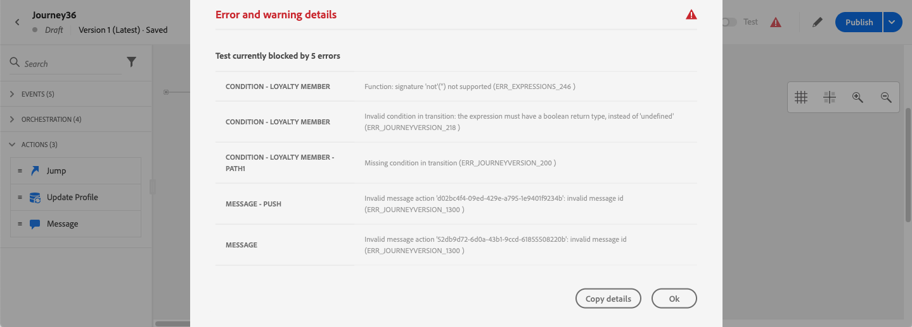

# Solucionar problemas da sua jornada{#troubleshooting}

Nesta seção, você descobrirá como solucionar problemas de jornadas antes de testar ou publicar. Todas as verificações listadas abaixo podem ser realizadas quando a jornada estiver em modo de teste ou quando a jornada estiver em tempo real. Recomenda-se que todas as verificações a seguir sejam feitas no modo de teste e, em seguida, prossiga para a publicação. Consulte [esta página](../building-journeys/testing-the-journey.md).

## Verificar erros antes de testar{#checking-for-errors-before-testing}

Antes de testar e publicar sua jornada, verifique se todas as atividades estão configuradas corretamente. Não é possível executar testes ou publicações se os erros ainda forem detectados pelo sistema.

Os erros são exibidos com um símbolo de aviso na tela. Coloque o cursor no ponto de exclamação para exibir a mensagem de erro. Se você clicar na atividade, verá a linha com erro com um aviso. Por exemplo, se um campo obrigatório estiver vazio, um erro será exibido.


Por exemplo, na tela, quando duas atividades são desconectadas, um aviso é exibido.


Ao lado do **[!UICONTROL Test]** alternar e **[!UICONTROL Publish]** , um sinal de aviso pode ser exibido. Este sinal de aviso exibe erros detectados pelo sistema e impede a ativação do modo de teste ou a publicação da jornada. Na maioria das vezes, os erros detectados pelo sistema estão vinculados aos erros visíveis nas atividades, mas às vezes estão vinculados a outros problemas. Nesse caso, você pode exibi-los e tentar identificar o problema usando a descrição do erro. Se não conseguir identificar o problema, você pode copiar os detalhes e enviá-los ao administrador ou ao suporte. Observe que os erros que bloqueiam o teste e os erros que bloqueiam a publicação são semelhantes.

O sistema detecta dois tipos de problemas: erros e avisos. Os erros bloqueiam a publicação e a ativação de teste. Os avisos indicam possíveis problemas que não estão bloqueando a ativação de teste ou a publicação. Você verá uma descrição do problema e uma ID de registro de problemas do tipo ERR_XXX_XXX. Isso ajudará o suporte técnico a identificar o problema.

Duas cores diferentes podem ser exibidas no sinal ao lado do **[!UICONTROL Test]** alternar e **[!UICONTROL Publish]** botão. Em caso de erro, o sinal é exibido em vermelho. Em caso de aviso, é exibido em laranja.



Erros e avisos globais para a jornada aparecem primeiro na lista. Os erros e avisos relacionados a atividades específicas são listados depois, por ordem de atividade ou aparência na jornada, da esquerda para a direita. O **[!UICONTROL Copy details]** copia informações técnicas sobre a jornada que a equipe de suporte pode usar para solucionar problemas.

Quando ocorre um erro em uma ação ou condição, a jornada de um indivíduo para. A única maneira de fazê-lo continuar é marcando a caixa **[!UICONTROL Add an alternative path in case of a timeout or an error]**. Consulte [esta seção](../building-journeys/using-the-journey-designer.md#paths).

## Verifique se os eventos foram enviados corretamente{#checking-that-events-are-properly-sent}

O ponto de partida de uma jornada é sempre um evento. Você pode realizar testes usando ferramentas como o Postman.

Você pode verificar se a chamada da API enviada por meio dessas ferramentas foi enviada corretamente ou não. Se ocorrer um erro, significa que a chamada tem um problema. Verifique novamente a carga, o cabeçalho (e especialmente a ID da organização) e o URL de destino. Você pode perguntar ao administrador qual é o URL correto para a ocorrência.

Os eventos não são levados diretamente da origem às jornadas. Na verdade, as jornadas dependem das APIs de assimilação de streaming da Adobe Experience Platform. Como resultado, no caso de problemas relacionados ao evento, é possível consultar [Documentação da Adobe Experience Platform](https://experienceleague.adobe.com/docs/experience-platform/ingestion/streaming/troubleshooting.html){target=&quot;_blank&quot;} para solução de problemas de APIs de assimilação de streaming.

## Verificar se as pessoas entram na jornada{#checking-if-people-enter-the-journey}

O relatório de jornada mede a entrada das pessoas em uma jornada em tempo real.

Se você enviar o evento com sucesso, mas não vir nenhuma entrada na jornada, significa que algo está errado entre o envio do evento e a recepção do evento na jornada.

Veja alguns itens que o administrador deve verificar:

* Tem certeza de que a jornada em que você espera que o evento de entrada esteja no modo de teste ou ativa?
* Você salvou o evento antes de copiar a carga da pré-visualização de carga?
* O payload do evento contém uma ID de evento?
* Você atingiu o URL correto?
* Você seguiu a estrutura de payload das APIs de assimilação de fluxo usando a pré-visualização da estrutura de payload no painel de configuração do evento? Consulte [esta página](../event/about-creating.md#preview-the-payload).
* Você usou os pares de valores chave corretos no cabeçalho do evento?

   ```
   X-gw-ims-org-id - your organization's ID
   Content-type - application/json
   ```

## Verifique como as pessoas navegam pela jornada{#checking-how-people-navigate-through-the-journey}

O relatório de jornada mede o progresso das pessoas físicas dentro de uma jornada. É fácil identificar onde e por que uma pessoa foi parada.

Veja algumas coisas que devem ser verificadas:

* Isso se deve a uma condição que exclui a pessoa? Por exemplo, a condição é &quot;gênero = homem&quot; e a pessoa é uma mulher. Essa verificação pode ser executada por um usuário empresarial se a condição não for muito complexa.
* Isso ocorre devido a uma chamada para uma fonte de dados que não está respondendo? Quando a jornada está em teste, essas informações podem ser vistas nos logs do modo de teste. Quando a jornada é em tempo real, um administrador pode testar chamadas diretas para a fonte de dados e verificar a resposta recebida. Um administrador também pode duplicar a jornada e testá-la.

## Verifique se as mensagens foram enviadas com êxito{#checking-that-messages-are-sent-successfully}

Se as pessoas físicas continuarem percorrendo o caminho certo na jornada, mas não receberem as mensagens que devem receber, você pode verificar se:

* [!DNL Journey Optimizer] tiver considerado corretamente a solicitação de envio da mensagem. Os usuários empresariais podem acessar a mensagem que deve ser enviada e verificar se a hora da execução mais recente corresponde ao tempo de execução da sua jornada. Eles também podem verificar as chamadas/eventos de API mais recentes recebidos.
* [!DNL Journey Optimizer] enviou a mensagem com êxito. Verifique o relatório da jornada para garantir que não haja erros.

No caso de uma mensagem enviada por meio de uma ação personalizada, a única coisa que pode ser verificada durante o teste da jornada é o fato de a chamada do sistema da ação personalizada causar ou não um erro. Se a chamada para o sistema externo associada à ação personalizada não causar um erro, mas não enviar uma mensagem, algumas investigações devem ser feitas por parte do sistema externo.
