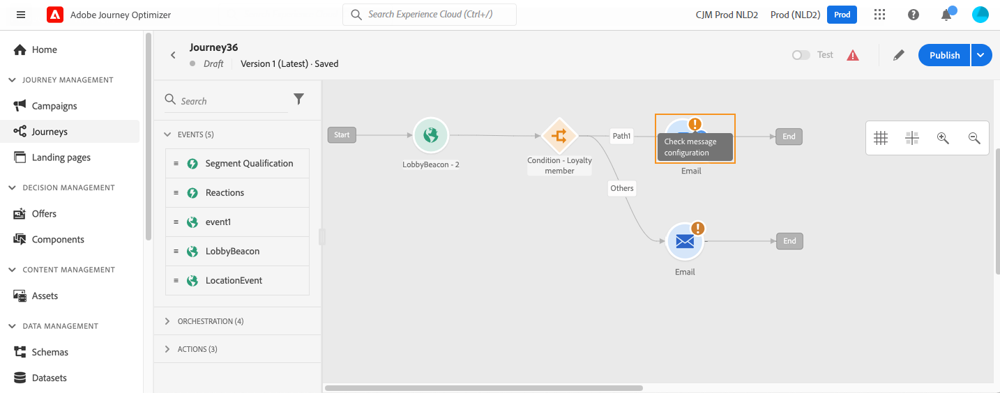
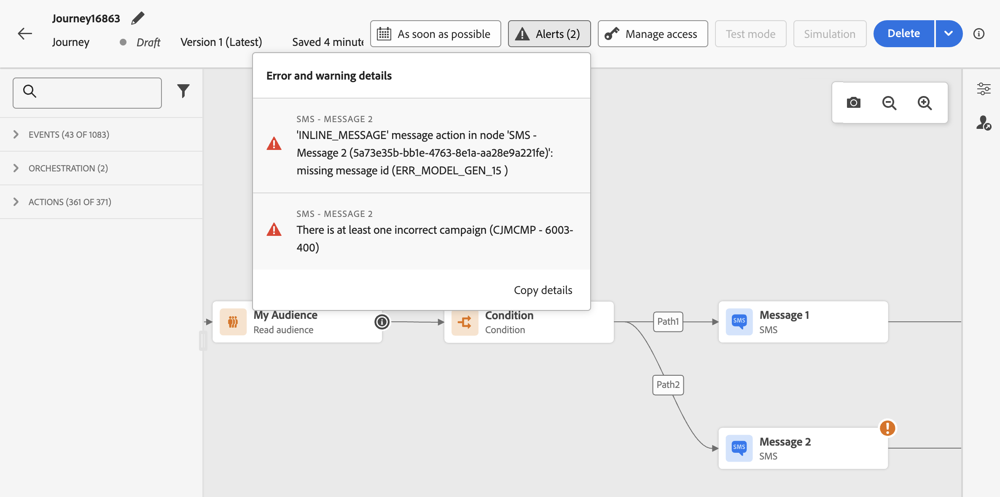

# Solucionar problemas da jornada {#troubleshooting}

Nesta seção, saiba como solucionar problemas do jornada antes de testar ou publicar. Todos os controles enumerados a seguir podem ser efetuados quando a jornada estiver em modo de teste ou mesmo ativa. Recomenda-se que todas as verificações a seguir sejam feitas no modo de teste, para então prosseguir com a publicação. Saiba mais sobre o modo de teste em [esta página](../building-journeys/testing-the-journey.md).

Como administrador, você também pode testar as configurações de ações personalizadas fazendo chamadas de API reais diretamente da interface do usuário. Saiba mais [nesta página](../action/troubleshoot-custom-action.md).

## Verificar se há erros antes do teste {#checking-for-errors-before-testing}

Antes de testar e publicar sua jornada, verifique se todas as atividades estão configuradas corretamente. Não é possível executar testes ou publicações se os erros ainda forem detectados pelo sistema.


### Erros nas atividades {#activity-errors}

Os erros são exibidos com um símbolo de aviso na tela. Coloque o cursor no ponto de exclamação para exibir a mensagem de erro. Se você selecionar a atividade, verá a linha que contém o erro com um aviso. Por exemplo:

* se um campo obrigatório estiver vazio, um erro será exibido

  

* na tela, quando duas atividades são desconectadas, um aviso é exibido

  

### Erros na jornada {#canvas-errors}

Os erros também são visíveis no botão **[!UICONTROL Alertas]**, acima da tela. Esse botão permite que você veja erros detectados pelo sistema e que impedem a ativação do modo de teste ou a publicação do jornada.

O sistema detecta dois tipos de problemas: **erros** e **avisos**. Os erros bloqueiam a publicação e a ativação de teste. Os avisos indicam possíveis problemas que não estão bloqueando a ativação de teste ou a publicação. Você verá uma descrição do problema e uma ID de registro de problemas do tipo ERR_XXX_XXX. Isso pode ajudar a identificar o problema.



<!--Most of the time, errors detected by the system are linked to errors visible on the activities but they can also relate to other issues. In all cases, check alerts and resolve the issue using to the error description. If you cannot identify the issue, use the **[!UICONTROL Copy details]** button to store the alerts, and send them to your administrator.-->

Erros e avisos globais para a jornada aparecem primeiro na lista. Os erros e avisos relacionados a atividades específicas são listados depois, por ordem de atividade ou aparência na jornada, da esquerda para a direita. Na parte inferior da lista de alertas, o botão **[!UICONTROL Copiar detalhes]** permite copiar informações técnicas sobre a jornada, que são úteis para solucionar problemas.

### Adicionar um caminho alternativo {#canvas-add-path}

Você pode definir uma ação de fallback em caso de erro para as seguintes atividades de jornada: **[!UICONTROL Condição]** e **[!UICONTROL Ação]**.

A jornada de uma pessoa para quando ocorre um erro em uma ação ou condição. A única maneira de fazê-lo continuar é resolver a questão. Para evitar a interrupção da jornada, você também pode marcar a opção **[!UICONTROL Adicionar um caminho alternativo em caso de tempo limite ou erro]** nas propriedades da atividade. Saiba mais [nesta seção](../building-journeys/using-the-journey-designer.md#paths).


## Verifique se os eventos foram enviados corretamente {#checking-that-events-are-properly-sent}

O ponto de partida de uma jornada é sempre um evento. Você pode fazer testes usando ferramentas como o Postman.

Você pode verificar se a chamada à API enviada por meio dessas ferramentas foi corretamente enviada. Se ocorrer um erro, significa que a chamada tem um problema. Verifique novamente o payload, o cabeçalho (e principalmente a ID da organização) e o URL de destino. Você pode perguntar ao administrador qual é o URL correto para a ocorrência.

Eventos não são levados diretamente da origem para jornadas. Na verdade, o jornada depende das APIs de assimilação de streaming do Adobe Experience Platform. Como resultado, no caso de problemas relacionados ao evento, consulte a [documentação do Adobe Experience Platform](https://experienceleague.adobe.com/docs/experience-platform/ingestion/streaming/troubleshooting.html){target="_blank"} para obter a solução de problemas de APIs de assimilação de streaming.

Se a jornada não conseguir habilitar o modo de teste com erro `ERR_MODEL_RULES_16`, verifique se o evento usado inclui um [namespace de identidade](../audience/get-started-identity.md) ao usar uma ação de canal.

O namespace de identidade é usado para identificar exclusivamente os perfis de teste. Por exemplo, se o email for usado para identificar os perfis de teste, o namespace de identidade **Email** deverá ser selecionado. Se o identificador exclusivo for o número de telefone, o namespace de identidade **Telefone** deverá ser selecionado.

## Verificar se as pessoas entram na jornada {#checking-if-people-enter-the-journey}

O relatório de Jornada mede a entrada das pessoas em uma jornada em tempo real.

Se você enviar o evento com êxito, mas não vir nenhuma entrada na jornada, significa que há algo de errado entre o envio do evento e a recepção do evento na jornada.

Você pode começar a solucionar problemas com as perguntas abaixo:

* Você tem certeza de que a jornada em que você espera o evento de entrada está no modo de teste ou ativa?
* Você salvou o evento antes de copiar o payload da pré-visualização de payload?
* O payload do evento contém uma ID do evento?
* Você digitou o URL correto?
* Você seguiu a estrutura de payload das APIs de ingestão de streaming usando a pré-visualização da estrutura de payload no painel de configuração do evento? Consulte [esta página](../event/about-creating.md#preview-the-payload).
* Você usou os pares de valor chave corretos no cabeçalho do evento?

  ```
  X-gw-ims-org-id - your organization's ID
  Content-type - application/json
  ```

## Verificar como as pessoas navegam pela jornada {#checking-how-people-navigate-through-the-journey}

O relatório de jornada mede o progresso das pessoas físicas dentro de uma jornada. É fácil identificar onde e por que uma pessoa foi parada.

Veja algumas coisas que devem ser verificadas:

* A interrupção se deve a uma condição que exclui a pessoa? Por exemplo, a condição é &quot;gênero = homem&quot; e a pessoa é uma mulher. Essa verificação pode ser feita por um usuário empresarial se a condição não for muito complexa.
* A interrupção se deve a uma chamada a uma fonte de dados que não está respondendo? Quando a jornada está em teste, essas informações podem ser vistas nos registros do modo de teste. Quando a jornada é em tempo real, um administrador pode testar chamadas diretas para a fonte de dados e verificar a resposta recebida. Um administrador também pode duplicar a jornada e testá-la.

## Verificar se as mensagens foram enviadas com êxito {#checking-that-messages-are-sent-successfully}

Se as pessoas físicas continuarem percorrendo o caminho certo na jornada, mas não receberem as mensagens esperadas, você poderá verificar se:

* [!DNL Journey Optimizer] levou em consideração corretamente a solicitação para enviar a mensagem. Os usuários empresariais podem acessar a mensagem que deve ser enviada e verificar se a hora da execução mais recente corresponde ao tempo de execução da sua jornada. Eles também podem verificar as chamadas/eventos de API mais recentes recebidos.
* [!DNL Journey Optimizer] enviou a mensagem com êxito. Verifique os relatórios do jornada para garantir que não haja erros.

No caso de uma mensagem enviada por meio de uma ação personalizada, a única coisa que pode ser verificada durante o teste de jornada é o fato de a chamada do sistema da ação personalizada causar ou não um erro. Se a chamada para o sistema externo associada à ação personalizada não causar um erro, mas não enviar a mensagem, algumas investigações devem ser feitas por parte do sistema externo.
