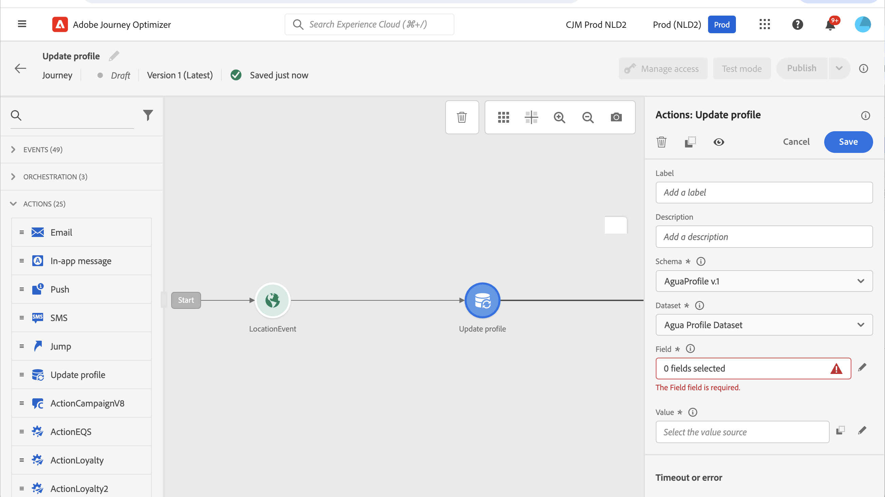

# Atualizar perfil {#update-profile}

>[!CONTEXTUALHELP]
>id="ajo_journey_update_profiles"
>title="Atividade Atualizar perfil"
>abstract="A ação Atualizar perfil permite atualizar um perfil da Adobe Experience Platform existente com informações provenientes do evento, de uma fonte de dados ou usando um valor específico."

Use o **[!UICONTROL Atualizar perfil]** atividade de ação para atualizar um perfil do Adobe Experience Platform existente com informações provenientes de um evento, uma fonte de dados ou com um valor específico.

## Recomendações

* A variável **Atualizar perfil** A ação só pode ser usada em jornadas que comecem com um evento que tenha um namespace.
* A ação atualiza apenas os campos existentes, não cria novos campos de perfil.
* Você não pode usar o **Atualizar perfil** ação para gerar eventos de experiência, por exemplo, uma compra.
* Como qualquer outra ação, é possível definir um caminho alternativo em caso de erro ou tempo limite, e não é possível colocar duas ações em paralelo.
* A solicitação de atualização enviada para o Adobe Experience Platform é imediata/em um segundo. Normalmente, levará alguns segundos, mas às vezes mais, sem garantia. Como resultado, por exemplo, se uma ação estiver usando o &quot;campo 1&quot; atualizado por um **Atualizar perfil** ação posicionada logo antes, não é de se esperar que o &quot;campo 1&quot; seja atualizado na ação.
* A variável **Atualizar perfil** A atividade não é compatível com campos XDM definidos como uma enumeração.

## Uso da atualização de perfil

1. Projete sua jornada iniciando com um evento. Consulte esta [seção](../building-journeys/journey.md).

1. No **Ação** da paleta, solte a **Atualizar perfil** atividade na tela.

   

1. Selecione um esquema na lista.

1. Clique em **Campo** para selecionar o campo que deseja atualizar. Somente um campo pode ser selecionado.

   

1. Selecione um conjunto de dados na lista.

   >[!NOTE]
   >
   >A variável **Atualizar perfil** A ação atualiza os dados do perfil em tempo real, mas não atualiza os conjuntos de dados. A seleção do conjunto de dados é necessária, pois o perfil é um registro relacionado a um conjunto de dados.

1. Clique no link **Valor** para definir o valor que deseja usar:

   * Usando o editor de expressões simples, é possível selecionar um campo de uma fonte de dados ou do evento de entrada.

     

   * Se quiser definir um valor específico ou aproveitar funções avançadas, clique em **Modo avançado**.

     

A variável **Atualizar perfil** O agora está configurado.

## Uso do modo de teste {#using-the-test-mode}

No modo de teste, a atualização do perfil não será simulada. A atualização será executada no perfil de teste.

Somente perfis de teste podem inserir uma jornada no modo de teste. Você pode criar um novo perfil de teste ou transformar um perfil existente em um perfil de teste. No Adobe Experience Platform, você pode atualizar atributos de perfis por meio de uma importação de arquivo csv ou chamadas de API. Um método mais simples é usar um **Atualizar perfil** atividade de ação e alterar o campo booleano do perfil de teste de falso para verdadeiro.

Para obter mais informações sobre como transformar um perfil existente em um perfil de teste, consulte este [seção](../audience/creating-test-profiles.md#create-test-profiles-csv).
