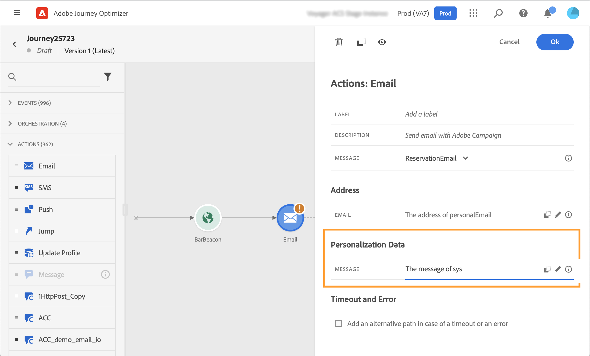

# Ações do [!DNL Adobe Campaign] Standard {#using_campaign_action}

>[!BEGINSHADEBOX]

**Nesta página:** Saiba como usar as atividades internas de email, push e SMS do Adobe Campaign Standard em suas jornadas, confiando nos modelos de Mensagens Transacionais do Campaign Standard.

>[!ENDSHADEBOX]

>[!CONTEXTUALHELP]
>id="ajo_journey_action_custom_acs"
>title="Ações personalizadas"
>abstract="Uma integração está disponível caso você tenha o [!DNL Adobe Campaign] Standard. Ela permite enviar emails, notificações por push e SMS usando os recursos de mensagens transacionais do [!DNL Adobe Campaign]."

Se você tiver o [!DNL Adobe Campaign] Standard, as seguintes atividades integradas estão disponíveis: **[!UICONTROL Email]**, **[!UICONTROL Push]** e **[!UICONTROL SMS]**.

>[!NOTE]
>
>Para isso, é necessário configurar a ação integrada. Consulte [esta página](../action/acs-action.md).

Para cada um desses canais, você seleciona um [!DNL Adobe Campaign] **modelo** de mensagens transacionais padrão. Para os canais de email, SMS e push integrados, dependemos de Mensagens transacionais para executar o envio de mensagens. Isso significa que, se você quiser usar um determinado modelo de mensagem em suas jornadas, deverá publicá-lo no [!DNL Adobe Campaign] Standard. Consulte [esta página](https://experienceleague.adobe.com/docs/campaign-standard/using/communication-channels/transactional-messaging/getting-started-with-transactional-msg.html?lang=pt-BR) para saber como usar este recurso.

>[!NOTE]
>
>A mensagem transacional do Campaign Standard e o evento associado devem ser publicados para serem usados no Journey Optimizer. Se o evento for publicado, mas a mensagem não for, ele não estará visível na interface do Journey Optimizer. Se a mensagem for publicada, mas o evento associado não, ela ficará visível na interface do Journey Optimizer, mas não poderá ser usada.

![[!DNL Adobe Campaign] Configuração da ação padrão no jornada](assets/journey59.png)

Você pode usar um evento (também conhecido como tempo real) ou template de mensagens transacionais de perfil.

>[!NOTE]
>
>Quando enviamos mensagens transacionais em tempo real (rtEvent) ou quando roteamos mensagens com um sistema de terceiros graças a uma ação personalizada, uma configuração específica é necessária para o gerenciamento de fadiga, lista de bloqueios ou cancelamento de assinatura. Por exemplo, se um atributo de &quot;cancelamento de inscrição&quot; for armazenado em [!DNL Adobe Experience Platform] ou em um sistema de terceiros, será necessário adicionar uma condição antes do envio da mensagem para verificar essa condição.

Ao selecionar um modelo, todos os campos esperados na carga da mensagem são exibidos no painel de configuração da atividade em **[!UICONTROL Endereço]** e **[!UICONTROL Dados do Personalization]**. Você precisa mapear cada um desses campos com o campo que deseja usar, seja do evento ou da fonte de dados. Você também pode usar o editor de expressão avançado para passar um valor manualmente, executar a manipulação de dados nas informações recuperadas (por exemplo, converter uma cadeia de caracteres em maiúsculas) ou usar funções como &quot;if, then, else&quot;. Consulte [esta página](expression/expressionadvanced.md).


## Email e SMS {#section_asc_51g_nhb}

Para **[!UICONTROL Email]** e **[!UICONTROL SMS]**, os parâmetros são idênticos.

>[!NOTE]
>
>Ao usar um modelo transacional de perfil para email, o mecanismo de cancelamento de assinatura é manipulado automaticamente pelo [!DNL Adobe Campaign] Standard.
>Incluir um bloco de conteúdo de **[!UICONTROL Link de unsubscription]** em [o modelo de email transacional](https://experienceleague.adobe.com/docs/campaign-standard/using/communication-channels/transactional-messaging/getting-started-with-transactional-msg.html?lang=pt-BR).
>Se estiver usando um modelo baseado em eventos (rtEvent), incorpore um link na mensagem que transmite o email do destinatário como um parâmetro de URL e o direciona para uma página de aterrissagem de cancelamento de inscrição.
>Crie a página de aterrissagem e verifique se a decisão de cancelamento de inscrição do recipient é transmitida ao Adobe.

Primeiro, você precisa escolher um template de mensagem transacional.

Duas categorias estão disponíveis: **[!UICONTROL Endereço]** e **[!UICONTROL Dados do Personalization]**.

Você pode definir facilmente onde recuperar o **[!UICONTROL Endereço]** ou os **[!UICONTROL Dados do Personalization]** usando a interface. Você pode navegar pelos eventos e campos disponíveis da fonte de dados. Você também pode usar o editor de expressão avançado para casos de uso mais avançados, como o uso de uma fonte de dados que requer a transmissão de parâmetros ou a execução de manipulações. Consulte [esta página](expression/expressionadvanced.md).

**[!UICONTROL Endereço]**

>[!NOTE]
>
>Essa categoria só estará visível se você selecionar uma mensagem transacional de &quot;evento&quot;. Para mensagens de &quot;perfil&quot;, o campo **[!UICONTROL Endereço]** é recuperado automaticamente do [!DNL Adobe Campaign] Padrão pelo sistema.

Esses são os campos que o sistema exige para saber para onde enviar a mensagem. Para um template de email, é o endereço de email. Para um SMS, é o número do celular.


**[!UICONTROL Dados do Personalization]**

>[!NOTE]
>
>Não é possível transmitir uma coleção em dados de personalização. Se o email ou SMS transacional esperar coleções, não funcionará. Observe também que os dados de personalização têm um formato esperado (por exemplo: sequência, decimal etc.). Você deve ter cuidado para respeitar esses formatos esperados.

Esses são os campos esperados pela mensagem Padrão [!DNL Adobe Campaign]. Esses campos podem ser usados para personalizar a mensagem, aplicar formatação condicional ou escolher uma variante de mensagem específica.



## Push {#section_im3_hvf_nhb}

Antes de usar a atividade de push, seu aplicativo móvel precisa ser configurado junto com o Campaign Standard para enviar notificações por push. Use este [artigo](https://helpx.adobe.com/br/campaign/kb/integrate-mobile-sdk.html) para executar as etapas de implementação necessárias para dispositivos móveis.

Primeiro, você precisa escolher um aplicativo móvel na lista suspensa e uma mensagem transacional.


Duas categorias estão disponíveis: **[!UICONTROL Target]** e **[!UICONTROL Dados do Personalization]**.

**[!UICONTROL Target]**

>[!NOTE]
>
>Essa categoria só estará visível se você selecionar uma mensagem de evento. Para mensagens de perfil, os campos **[!UICONTROL Target]** são recuperados automaticamente pelo sistema usando a reconciliação executada pelo [!DNL Adobe Campaign] Standard.

Nesta seção, você precisa definir a **[!UICONTROL plataforma de push]**. A lista suspensa permite selecionar **[!UICONTROL Apple Push Notification Server]** (iOS) ou **[!UICONTROL Firebase Cloud Messaging]** (Android). Como alternativa, você pode selecionar um campo específico de um evento ou de uma fonte de dados, ou definir uma expressão avançada.

Você também precisa definir o **[!UICONTROL Token de Registro]**. A expressão depende de como o token é definido na carga do evento ou em outras informações [!DNL Journey Optimizer]. Pode ser um campo simples ou uma expressão mais complexa, caso o token seja definido em uma coleção, por exemplo:

```
@event{Event_push._experience.campaign.message.profileSnapshot.pushNotificationTokens.first().token}
```

**[!UICONTROL Dados do Personalization]**

>[!NOTE]
>
>Não é possível transmitir uma coleção em dados de personalização. Se o push transacional esperar coleções, não funcionará. Observe também que os dados de personalização têm um formato esperado (por exemplo: sequência, decimal etc.). Você deve ter cuidado para respeitar esses formatos esperados.

Esses são os campos esperados pelo modelo transacional usado na sua mensagem Padrão [!DNL Adobe Campaign]. Esses campos podem ser usados para personalizar a mensagem, aplicar formatação condicional ou escolher uma variante de mensagem específica.

+++ Referência de conhecimento de IA

Esta seção contém conhecimento estruturado destinado a oferecer suporte à interpretação, recuperação e resposta a perguntas relacionadas a este tópico.

Para uma compreensão completa, essas informações devem ser combinadas com a documentação desta página. Nenhuma das origens deve ser independente; a página descreve o recurso, enquanto esta seção fornece um contexto adicional que ajuda a desfazer a ambiguidade da terminologia, intenção, aplicabilidade e restrições.

* **TL;DR:** Esta página explica como usar as atividades internas de email, SMS e ação de push do Adobe Campaign Standard no Journey Optimizer jornada através de modelos de mensagens transacionais do Campaign.

**Intenções:**

* Configurar atividades de email, SMS ou ação de push em uma jornada usando a integração do Adobe Campaign Standard
* Selecionar e mapear um template de mensagens transacionais do Campaign Standard para campos de jornada
* Mapear campos de endereço e dados do Personalization de eventos de jornada ou fontes de dados para a carga da mensagem
* Lidar com unsubscription de modelos de email transacionais baseados em eventos e perfis
* Configurar a plataforma de destino da notificação por push e o token de registro para ações por push do Campaign Standard

**Glossário:**

* **Mensagens Transacionais**: recurso do Adobe Campaign Standard para enviar mensagens acionadas em tempo real (email, SMS, push) com base em eventos *(específico do produto)*
* **rtEvent**: modelo de mensagem transacional de evento em tempo real no Adobe Campaign Standard, usado para mensagens baseadas em eventos *(específico do produto)*
* **Modelo transacional de perfil**: um modelo de mensagem transacional do Campaign Standard que usa dados de perfil para resolução de destinatários e tratamento de cancelamento de assinatura *(específico do produto)*
* **Token de Registro**: identificador de nível de dispositivo necessário para direcionar uma notificação por push a uma instalação de aplicativo móvel específica *(específico do produto)*

**Medidas de Proteção:**

* A ação integrada deve ser configurada antes do uso; consulte a página de configuração de ação.
* A mensagem transacional do Campaign Standard e o evento associado devem ser publicados para que o modelo seja utilizável no Journey Optimizer.
* As coleções não podem ser passadas nos campos de dados do Personalization.
* Para modelos baseados em eventos (rtEvent), o gerenciamento de unsubscription deve ser manipulado manualmente com uma condição antes do envio.
* Para mensagens de push baseadas em perfil, os campos do Target são recuperados automaticamente; a categoria Target só é visível para mensagens de evento.
* O aplicativo móvel deve ser configurado com o Campaign Standard antes que a atividade de push possa ser usada.

**Terminologia:**

* Nome canônico: Adobe Campaign Standard — Acrônimo: ACS — variantes: Campaign Standard
* Sinônimos: &quot;mensagem transacional de evento&quot; = &quot;rtEvent&quot;; &quot;mensagem transacional em tempo real&quot; = &quot;rtEvent&quot;
* Não confunda: &quot;profile transactional template&quot; (unsubscription manipulada automaticamente) ≠ &quot;event transactional template&quot; (unsubscription deve ser manipulada manualmente)

**Perguntas frequentes:**

* **P: Quais canais estão disponíveis por meio da integração com o Adobe Campaign Standard?** — Os canais de email, SMS e notificação por push estão disponíveis como atividades de ação incorporadas.
* **P: A mensagem transacional precisa ser publicada no Campaign Standard antes de ser usada no Journey Optimizer?** — Sim, a mensagem transacional e seu evento associado devem ser publicados; uma mensagem não publicada não poderá ser usada, mesmo se estiver visível na interface.
* **P: Como o cancelamento de assinatura é tratado para modelos de email baseados em perfil?** — O cancelamento de subscrição é tratado automaticamente pelo Adobe Campaign Standard ao usar um template transacional de perfil; inclua um bloco de conteúdo Unsubscription link no template.
* **P: Posso passar uma coleção como dados de personalização?** — Não, as coleções não podem ser passadas nos dados do Personalization; a mensagem transacional não deve esperar coleções.
* **P: Onde mapear o endereço do destinatário para um email baseado em eventos?** — A categoria Address no painel de configuração da atividade só é visível para mensagens transacionais de evento; para mensagens de perfil, o endereço é recuperado automaticamente.

+++
