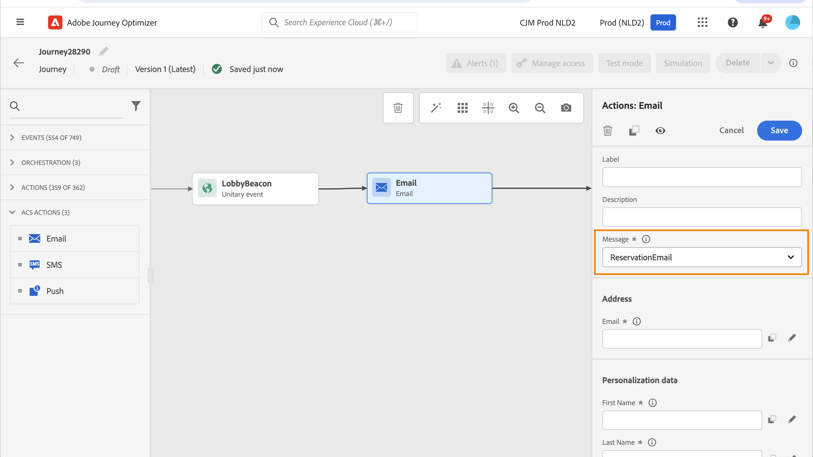

# Ações do Adobe Campaign Standard {#using_campaign_action}

>[!CONTEXTUALHELP]
>id="ajo_journey_action_custom_acs"
>title="Ações personalizadas"
>abstract="Uma integração está disponível caso você tenha o Adobe Campaign Standard. Ela permite enviar emails, notificações por push e SMS usando os recursos de mensagens transacionais do Adobe Campaign."

Se você tiver o Adobe Campaign Standard, as seguintes atividades integradas estão disponíveis: **[!UICONTROL Email]**, **[!UICONTROL Push]** e **[!UICONTROL SMS]**.

>[!NOTE]
>
>Para isso, é necessário configurar a ação integrada. Consulte [esta página](../action/acs-action.md).

Para cada um desses canais, selecione um **modelo** de mensagens transacionais do Adobe Campaign Standard. Para os canais de email, SMS e push integrados, dependemos de Mensagens transacionais para executar o envio de mensagens. Isso significa que, se você quiser usar um determinado modelo de mensagem nas jornadas, será necessário publicá-lo no Adobe Campaign Standard. Consulte [esta página](https://experienceleague.adobe.com/docs/campaign-standard/using/communication-channels/transactional-messaging/getting-started-with-transactional-msg.html?lang=pt-BR) para saber como usar este recurso.

>[!NOTE]
>
>A mensagem transacional do Campaign Standard e o evento associado devem ser publicados para serem usados no Journey Optimizer. Se o evento for publicado, mas a mensagem não for, ele não estará visível na interface do Journey Optimizer. Se a mensagem for publicada, mas o evento associado não, ela ficará visível na interface do Journey Optimizer, mas não poderá ser usada.



Você pode usar um evento (também conhecido como tempo real) ou template de mensagens transacionais de perfil.

>[!NOTE]
>
>Quando enviamos mensagens transacionais em tempo real (rtEvent) ou quando roteamos mensagens com um sistema de terceiros graças a uma ação personalizada, uma configuração específica é necessária para o gerenciamento de fadiga, lista de bloqueios ou cancelamento de assinatura. Por exemplo, se um atributo de &quot;cancelamento de inscrição&quot; for armazenado no Adobe Experience Platform ou em um sistema de terceiros, uma condição precisará ser adicionada antes do envio da mensagem para verificar essa condição.

Ao selecionar um modelo, todos os campos esperados na carga da mensagem são exibidos no painel de configuração da atividade em **[!UICONTROL Endereço]** e **[!UICONTROL Dados do Personalization]**. Você precisa mapear cada um desses campos com o campo que deseja usar, seja do evento ou da fonte de dados. Você também pode usar o editor de expressão avançado para passar um valor manualmente, executar a manipulação de dados nas informações recuperadas (por exemplo, converter uma cadeia de caracteres em maiúsculas) ou usar funções como &quot;if, then, else&quot;. Consulte [esta página](expression/expressionadvanced.md).


## Email e SMS {#section_asc_51g_nhb}

Para **[!UICONTROL Email]** e **[!UICONTROL SMS]**, os parâmetros são idênticos.

>[!NOTE]
>
>Ao usar um template transacional do perfil para email, o mecanismo de cancelamento de subscrição é manipulado automaticamente pelo Adobe Campaign Standard. Para implementar isso, você pode facilmente incluir um bloco de conteúdo **[!UICONTROL Link de unsubscription]** no [modelo de email transacional](https://experienceleague.adobe.com/docs/campaign-standard/using/communication-channels/transactional-messaging/getting-started-with-transactional-msg.html?lang=pt-BR). No entanto, se estiver usando um template baseado em evento (rtEvent), você deverá incorporar um link na mensagem que passa o email do recipient como um parâmetro de URL e os direciona para uma landing page de cancelamento de subscrição. É necessário criar essa landing page e garantir que a decisão do recipient de cancelar a inscrição seja efetivamente transmitida ao Adobe.

Primeiro, você precisa escolher um template de mensagem transacional.

Duas categorias estão disponíveis: **[!UICONTROL Endereço]** e **[!UICONTROL Dados do Personalization]**.

Você pode definir facilmente onde recuperar o **[!UICONTROL Endereço]** ou os **[!UICONTROL Dados do Personalization]** usando a interface. Você pode navegar pelos eventos e campos disponíveis da fonte de dados. Você também pode usar o editor de expressão avançado para casos de uso mais avançados, como o uso de uma fonte de dados que requer a transmissão de parâmetros ou a execução de manipulações. Consulte [esta página](expression/expressionadvanced.md).

**[!UICONTROL Endereço]**

>[!NOTE]
>
>Essa categoria só estará visível se você selecionar uma mensagem transacional de &quot;evento&quot;. Para mensagens de &quot;perfil&quot;, o campo **[!UICONTROL Endereço]** é recuperado automaticamente do Adobe Campaign Standard pelo sistema.

Esses são os campos que o sistema exige para saber para onde enviar a mensagem. Para um template de email, é o endereço de email. Para um SMS, é o número do celular.


**[!UICONTROL Dados do Personalization]**

>[!NOTE]
>
>Não é possível transmitir uma coleção em dados de personalização. Se o email ou SMS transacional esperar coleções, não funcionará. Observe também que os dados de personalização têm um formato esperado (por exemplo: sequência, decimal etc.). Você deve ter cuidado para respeitar esses formatos esperados.

Esses são os campos esperados pela mensagem do Adobe Campaign Standard. Esses campos podem ser usados para personalizar a mensagem, aplicar formatação condicional ou escolher uma variante de mensagem específica.


## Push {#section_im3_hvf_nhb}

Antes de usar a atividade de push, seu aplicativo móvel precisa ser configurado junto com o Campaign Standard para enviar notificações por push. Use este [artigo](https://helpx.adobe.com/br/campaign/kb/integrate-mobile-sdk.html) para executar as etapas de implementação necessárias para dispositivos móveis.

Primeiro, você precisa escolher um aplicativo móvel na lista suspensa e uma mensagem transacional.


Duas categorias estão disponíveis: **[!UICONTROL Target]** e **[!UICONTROL Dados do Personalization]**.

**[!UICONTROL Target]**

>[!NOTE]
>
>Essa categoria só estará visível se você selecionar uma mensagem de evento. Para mensagens de perfil, os campos **[!UICONTROL Target]** são recuperados automaticamente pelo sistema usando a reconciliação executada pelo Adobe Campaign Standard.

Nesta seção, você precisa definir a **[!UICONTROL plataforma de push]**. A lista suspensa permite selecionar **[!UICONTROL Apple Push Notification Server]** (iOS) ou **[!UICONTROL Firebase Cloud Messaging]** (Android). Como alternativa, você pode selecionar um campo específico de um evento ou de uma fonte de dados, ou definir uma expressão avançada.

Você também precisa definir o **[!UICONTROL Token de Registro]**. A expressão depende de como o token é definido na carga do evento ou em outras informações [!DNL Journey Optimizer]. Pode ser um campo simples ou uma expressão mais complexa, caso o token seja definido em uma coleção, por exemplo:

```
@event{Event_push._experience.campaign.message.profileSnapshot.pushNotificationTokens.first().token}
```

**[!UICONTROL Dados do Personalization]**

>[!NOTE]
>
>Não é possível transmitir uma coleção em dados de personalização. Se o push transacional esperar coleções, não funcionará. Observe também que os dados de personalização têm um formato esperado (por exemplo: sequência, decimal etc.). Você deve ter cuidado para respeitar esses formatos esperados.

Esses são os campos esperados pelo modelo transacional usado na mensagem do Adobe Campaign Standard. Esses campos podem ser usados para personalizar a mensagem, aplicar formatação condicional ou escolher uma variante de mensagem específica.
