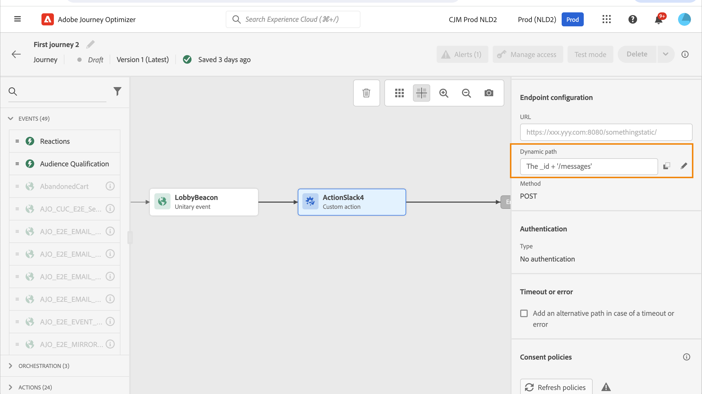

# Use custom actions {#use-custom-actions}

>[!CONTEXTUALHELP]
>id="ajo_journey_action_custom"
>title="Ações personalizadas"
>abstract="As ações personalizadas permitem configurar a conexão de um sistema de terceiros para enviar mensagens ou chamadas de API. Uma ação pode ser configurada com qualquer serviço de qualquer provedor que possa ser chamado por meio de uma REST API com uma carga útil formatada em JSON."

As ações personalizadas permitem configurar a conexão de um sistema de terceiros para enviar mensagens ou chamadas de API. Uma ação pode ser configurada com qualquer serviço de qualquer provedor que possa ser chamado por meio de uma REST API com uma carga útil formatada em JSON.

## Configurar o URL

**** You cannot set up the static part of the URL in the journey, but in the global configuration of the custom action. [Saiba mais](../action/about-custom-action-configuration.md).

### Dynamic path

**[!UICONTROL Path]**

To concatenate fields and plain text strings, use the String functions or the Plus sign (+) in the advanced expression editor. Enclose plain text strings in single quotation marks (&#39;) or in double quotation marks (&quot;). [Saiba mais](expression/expressionadvanced.md).

This table shows an example of configuration:

| Campo | Valor |
| --- | --- |
| URL | `https://xxx.yyy.com:8080/somethingstatic/` |
| Path | `The id of marketingCampaign + '/messages'` |

The concatenated URL has this form:

`https://xxx.yyy.com:8080/somethingstatic/``/messages`

### Cabeçalhos

**[!UICONTROL URL Configuration]** Dynamic header fields are HTTP header fields whose value is configured as a variable. [Saiba mais](../action/about-custom-action-configuration.md).

If required, specify the value of dynamic header fields:

1. Select the custom action in the journey.
1. **[!UICONTROL URL Configuration]**

   

1. **[!UICONTROL OK]**

## Action parameters

**[!UICONTROL Action parameters]**__ For these parameters, you can define where to get this information (example: events, data sources), pass values manually or use the advanced expression editor for advanced use cases. Advanced uses cases can be data manipulation and other function usage. Consulte esta [página](expression/expressionadvanced.md).

**Tópicos relacionados**

[Configurar uma ação](../action/about-custom-action-configuration.md)
