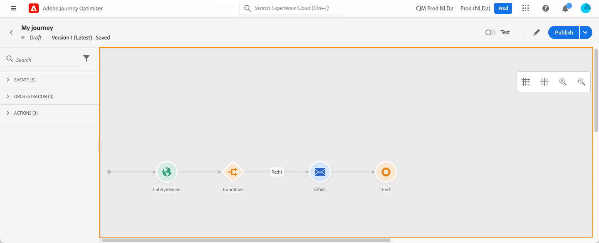
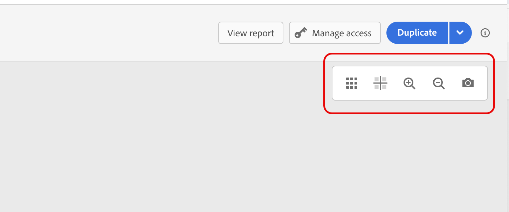
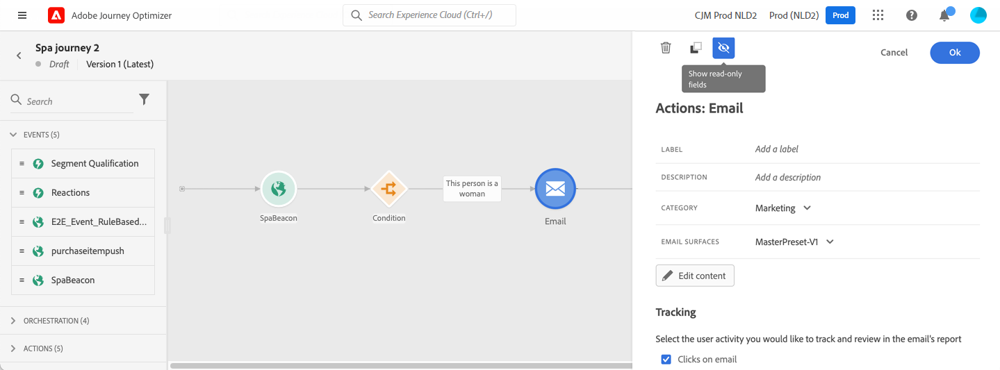
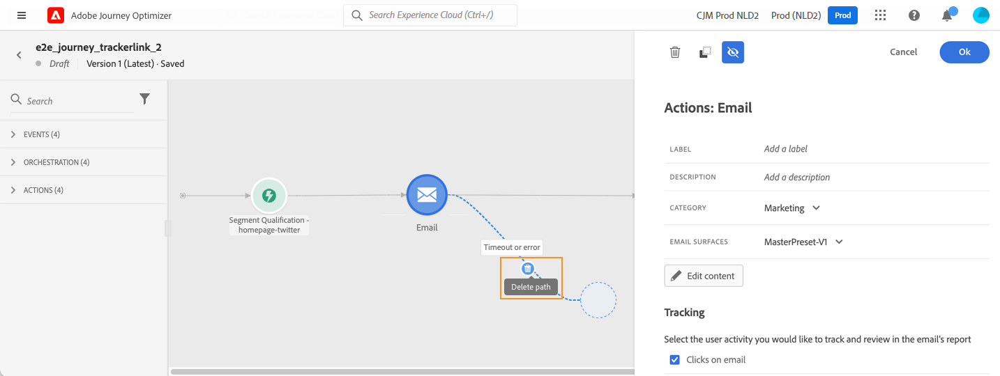
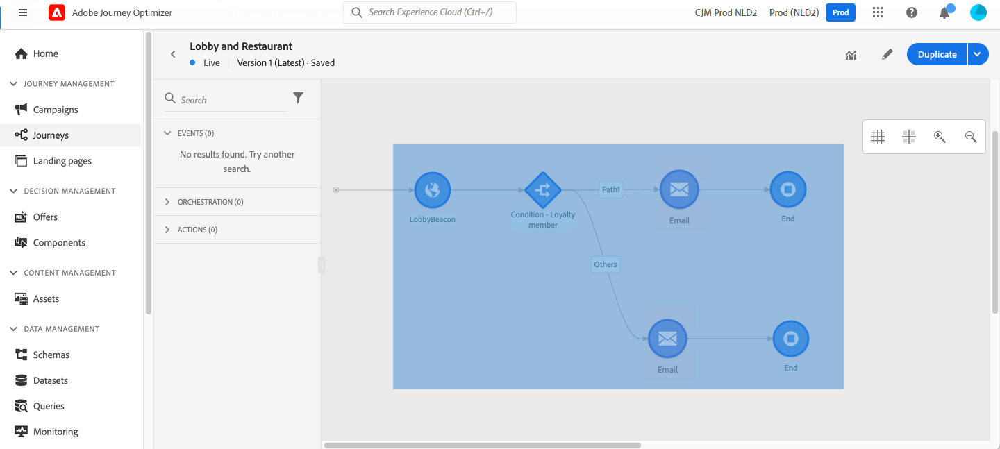
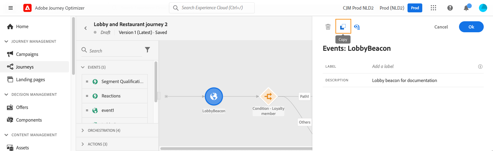

# Projetar a jornada {#design-your-journey}

>[!BEGINSHADEBOX]

**Nesta página:** saiba como usar a paleta e a tela do designer do jornada para arrastar e soltar eventos, orquestração e atividades de ação em um fluxo sequenciado que cria sua jornada.

>[!ENDSHADEBOX]

[!DNL Adobe Journey Optimizer] inclui uma tela de orquestração omnicanal que permite aos profissionais de marketing harmonizar o alcance de marketing com o envolvimento individual do cliente. A interface de usuário do permite arrastar e soltar facilmente as atividades da paleta na tela para criar sua jornada. Observe que você também pode clicar duas vezes em uma atividade para adicioná-la à tela na próxima etapa disponível.

Eventos, atividades de orquestração e ação têm um papel e um lugar específicos no processo. As atividades são sequenciadas: quando uma atividade é concluída, o fluxo continua e processa a próxima atividade e assim por diante.

## Introdução ao design do jornada {#gs-journey-design}

A **paleta** está no lado esquerdo da tela. Todas as atividades disponíveis estão classificadas em várias categorias: [Eventos](#jo-event), [Orquestração](#jo-orch) e [Ações](#jo-actions). Você pode expandir/recolher as diferentes categorias clicando no nome delas. Para usar uma atividade na jornada, arraste-a e solte-a da paleta na tela.

Ao iniciar uma nova jornada, os elementos que não podem ser soltos na tela na primeira etapa ficam ocultos. Isso se refere a todas as ações, à atividade de condição, espera e reação.

O ícone **[!UICONTROL Filtrar itens]** no canto superior esquerdo permite exibir os seguintes filtros:

* **Mostrar apenas itens disponíveis**: ocultar ou exibir elementos indisponíveis na paleta, por exemplo, os eventos que usam um namespace diferente daqueles usados em sua jornada. Por padrão, os itens indisponíveis ficam ocultos. Se você optar por exibi-los, eles aparecerão esmaecidos.

* **Mostrar apenas itens recentes**: este filtro permite exibir apenas os cinco últimos eventos e ações usados, além dos prontos para uso. Isso é específico para cada usuário. Por padrão, todos os itens são exibidos.

Você também pode usar o campo **[!UICONTROL Pesquisa]**. Somente eventos e ações são filtrados.

A **tela** é a zona central no designer de jornada. É nessa zona que você pode descartar suas atividades e configurá-las. Clique em uma atividade na tela para configurá-la. Isso abre o painel de configuração de atividade no lado direito.

A **barra de ferramentas**, localizada no canto superior direito da tela, permite mostrar/ocultar a grade, ampliar/reduzir e baixar uma captura de tela da tela. Consulte esta [seção](../building-journeys/journey-properties.md#timeout_and_error).

<!--and show/hide timeout and error paths-->

{width="70%"}

O **painel de configuração da atividade** aparece quando você clica em uma atividade na paleta. Preencha os campos obrigatórios. Clique no ícone **[!UICONTROL Excluir]** para excluir a atividade. Clique em **[!UICONTROL Cancelar]** para cancelar as modificações ou em **[!UICONTROL Ok]** para confirmar. Para excluir atividades, você também pode selecionar uma (ou várias) atividades e pressionar a tecla backspace. Pressionar a tecla Escape fechará o painel de configuração da atividade.

Por padrão, os campos somente leitura ficam ocultos. Para mostrar campos somente leitura, clique no ícone **Mostrar campos somente leitura** na parte superior esquerda do painel de configuração da atividade. Essa configuração se aplica a todas as atividades em todas as jornadas.

Dependendo do status da jornada, você pode executar ações diferentes na jornada usando os botões disponíveis no canto superior direito: **[!UICONTROL Publicar]**, **[!UICONTROL Duplicar]**, **[!UICONTROL Excluir]**, **[!UICONTROL Modo de teste]**, **[!UICONTROL Gerenciar acesso]**, **[!UICONTROL Alertas]**. Esses botões aparecem quando nenhuma atividade é selecionada. Alguns botões serão exibidos de forma contextual. O botão de log do modo de teste é exibido quando o modo de teste é ativado.

## Nova experiência da interface do Jornada {#canvas-capabilities}

Uma **nova interface de usuário** está disponível para a tela de jornada, criada para ser dimensionada de acordo com os casos de uso mais complexos:

* **Desempenho** — lida com jornadas grandes com muitas etapas e ramificações de forma eficiente.
* **Layout automático** — organiza automaticamente as atividades para facilitar a leitura.
* **Criação guiada** — oferece uma experiência de criação estruturada para ajudá-lo a criar jornadas com facilidade e eficiência.

Para alternar para a nova experiência, clique no botão **[!UICONTROL Nova experiência]** na tela de jornada. Depois de alternada, essa configuração é salva no nível da jornada, para que a jornada seja aberta na nova experiência por padrão em visitas subsequentes. Para reverter, clique no botão **[!UICONTROL Experiência antiga]**.

{width="50%" align="center" zoomable="yes"}

## Inicie sua jornada {#start-your-journey}

Quando você cria sua jornada, a primeira pergunta que deseja fazer é como os perfis entrarão na jornada.

Há duas possibilidades:

1. **Iniciar com um evento**: quando uma jornada é definida para ouvir eventos, os indivíduos entram na jornada **unitariamente** em tempo real. As mensagens incluídas na jornada são enviadas à pessoa que atualmente flui para a jornada. [Saiba mais sobre eventos](../event/about-events.md)

1. **Comece com um Público-alvo de Leitura**: você pode configurar sua jornada para ouvir [!DNL Adobe Experience Platform] públicos-alvo. Nesse caso, todos os indivíduos pertencentes ao público-alvo especificado entram na jornada. As mensagens incluídas na sua jornada são enviadas aos indivíduos que pertencem ao público. Saiba mais sobre [ler público](read-audience.md). Para obter mais informações sobre como gerar e direcionar públicos no Journey Optimizer, consulte [esta seção](../audience/about-audiences.md).

## Definir as próximas etapas{#define-next-steps}

Após o primeiro evento ou Ler públicos-alvo, você pode combinar as diferentes atividades para criar cenários de canais em várias etapas. Escolha, na paleta, as etapas necessárias.

### Eventos{#jo-event}

Eventos são o que aciona uma jornada personalizada, como uma compra online. Uma vez que alguém entra em uma jornada, ele se move como um indivíduo, e não há dois indivíduos se movendo ao longo da mesma taxa ou ao longo do mesmo caminho.

Ao iniciar a jornada com um evento, a jornada é acionada ao receber o evento. Cada pessoa na jornada segue, individualmente, as próximas etapas definidas na jornada.

Você pode adicionar **vários eventos** à sua jornada, desde que eles usem o mesmo namespace. Os eventos são configurados com antecedência. [Saiba mais sobre eventos de jornada](about-journey-activities.md#event-activities)

Você também pode adicionar um evento **Reação** após uma mensagem para reagir aos dados de rastreamento relacionados à mensagem. Isso permite, por exemplo, enviar outra mensagem se o indivíduo tiver aberto a mensagem anterior ou clicado dentro dela. [Saiba mais sobre eventos de reação](reaction-events.md).

Use a atividade de evento **Qualificação de público-alvo** para fazer com que os indivíduos entrem ou avancem em uma jornada com base em [!DNL Adobe Experience Platform] entradas e saídas de público-alvo. Você pode fazer com que todos os novos clientes Silver insiram uma jornada e enviem mensagens personalizadas. Saiba mais nesta [seção](audience-qualification-events.md).

### Orquestração{#jo-orch}

As atividades de orquestração são condições diferentes que ajudam a determinar a próxima etapa da jornada.

Nas atividades de orquestração, use a atividade **Ler público** para definir sua jornada para ouvir um público [!DNL Adobe Experience Platform]. [Saiba mais sobre a atividade Ler Público](read-audience.md).

Use **Fragmentos de Jornada** para inserir conjuntos reutilizáveis de nós de jornada pré-criados diretamente na tela. Os fragmentos ajudam as equipes a permanecerem consistentes e a se moverem mais rápido, evitando reconstruir a mesma lógica — como verificações de elegibilidade, roteamento de canais ou sequências de boas-vindas — do zero. [Saiba mais sobre os Fragmentos de Jornada](journey-fragments.md).

As outras atividades permitem adicionar condições à jornada para definir vários caminhos, definir um tempo de espera antes de executar a próxima atividade ou encerrar a jornada. [Saiba mais sobre atividades de orquestração](about-journey-activities.md#orchestration-activities).

### Ações{#jo-actions}

As ações são o que você deseja que aconteça como resultado de algum tipo de acionador, como enviar uma mensagem. É a parte da jornada que o cliente experimenta. Pode ser um email, SMS ou mensagem de push ou uma ação de terceiros, como uma mensagem do Slack.

As atividades de ação de canal permitem incluir uma mensagem criada no [!DNL Journey Optimizer]. [Saiba mais sobre as atividades de ação de canal](journey-action.md)

Nas atividades de ação, use ações personalizadas para enviar mensagens com sistemas de terceiros. [Saiba mais sobre ações personalizadas](about-journey-activities.md#action-activities).

## Adicionar caminhos alternativos {#paths}

Você pode definir uma ação de fallback em caso de erro ou tempo limite para as seguintes atividades de jornada: **[!UICONTROL Condição]** e **[!UICONTROL Ação]**.

Para adicionar uma ação de fallback para uma atividade, marque a caixa **[!UICONTROL Adicionar um caminho alternativo em caso de tempo limite ou erro]** nas propriedades da atividade: outro caminho é adicionado após a atividade. A duração do tempo limite é definida pelos usuários administradores nas [propriedades de jornada](../building-journeys/journey-properties.md). Por exemplo, se um email demorar muito para ser enviado ou estiver com erro, você pode decidir enviar uma notificação por push.

Várias atividades (evento, ação, espera) permitem adicionar vários caminhos após elas. Para fazer isso, coloque o cursor na atividade e clique no símbolo &quot;+&quot;. Somente atividades de evento e espera podem ser definidas em paralelo. Se vários eventos forem definidos em paralelo, o caminho escolhido será o do primeiro evento que ocorrer.

Ao ouvir um evento, recomendamos que você não espere o evento indefinidamente. Não é obrigatório, apenas uma prática recomendada. Se quiser ouvir um ou vários eventos somente durante um determinado tempo, coloque um ou vários eventos e uma atividade de espera em paralelo. Consulte [esta seção](../building-journeys/general-events.md#events-specific-time).

Para excluir o caminho, coloque o cursor sobre ele e clique no ícone **[!UICONTROL Excluir caminho]**.

Na tela, quando duas atividades são desconectadas, um aviso é exibido. Coloque o cursor no ícone de aviso para exibir a mensagem de erro. Para corrigir o problema, basta mover a atividade desconectada e conectá-la à atividade anterior.

## Atividades de copiar e colar {#copy-paste}

É possível copiar uma ou várias atividades de uma jornada e colá-las na mesma jornada ou em uma diferente. Isso permite economizar tempo se você quiser reutilizar várias atividades que já foram configuradas em uma jornada anterior.

**Observações importantes**

* Você pode copiar/colar em diferentes guias e navegadores. Você só pode copiar/colar atividades dentro da mesma instância.
* Não é possível copiar/colar um evento se a jornada de destino tiver um evento que use um namespace diferente.
* As atividades coladas podem fazer referência a dados que não existem na jornada de destino, por exemplo, se você copiar/colar em diferentes sandboxes. Sempre verifique se há erros e faça os ajustes necessários.
* Observe que não é possível desfazer uma ação. Para excluir atividades coladas, será necessário selecioná-las e excluí-las. Portanto, selecione apenas as atividades necessárias antes de copiá-las.
* É possível copiar atividades de qualquer jornada, mesmo aquelas que estão em modo somente leitura.
* Você pode selecionar qualquer atividade, mesmo aquelas que não estão vinculadas. As atividades vinculadas permanecerão vinculadas após serem coladas.

Estas são as etapas para copiar/colar atividades:

1. Abra uma jornada.
1. Selecione as atividades que deseja copiar movendo o mouse enquanto clica. Você também pode clicar em cada atividade enquanto pressiona a tecla **Ctrl/Command**. Use **Ctrl/Command + A** se desejar selecionar todas as atividades.
   
1. Pressione **Ctrl/Command + C**.
Se quiser copiar apenas uma atividade, clique nela e use o ícone **Copiar** na parte superior esquerda do painel de configuração da atividade.
   
1. Em qualquer jornada, pressione **Ctrl/Command + V** para colar as atividades sem vinculá-las a um nó existente. As atividades coladas são colocadas na mesma ordem. Depois de coladas, as atividades permanecem selecionadas para que você possa movê-las facilmente. Você também pode colocar o cursor em um espaço reservado vazio e pressionar **Ctrl/Command + V**. As atividades coladas serão vinculadas ao nó.
   

+++ Referência de conhecimento de IA

Esta seção contém conhecimento estruturado destinado a oferecer suporte à interpretação, recuperação e resposta a perguntas relacionadas a este tópico.

Para uma compreensão completa, essas informações devem ser combinadas com a documentação desta página. Nenhuma das origens deve ser independente; a página descreve o recurso, enquanto esta seção fornece um contexto adicional que ajuda a desfazer a ambiguidade da terminologia, intenção, aplicabilidade e restrições.

* **TL;DR:** esta página apresenta a tela do designer do Journey Optimizer jornada, explicando como criar jornadas de várias etapas arrastando e soltando eventos, orquestração e atividades de ação da paleta.

**Intenções:**

* Navegue pela interface do designer de jornadas (paleta, tela, barra de ferramentas, painel de configuração da atividade)
* Adicionar eventos, atividades de orquestração e atividades de ação a uma tela de jornada
* Configurar um caminho alternativo de fallback para as atividades de Condição e Ação no tempo limite ou erro
* Copie e cole atividades na mesma jornada ou em diferentes jornadas na mesma instância
* Iniciar uma jornada usando um acionador de evento ou um ponto de entrada Ler público

**Glossário:**

* **Paleta**: o painel esquerdo no designer do jornada lista todos os eventos, orquestração e atividades de ação disponíveis para arrastar e soltar na tela *(específico do produto)*
* **Tela**: a área de design central do designer de jornadas onde as atividades são colocadas, conectadas e configuradas *(específico do produto)*
* **Painel de configuração da atividade**: o painel direito que é aberto quando uma atividade é selecionada na tela, usado para preencher as configurações da atividade *(específico do produto)*
* **Fragmentos de Jornada**: conjuntos reutilizáveis de nós de jornada pré-criados que podem ser inseridos diretamente na tela para evitar a reconstrução da lógica comum *(específico do produto)*
* **Evento de reação**: uma atividade de evento colocada após uma mensagem para ramificar a jornada com base nas interações de rastreamento do destinatário (abrir, clicar) *(específico do produto)*

**Medidas de Proteção:**

* Ações, condições, atividades de espera e eventos de reação não podem ser colocados como a primeira etapa de uma nova jornada.
* Copiar/colar só é compatível na mesma instância; copiar/colar entre instâncias não é compatível.
* Não é possível copiar/colar um evento em uma jornada de destino que usa um namespace diferente.
* As atividades coladas de uma sandbox diferente podem fazer referência a dados que não existem na jornada de destino.
* Somente atividades de evento e espera podem ser definidas em paralelo; outros tipos de atividades não podem ser executados em paralelo.
* Caminhos alternativos (tempo limite/fallback de erro) estão disponíveis apenas para atividades de Condição e Ação.

**Terminologia:**

* Nome canônico: Jornada Designer — Acrônimo: none — variantes: tela de jornada, tela de orquestração
* Sinônimos: &quot;paleta&quot; = &quot;painel de atividade&quot;; &quot;tela&quot; = &quot;área de design&quot;
* Não confunda: &quot;events&quot; (acionar entrada ou ramificação da jornada) ≠ &quot;actions&quot; (o que acontece com o cliente, por exemplo, enviar uma mensagem)

**Perguntas frequentes:**

* **P: Como os perfis entram em uma jornada?** — Os perfis são inseridos unitariamente em tempo real quando um evento configurado é recebido, ou em lote quando uma atividade Ler público aciona a jornada.
* **P: Posso adicionar vários eventos a uma jornada?** — Sim, você pode adicionar vários eventos, desde que todos usem o mesmo namespace.
* **P: Como definir um fallback quando uma ação falhar?** — Nas propriedades da atividade, ative a opção &quot;Adicionar um caminho alternativo em caso de tempo limite ou erro&quot; para adicionar um caminho de fallback após a atividade.
* **P: Posso copiar atividades de uma jornada somente leitura?** — Sim, você pode copiar atividades de qualquer jornada, independentemente de seu status, mas só é possível colar dentro da mesma instância.
* **P: O que é um fragmento de Jornada?** — Um conjunto reutilizável de nós de jornada pré-construídos (por exemplo, verificações de elegibilidade, sequências de boas-vindas) que podem ser inseridos diretamente na tela para evitar a reconstrução da lógica comum do zero.

+++
